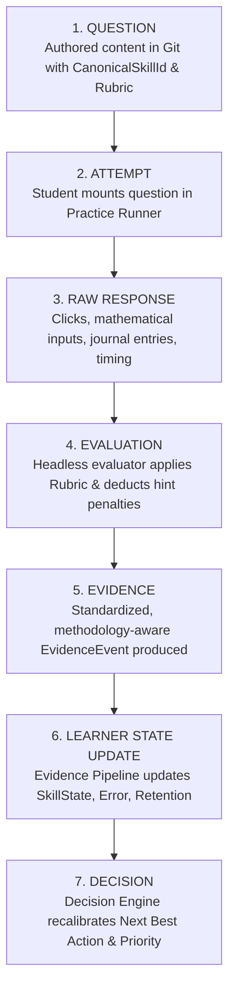
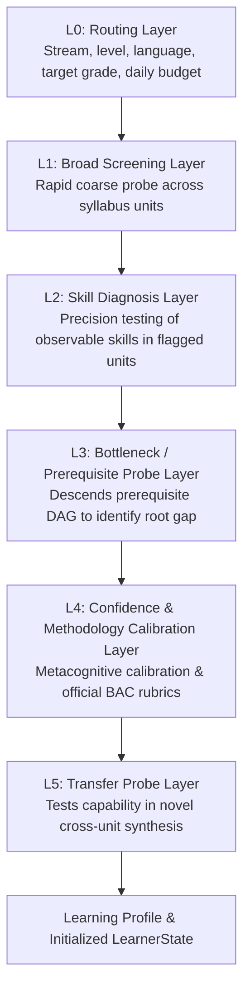

# BAC MASTERY V2 — ASSESSMENT & QUESTION LIFECYCLE CONTRACT

**Document Version:** 2.0.0  
**Status:** ARCHITECTURE FROZEN  
**Authority:** Core Architecture Group  
**Workspace:** BAC BEM (Algerian BAC Learning Operating System)  
**Invariant:** Pure specification — zero code mutations.

---

## 1. The Core Assessment Lifecycle

In BAC Mastery V2, the journey from static question to adaptive decision follows an unbroken 7-stage deterministic pipeline:



---

## 2. Fundamental Architectural Finding: Renderer Capability vs. Content Concentration

> [!IMPORTANT]
> **FINDING FROM TASK 0.1 & TASK 0.2 AUDIT:**  
> The codebase **already contains advanced interactive assessment renderers**:
> - `InteractiveJournal.tsx`: Specialized multi-column accounting double-entry ledger editor for Gestion & Économie.
> - `InteractiveSteps.tsx`: Multi-stage step-by-step mathematical and physical proof deduction component with progressive reveal and branching validation.
> - Multi-select and numeric input handlers.
>
> **The Real Bottleneck:**  
> The limitation identified in the platform is **NOT architectural absence of renderers, but Content Concentration**:
> - 92% of the currently authored 465+ questions in `src/data/practice/` are single-choice MCQs.
> - Only 5% utilize the accounting journal renderer.
> - Only 3% utilize the progressive step deduction renderer.
> - 0% of Natural Sciences questions currently utilize multi-document scientific reasoning rubrics (*démarche d'investigation scientifique*).
>
> **V2 Directive:**  
> V2 does **not** need to build new UI renderers. It requires **authoring structured content** (synthetic reasoning, document analysis, multi-stage math proofs) utilizing the existing interactive engines, and standardizing their output into the canonical `EvidenceEvent` format.

---

## 3. The 12 Supported Question Formats & Evaluation Contracts

Below are the 12 canonical question formats recognized by BAC Mastery V2:

| Format Code | UI Component | Input Schema | Evaluation Contract |
| :--- | :--- | :--- | :--- |
| **`single_choice`** | Standard Card | `{ selectedOptionId: string }` | Direct key comparison with distractor misconception tagging. |
| **`multi_select`** | Checkbox Group | `{ selectedOptionIds: string[] }` | Jaccard similarity or all-or-nothing with partial credit rubric. |
| **`numeric`** | Number Input | `{ value: number, unit?: string }` | Value within tolerance ((pm 1%)) + strict unit verification. |
| **`symbolic`** | Mathquill / KaTeX | `{ latexString: string }` | CAS or canonical AST tree equivalence matching. |
| **`short_answer`** | Text Field | `{ text: string }` | Normalized string match + keyword regex matcher. |
| **`open_response`** | Markdown / Textarea | `{ responseText: string }` | Official BAC keyword presence + rubric benchmark scoring. |
| **`step_by_step`** | `InteractiveSteps.tsx` | `{ completedSteps: Array<{ stepId: string, answer: any }> }` | Sequential stage validation; partial credit per verified step. |
| **`proof_deduction`**| `InteractiveSteps.tsx` | `{ logicalPath: string[], conclusion: string }` | DAG validation of deductive steps (Hypothesis -> Law -> Conclusion). |
| **`document_analysis`**| Split-Pane Inspector | `{ documentObservations: Record<string, string>, synthesis: string }` | Multi-document exploitation rubric (Observation -> Interpretation -> Deduction). |
| **`problem_solving`** | Composite Runner | `{ parts: Array<{ partId: string, response: any }> }` | Multi-part BAC problem structure (Part 1, Part 2, Part 3). |
| **`journal_entry`** | `InteractiveJournal.tsx` | `{ rows: Array<{ accountCode: string, debit: number, credit: number }> }` | Financial accounting balance validation ((sum 	ext{Debit} == sum 	ext{Credit})). |
| **`exam_response`** | D-Day Exam Runner | `{ subjectId: string, topicIndex: number, responses: any[] }` | Complete 4-hour mock paper scored against official ONEC marking key. |

---

## 4. Headless Evaluation Contract (Decoupling UI from Grading)

In V1, answer grading was tightly coupled inside React component event handlers (`PracticeSession.tsx`).  
In V2, evaluation is strictly **headless, pure, and deterministic**:

```typescript
export interface EvaluationInput {
  questionId: string;
  skillId: CanonicalSkillId;
  format: AssessmentFormat;
  rawResponse: unknown;
  durationMs: number;
  expectedDurationMs: number;
  hintsUsedCount: number;
  rubric: QuestionRubric;
}

export interface EvaluationResult {
  isCorrect: boolean;
  score: number;                     // 0.000 to 1.000
  independenceScore: number;         // 0.000 to 1.000
  feedbackAr: string;               // Pedagogical explanation in Arabic
  errorTaxonomyCode?: ErrorTaxonomyCode;
  misconceptionId?: string;
  stepResults?: StepEvaluationDetail[];
  keywordMatches?: string[];
  rubricScoreDetails?: RubricDetail;
}

/**
 * Pure evaluation function — no window, no localStorage, no database I/O.
 */
export function evaluateStudentAttempt(input: EvaluationInput): EvaluationResult;
```

---

## 5. Mapping Evaluated Attempts to Canonical Evidence

Once `evaluateStudentAttempt()` executes, the result is immediately packaged into the canonical `EvidenceEvent`:

1. **Score Normalization:**  
   Partial credit is preserved (e.g., in a 4-step proof where 3 steps were correct, rawScore = `0.75`).
2. **Independence Calculation:**  
   [
   	ext{Independence} = maxleft(0, 1.00 - (	ext{hintsUsed} 	imes 0.25)
ight)
   ]
3. **Time Velocity Calculation:**  
   [
   	ext{Velocity} = rac{	ext{durationMs}}{	ext{expectedDurationMs}}
   ]
   *(If velocity > 2.5, time pressure is flagged as a compounding factor).*
4. **Distractor Misconception Extraction:**  
   If the student picked distractor C on a single-choice item, the question metadata reveals the exact misconception (`misc_snv_active_site_denaturation`).
5. **Dispatch to Evidence Pipeline:**  
   The resulting payload is immutable and dispatched to `EvidencePipeline.processEvent(event)`.

---

## 6. Content Authoring Standards for V2

To resolve the content concentration problem, all future question authoring must adhere to the **V2 Item Specification**:
- Every item MUST reference exactly one Primary `CanonicalSkillId`.
- Every item MUST declare an `expectedDurationMs` calibrated for an average student.
- Every distracter on multiple-choice items MUST map to a documented `ErrorTaxonomyCode` or `MisconceptionId`.
- STEM items with > 2 computational steps MUST be authored for `InteractiveSteps.tsx`.
- Accounting items MUST be authored for `InteractiveJournal.tsx`.
- Natural Science items targeting competencies 2 and 3 MUST include structured document stimuli and keyword rubrics.


---

## 7. The Diagnostic V2 Architecture: 6 Canonical Layers

The Diagnostic Engine in BAC Mastery V2 is **not a simple score-producing quiz**.  
Its purpose is: **to collect sufficient multi-dimensional evidence to make authoritative learning decisions.**



### Detailed Specification of the 6 Diagnostic Layers:

1. **L0 — Routing Layer:**
   - **Purpose:** Configures the student's academic baseline: Stream (`sciences_exp`, `math`, `gestion_eco`, `lettres_philo`), Education Level (3AS), Target BAC Grade ((10.00 - 20.00)), Desired University Specialty, and Daily Study Budget.
   - **Output:** Calibrated `GoalState` and `StudentState`.

2. **L1 — Broad Screening Layer:**
   - **Purpose:** Rapid, coarse-grained evaluation covering the breadth of the stream's core units (e.g. 1 question per major unit).
   - **Stopping Rule:** Complete once all primary units have at least 1 high-level observation.
   - **Output:** Unit-level screening flags (`healthy`, `suspect`, `critical_gap`).

3. **L2 — Skill Diagnosis Layer:**
   - **Purpose:** Adaptive branching into units flagged as `suspect` or `critical_gap` to test specific observable `CanonicalSkillId`s.
   - **Stopping Rule:** 2 items per candidate skill. If first item is passed with high confidence, skill is flagged `emerging`; if failed, routes to L3.
   - **Output:** Skill-level competence classifications.

4. **L3 — Bottleneck / Prerequisite Probe Layer:**
   - **Purpose:** When a skill is failed in L2, the engine traverses backward along the **Prerequisite DAG** to test whether the failure was caused by a missing foundational dependency (e.g., failing exponential limits because of polynomial factorization from 1AS/2AS).
   - **Output:** Root-cause bottleneck identification (`PrerequisiteGap`).

5. **L4 — Confidence & Methodology Calibration Layer:**
   - **Purpose:** Evaluates metacognitive awareness and official Algerian BAC answering methodology.
   - **Calibration Matrix:** Identifies **Severe Uncalibrated Traps** (high confidence + wrong answer) vs. **Underconfident Hesitations** (low confidence + correct answer).
   - **Output:** Methodology fidelity index and metacognitive calibration profile.

6. **L5 — Transfer Probe Layer:**
   - **Purpose:** Administered to advanced students to probe resilience in unannounced, cross-topic synthetic problems.
   - **Output:** Transfer readiness verification.

### Diagnostic Invariants:
- **Adaptive Branching:** Questions are dynamically selected based on prior answers; students never take a fixed, static linear quiz.
- **Evidence Strength:** Diagnostic items require Tier 2 Independent Practice items to produce valid baseline state.
- **Zero Guilt Reporting:** The diagnostic output produces a clear, encouraging **Learning Profile (الملف التعليمي)** and immediately points to the single highest-yield micro-mission to begin.
