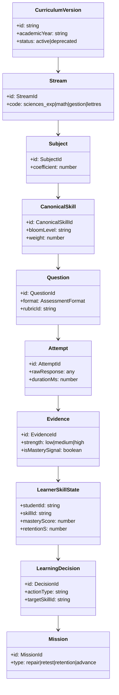

# BAC MASTERY V2 — CANONICAL DOMAIN CONTRACT

**Document Version:** 2.0.0  
**Status:** ARCHITECTURE FROZEN  
**Authority:** Core Architecture Group  
**Workspace:** BAC BEM (Algerian BAC Learning Operating System)  
**Invariant:** Pure specification — zero code mutations.

---

## 1. Executive Doctrine & Architectural Core

BAC Mastery V2 is **not** an e-learning course, video repository, or quiz bank. It is an **adaptive Learning Operating System (Learning OS)** tailored to the rigorous standards of the Algerian Baccalaureate (BAC).

The mission of the system is governed by a singular algorithmic and pedagogical mandate:
> **"What is the single next best learning action for this student, and what evidence justifies it?"**

To answer this deterministically, transparently, and without hallucination, the system enforces a strict separation between **Curriculum Knowledge** (immutable truth stored in Git), **Learner State** (derived runtime state stored in Supabase), and **Evidence** (atomic observation events emitted by student attempts).

---

## 2. Foundational Disambiguations (Non-Negotiables)

Before defining individual entities, the architecture establishes strict boundaries to eliminate historical conflations:

### 2.1. Skill ≠ Topic
- **Topic** is a curricular organization container (e.g., *Unit 01: Protein Synthesis* or *Limits and Continuity*). It represents the syllabus table of contents.
- **Skill** is an observable, measurable cognitive capability that a student must demonstrate under specific conditions (e.g., *Translate mRNA codon sequence into polypeptide chain using genetic code table*).
- **Rule:** Topics cannot be "mastered"; only skills can be mastered.

### 2.2. Skill ≠ Concept
- **Concept** is an underlying mental model, theoretical principle, or definition (e.g., *The active site of an enzyme is complementary to the substrate*).
- **Skill** is the operational ability to apply concepts to solve problems, construct proofs, or evaluate biological phenomena.
- **Rule:** A skill typically mobilizes one or more concepts.

### 2.3. Question ≠ Evidence
- **Question** is an assessment instrument configured with stimulus materials, prompt criteria, and rubrics.
- **Evidence** is the structured pedagogical record generated when a student attempts a question.
- **Rule:** A question is static content; evidence is an immutable empirical observation.

### 2.4. Attempt ≠ Evidence
- **Attempt** is the raw interaction event (e.g., user clicked option B, took 42 seconds, requested 1 hint).
- **Evidence** is the pedagogical interpretation extracted from that attempt (e.g., demonstrated procedural accuracy but revealed a sign-reversal calculation slip).
- **Rule:** Attempts capture telemetry; Evidence synthesizes learning signals.

### 2.5. Error ≠ Misconception
- **Error** describes the observable surface failure in performance (e.g., student omitted the units in a titration calculation).
- **Misconception** describes the underlying invalid cognitive model that produced the error (e.g., student believes concentration equals absolute mole quantity).
- **Rule:** One misconception can generate multiple different error manifestations.

### 2.6. Skill ≠ Learner Skill State
- **Skill** is an immutable canonical curriculum entity shared across all students.
- **Learner Skill State** is an individual student's temporal, derived mastery trajectory for that skill (mastery score, confidence, stability, review dates).
- **Rule:** The curriculum defines the skill; the learner state records the student's mastery of it.

### 2.7. Priority ≠ Skill Property
- **Priority** is a dynamic, context-aware decision produced by the Decision Engine for a specific student at a specific moment.
- **Rule:** Priority MUST NOT be hardcoded as an intrinsic attribute of a skill in the curriculum registry. Coefficients belong to skills; priority belongs to learner decisions.

### 2.8. Mission ≠ Lesson
- **Lesson** is an instructional passive content delivery artifact (text, video, diagram).
- **Mission** is an active, bounded pedagogical intervention (10-25 minutes) designed to induce a specific state transition (e.g., diagnose a gap, repair an active error, retest a repaired skill, or retain a fading memory trace).
- **Rule:** Missions require active cognitive output; lessons do not.

### 2.9. Roadmap ≠ Priority
- **Roadmap** is the macro-level trajectory—the ordered pedagogical sequence of units, skills, and milestones across the academic year.
- **Priority** is the micro-level recommendation—the single next action selected right now based on prerequisites, retention decay, and active errors.
- **Rule:** Roadmap dictates the strategic path; Priority selects the tactical step.

### 2.10. Retention ≠ Mastery
- **Mastery** measures the depth and accuracy of understanding demonstrated during recent performance (latent competence).
- **Retention** measures the memory stability and retrieval probability of that skill over time according to spaced retrieval models (SM-2 / Ebbinghaus decay).
- **Rule:** A student can have 100% mastery today and 30% retention 30 days later.

---

## 3. The 28 Canonical Domain Entities

Below is the exhaustive specification of the 28 core domain entities forming BAC Mastery V2.

---

### Entity 01: Student
- **Purpose:** Represents the human learner registered on the platform preparing for the Algerian BAC.
- **Canonical ID:** `student_${uuid}` (e.g., `student_usr_01hqz8x9...`)
- **Owner:** Identity / User OS
- **Inputs:** Auth provider credentials (Supabase Auth), initial registration metadata.
- **Outputs:** Active learner profile, event streams.
- **Mutability:** Mutable profile metadata (name, target school, preferences); immutable user ID.
- **Source of Truth:** Supabase `profiles` / `auth.users`.
- **Relationships:** Has 1:1 `LearnerState`, 1:N `Attempt`s, 1:N `ExamSession`s.
- **Lifecycle:** Created at signup -> Onboarded -> Active Learning -> Exam Candidate -> Archived Alumnus.
- **What it is NOT:** It is NOT the learner state; it is the entity that owns the learner state.

---

### Entity 02: Education Level
- **Purpose:** Specifies the secondary education grade stage within the Algerian national curriculum.
- **Canonical ID:** Enum string: `"secondary_1as" | "secondary_2as" | "secondary_3as"`
- **Owner:** Curriculum OS
- **Inputs:** Ministry of National Education guidelines.
- **Outputs:** Grade boundary context for curricula.
- **Mutability:** Immutable constant.
- **Source of Truth:** Git (`src/types/education.ts`).
- **Relationships:** 1:N Streams. For BAC Mastery V2, the target level is fixed to `"secondary_3as"` (3ème Année Secondaire).
- **Lifecycle:** Static system constant.
- **What it is NOT:** Not a dynamic student grade or score.

---

### Entity 03: Exam
- **Purpose:** Defines the standardized national high-stakes examination.
- **Canonical ID:** Enum string: `"BAC" | "BEM"`
- **Owner:** Curriculum OS / National Examination Board (ONEC).
- **Inputs:** Official decree of the Algerian Ministry of Education.
- **Outputs:** Examination rules, duration budgets, grading conventions.
- **Mutability:** Immutable constant.
- **Source of Truth:** Git repository.
- **Relationships:** Has 1:N official Streams, official passing threshold (10.00/20.00), honors thresholds (Mention Bien: 14, Très Bien: 16, Excellent: 18).
- **Lifecycle:** Static constant.
- **What it is NOT:** It is NOT an individual exam attempt or practice session.

---

### Entity 04: Stream (Filière)
- **Purpose:** Represents the official academic branch of the Algerian secondary curriculum.
- **Canonical ID:** Enum string: `"sciences_exp" | "math" | "technique_math" | "gestion_eco" | "lettres_philo" | "langues_etrangeres"`
- **Owner:** Curriculum OS
- **Inputs:** Official ministerial curriculum stream definitions.
- **Outputs:** Stream-specific subject registries, coefficient matrices, and skill trees.
- **Mutability:** Immutable configuration in Git.
- **Source of Truth:** Git (`src/data/constants/streams.ts`).
- **Relationships:** Belongs to 1 Exam; contains 1:N Subjects with official ministerial coefficients (e.g., Sciences Exp: Sciences Naturelles = coef 6, Math = coef 5, Physique = coef 5).
- **Lifecycle:** Static definition.
- **What it is NOT:** It is not a user preference; it is a legally defined academic branch.

---

### Entity 05: Specialty (Filière Technique Spécialité)
- **Purpose:** Sub-branch specialization within the Technique Mathématique stream.
- **Canonical ID:** Enum string: `"genie_civil" | "genie_mecanique" | "genie_electrique" | "genie_procedes"`
- **Owner:** Curriculum OS
- **Inputs:** Official ministerial Technical Math syllabus.
- **Outputs:** Engineering subject specialization modules.
- **Mutability:** Immutable constant.
- **Source of Truth:** Git.
- **Relationships:** Belongs strictly to `stream: "technique_math"`.
- **Lifecycle:** Static constant.
- **What it is NOT:** Not applicable to Sciences Exp, Gestion, or Lettres.

---

### Entity 06: Subject (Matière)
- **Purpose:** An academic discipline taught within a stream with an official coefficient.
- **Canonical ID:** Enum string: `"sciences_naturelles" | "mathematiques" | "physique_chimie" | "philosophie" | "arabe" | "francais" | "anglais" | "histoire_geo" | "islamique" | "gestion_comptable" | "economie_management" | "droit"`
- **Owner:** Curriculum OS
- **Inputs:** National syllabus documents.
- **Outputs:** Units, topics, skills, and questions.
- **Mutability:** Immutable.
- **Source of Truth:** Git (`src/types/education.ts`, `src/lib/constants/streams.ts`).
- **Relationships:** Linked to Stream with a specific coefficient and weekly hour allocation. Contains 1:N Domains/Units.
- **Lifecycle:** Static constant.
- **What it is NOT:** It is not a skill or a single test.

---

### Entity 07: Curriculum Version
- **Purpose:** Tracks syllabus editions and official ministerial ministerial allegiances/adjustments (Allègements pédagogiques).
- **Canonical ID:** `curriculum_dz_${academicYear}_${revision}` (e.g., `curriculum_dz_2026_v1`)
- **Owner:** Curriculum OS
- **Inputs:** Official inspection ministry advisories (Tawjihat Pédagogiques).
- **Outputs:** Active curriculum configuration active across the platform.
- **Mutability:** Immutable once published; new versions created for subsequent years.
- **Source of Truth:** Git (`src/data/curriculum/version.ts`).
- **Relationships:** Scopes all Units, Topics, Skills, and Question Banks.
- **Lifecycle:** Draft -> Published -> Active -> Superseded.
- **What it is NOT:** It is NOT an app software version; it is the pedagogical curriculum edition.

---

### Entity 08: Domain / Unit (Unité / Axe)
- **Purpose:** The top-level thematic block within a subject's syllabus.
- **Canonical ID:** `unit_${subjectId}_${unitSlug}` (e.g., `unit_snv_protein_synthesis`, `unit_math_complex_numbers`)
- **Owner:** Curriculum OS
- **Inputs:** Official Algerian inspection manual.
- **Outputs:** Sequential container for topics and skills.
- **Mutability:** Immutable in Git.
- **Source of Truth:** Git (`src/data/curriculum/`).
- **Relationships:** Belongs to 1 Subject; contains 1:N Topics and 1:N Skills.
- **Lifecycle:** Static definition.
- **What it is NOT:** It is NOT an atomic learning objective.

---

### Entity 09: Topic (Thème / Sous-axe)
- **Purpose:** Sub-thematic structural division within a unit.
- **Canonical ID:** `topic_${subjectId}_${topicSlug}` (e.g., `topic_snv_translation_mechanism`)
- **Owner:** Curriculum OS
- **Inputs:** Syllabus section breakdown.
- **Outputs:** Pedagogical clustering for related skills.
- **Mutability:** Immutable.
- **Source of Truth:** Git.
- **Relationships:** Belongs to 1 Unit; maps to 1:N Skills.
- **Lifecycle:** Static definition.
- **What it is NOT:** A topic is an organizational label, NOT an assessment target.

---

### Entity 10: Skill (Compétence / Capacité Observable)
- **Purpose:** The atomic, observable unit of student capability tested on the Algerian BAC.
- **Canonical ID:** `${subjectPrefix}_${snake_case_action_descriptor}` (e.g., `math_derivatives_chain_rule`, `snv_protein_structure_ionization`, `physics_rc_circuit_differential_equation`)
- **Owner:** Curriculum OS
- **Inputs:** Official BAC examination guidelines and inspectoral rubrics.
- **Outputs:** Pedagogical learning outcomes, diagnostic criteria, repair steps.
- **Mutability:** Immutable.
- **Source of Truth:** Git (`src/data/skills/canonical-*.ts`).
- **Relationships:** Belongs to 1 Subject and 1 Unit. References 0:N Prerequisite Skill IDs. Contains 1:N Learning Objectives.
- **Lifecycle:** Defined in Git -> Verified by Test Suite -> Active in Engine.
- **What it is NOT:** It is NOT a student score, NOT a topic, and NOT a priority.

---

### Entity 11: Learning Objective (Objectif Pédagogique)
- **Purpose:** Granular behavioral target detailing the conditions and performance criteria of a skill.
- **Canonical ID:** `obj_${skillId}_${index}` (e.g., `obj_math_derivatives_chain_rule_01`)
- **Owner:** Curriculum OS
- **Inputs:** Official curricular performance indicators.
- **Outputs:** Item authoring specifications.
- **Mutability:** Immutable in Git.
- **Source of Truth:** Git within `CanonicalSkill.learningObjectives`.
- **Relationships:** Belongs strictly to 1 Skill.
- **Lifecycle:** Static definition.
- **What it is NOT:** Not an independent curriculum entity; exists within a skill.

---

### Entity 12: Concept (Concept Théorique)
- **Purpose:** An underlying rule, formula, anatomical structure, or theoretical principle.
- **Canonical ID:** `concept_${subjectId}_${conceptSlug}` (e.g., `concept_snv_codon_degeneracy`, `concept_math_intermediate_value_theorem`)
- **Owner:** Curriculum OS
- **Inputs:** Scientific and academic domain knowledge.
- **Outputs:** Cognitive schema mobilized during problem solving.
- **Mutability:** Immutable in Git.
- **Source of Truth:** Git.
- **Relationships:** Mobilized across 1:N Skills; targeted in Socratic explanations.
- **Lifecycle:** Static definition.
- **What it is NOT:** Not an action or observable performance.

---

### Entity 13: Prerequisite (Prérequis)
- **Purpose:** Explicit directed dependency declaration stating that Skill A must be mastered before Skill B can be reliably acquired.
- **Canonical ID:** Directed pair: `{ sourceSkillId: CanonicalSkillId, targetSkillId: CanonicalSkillId, criticality: "hard" | "soft" }`
- **Owner:** Curriculum OS
- **Inputs:** Pedagogical sequence logic validated by inspectors.
- **Outputs:** Dependency graph for the Priority and Roadmap engines.
- **Mutability:** Immutable in Git.
- **Source of Truth:** Git within `CanonicalSkill.prerequisites`.
- **Relationships:** Directed Acyclic Graph (DAG) over the Skill registry.
- **Lifecycle:** Validated at build time by graph cycle detection tests.
- **What it is NOT:** Not an ad-hoc runtime flag; it is a structural curriculum invariant.

---

### Entity 14: Misconception (Représentation Erronée)
- **Purpose:** Documented systematically flawed mental models or cognitive traps common among Algerian BAC candidates.
- **Canonical ID:** `misc_${skillId}_${slug}` (e.g., `misc_snv_amino_acid_charge_neutral_ph`)
- **Owner:** Curriculum OS / Learning Science
- **Inputs:** Baccalaureate grading reports and common pitfall analyses.
- **Outputs:** Targeted distractors in questions and repair hints in Socratic remediation.
- **Mutability:** Immutable in Git.
- **Source of Truth:** Git.
- **Relationships:** Linked to 1 Skill; referenced by 1:N Question Distractors and Error Taxonomies.
- **Lifecycle:** Defined in Git -> Linked to Items -> Evaluated in Evidence.
- **What it is NOT:** Not the error event itself, but the root cause of the error.

---

### Entity 15: Resource (Ressource / Support Pédagogique)
- **Purpose:** Curated reference material (video snippet, diagram, summarized formula card, official BAC methodology PDF).
- **Canonical ID:** `res_${type}_${slug}` (e.g., `res_video_hammache_limits_01`, `res_diagram_chloroplast_atp`)
- **Owner:** Content OS
- **Inputs:** Quality-assured educational media (teacher credentials verified).
- **Outputs:** Educational media embedded in active learning missions or revision summaries.
- **Mutability:** Immutable metadata in Git.
- **Source of Truth:** Git (`src/data/resources/`).
- **Relationships:** Associated with 1:N Skills.
- **Lifecycle:** Drafted -> Inspected -> Published -> Active.
- **What it is NOT:** Not an assessment and NOT a mission.

---

### Entity 16: Question (Item d'Évaluation)
- **Purpose:** Concrete assessment instrument engineered to elicit observable evidence of skill mastery.
- **Canonical ID:** `q_${skillId}_${difficulty}_${hash}` (e.g., `q_math_chain_rule_d2_a8f9`)
- **Owner:** Assessment OS
- **Inputs:** Question stimulus, prompt, options/inputs, scoring rubric, skill tagging.
- **Outputs:** Student attempts.
- **Mutability:** Immutable in Git once published.
- **Source of Truth:** Git (`src/data/questions/`).
- **Relationships:** Directly tagged with 1 Primary `CanonicalSkillId`, 0:N Secondary Skills, 1 Bloom cognitive level, 1 Assessment Format, 1 Rubric.
- **Lifecycle:** Authored -> Peer-Reviewed -> Tagged -> Published -> Active.
- **What it is NOT:** A question is NOT evidence; it generates evidence.

---

### Entity 17: Rubric (Grille de Correction / Barème Ministériel)
- **Purpose:** Formal criteria defining partial credit, keyword presence, and grading benchmarks mirroring official Algerian BAC marking keys.
- **Canonical ID:** `rubric_${questionId}` or `rubric_canonical_${rubricSlug}`
- **Owner:** Assessment OS
- **Inputs:** Official BAC correction criteria (Barème officiel de l'ONEC).
- **Outputs:** Deterministic conversion of raw student answers into scored evidence.
- **Mutability:** Immutable in Git.
- **Source of Truth:** Git.
- **Relationships:** 1:1 with structured open questions; references specific keyword weights and error penalties.
- **Lifecycle:** Static definition.
- **What it is NOT:** Not an arbitrary teacher opinion; it is the codified BAC scoring standard.

---

### Entity 18: Mission (Mission d'Apprentissage)
- **Purpose:** A coherent, time-bounded learning intervention assigned to the student to achieve a single clear objective. Configured in one of 4 canonical duration classes: Micro (5–10 min), Short (10–20 min), Standard (20–35 min), or Deep (35–60 min).
- **Canonical ID:** `msn_${studentId}_${timestamp}_${skillId}`
- **Owner:** Mission Engine
- **Inputs:** `LearningDecision` output from Decision Engine.
- **Outputs:** Sequenced set of exercises/steps and resulting `EvidenceEvent`s.
- **Mutability:** Immutable once generated; status advances (`pending` -> `active` -> `completed` | `abandoned`).
- **Source of Truth:** Supabase `missions`.
- **Relationships:** Belongs to 1 Student; targets 1 Skill; contains 1:N Questions/Steps; references 1 `LearningDecision`.
- **Lifecycle:** Decided -> Generated -> In Progress -> Completed -> Evaluated.
- **What it is NOT:** Not a chapter, course, or generic practice session.

---

### Entity 19: Attempt (Tentative / Événement d'Interaction)
- **Purpose:** The raw telemetry record of a student interacting with a question.
- **Canonical ID:** `att_${studentId}_${questionId}_${timestamp}`
- **Owner:** Assessment / Telemetry Layer
- **Inputs:** User clicks, form submissions, timing data, hint requests.
- **Outputs:** Raw response payload dispatched to the Evidence Engine.
- **Mutability:** Strictly immutable append-only record.
- **Source of Truth:** Supabase `attempts`.
- **Relationships:** Links 1 Student to 1 Question within 1 Mission or Exam Session. Produces exactly 1:1 `Evidence` event.
- **Lifecycle:** Created -> Evaluated -> Archived.
- **What it is NOT:** An attempt is NOT the evidence; it is the raw substrate from which evidence is parsed.

---

### Entity 20: Evidence (Preuve d'Apprentissage / EvidenceEvent)
- **Purpose:** The standardized, methodology-aware pedagogical interpretation of an attempt.
- **Canonical ID:** `ev_${attemptId}`
- **Owner:** Evidence Engine
- **Inputs:** `Attempt` + `Question` + `Rubric`.
- **Outputs:** State updates consumed by the Learner Model.
- **Mutability:** Strictly immutable append-only record.
- **Source of Truth:** Supabase `evidence_events` / contracts in Git.
- **Relationships:** Derived from 1 Attempt; updates 1 `LearnerSkillState`; may trigger 0:1 `ErrorEvent`.
- **Lifecycle:** Ingested -> Validated -> Applied to Learner State -> Persisted.
- **What it is NOT:** Evidence is NOT the student's mastery score; it is the observation that informs that score.

---

### Entity 21: Error Event (Événement d'Erreur Pédagogique)
- **Purpose:** A structured diagnostic record produced when evidence indicates an incorrect response or flawed methodology.
- **Canonical ID:** `err_${evidenceId}`
- **Owner:** Error Lab / Diagnostic Subsystem
- **Inputs:** Failed or partially failed `EvidenceEvent`.
- **Outputs:** Classified entry in the student's mistake ledger triggering targeted remediation.
- **Canonical Taxonomy (10 Types):**
  1. `forgot_information`: Forgot definition, rule, constant, or theorem.
  2. `misunderstood_concept`: Fundamental misconception of the underlying phenomenon.
  3. `methodology_error`: Knew the idea but failed official Algerian BAC answer structuring.
  4. `calculation_error`: Sign mistake, algebraic slip, or arithmetic error.
  5. `misread_question`: Missed initial conditions, units, or question constraints.
  6. `rushed`: Responded prematurely without verifying alternatives.
  7. `lack_of_practice`: Recognized concept but lacked procedural fluency.
  8. `time_management`: Ran out of time on a timed task.
  9. `attention_error`: Slipped on an obvious element due to fatigue or distraction.
  10. `unknown`: Unattributed ambiguity; triggers step-by-step diagnostic breakdown.
- **Legacy V1 Compatibility Mapping:**
  | Legacy V1 Error Type | Canonical V2 Error Taxonomy Code |
  | :--- | :--- |
  | `concept_confusion` | `misunderstood_concept` |
  | `calculation_slip` | `calculation_error` |
  | `keyword_missing` | `methodology_error` |
  | `methodology_flaw` | `methodology_error` |
  | `time_pressure` | `time_management` |
  | `reading_comprehension` | `misread_question` |
- **Recurrence & Repair Policy:**
  - Same skill + same error code occurring (ge 2) times triggers `isRecurring = true`.
  - Targeted micro-repair drill (5–15 min) followed by an isomorphic retest twin.
  - **Maximum 2-Cycle Policy:** If retest fails twice, skill transitions to `needs_more_work` and is paused for delayed recovery to prevent cognitive burnout.
- **Mutability:** Immutable event; tracking status (`unresolved` -> `repairing` -> `retested` -> `resolved`) lives in Derived Learner State.
- **Source of Truth:** Supabase `error_events`.
- **Relationships:** Links to 1 Evidence, 1 Skill, and 1 of the 10 Canonical Error Taxonomy Codes.
- **Lifecycle:** Emitted -> Logged -> Assigned to Repair -> Retested -> Cleared.
- **What it is NOT:** Not a simple numeric penalty or count; it is an actionable learning trigger.

---

### Entity 22: Retest (Retest / Test Jumeau)
- **Purpose:** An isomorphic verification item administered after error repair to prove authentic learning.
- **Canonical ID:** `retest_${errId}_${timestamp}`
- **Owner:** Error Lab / Assessment Engine
- **Inputs:** Resolved error event + isomorphic twin question.
- **Outputs:** Evidence confirming or refuting whether the misconception was eliminated.
- **Mutability:** Immutable once administered.
- **Source of Truth:** Supabase `retests`.
- **Relationships:** Directly pairs with 1 original Error Event and 1 Isomorphic Question.
- **Lifecycle:** Queued -> Administered -> Graded -> Resolved.
- **What it is NOT:** Not the same question repeated (must test the same skill with varied surface features).

---

### Entity 23: Mastery (Maîtrise / Demonstrated Competence)
- **Purpose:** The authoritative learner-facing state of demonstrated capability on a specific skill.
- **Authoritative Domain States:**
  - `not_yet` (لم نثبتها بعد): Unaddressed, unassessed, or failed 2 retest cycles requiring deeper recovery.
  - `emerging` (في طور التحسن): Initial practice answered correctly, but unverified by an isomorphic twin retest or delayed review.
  - `demonstrated` (تم إثبات التحكم ✓): Error identified -> repair completed -> unseen twin retest passed with high confidence, OR two independent high-tier practice successes without hints.
  - `review_due` (حان وقت المراجعة): A previously demonstrated skill whose memory stability has decayed past the critical threshold.
- **Secondary Telemetry (Non-Authoritative):**
  - Continuous numerical values in `[0..1]` (e.g., latent ability estimate `theta`, confidence index) MAY exist as internal ranking signals.
  - **CRITICAL RULE:** A numeric score MUST NOT itself define mastery. No single scalar replaces the multidimensional learner model.
- **Owner:** Learner Model
- **Inputs:** Verified stream of multi-dimensional `EvidenceEvent`s (correctness, independence, rubric fidelity, cognitive tier).
- **Outputs:** Readiness gates for roadmap progression and target score projections.
- **Mutability:** Derived state updated upon authenticated evidence ingestion.
- **Source of Truth:** Derived in Learner Model; persisted in Supabase `learner_skill_states`.
- **Relationships:** Attaches to (Student, CanonicalSkill) pair.
- **Lifecycle:** `not_yet` -> `emerging` -> `demonstrated` <-> `review_due`.
- **What it is NOT:** It is NOT a continuous floating-point percentage. It is a discrete, explainable pedagogical status.

---

### Entity 24: Retention (Rétention / Stabilité Mémorielle)
- **Purpose:** The modeled retrieval strength and scheduled review threshold for a demonstrated skill.
- **Authoritative Evidence Vectors (FROZEN NOW):**
  Review urgency and memory durability are evaluated using **six empirical evidence dimensions**:
  1. `correctness` ((c in {0, 1})): Incorrect retrieval immediately collapses interval to 1.0 day and triggers repair.
  2. `confidence` ((kappa in {1, 2, 3, 4, 5})): Distinguishes lucky guesses from firm certainty.
  3. `response_speed_ratio` ((	au = t_{\text{actual}} / t_{\text{expected}})): Flags cognitive struggle ((	au > 2.0)) vs. effortless fluency ((	au < 0.6)).
  4. `lapse_history` ((L)): Chronic past lapses penalize interval expansion: (	ext{penalty} = max(0.6, 1.0 - 0.1 	imes L)).
  5. `decay_factor` ((delta)): Stabilizes with consecutive successes, accelerates under recurring errors.
  6. `days_elapsed`: Compares elapsed days against scheduled stability (`fresh`, `due`, `overdue`, `critical`).
- **Algorithm Calibration Status (NOT YET FROZEN):**
  - Classic SuperMemo-2 (SM-2) is documented as an initial baseline/reference implementation.
  - The exact final mathematical interval function is intentionally **NOT YET FROZEN** and will be empirically calibrated using pilot data.
- **Owner:** Retention Subsystem / Learner Model
- **Inputs:** The six empirical retention evidence vectors.
- **Outputs:** Review urgency status and priority inputs for the Decision Engine.
- **Mutability:** Updated on retrieval evidence ingestion.
- **Source of Truth:** Supabase `learner_retention_schedules`.
- **Relationships:** 1:1 with Demonstrated `LearnerSkillState`.
- **Lifecycle:** Initialized upon demonstrated mastery -> Monitored -> Overdue -> Reviewed -> Recalibrated.
- **What it is NOT:** Not mastery itself; mastery is depth of understanding, retention is persistence over time.

---

### Entity 25: Learning Decision (Décision Algorithmique)
- **Purpose:** The deterministic recommendation produced by the Decision Engine specifying what the student must do next.
- **Canonical ID:** `dec_${studentId}_${timestamp}`
- **Owner:** Decision / Priority Engine
- **Inputs:** Authoritative `LearnerState` (active errors, overdue retention, prerequisite gaps, roadmap priorities).
- **Outputs:** `NextRecommendation` detailing action type, target skill, and reason code.
- **Mutability:** Immutable calculation artifact; logged for auditability and explainability.
- **Source of Truth:** Generated in memory; logged to Supabase `decision_audit_logs`.
- **Relationships:** Directly spawns or configures 1 `Mission`.
- **Lifecycle:** Evaluated -> Proposed -> Accepted by student / Launched -> Completed.
- **What it is NOT:** Not an AI suggestion; it is a deterministic, explainable algorithm.

---

### Entity 26: Exam Session (Session d'Examen Blanc / D-Day)
- **Purpose:** A high-fidelity mock examination session mirroring official Algerian BAC testing conditions (formal subjects, time limits, double subjects options, strict timer).
- **Canonical ID:** `exam_sess_${studentId}_${streamId}_${timestamp}`
- **Owner:** Exam Simulator / Assessment OS
- **Inputs:** Student initiation, official BAC paper structure (Sujet 1 vs Sujet 2 choice).
- **Outputs:** Aggregated exam attempt telemetry and comprehensive diagnostic profile.
- **Mutability:** State advances (`in_progress` -> `submitted` -> `graded`).
- **Source of Truth:** Supabase `exam_sessions`.
- **Relationships:** Contains 1:N `ExamAttempt`s covering multiple subjects according to official coefficient schedules.
- **Lifecycle:** Scheduled -> Started -> Subject Chosen -> Submitted -> Graded -> Reviewed.
- **What it is NOT:** Not standard casual practice; strict time constraints and no hints allowed.

---

### Entity 27: Exam Attempt (Tentative d'Examen par Matière)
- **Purpose:** The specific student submission for a single subject paper within an Exam Session.
- **Canonical ID:** `exam_att_${sessionId}_${subjectId}`
- **Owner:** Exam Simulator
- **Inputs:** Student's complete response sheet for that subject.
- **Outputs:** Graded score out of 20.00 according to ministerial rubrics, breakdown by skill.
- **Mutability:** Immutable once submitted.
- **Source of Truth:** Supabase `exam_attempts`.
- **Relationships:** Belongs to 1 `ExamSession`; contains structured responses mapped to skills.
- **Lifecycle:** Created -> Answered -> Submitted -> Graded.
- **What it is NOT:** Not a micro-mission; it is a 3 to 4.5 hour macro-assessment.

---

### Entity 28: Goal (Objectif Baccalauréat)
- **Purpose:** The student's declared academic ambition (target BAC grade, target university/specialty, target study pace).
- **Canonical ID:** `goal_${studentId}`
- **Owner:** Student Profile / Strategy Layer
- **Inputs:** Student onboarding selection (e.g., Target: 17.00/20 for National School of Computer Science / ESI, or Medicine).
- **Outputs:** Target score benchmarks and pacing calibration for the Roadmap Engine.
- **Mutability:** Mutable by the student; versioned history tracked.
- **Source of Truth:** Supabase `profiles` / `learner_states`.
- **Relationships:** 1:1 with Student; drives gap severity calculations in the Decision Engine.
- **Lifecycle:** Configured at onboarding -> Refined during academic year -> Evaluated on BAC Day.
- **What it is NOT:** Not a passive wish; it actively weights the pedagogical priority engine.

---

## 4. Architectural Summary

Every single piece of data in BAC Mastery V2 lives strictly within one of these 28 canonical definitions. 

By freezing these boundaries:
- **Curriculum truth** remains versioned, immutable, and test-verified in Git.
- **Assessment instruments** are decoupled from the evidence they generate.
- **Learner state** is derived purely from immutable evidence events.
- **Decisions** are deterministic, explainable, and accountable.
