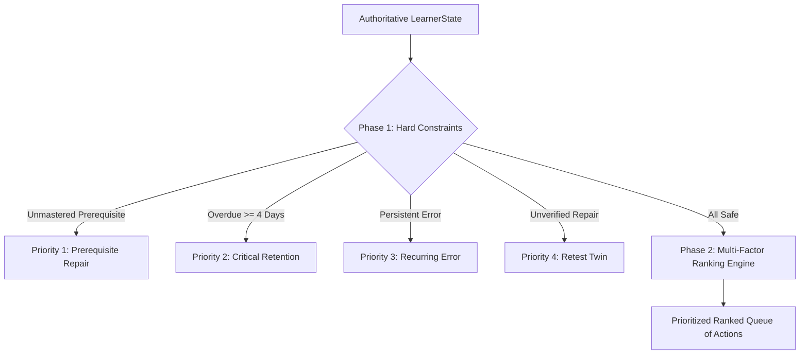

# BAC MASTERY V2 — LEARNING DECISION CONTRACT & REASONING ENGINE

**Document Version:** 2.0.0  
**Status:** ARCHITECTURE FROZEN  
**Authority:** Core Architecture Group  
**Workspace:** BAC BEM (Algerian BAC Learning Operating System)  
**Invariant:** Pure specification — zero code mutations.

---

## 1. The Core Mandate

The Decision Engine is the pedagogical brain of BAC Mastery V2. It is responsible for answering exactly one question:
> **"What is the single next best learning action for this student, and what evidence justifies it?"**

### Core Principles:
1. **Deterministic & Pure:** Given the identical `LearnerState` and curriculum, the engine MUST produce the identical decision.
2. **Explainable:** Every decision exposes a structured `reasonCode` and human-readable pedagogical rationale in Algerian Arabic.
3. **Hard Constraints Before Ranking:** The engine does not compute messy weighted sums until safety constraints (unrepaired prerequisites, critical memory decay) have been satisfied.
4. **Provisional Weights:** Any heuristic ranking parameter that has not yet undergone empirical psycho-metric calibration on Algerian cohort data is explicitly tagged `[PROVISIONAL]`.

---

## 2. Canonical Next Recommendation Object

```typescript
export type DecisionActionType =
  | "active_repair"          // Remediate a diagnosed conceptual error
  | "retest"                 // Verify post-repair mastery via isomorphic twin
  | "critical_retention"     // Spaced review overdue >= 4 days (urgent decay)
  | "recurring_error"        // Break a persistent cognitive loop
  | "prerequisite_repair"    // Fix broken foundational dependency
  | "diagnostic_follow_up"   // Resolve unprobed skill from baseline test
  | "high_impact_skill"      // Advance to unmastered high-coefficient skill
  | "transfer"               // Test resilience in novel / cross-topic context
  | "exam_execution"         // Timed mock exam practice for pacing
  | "normal_review"          // Routine spaced review (due 0-3 days)
  | "new_skill";             // Standard syllabus progression

export interface NextRecommendation {
  decisionId: string;
  studentId: string;
  calculatedAt: string;        // ISO 8601 UTC
  
  actionType: DecisionActionType;
  targetSkillId: CanonicalSkillId;
  secondarySkillIds?: CanonicalSkillId[];
  
  priorityTier: 1 | 2 | 3 | 4 | 5 | 6 | 7; // 1 is absolute highest
  reasonCode: string;          // e.g. "critical_retention_overdue_5d"
  rationaleAr: string;         // "مراجعة متباعدة حرجة: مهارة الاسترة مهددة بالنسيان بعد 5 أيام تأخير"
  rationaleFr: string;
  
  recommendedMissionType: "micro_repair" | "twin_retest" | "retrieval_flash" | "standard_mission" | "mock_section";
    durationClass: "micro" | "short" | "standard" | "deep";
  estimatedDurationMinutes: number; // Micro: 5-10, Short: 10-20, Standard: 20-35, Deep: 35-60
  
  evidenceRequiredForSuccess: {
    minimumScore: number;      // e.g. 0.85
    minimumTier: PracticeTier;
    allowHints: boolean;
  };
  
  failureFallback: {
    fallbackAction: DecisionActionType;
    fallbackSkillId: CanonicalSkillId;
  };
}
```

---

## 3. The 11 Canonical Decision Types

Below is the exhaustive specification of all 11 decision types:

| Decision Type | Priority Tier | Target Scenario | Mission Format | Evidence Required | Failure Fallback |
| :--- | :--- | :--- | :--- | :--- | :--- |
| **`prerequisite_repair`** | **Tier 1** | Target skill has hard unmastered prerequisite. | Guided remediation on prerequisite. | `score >= 0.80`, 0 hints. | Drop to lower prerequisite tier. |
| **`critical_retention`** | **Tier 2** | Mastered skill is overdue by (ge 4) days. | Rapid retrieval drill (3 items). | `reviewGrade >= 3` (SM-2). | Re-flag skill as `needs_retest`. |
| **`recurring_error`** | **Tier 3** | Same error code repeated (ge 2) times. | Deep conceptual breakdown + scaffold. | Rubric keyword check pass. | Route to Socratic AI explanation. |
| **`active_repair`** | **Tier 4** | Fresh error logged during recent practice. | Error Lab repair steps + self-check. | 1 guided item + 1 self-check. | Escalate to `recurring_error`. |
| **`retest`** | **Tier 5** | Repair completed; requires twin validation. | 2 Isomorphic Twin items. | `score >= 0.85` independent. | Re-open `active_repair`. |
| **`normal_review`** | **Tier 6** | Spaced review due (0 to 3 days overdue). | Standard 10-min retrieval practice. | `reviewGrade >= 3`. | Schedule `critical_retention`. |
| **`diagnostic_follow_up`**| **Tier 7** | Skill left unprobed during quick onboarding. | 3 targeted diagnostic probes. | Classifies into mastery tier. | Default to `emergent`. |
| **`high_impact_skill`** | **Tier 8** | High-coefficient unmastered BAC skill. | Full 4-step progressive practice. | 2 High-tier successes. | Drop to guided tier. |
| **`transfer`** | **Tier 9** | Mastered skill ready for multi-unit linkage. | Complex synthetic BAC scenario. | `score >= 0.75` synthesis. | Maintain standard mastery. |
| **`exam_execution`** | **Tier 10**| Student approaching exam countdown (<60 days).| Timed official BAC section. | Time velocity (le 1.1). | Time management repair. |
| **`new_skill`** | **Tier 11**| Standard sequential roadmap advance. | Introductory concept + guided items. | Initial practice baseline. | None (standard progression). |


---

## 3.1. The 4 Canonical Mission Duration Classes

The Decision and Mission engines dynamically adapt mission sizing to the student's immediate context, energy level, and pedagogical goal:

| Duration Class | Time Budget | Typical Mission Types | Triggering Scenarios |
| :--- | :--- | :--- | :--- |
| **`MICRO`** | **5–10 min** | `active_repair`, Active Recall, Fast Verification | Student energy is `tired` or `stressed`; quick mobile review; single error fix. |
| **`SHORT`** | **10–20 min** | `retest`, `normal_review`, `critical_retention` | Standard daily spaced retrieval; post-repair isomorphic twin verification. |
| **`STANDARD`**| **20–35 min** | `high_impact_skill`, `new_skill` | Core 13-element lesson; progressive concept acquisition + guided + independent practice. |
| **`DEEP`** | **35–60 min** | `transfer`, `exam_execution`, Complex Synthesis | Interleaved problem sets; multi-document scientific reasoning (SNV); timed BAC section. |

*Architectural Invariant:* The platform **NEVER** collapses all missions into a rigid 15–20 minute window. Duration is an adaptive variable determined by the Decision Engine.


---

## 4. Two-Phase Decision Architecture

The engine executes in two distinct phases:



### Phase 1: Hard Constraints (Authoritative Vetoes)
If any of these conditions are true, the engine bypasses ranking and immediately returns the mandatory safety action:
1. **Safety Gate 1:** If student attempts to advance to Skill B while Skill A (hard prerequisite) has `masteryScore < 0.60`, engine issues `prerequisite_repair(Skill A)`.
2. **Safety Gate 2:** If any previously mastered skill has `retention.overdueDays >= 4`, engine issues `critical_retention(Skill)` to prevent irreversible memory extinction.
3. **Safety Gate 3:** If an unresolved error has been repaired, engine enforces `retest(Skill)` before allowing new syllabus content.


### Phase 2: Contextual Multi-Factor Ranking
When no hard safety constraints are violated, candidate skills are evaluated across contextual vectors:
- **Goal Relevance:** Alignment with target BAC grade and university faculty ambition.
- **BAC Relevance:** Normalized ministerial coefficient (SNV = 6, Math = 5, Physics = 5 in Sciences Exp).
- **Gap Severity:** Difference between target competence and current demonstrated status.
- **Retention Urgency:** Consumes the 6 retention evidence vectors ((c, \kappa, \tau, L, \delta, \text{days}\)).
- **Transfer Readiness:** Historical success on underlying prerequisites.

*Rule:* Weights and rank ordering are context-dependent and will undergo empirical calibration during the Sciences Exp pilot. Numerical formulas are strictly provisional guidance, not immutable laws.

#### Calibration Status:
- ( W_{	ext{coef}} = 0.35 ) `[PROVISIONAL]`
- ( W_{	ext{gap}} = 0.30 ) `[PROVISIONAL]`
- ( W_{	ext{urg}} = 0.20 ) `[PROVISIONAL]`
- ( W_{	ext{exam}} = 0.15 ) `[PROVISIONAL]`

*(These weights are provisional until the completion of Phase 3 empirical validation with the Sciences Exp pilot cohort).*

---

## 5. Decision Invariants
1. The Decision Engine is a **read-only pure evaluator** of `LearnerState`.
2. The Decision Engine **never modifies** the database directly.
3. Every recommendation is stamped with a unique `decisionId` and stored in the decision audit ledger for model transparency.
