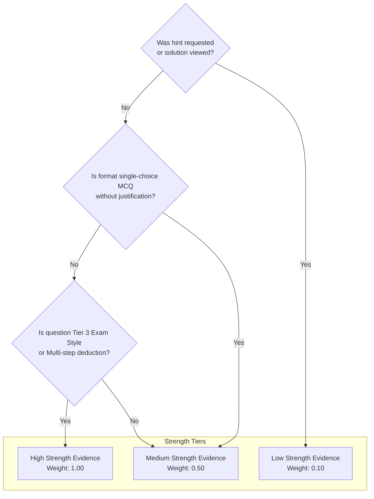

# BAC MASTERY V2 — METHODOLOGY-AWARE EVIDENCE CONTRACT

**Document Version:** 2.0.0  
**Status:** ARCHITECTURE FROZEN  
**Authority:** Core Architecture Group  
**Workspace:** BAC BEM (Algerian BAC Learning Operating System)  
**Invariant:** Pure specification — zero code mutations.

---

## 1. Beyond Binary Correctness: The Algerian BAC Evidence Doctrine

In traditional quiz engines, assessment is binary: `correct: true | false`.  
For the Algerian Baccalaureate, binary assessment is completely inadequate:
- A student can guess correctly on a multiple-choice item without authentic understanding.
- A student can reach the correct final numerical answer in Physics while committing a fatal methodological violation in the differential equation proof.
- A student in Natural Sciences (SNV) may understand the biological mechanism but score 0/4 because ministerial keywords (*mots-clés du barème officiel*) were omitted.
- A student may answer correctly only after viewing 3 hints and taking 8 minutes on a 2-minute item.

**The V2 Doctrine:**  
> **Evidence is a multi-dimensional, methodology-aware pedagogical signal.**  
> It captures not only *what* the student answered, but *how independently*, *how quickly*, *under what cognitive demand*, and with *what fidelity to official BAC rubrics*.

---

## 2. Canonical Evidence Event Schema

Every student interaction that passes through the Evidence Pipeline produces a validated, immutable `EvidenceEvent`:

```typescript
export type EvidenceType =
  | "diagnostic"      // Initial or unit-level baseline assessment
  | "practice"        // Standard daily guided learning
  | "repair"          // Active error remediation exercise
  | "retest"          // Post-repair isomorphic verification twin
  | "spaced_review"   // Scheduled memory retrieval review (SM-2)
  | "transfer"        // Cross-domain or novel context application
  | "exam_simulation" // Official timed mock BAC paper

export type EvidenceStrength = "low" | "medium" | "high";

export type CognitiveDemand =
  | "recall"        // Direct memory retrieval (definitions, units)
  | "procedural"    // Standard formula application, equation solving
  | "conceptual"    // Explaining mechanisms, qualitative relationships
  | "analytical"    // Document exploitation, graph interpretation (SNV/Phys)
  | "synthesis"     // Complex BAC scientific synthesis problem

export type PracticeTier = "tier_1_guided" | "tier_2_independent" | "tier_3_exam_style";

export type ErrorTaxonomyCode =
  | "forgot_information"      // Forgot definition, rule, constant, or theorem
  | "misunderstood_concept"   // Fundamental misconception of the underlying phenomenon
  | "methodology_error"       // Failed official Algerian BAC answer structuring/rubric
  | "calculation_error"       // Sign mistake, algebraic slip, or arithmetic error
  | "misread_question"        // Missed initial conditions, units, or question constraints
  | "rushed"                  // Responded prematurely without verifying alternatives
  | "lack_of_practice"        // Recognized concept but lacked procedural fluency
  | "time_management"         // Ran out of time on a timed task
  | "attention_error"         // Slipped on an obvious element due to fatigue/distraction
  | "unknown";                // Unattributed ambiguity; triggers diagnostic probe

export interface EvidenceEvent {
  // Identity & Correlation
  evidenceId: string;           // ev_{attemptId}
  attemptId: string;            // att_{studentId}_{questionId}_{timestamp}
  studentId: string;            // student_{uuid}
  timestamp: string;            // ISO 8601 UTC
  
  // Pedagogical Coordinates
  skillId: CanonicalSkillId;     // Target skill demonstrated
  secondarySkillIds?: CanonicalSkillId[];
  objectiveId?: string;         // Granular learning objective
  curriculumVersion: string;    // e.g. "curriculum_dz_2026_v1"
  evidenceType: EvidenceType;
  practiceTier: PracticeTier;
  cognitiveDemand: CognitiveDemand;

  // Performance Dimensions
  rawScore: number;             // Normalized 0.000 to 1.000
  independenceScore: number;    // 0.000 (guided) to 1.000 (fully independent)
  confidence: "low" | "medium" | "high";
  durationMs: number;
  expectedDurationMs: number;
  timeVelocityRatio: number;    // durationMs / expectedDurationMs
  
  // Scaffolding & Assistance
  hintsRequestedCount: number;
  hintTypesViewed?: Array<"nudge" | "formula" | "step_solution">;
  solutionViewedBeforeAnswer: boolean;

  // Algerian BAC Rubric & Error Signals
  rubricScoreDetails?: {
    keywordFidelityScore: number;     // 0.00 to 1.00
    methodologicalOrderScore: number;  // 0.00 to 1.00
    calculationAccuracyScore: number;  // 0.00 to 1.00
  };
  errorSignal?: {
    code: ErrorTaxonomyCode;
    misconceptionId?: string;
    detectedDistractorKey?: string;
    severity: "minor_slip" | "conceptual_block" | "methodological_violation";
  };

    // Retention Evidence Dimensions (FROZEN NOW)
  retentionSignal?: {
    correctness: 0 | 1;
    confidence: 1 | 2 | 3 | 4 | 5;
    responseSpeedRatio: number;      // tau = t_actual / t_expected
    lapseHistoryCount: number;       // L
    decayFactor: number;             // delta
    daysElapsed: number;
    isOverdue: boolean;
  };

  // Synthesis & Trustworthiness
  evidenceStrength: EvidenceStrength;
  isMasterySignal: boolean;     // Can this event justify status promotion?
}
```


---

## 2.1. The Multi-Dimensional Invariant: Prohibition on Scalar Reduction

> [!CAUTION]
> **ARCHITECTURAL RED LINE:**  
> **EVIDENCE MUST NEVER BE REDUCED TO A SINGLE COMPOSITE SCALAR NUMBER.**  
> It is strictly forbidden to compute a formula like:
> \( \text{evidence} = \text{correctness} \times \text{confidence} \times \text{speed} \times \text{independence} \)
>
> **The Canonical Architecture:**
> ```text
> Evidence Event
>    ├── correctness (rawScore)
>    ├── confidence (metacognitive rating 1..5)
>    ├── response time (tau velocity ratio)
>    ├── independence (hint penalties)
>    ├── cognitive demand (Bloom level)
>    ├── rubric details (keyword fidelity)
>    ├── error taxonomy (10 canonical codes)
>    └── retention vectors (6 empirical dimensions)
>           ↓
>       Learner Model State Reducer
>           ↓
>    Multiple Independent Derived States
>    (Mastery Status, Retention Schedule, Error Ledger, Priority)
> ```
> Different engines consume different evidence dimensions. There is no requirement that every engine consume every dimension.


---

## 3. The 7 Canonical Evidence Types

| Evidence Type | Purpose | Minimum Cognitive Demand | Minimum Practice Tier | Can Trigger Mastery? |
| :--- | :--- | :--- | :--- | :--- |
| **`diagnostic`** | Rapidly estimate baseline ability profile | Procedural | Tier 2 Independent | Yes (initializes state) |
| **`practice`** | Progressive skill acquisition | Procedural to Conceptual | Tier 1 to Tier 2 | Yes (incremental EMA) |
| **`repair`** | Remediate a diagnosed error/misconception | Conceptual | Tier 1 Guided | No (only enables retest) |
| **`retest`** | Verify elimination of misconception via twin | Analytical | Tier 2 Independent | Yes (clears error lock) |
| **`spaced_review`** | Maintain memory retention (SM-2) | Recall to Procedural | Tier 2 Independent | No (updates retention) |
| **`transfer`** | Prove resilience in novel context/data | Analytical to Synthesis | Tier 3 Exam Style | Yes (validates deep mastery) |
| **`exam_simulation`** | Measure high-stakes exam readiness | Full BAC Spectrum | Tier 3 Exam Style | Yes (updates exam benchmark) |

---

## 4. Evidence Strength Calibration

Not all evidence is created equal. The system categorizes every event into three strength tiers:



### 4.1. High Strength Evidence
- **Criteria:**
  - Zero hints requested (`independenceScore == 1.00`).
  - Cognitive demand is `"analytical"` or `"synthesis"`.
  - Practice tier is `"tier_2_independent"` or `"tier_3_exam_style"`.
  - Involves active construction (multi-step math calculation, accounting journal entry, or document exploitation).
  - Time taken is within 0.5x to 1.5x expected budget.
- **Authority:** Permitted to trigger promotion to `"mastered"` status.

### 4.2. Medium Strength Evidence
- **Criteria:**
  - Zero hints requested, but question is standard single-choice MCQ.
  - OR single procedural calculation completed within normal time.
- **Authority:** Contributes incrementally to EMA mastery score; cannot alone promote to `"mastered"`.

### 4.3. Low Strength Evidence
- **Criteria:**
  - One or more hints requested (`independenceScore < 0.75`).
  - Answer submitted in < 5 seconds (flagged as impulsive guessing).
  - Answer submitted after > 3x expected budget (extreme struggle/hesitation).
  - Solution viewed before submission.
- **Authority:** Never increments mastery score; recorded purely as diagnostic friction or diagnostic telemetry.

---

## 5. Sufficiency Rules for Learner State Mutation

To ensure algorithmic integrity and prevent "inflation of mastery", the Evidence Pipeline enforces strict mathematical gates:

### Rule 1: The Independence Gate
```typescript
if (event.independenceScore < 0.80) {
  event.isMasterySignal = false;
  // Weak evidence: only affects friction analytics, never mastery promotion
}
```

### Rule 2: The Two-Success Minimum for Mastery
A skill cannot transition from `"practicing"` to `"mastered"` based on a single attempt, regardless of score:
- **Requirement:** At least **two consecutive High Strength evidence events** with `rawScore >= 0.85` achieved across distinct sessions (minimum 4 hours separation to prevent short-term working memory bias).

### Rule 3: Error Isolation vs. Cascade
- If a student fails a question on `physics_rlc_resonance` due strictly to an arithmetic sign slip (`calculation_slip`), the system logs the calculation error, but **does not mark the resonance physics concept as unmastered**.
- If the student fails due to `concept_confusion` (e.g., inverting the resonance frequency formula), the physics skill status drops to `"needs_retest"`.

---

## 6. Auditability & Immutability Guarantee

Every `EvidenceEvent` is:
1. **Cryptographically Hashed:** Timestamp + studentId + attemptId + rawScore are logged with an append-only sequence number.
2. **Immutable in Supabase:** The `evidence_events` table has Row Level Security (RLS) configured to prevent `UPDATE` and `DELETE` operations.
3. **Replay-Ready:** Entire student cohorts can have their mastery trajectories re-simulated from original evidence events if a grading parameter is refined.
