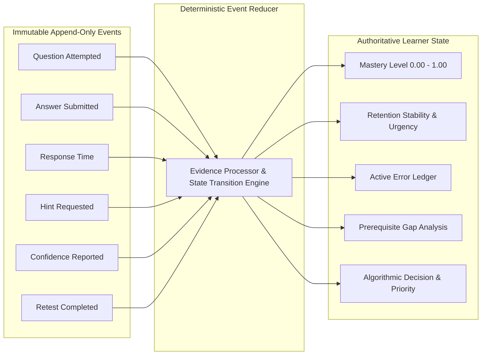

# BAC MASTERY V2 — CANONICAL LEARNER STATE CONTRACT

**Document Version:** 2.0.0  
**Status:** ARCHITECTURE FROZEN  
**Authority:** Core Architecture Group  
**Workspace:** BAC BEM (Algerian BAC Learning Operating System)  
**Invariant:** Pure specification — zero code mutations.

---

## 1. The Core Architecture Problem & The V2 Solution

In BAC Mastery V1, the audit (TASK 0.1 & 0.2) identified critical state fragmentation:
- **15 distinct localStorage keys** (`bac_mastery_store`, `bac_mistakes`, `bac_spaced_reviews`, etc.) operating without atomic coordination.
- **16 Supabase tables** updating asynchronously without a unified sync coordinator.
- **Client-side React component state** performing ad-hoc calculations of streak, mastery, and urgent reviews directly in UI render methods.

This caused:
1. **Hydration Mismatches:** Client rendered local counters while server rendered database state.
2. **Data Loss Vulnerability:** Clearing browser cache wiped out months of mistakes, review dates, and practice history.
3. **Inconsistent Decisions:** The Roadmap Engine saw one subset of evidence while the Daily Mission and Error Lab saw different local arrays.

### The V2 Architecture Doctrine:
There is **EXACTLY ONE Canonical Learner State** per student.  
All UI components, recommendation engines, and reports consume strictly from this unified state model.

---

## 2. Fundamental Separation: Raw Evidence vs. Derived State

The architecture strictly distinguishes between immutable historical facts (**Raw Evidence**) and computed pedagogical conclusions (**Derived State**).



### 2.1. Raw Evidence (What Happened)
- **Nature:** Immutable, timestamped, append-only facts.
- **Examples:**
  - Question `q_math_chain_rule_01` attempted at 2026-09-17T02:15:00Z.
  - Selected option B; took 64 seconds; requested 0 hints.
  - Student reported confidence: `high`.
  - Retest item `retest_err_01` completed with correct mathematical justification.
  - Diagnostic session completed for unit `snv_protein_synthesis`.
- **Storage:** Supabase `evidence_events` and `attempts` tables. Cached locally in IndexedDB/offline queue.

### 2.2. Derived State (What the System Currently Infers)
- **Nature:** Ephemeral or persistent mathematical projections recalculated deterministically from the evidence stream.
- **Examples:**
  - Skill `math_derivatives_chain_rule` has a mastery score of `0.88` (Mastered).
  - Memory stability is `14.2 days`; next review due in 2 days (`isDue: false`).
  - Active error on `concept_confusion` flagged as requiring retest.
  - Prerequisite gap exists on `math_limits_polynomial`.
  - Current Next Best Action: `active_repair` on `physics_rc_circuit`.
- **Storage:** Persisted snapshot in Supabase `learner_states` (single JSONB document + relational indices); cached client-side under a single key `bac_learner_state_v2`.

---

## 3. The 10 Sub-States of Canonical Learner State

The canonical root state is `LearnerState`, composed of 10 strongly typed sub-states:

```typescript
export interface LearnerState {
  version: "2.0.0";
  studentId: string;
  schemaVersion: number;
  lastUpdated: string; // ISO 8601
  seqNumber: number;   // Monotonically increasing event counter
  
  student: StudentState;
  goal: GoalState;
  context: ContextState;
  subjects: Record<SubjectId, SubjectState>;
  skills: Record<CanonicalSkillId, SkillState>;
  missions: MissionState;
  errors: ErrorState;
  retention: RetentionState;
  assessment: AssessmentState;
  currentDecision: CurrentDecisionState;
}
```

---

### Sub-State 1: StudentState
- **Purpose:** Core demographic, stream affiliation, and registration identity.
- **Authoritative Owner:** Identity / User OS
- **Allowed Writers:** Onboarding flow, Account Settings Service.
- **Allowed Readers:** All engines, UI components, Analytics.
- **Input Evidence:** Onboarding submission event, Profile update event.
- **Derived Fields:** `daysUntilExam`, `academicPhase`, `isVerifiedStudent`.
- **Allowed Transitions:** `onboarding` -> `active` -> `suspended` -> `archived`.
- **Forbidden Transitions:** Cannot mutate `studentId` or change `streamId` without a formal curriculum migration event.
- **Persistence Location:** Supabase `profiles` table & root `learner_states.student`.
- **Cache Behavior:** In-memory + persisted locally; refreshed on session start.
- **Sync Behavior:** Immediate bidirectional sync.

---

### Sub-State 2: GoalState
- **Purpose:** Tracks the student's declared academic ambitions, target BAC grade, and study pacing.
- **Authoritative Owner:** Strategy / Student Profile Layer
- **Allowed Writers:** Student Goal Settings UI (via Goal Action).
- **Allowed Readers:** Decision Engine, Roadmap Engine, Analytics.
- **Input Evidence:** Goal declaration event, Pacing change event.
- **Derived Fields:**
  - `targetGrade`: number (e.g., 16.50/20.00).
  - `targetMention`: "assez_bien" | "bien" | "tres_bien" | "excellent".
  - `targetSpecialty`: string (e.g., "Médecine", "Informatique / ESI", "Polytechnique").
  - `dailyStudyBudgetMinutes`: number (e.g., 90).
  - `requiredMasteryIndex`: number (calculated from target grade and coefficients).
- **Allowed Transitions:** Pacing or target updates allowed at any time; updates re-calibrate the roadmap.
- **Forbidden Transitions:** Setting target below official passing grade (10.00).
- **Persistence Location:** Supabase `learner_states.goal`.
- **Cache Behavior:** Cached locally; invalidates Roadmap cache on change.
- **Sync Behavior:** Synced immediately upon modification.

---

### Sub-State 3: ContextState
- **Purpose:** Real-time environmental and student state metrics (device type, connection speed, available session time, energy level).
- **Authoritative Owner:** Runtime Session Layer
- **Allowed Writers:** Session initialization hook, Energy check-in modal.
- **Allowed Readers:** Decision Engine (for micro-mission duration matching).
- **Input Evidence:** User session heartbeat, optional energy check-in ("high" | "normal" | "tired" | "stressed").
- **Derived Fields:** `sessionDurationBudget`, `offlineStatus`, `recommendedMissionSize`.
- **Allowed Transitions:** Dynamic per session.
- **Forbidden Transitions:** None.
- **Persistence Location:** Session storage / local device cache (does NOT require permanent database archiving).
- **Cache Behavior:** Reset per browser session.
- **Sync Behavior:** Sent as telemetry during sync events; never blocks learning.

---

### Sub-State 4: SubjectState
- **Purpose:** Macro-level mastery, coefficient weight, and unit-level coverage for each subject in the student's stream.
- **Authoritative Owner:** Learner Model / Subject Aggregator
- **Allowed Writers:** Evidence Pipeline.
- **Allowed Readers:** Student Dashboard, Progress Reports, Roadmap Engine.
- **Input Evidence:** Aggregated evidence from all skills under this subject.
- **Derived Fields:**
  - `coefficient`: Official BAC coefficient (e.g., 6 for SNV, 5 for Math).
  - `overallMastery`: Weighted average of underlying skill masteries (0.00 - 1.00).
  - `predictedBacScore`: Statistical projection on the 0.00 - 20.00 scale.
  - `completedSkillsCount`: number.
  - `totalSkillsCount`: number.
  - `coveragePercentage`: number.
- **Allowed Transitions:** Monotonically reflects aggregate skill evidence; recalculated on skill updates.
- **Forbidden Transitions:** UI cannot directly edit subject mastery or predicted scores.
- **Persistence Location:** Supabase `learner_states.subjects`.
- **Cache Behavior:** Recomputed reactively in cache on skill updates.
- **Sync Behavior:** Synced with primary state snapshot.

---

### Sub-State 5: SkillState
- **Purpose:** The atomic competence record for every `CanonicalSkillId` in the stream curriculum.
- **Authoritative Owner:** Learner Model
- **Allowed Writers:** Evidence Pipeline (EXCLUSIVELY).
- **Allowed Readers:** All recommendation engines, Error Lab, UI.
- **Input Evidence:** Multi-dimensional `EvidenceEvent`s (practice, diagnostic, retest, exam).
- **Authoritative Domain Status:**
  - `status`: `"not_yet" | "emerging" | "demonstrated" | "review_due"`.
- **Secondary Telemetry & Signals:**
  - `latentAbilityScore`: Optional continuous estimate ([0..1]) for ranking (does NOT define mastery).
  - `confidenceCalibration`: float between 0.000 and 1.000.
  - `totalAttemptsCount`: number.
  - `successfulAttemptsCount`: number.
  - `lastPracticedAt`: ISO timestamp string.
  - `hasActiveError`: boolean.
  - `prerequisitesMet`: boolean.
- **Allowed Transitions:**
  - `not_yet` -> `emerging` (via initial successful practice).
  - `emerging` -> `demonstrated` (via 2 independent high-tier successes or post-repair twin pass).
  - `demonstrated` -> `review_due` (when memory stability decays past due date).
  - `review_due` -> `demonstrated` (upon successful retrieval challenge).
  - `demonstrated` -> `not_yet` (upon 2 consecutive failed repair/retest cycles).
- **Forbidden Transitions:**
  - DIRECT MUTATION BY UI.
  - A numeric float score setting mastery status directly.
  - Transition to `demonstrated` without passing the minimum independence threshold.
- **Persistence Location:** Supabase `learner_skill_states` table + snapshot in `learner_states.skills`.
- **Cache Behavior:** Cached in IndexedDB; updated optimistically via local Evidence Processor.
- **Sync Behavior:** Synced with high priority to cloud backend.

---

### Sub-State 6: MissionState
- **Purpose:** Tracks currently active, queued, and historical learning missions.
- **Authoritative Owner:** Mission Engine
- **Allowed Writers:** Mission Engine, Practice Runner (updates step progress).
- **Allowed Readers:** Dashboard, Daily Target UI, Practice Runner.
- **Input Evidence:** Mission launch event, Step completion event, Mission abandon/finish event.
- **Derived Fields:**
  - `activeMission`: `Mission | null`.
  - `queuedMissions`: `QueuedMissionItem[]`.
  - `completedTodayCount`: number.
  - `dailyTargetState: { target: number, current: number, isMet: boolean };\n  durationClass: "micro" | "short" | "standard" | "deep";\n- **Allowed Transitions:** `idle` -> `mission_in_progress` -> `mission_completed` -> `evaluating` -> `idle`.
- **Forbidden Transitions:** Cannot have multiple concurrent active missions. Cannot mark mission complete without completing required steps.
- **Persistence Location:** Supabase `missions` table + `learner_states.missions`.
- **Cache Behavior:** Locally cached; active mission state preserved across browser refreshes.
- **Sync Behavior:** Immediate sync on step transitions.

---

### Sub-State 7: ErrorState
- **Purpose:** The mistake vault tracking uncorrected errors, active repairs, and retest twins.
- **Authoritative Owner:** Error Lab Subsystem
- **Allowed Writers:** Evidence Pipeline (creates error events), Error Lab (updates repair status).
- **Allowed Readers:** Error Lab UI, Decision Engine, AI Tutor.
- **Input Evidence:** Failed `EvidenceEvent` (error creation), Repair step completion (repair transition), Retest attempt (clearance or escalation).
- **10 Canonical Error Taxonomy Codes:**
  `forgot_information`, `misunderstood_concept`, `methodology_error`, `calculation_error`, `misread_question`, `rushed`, `lack_of_practice`, `time_management`, `attention_error`, `unknown`.
- **Derived Fields:**
  - `unresolvedCount`: number.
  - `recurringErrors`: Array of error events with repetition count (ge 2).
  - `topErrorTaxonomy`: Most frequent canonical error code.
  - `pendingRetests`: Array of skills with completed repair awaiting isomorphic twin test.
  - `needsMoreWorkSkills`: Array of skills that failed 2 repair cycles, paused for recovery.
- **Allowed Transitions:**
  - `unresolved` -> `repairing` -> `pending_retest` -> `resolved`.
  - Retest Failure 1 -> Back to `repairing` with alternative scaffolding.
  - Retest Failure 2 -> Transition to `needs_more_work` (2-cycle limit enforced).
- **Forbidden Transitions:** UI cannot delete an error without successful retest evidence.
- **Persistence Location:** Supabase `error_events` table + `learner_states.errors`.
- **Cache Behavior:** Cached locally; updates instantly on practice failure.
- **Sync Behavior:** Synced immediately to ensure mistakes are never lost.

---

### Sub-State 8: RetentionState
- **Purpose:** Retention schedules and memory decay tracking for demonstrated skills.
- **Authoritative Owner:** Retention Subsystem / Learner Model
- **Allowed Writers:** Evidence Pipeline (upon retrieval review event).
- **Allowed Readers:** Decision Engine, Roadmap Engine, Spaced Review UI.
- **Input Evidence Dimensions (FROZEN NOW):**
  Consumes the 6 empirical vectors: `correctness`, `confidence` ((1..5)), `response_speed_ratio` ((	au)), `lapse_history` ((L)), `decay_factor` ((delta)), and `days_elapsed`.
- **Algorithm Calibration:** Exact mathematical scheduling function is **NOT YET FROZEN** (SM-2 serves as baseline reference).
- **Derived Fields:**
  - `dueCount`: Number of skills where `nextReviewAt <= now()`.
  - `criticalDueCount`: Number of skills overdue by (ge 4) days.
  - `urgencyStatus`: `"fresh" | "due" | "overdue" | "critical"`.
  - `schedules`: `Record<CanonicalSkillId, RetentionSchedule>`.
- **Allowed Transitions:** Interval expands with high confidence and fast fluency; collapses to 1 day on incorrect retrieval.
- **Forbidden Transitions:** Cannot schedule review for an unmastered skill (`not_yet` or `emerging`).
- **Persistence Location:** Supabase `learner_retention_schedules` + `learner_states.retention`.
- **Cache Behavior:** Evaluated locally via pure function.
- **Sync Behavior:** Synchronized on review completion.

---

### Sub-State 9: AssessmentState
- **Purpose:** Tracks formal diagnostic evaluations, baseline proficiencies, and mock BAC exam results.
- **Authoritative Owner:** Assessment OS / Exam Simulator
- **Allowed Writers:** Diagnostic Engine, Exam Simulator.
- **Allowed Readers:** Student Dashboard, Strategy Layer, Onboarding.
- **Input Evidence:** Diagnostic submission event, Exam Session submission event.
- **Derived Fields:**
  - `diagnosticStatus`: `"not_started" | "in_progress" | "completed"`.
  - `diagnosticCompletedAt`: string | null.
  - `baselineProficiency`: Record<SubjectId, number>.
  - `examSessions`: Array of completed mock BAC sessions with standardized scores.
- **Allowed Transitions:** `not_started` -> `in_progress` -> `completed`. Once completed, baseline is locked; progress is measured via subsequent practice and exam sessions.
- **Forbidden Transitions:** Resetting completed diagnostic without administrative or structural curriculum override.
- **Persistence Location:** Supabase `exam_sessions`, `exam_attempts`, `learner_states.assessment`.
- **Cache Behavior:** Cached permanently; immutable historical benchmarks.
- **Sync Behavior:** Immediate sync upon session submission.

---

### Sub-State 10: CurrentDecisionState
- **Purpose:** Stores the single authoritative "Next Best Learning Action" currently recommended for this student, along with full mathematical and pedagogical justification.
- **Authoritative Owner:** Decision Engine / Priority Subsystem
- **Allowed Writers:** Decision Engine (EXCLUSIVELY).
- **Allowed Readers:** Dashboard "Start Next Mission" button, Navigation bar, AI Tutor.
- **Input Evidence:** Entire authoritative `LearnerState` (errors, retention, prerequisite gaps, target grade).
- **Derived Fields:**
  - `actionType`: `"active_repair" | "retest" | "critical_retention" | "recurring_error" | "prerequisite_repair" | "diagnostic_follow_up" | "high_impact_skill" | "transfer" | "exam_execution" | "normal_review" | "new_skill"`.
  - `targetSkillId`: `CanonicalSkillId`.
  - `priorityTier`: 1 through 7 (1 = Highest).
  - `reasonCode`: e.g., `"spaced_retrieval_review"`, `"unresolved_prerequisite"`.
  - `rationaleTextAr`: Algerian Arabic explanation for student transparency.
  - `estimatedDurationMinutes`: number (typically 15-20).
  - `calculatedAt`: ISO timestamp.
- **Allowed Transitions:** Recomputed dynamically whenever evidence alters learner state or context changes.
- **Forbidden Transitions:** Hardcoding or overriding via UI without recalculation.
- **Persistence Location:** Evaluated dynamically in memory; logged to Supabase `decision_audit_logs`.
- **Cache Behavior:** In-memory reactive state; re-evaluated on every state change.
- **Sync Behavior:** Logged asynchronously for learning science analytics.

---

## 4. State Security & Access Control Matrix

| Sub-State | Authoritative Owner | Allowed Writers | Allowed Readers | Persistence |
| :--- | :--- | :--- | :--- | :--- |
| **StudentState** | Identity OS | Onboarding / Auth | All | `profiles` |
| **GoalState** | Strategy Layer | Student Settings UI | Engines, UI | `learner_states.goal` |
| **ContextState** | Runtime Session | Session Hooks | Decision Engine | Memory / Session |
| **SubjectState** | Learner Model | Evidence Pipeline | Dashboard, UI | `learner_states.subjects` |
| **SkillState** | Learner Model | Evidence Pipeline | Engines, UI | `learner_skill_states` |
| **MissionState** | Mission Engine | Mission Engine / Runner | Practice, UI | `missions` |
| **ErrorState** | Error Lab | Evidence Pipeline / Lab | Error Lab, Engines | `error_events` |
| **RetentionState** | Retention Subsystem | Evidence Pipeline | Decision, UI | `retention_schedules` |
| **AssessmentState** | Assessment OS | Exam / Diagnostic Engine | Dashboard, UI | `exam_sessions` |
| **CurrentDecisionState**| Decision Engine | Decision Engine | UI, Navigation | `decision_audit_logs` |

---

## 5. Architectural Invariant

> **THE CARDINAL INVARIANT OF BAC MASTERY V2:**  
> **No component outside the Evidence Pipeline may mutate `SkillState`, `ErrorState`, or `RetentionState`.**  
> **No component outside the Decision Engine may designate the `CurrentDecisionState`.**  
> **The UI is a pure presentation and telemetry emitter; it holds ZERO authority over learning truth.**
