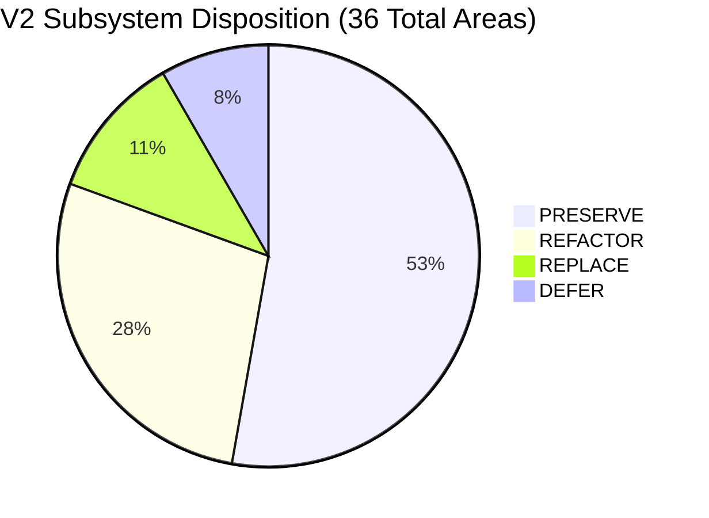

# BAC MASTERY V2 — MIGRATION BOUNDARY & SUBSYSTEM DISPOSITION

**Document Version:** 2.0.0  
**Status:** ARCHITECTURE FROZEN  
**Authority:** Core Architecture Group  
**Workspace:** BAC BEM (Algerian BAC Learning Operating System)  
**Invariant:** Pure specification — zero code mutations.

---

## 1. Executive Migration Framework

The transition to BAC Mastery V2 is governed by strict scope containment.  
To prevent destabilizing working user flows, every existing subsystem is partitioned into one of four immutable migration categories:
1. **PRESERVE:** Proven, verified code that must survive untouched or with zero-breaking cosmetic integration.
2. **REFACTOR:** Subsystems whose internal architecture is adapted to Layer 1 contracts while preserving 100% of user-facing behavior.
3. **REPLACE:** Legacy logic that is obsolete, structurally flawed, or violates the V2 Authority Matrix and must be rewritten.
4. **DEFER:** Secondary features and non-core modules that must NOT be touched during Core Stabilization.

---

## 2. Exhaustive Subsystem Disposition Table

| Subsystem / Component | Disposition | Current File / Location | Disposition Rationale & Boundaries |
| :--- | :--- | :--- | :--- |
| **Layer 1 Contracts** | **PRESERVE** | `src/contracts/*` | Verified in Sprint 01; canonical contracts are frozen foundations. |
| **Sciences Exp Skills (31)**| **PRESERVE** | `src/data/skills/canonical-sciences.ts` | Clean canonical registry with official coefficients; 100% test passing. |
| **Interactive Journal UI** | **PRESERVE** | `src/components/practice/InteractiveJournal.tsx` | Working double-entry ledger component for Gestion; keep as assessment renderer. |
| **Interactive Steps UI** | **PRESERVE** | `src/components/practice/InteractiveSteps.tsx` | Working multi-stage deduction component for STEM; keep as assessment renderer. |
| **Algerian Payment Engine** | **PRESERVE** | `src/lib/payments/`, `src/app/api/checkout/` | Chargily Pay V2 + receipt upload flow tailored to Algeria; completely functional. |
| **Supabase SSR Auth** | **PRESERVE** | `src/lib/supabase/`, `src/middleware.ts` | Standard Next.js App Router auth with cookie session management. |
| **D-Day Exam Simulator** | **PRESERVE** | `src/lib/exam/`, `src/components/d-day/` | Working timed exam mode mirroring BAC duration and official coefficients. |
| **Error Taxonomy Standard** | **PRESERVE** | `src/lib/errors/taxonomy.ts` | Authoritative 10 cognitive & methodological error types restored from Learning OS §7.1 (legacy 6 types mapped cleanly). |
| **Audio Player Component** | **PRESERVE** | `src/components/ui/AudioPlayer.tsx` | Audio playback for Arabic poetry recitation and literature revision. |
| **PDF Summary Exporters** | **PRESERVE** | `src/lib/export/` | Working printable revision summaries and formula sheets. |
| **Landing Page & Marketing** | **PRESERVE** | `src/app/page.tsx`, `src/components/landing/` | High-converting Algerian student landing page with tested conversion funnel. |
| **Verification Test Suite** | **PRESERVE** | `scripts/verify-sprint01.ts` | Regression harness testing Layer 1 invariants and zero circular dependencies. |
| **Route Redirection Layer** | **PRESERVE** | `next.config.mjs` | 301 redirects permanently routing deprecated routes (`/errors` -> `/error-lab`). |
| **UI Design System Primitives**| **PRESERVE**| `src/components/ui/*` | Clean Tailwind CSS cards, buttons, badges, modals, and progress bars. |
| **Curriculum Facade** | **PRESERVE** | `src/data/curriculum/skills.ts` | 10-line backward-compatibility facade ensuring legacy imports do not break. |
| **Supabase Core Tables** | **PRESERVE** | `profiles`, `subscriptions`, `payments` | Stable PostgreSQL tables for billing, accounts, and user identity. |
| **Confidence Calibration** | **PRESERVE** | `src/lib/practice/` (confidence input) | Student self-reported confidence widget; preserve during question attempts. |
| **Retest Twin Logic** | **PRESERVE** | `src/lib/errors/` (twin question selector)| Isomorphic question pairing concept is sound; preserve matching criteria. |
| **Sciences Exp Question Bank**| **PRESERVE**| `src/data/practice/sciences-exp.ts` | High-quality authored questions; preserve content while standardizing tags. |
| **Roadmap Recommendation** | **REFACTOR** | `src/lib/roadmap/engine.ts` | Adapt to consume unified `LearnerState` and return `CanonicalSkillId[]`. |
| **Mission Engine** | **REFACTOR** | `src/lib/missions/`, `src/app/missions/` | Drive mission generation purely from `LearnerState.dailyTarget` and priority queue. |
| **Practice Session Runner** | **REFACTOR** | `src/app/practice/`, `PracticeSession.tsx` | Decouple evaluation logic into headless evaluator; UI emits `EvidenceEvent`s. |
| **Error Lab Subsystem** | **REFACTOR** | `src/app/error-lab/`, `src/lib/errors/` | Read directly from `LearnerState.errors`; drive targeted micro-remediation loops. |
| **Spaced Retrieval Engine** | **REFACTOR** | `src/lib/spaced-repetition/` (SM-2) | Connect local SM-2 calculations to canonical `LearnerState.retention`. |
| **Student Dashboard** | **REFACTOR** | `src/app/dashboard/` | Replace 4 separate localStorage reads with reactive `useLearnerState()` hook. |
| **Curriculum: Gestion & Philo**| **REFACTOR** | `src/data/curriculum/gest-econ.ts`, etc. | Upgrade Gestion (33) and Lettres (23) to full `CanonicalSkill` interface. |
| **Question Bank Tagging** | **REFACTOR** | `src/data/questions/` | Ensure 100% of questions reference valid `CanonicalSkillId`s and Bloom tiers. |
| **Profile & Settings Page** | **REFACTOR** | `src/app/profile/`, `src/app/settings/` | Synchronize student BAC goals directly into `LearnerState.goal`. |
| **AI Prompt Bridge** | **REFACTOR** | `src/lib/ai/`, `src/app/api/tutor/` | Constrain prompt context to active error codes and forbid solution leakage. |
| **Adaptive Diagnostic Cold-Start**| **REPLACE**| `src/lib/diagnostic/` | Replace static 15-question quiz with 6-layer Diagnostic V2 (L0 Routing, L1 Screening, L2 Diagnosis, L3 Bottleneck Probe, L4 Calibration, L5 Transfer). |
| **Monolithic State Storage**| **REPLACE** | 15 localStorage keys + 16 Supabase tables | Replace scattered keys with `LearnerState` single-key cache + Sync Engine. |
| **Direct UI Grading Logic** | **REPLACE** | Inlined scoring inside React components | Replace with headless `evaluateStudentAttempt()` function. |
| **Legacy Storage Shims** | **REPLACE** | Deprecated helper shims and orphan keys | Purge orphan keys once state rehydration is verified. |
| **Gamification & Badges** | **DEFER** | `src/components/gamification/` | Non-essential for Sciences pilot; defer until Core stabilization passes. |
| **Peer Leaderboards** | **DEFER** | `src/app/leaderboard/` | Defer to prevent distraction from pedagogical mastery loop. |
| **Parent Portal & SMS Gateway**| **DEFER** | `src/lib/notifications/` | Defer until Core Learning OS is deployed to active test users. |

---

## 3. Strict Rules for the Sciences Exp Pilot

1. **Sciences Exp First:** The Core stabilization focuses 100% on the **Sciences Expérimentales** stream (Math, Physics, Natural Sciences).
2. **Zero Invalidation of Historical User Data:** Existing users with valid Chargily payments and profiles must experience zero interruption during state migration.
3. **Rollback Safety:** If the unified `LearnerState` cache encounters an unrecoverable error, the system must cleanly re-initialize from Supabase cloud state.

---

## 4. Legacy V1 Error Compatibility Mapping

The legacy 6 error types found in V1 code map into the 10 canonical V2 error types as follows:

| Legacy V1 Error Type | Canonical V2 Error Taxonomy Code | Description |
| :--- | :--- | :--- |
| `concept_confusion` | `misunderstood_concept` | Fundamental misconception of the underlying phenomenon. |
| `calculation_slip` | `calculation_error` | Sign mistake, algebraic slip, or arithmetic calculation error. |
| `keyword_missing` | `methodology_error` | Omission of mandatory ministerial scoring keywords (mots-clés du barème). |
| `methodology_flaw` | `methodology_error` | Failure to follow official Algerian BAC scientific reasoning structure. |
| `time_pressure` | `time_management` | Timeout or rushed submission under exam timing constraints. |
| `reading_comprehension` | `misread_question` | Misinterpretation of initial conditions, parameters, or units. |

*Additional Canonical Types Restored in V2:*
- `forgot_information`: Forgotten definitions, physical constants, or mathematical theorems.
- `rushed`: Premature impulsive submission without verifying alternative options.
- `lack_of_practice`: Recognized concept but lacked procedural fluency and execution speed.
- `attention_error`: Careless slip due to cognitive fatigue.
- `unknown`: Unattributed breakdown triggering step-by-step diagnostic probe.
