# BAC MASTERY V2 — MIGRATION MATRIX & DEPENDENCY BLUEPRINT

**Document Version:** 2.0.0  
**Status:** Canonical Reference Architecture  
**Generated:** 2026-09-17  
**Workspace:** BAC BEM (Algerian BAC Learning Operating System)  
**Invariant:** Pure specification & architecture planning — zero code mutations.

---

## Executive Summary

This Migration Matrix establishes the definitive transition plan from BAC Mastery V1 to **BAC Mastery V2 (Learning Operating System)**.

Every component, engine, data store, and user flow across the 24 capability areas identified in the Feature Inventory is classified into exactly one of six strategic actions:
- **KEEP (19)**: Solid, verified, or Layer 1 foundation components retained as-is or with minor cosmetic integration.
- **MODIFY (10)**: Core engines adapted to consume Layer 1 contracts, canonical skills, and the unified `LearnerState`.
- **SPLIT (3)**: Tangled modules decoupled into clean architectural tiers (presentation, domain logic, synchronization).
- **REBUILD (1)**: Fundamental rewrites required to replace heuristic cold-starts with rigorous adaptive diagnostic logic.
- **DELETE (1)**: Deprecated shims, duplicate storage keys, and obsolete code scheduled for safe removal.
- **NEW (2)**: Novel infrastructure components (Evidence Pipeline and Unified State Sync Engine) created to close critical architecture gaps.

Total Features Classified: **36** (19 KEEP + 10 MODIFY + 3 SPLIT + 1 REBUILD + 1 DELETE + 2 NEW).

---

## Strategic Action Classifications

### 1. KEEP (19 Components)
*Components that remain intact, require no architectural rewrite, and form the baseline stability of V2.*

| Area | Current Implementation | Action | Reason | Migration Risk | Prerequisite |
| :--- | :--- | :--- | :--- | :--- | :--- |
| **Layer 1: Canonical Skill Contract** | `src/contracts/canonical-skill.contract.ts` | **KEEP** | Core contract defining `CanonicalSkillId`, coefficients, and units; fully typed and verified in Sprint 01. | Low | None |
| **Layer 1: Evidence Contract** | `src/contracts/evidence.contract.ts` | **KEEP** | Standardized atomic learning event schema (`EvidenceEvent`, `AssessmentFormat`, `ErrorTaxonomyCode`). | Low | None |
| **Layer 1: Learner State Contract** | `src/contracts/learner.contract.ts` | **KEEP** | Canonical state interface defining `LearnerState`, `SkillState`, and `DailyTargetState`. | Low | None |
| **Layer 1: Decision Contract** | `src/contracts/decision.contract.ts` | **KEEP** | Standardized interface for recommendation engines and routing policies. | Low | None |
| **Canonical Skills (Sciences Exp)** | `src/data/skills/canonical-sciences.ts` | **KEEP** | 31 unified canonical skills with official BAC 2026 coefficients, units, and learning objectives. | Low | Canonical Skill Contract |
| **Curriculum Facade** | `src/data/curriculum/skills.ts` | **KEEP** | Clean 10-line backward-compatibility facade re-exporting canonical skills to prevent breaking legacy imports. | None | Canonical Sciences |
| **Algerian Payment Engine** | `src/lib/payments/`, `src/app/api/checkout/` | **KEEP** | Working Chargily Pay V2 integration (Edahabia/CIB) + manual receipt upload flow tailored to Algerian commerce. | Low | None |
| **Auth Infrastructure & Middleware** | `src/lib/supabase/`, `src/middleware.ts` | **KEEP** | Supabase SSR auth with session cookie management, protected routes, and role-based access. | Low | None |
| **Interactive Journal UI** | `src/components/practice/InteractiveJournal.tsx` | **KEEP** | Domain-specific accounting ledger editor for Gestion & Économie stream; supports multi-column debits/credits. | Low | Evidence Contract (Adapter) |
| **Interactive Steps UI** | `src/components/practice/InteractiveSteps.tsx` | **KEEP** | Step-by-step progressive deduction component for multi-stage math and physics proofs. | Low | Evidence Contract (Adapter) |
| **Error Taxonomy Standard** | `src/lib/errors/taxonomy.ts` | **KEEP** | 6 pedagogically verified error categories matching Algerian BAC inspection criteria. | Low | None |
| **D-Day Simulator Logic** | `src/lib/exam/`, `src/components/d-day/` | **KEEP** | Timed simulation engine mirroring exact BAC time budgets (3.5h – 4.5h), coefficients, and grading scales. | Low | Canonical Skills |
| **Audio / Speech Engine** | `src/components/ui/AudioPlayer.tsx` | **KEEP** | Recitation and explanation audio player for Arabic literature, poetry, and linguistic rules. | None | None |
| **Revision Summary / PDF Exporters**| `src/lib/export/` | **KEEP** | Client-side and server-side printable summaries and formula sheets tailored for offline revision. | None | None |
| **Supabase Core Schema** | `profiles`, `subscriptions`, `payments` | **KEEP** | Production PostgreSQL tables for user profiles, subscription plans, and billing audit trails. | Low | None |
| **Landing Page & Marketing Funnel** | `src/app/page.tsx`, `src/components/landing/` | **KEEP** | High-conversion Algerian student landing page with proven copy, trust signals, and clear onboarding CTA. | None | None |
| **Sprint Verification Test Suite** | `scripts/verify-sprint01.ts` | **KEEP** | Automated 7-suite regression harness testing contracts, skill immutability, and circular dependencies. | None | None |
| **HTTP 301 Route Redirection Layer**| `next.config.mjs` | **KEEP** | Next.js redirect rules permanently routing deprecated endpoints (e.g., `/errors` -> `/error-lab`). | None | None |
| **UI Design System Primitives** | `src/components/ui/*` | **KEEP** | Clean Tailwind CSS component library (buttons, badges, dialogs, progress bars, cards). | None | None |

---

### 2. MODIFY (10 Components)
*Core engines and interfaces that must be adapted to consume Layer 1 contracts and the unified LearnerState.*

| Area | Current Implementation | Action | Reason | Migration Risk | Prerequisite |
| :--- | :--- | :--- | :--- | :--- | :--- |
| **Roadmap Recommendation Engine** | `src/lib/roadmap/engine.ts` | **MODIFY** | Migrate from reading fragmented localStorage to consuming canonical `LearnerState` and returning `CanonicalSkillId[]`. | Medium | Learner State Unification |
| **Diagnostic Test Engine** | `src/lib/diagnostic/`, `src/app/diagnostic/` | **MODIFY** | Adapt to test canonical skill trees across all streams and emit formal `EvidenceEvent`s into the pipeline. | Medium | Canonical Skills & Evidence Contract |
| **Mission Engine** | `src/lib/missions/`, `src/app/missions/` | **MODIFY** | Drive daily mission generation purely from `LearnerState.dailyTarget` and high-yield gap priorities. | Medium | Roadmap Engine & Learner State |
| **Practice Session Runner** | `src/app/practice/`, `PracticeSession.tsx` | **MODIFY** | Refactor from direct localStorage mutations to a pure state machine dispatching `EvidenceEvent`s. | High | Evidence Pipeline |
| **Error Lab / Mistake Vault** | `src/app/error-lab/`, `src/lib/errors/` | **MODIFY** | Read directly from `LearnerState.errors`; drive targeted micro-remediation practice loops. | Medium | Learner State & Evidence Pipeline |
| **Spaced Retrieval Engine** | `src/lib/spaced-repetition/` (SM-2) | **MODIFY** | Integrate local SM-2 interval calculations with canonical `SkillState.retention` and server-side scheduler. | Medium | Learner State Contract |
| **Student Dashboard** | `src/app/dashboard/` | **MODIFY** | Replace ad-hoc multi-key localStorage queries with reactive `useLearnerState()` selectors. | Low | Unified Learner State Hook |
| **Curriculum: Non-Sciences Streams**| `src/data/curriculum/gest-econ.ts`, `lettres-philo.ts` | **MODIFY** | Upgrade Gestion & Lettres streams to implement full `CanonicalSkill` interface with BAC coefficients. | Medium | Canonical Skill Contract |
| **Question Bank Registry** | `src/data/questions/` | **MODIFY** | Tag all 465+ questions with `CanonicalSkillId`, Bloom's level, format, and BAC exam reference tags. | Medium | Canonical Skill IDs |
| **Profile & Settings Experience** | `src/app/profile/`, `src/app/settings/` | **MODIFY** | Sync student BAC goals (stream, target grade, study pace) directly into canonical `LearnerState.profile`. | Low | Learner State Contract |

---

### 3. SPLIT (3 Components)
*Tangled modules that must be separated into distinct architectural tiers to prevent coupling and data loss.*

| Area | Current Implementation | Action | Reason | Migration Risk | Prerequisite |
| :--- | :--- | :--- | :--- | :--- | :--- |
| **Learner State Storage** | 15 localStorage keys + 16 Supabase tables | **SPLIT** | Decouple into: (1) Local Cache / Optimistic Store, (2) Cloud Sync Layer, and (3) Domain Selectors (`useSkills`, etc.). | High | Learner State Contract |
| **Practice Evaluation Logic** | Monolithic `PracticeSession.tsx` | **SPLIT** | Decouple into: (1) Headless Evaluator State Machine, and (2) Pure Presentation UI Components. | Medium | Evidence Contract |
| **AI Tutor / Chat Engine** | Ad-hoc prompt in `src/lib/ai/` | **SPLIT** | Decouple into: (1) Socratic Scaffolding Prompt Constructor, (2) Evidence Context Provider, and (3) Transport UI. | Medium | Error Taxonomy & Canonical Skills |

---

### 4. REBUILD (1 Component)
*Fundamental rewrite required due to architectural inadequacy of current implementation.*

| Area | Current Implementation | Action | Reason | Migration Risk | Prerequisite |
| :--- | :--- | :--- | :--- | :--- | :--- |
| **Adaptive Cold-Start Diagnostic** | Flat static 15-question quiz in `src/lib/diagnostic/` | **REBUILD** | Replace static quiz with multi-stage Bayesian diagnostic estimating latent ability and true BAC grade projection. | High | Canonical Skills, Tagged Questions, Learner State |

---

### 5. DELETE (1 Component)
*Obsolete code and antipattern shims scheduled for phased elimination.*

| Area | Current Implementation | Action | Reason | Migration Risk | Prerequisite |
| :--- | :--- | :--- | :--- | :--- | :--- |
| **Legacy LocalStorage Shims & Duplicates**| Deprecated storage helpers & orphan keys | **DELETE** | Purge orphan keys (`bac_mastery_store`, `bac_mistakes`) once migration to `bac_learner_state_v2` is verified. | Low | State Migration Completed |

---

### 6. NEW (2 Components)
*Brand-new foundational systems required to complete the Learning OS architecture.*

| Area | Planned Location | Action | Reason | Migration Risk | Prerequisite |
| :--- | :--- | :--- | :--- | :--- | :--- |
| **Evidence Pipeline** | `src/lib/evidence/pipeline.ts` | **NEW** | Centralized event processor: receives `EvidenceEvent`s, computes delta updates, and triggers state mutations. | Medium | Evidence Contract & Learner State Contract |
| **Unified State Sync Engine** | `src/lib/state/sync-engine.ts` | **NEW** | Offline-first sync coordinator between client cache and Supabase backend with monotonic version vectors. | High | Learner State Contract & Supabase Schema |

---

## Recommended Dependency-Aware Migration Sequence

The migration must proceed strictly in topological dependency order. No layer may be modified before its underlying contracts and dependencies are frozen and verified:

```mermaid
flowchart TD
    subgraph Phase 1: Foundation
        F1[1. Contracts Freeze<br/>canonical, evidence, learner, decision] --> F2[2. Canonical Skills Completion<br/>Sciences Exp, Gestion, Lettres]
    end

    subgraph Phase 2: Core State & Pipeline
        F2 --> S1[3. Unified Learner State<br/>Single local cache + Supabase sync engine]
        S1 --> S2[4. Evidence Pipeline<br/>Event ingestion, validation, state delta]
    end

    subgraph Phase 3: Assessment & Diagnostic
        S2 --> A1[5. Question Bank Tagging<br/>Canonical IDs, rubrics, formats]
        A1 --> A2[6. Headless Practice Evaluator<br/>Decoupled grading & evidence emission]
        A2 --> A3[7. Adaptive Diagnostic Rebuild<br/>Multi-stage cold start & gap profiling]
    end

    subgraph Phase 4: Guidance Engines
        A3 --> G1[8. Decision & Priority Engine<br/>High-yield coefficient ranking]
        G1 --> G2[9. Dynamic Roadmap Engine<br/>Personalized study sequencing]
        G2 --> G3[10. Daily Mission Engine<br/>Target completion & micro-goals]
    end

    subgraph Phase 5: Retention & Mastery
        G3 --> R1[11. Spaced Retrieval Scheduler<br/>SM-2 integrated with LearnerState]
        R1 --> R2[12. Error Lab Remediation<br/>Targeted mistake practice loops]
        R2 --> R3[13. D-Day Exam Simulator<br/>BAC timed mock integration]
    end

    subgraph Phase 6: Experience & Intelligence
        R3 --> U1[14. Unified Dashboard & UI<br/>Reactive hooks, zero hydration drift]
        U1 --> U2[15. Socratic AI Tutor<br/>Evidence-aware context & scaffolding]
        U2 --> D1[16. Deprecation & Cleanup<br/>Delete legacy keys & shims]
    end

    style F1 fill:#e0f2fe,stroke:#0284c7,stroke-width:2px
    style S1 fill:#fef3c7,stroke:#d97706,stroke-width:2px
    style S2 fill:#fef3c7,stroke:#d97706,stroke-width:2px
    style A3 fill:#fee2e2,stroke:#dc2626,stroke-width:2px
    style G1 fill:#dcfce7,stroke:#16a34a,stroke-width:2px
```

---

## Detailed Phase Execution Roadmap

### Phase 1: Foundation Contracts & Canonical Domain
1. **Freeze Contracts:** Ensure zero mutation on `canonical-skill.contract.ts`, `evidence.contract.ts`, `learner.contract.ts`, and `decision.contract.ts`.
2. **Curriculum Standardization:** Port Gestion & Économie (33 skills) and Lettres & Philosophie (23 skills) to strict `CanonicalSkill` objects.

### Phase 2: Learner State & Evidence Pipeline
3. **Unified Learner State Contract Implementation:** Build `src/lib/state/learner-store.ts` wrapping client storage in a single key (`bac_learner_state_v2`).
4. **State Sync Engine:** Implement bidirectional debounced synchronization to Supabase `learner_states` table with monotonic sequence counters.
5. **Evidence Pipeline Engine:** Implement `processEvidenceEvent(event: EvidenceEvent): LearnerStateUpdate` to centralize mastery calculations.

### Phase 3: Assessment Decoupling & Adaptive Diagnostic
6. **Question Bank Tagging:** Ensure 100% of questions reference valid `CanonicalSkillId`s.
7. **Practice State Machine:** Extract evaluation logic from `PracticeSession.tsx` into `src/lib/practice/evaluator.ts`.
8. **Adaptive Diagnostic Rebuild:** Implement the 3-stage diagnostic algorithm with instant BAC grade projection.

### Phase 4: Adaptive Guidance Loop
9. **Decision Engine:** Wire Priority 1 (Prerequisite gaps), Priority 2 (Spaced review), and Priority 3 (High BAC coefficient yield).
10. **Roadmap & Missions:** Connect UI directly to `DecisionEngine.getNextRecommendations()`.

### Phase 5: Retention & Transfer Loops
11. **Spaced Review Integration:** Automate SM-2 scheduling through `EvidenceEvent` timestamp logging.
12. **Error Lab Unification:** Link Error Lab retries directly to prerequisite reinforcement tasks.
13. **D-Day Simulator Integration:** Enable full mock exam attempts that produce comprehensive diagnostic evidence.

### Phase 6: Polish & Deprecation
14. **Dashboard Modernization:** Ensure all summary cards read from `useLearnerState()`.
15. **Socratic AI Tutor:** Connect prompt construction to `LearnerState.errors` and active skill objectives.
16. **Legacy Purge:** Run migration script to clear old localStorage keys and remove dead shims.

---

## Verification & Integrity Guardrails
- Every phase transition requires passing `npm run typecheck` with 0 errors.
- Every phase requires execution of regression suites in `scripts/verify-sprint01.ts` and subsequent sprint verifiers.
- Invariant: Zero direct writes to localStorage outside the unified `LearnerState` adapter.
