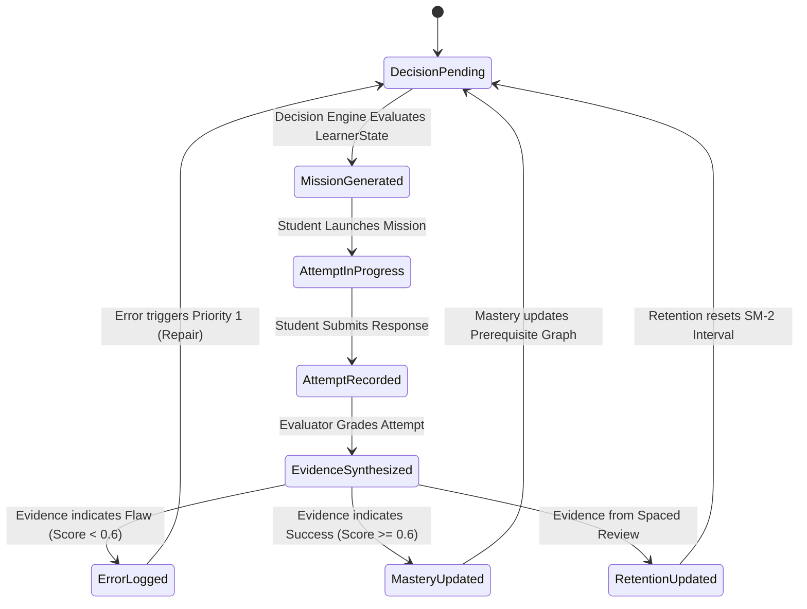
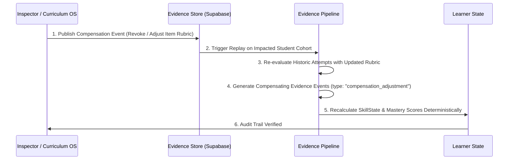

# BAC MASTERY V2 — STATE TRANSITION RULES & PEDAGOGICAL LOOP

**Document Version:** 2.0.0  
**Status:** ARCHITECTURE FROZEN  
**Authority:** Core Architecture Group  
**Workspace:** BAC BEM (Algerian BAC Learning Operating System)  
**Invariant:** Pure specification — zero code mutations.

---

## 1. The Closed Pedagogical Loop

In BAC Mastery V2, learning is modeled as a deterministic, closed feedback loop. State does not change through time, clicks, or passive consumption; it changes **exclusively** through authenticated evidence processed by strict state transition functions.



---

## 2. Formal Transition Specifications

### 2.1. Attempt → Evidence
```
Transition: evaluateAttempt(Attempt, Question, Rubric) -> EvidenceEvent
```
- **Preconditions:**
  - `Attempt` has a valid, non-null `rawResponse`.
  - `Question` is registered in the active curriculum with a valid `CanonicalSkillId`.
  - `durationMs > 0`.
- **Transformation Logic:**
  1. Compares `rawResponse` against `Question.rubric` or automated grading logic.
  2. Evaluates hint penalty (e.g., each hint reduces independence score by 0.25).
  3. Calculates response time vs. expected time budget (flags time pressure if > 2x expected).
  4. Formulates atomic `EvidenceEvent` specifying correctness (0.00 to 1.00), cognitive tier, and error signals.
- **Postconditions:**
  - Immutable `EvidenceEvent` created and appended to Supabase `evidence_events`.
  - The raw `Attempt` is marked `evaluated`.

---

### 2.2. Evidence → Learner State (Mastery Update)
```
Transition: updateSkillMastery(CurrentSkillState, EvidenceEvent) -> UpdatedSkillState
```
- **Preconditions:**
  - `EvidenceEvent.skillId == CurrentSkillState.skillId`.
  - Evidence strength is `"medium"` or `"high"` (weak evidence cannot trigger status promotion).
- **The Multi-Dimensional Reducer Rule:**
  - **CRITICAL NEGATIVE RULE:** The system is **STRICTLY PROHIBITED** from multiplying evidence dimensions into a single scalar product (e.g. \( \text{mastery} = \text{correctness} \times \text{confidence} \times \text{speed} \times \text{independence} \)).
  - Instead, the Evidence Pipeline evaluates dimensions independently:
    - **Independence Gate:** Must have `independenceScore >= 0.80` (zero or minimal hints).
    - **Accuracy Gate:** Must have `rawScore >= 0.85` on the target cognitive tier.
    - **Cognitive Demand Gate:** Must be at least Tier 2 Independent Practice.
- **State Transition Logic:**
  - If currently `"not_yet"` and passes initial practice $\implies$ Transition to `"emerging"`.
  - If currently `"emerging"` AND achieves **two consecutive independent high-tier successes** across distinct sessions (minimum 4h separation) $\implies$ Transition to `"demonstrated"`.
  - If currently `"demonstrated"` AND memory stability decays past due threshold $\implies$ Transition to `"review_due"`.
  - If currently `"review_due"` AND passes retrieval challenge with high confidence $\implies$ Renew `"demonstrated"`.
  - If currently `"demonstrated"` AND commits a fundamental error during practice $\implies$ Flag active error and transition to `"emerging"` pending repair.
  - If a skill fails 2 consecutive repair/retest cycles $\implies$ Transition to `"not_yet"` with status flag `needs_more_work` (2-cycle limit).
- **Postconditions:**
  - `LearnerState.skills[skillId]` updated with discrete status (`not_yet`, `emerging`, `demonstrated`, `review_due`) and timestamp.

---

### 2.3. Evidence → Error Event
```
Transition: logErrorEvent(EvidenceEvent) -> ErrorEvent
```
- **Preconditions:**
  - `EvidenceEvent.rawScore < 0.60` OR an explicit error signal is detected.
- **Transformation Logic:**
  1. Identifies and records the specific error code from the **10 Canonical Error Taxonomy Codes**:
     - `forgot_information`: Forgotten rule, formula, or theorem.
     - `misunderstood_concept`: Flawed mental model or conceptual inversion.
     - `methodology_error`: Structural flaw in proof, deduction, or Algerian BAC rubric.
     - `calculation_error`: Arithmetic, sign, or algebraic manipulation slip.
     - `misread_question`: Overlooked given conditions or unit constraints.
     - `rushed`: Premature submission without verification.
     - `lack_of_practice`: Procedural hesitation or unautomated steps.
     - `time_management`: Timeout or severe pacing overrun.
     - `attention_error`: Careless slip due to fatigue.
     - `unknown`: Ambiguous breakdown triggering diagnostic probe.
  2. Evaluates Recurrence: If `Count(e.skillId == skillId && e.errorCode == errorCode) >= 2`, flags `isRecurring = true`.
- **Postconditions:**
  - Appends new immutable entry to Supabase `error_events`.
  - Adds active error reference to `LearnerState.errors.activeErrors`.

---

### 2.4. Evidence → Retention Update (Spaced Review)
```
Transition: updateRetentionSchedule(CurrentSchedule, EvidenceEvent) -> UpdatedSchedule
```
- **Preconditions:**
  - `EvidenceEvent` originated from a Spaced Review session (`evidenceType == "spaced_review"`).
- **Transformation Logic (6 Evidence Vectors):**
  - Consumes: (1) `correctness`, (2) `confidence` ((1..5)), (3) `response_speed_ratio` ((\tau)), (4) `lapse_history` ((L)), (5) `decay_factor` ((\delta)), and (6) `days_elapsed`.
  - Incorrect retrieval ((c = 0)) immediately collapses interval to 1.0 day and triggers a repair cycle.
  - High confidence ((\kappa \ge 4)) and effortless fluency ((\tau < 0.6)) expand the interval safely.
  - Chronic lapses ((L > 1)) apply an interval dampening penalty ((\max(0.6, 1.0 - 0.1 \times L))).
  - *Algorithm Status:* Exact mathematical scheduling formula is **NOT YET FROZEN**; SM-2 acts as reference baseline.
- **Postconditions:**
  - `nextReviewAt` updated.
  - Persisted in `learner_retention_schedules`.

---

### 2.5. Evidence → Decision
```
Transition: evaluateNextBestAction(LearnerState) -> LearningDecision
```
- **Preconditions:**
  - Authoritative `LearnerState` is up to date with all processed evidence.
- **Hierarchical Priority Rule (Deterministic Order):**
  1. **Priority 1 (Active Prerequisite Gap):** If a target skill has unmastered hard prerequisites, target the failing prerequisite first.
  2. **Priority 2 (Critical Spaced Review):** If any mastered skill is overdue by (ge 4) days (`isDue: true`, `urgency: "critical"`), trigger a Retention Review.
  3. **Priority 3 (Active Error Repair):** If unresolved errors exist with `repairStrategy` defined, trigger targeted Error Repair.
  4. **Priority 4 (Retest Verification):** If a repaired skill requires twin verification, trigger a Retest Twin mission.
  5. **Priority 5 (Standard Spaced Review):** If any mastered skill is due (`isDue: true`, overdue 1-3 days), trigger Spaced Review.
  6. **Priority 6 (High-Yield Curriculum Advance):** Select the next unmastered skill in the student's stream weighted by official BAC coefficient (Sciences: SNV=6, Math=5, Phys=5).
  7. **Priority 7 (Review / Polish):** Deepening mastery of emerging skills ((0.60 le 	ext{mastery} < 0.85)).
- **Postconditions:**
  - `LearnerState.currentDecision` populated with action type, target skill, and explainable reason code.

---

### 2.6. Decision → Mission
```
Transition: generateMission(LearningDecision, StudentContext) -> Mission
```
- **Preconditions:**
  - `LearningDecision` is valid and non-null.
  - No existing active mission is in progress (or existing active mission is explicitly archived/abandoned).
- **Transformation Logic:**
  - Generates an intervention tailored to the decision's duration class (Micro: 5–10 min, Short: 10–20 min, Standard: 20–35 min, Deep: 35–60 min):
    - If `active_repair`: Micro or Short intervention (1 conceptual explanation + 1 guided item + 1 self-check).
    - If `retest`: Short intervention (2 isomorphic twin questions never seen by this student).
    - If `critical_retention`: Micro or Short intervention (3 rapid retrieval items targeting the fading trace).
    - If `high_impact_skill`: Standard or Deep intervention (1 diagnostic baseline + 3 progressive practice exercises).
- **Postconditions:**
  - Mission status set to `"ready"` with assigned questions and timer budget.

---

### 2.7. Mission → Attempt
```
Transition: startMission(Mission) -> ActiveMissionSession
```
- **Preconditions:**
  - Student clicks "Start Mission".
- **Transformation Logic:**
  - Mounts the appropriate practice runner component.
  - Initializes the interaction timer and telemetry listener.
- **Postconditions:**
  - Generates raw `Attempt` records for each interactive step.

---

## 3. Negative Architectural Guardrails (Absolute Prohibitions)

The following 10 rules are strictly enforced across all codebases:

1. **UI MUST NOT directly set mastery:**  
   No UI button, modal, or client script may invoke a function that assigns a mastery score or marks a skill as "mastered". Mastery is derived exclusively by the Evidence Pipeline.
2. **UI MUST NOT directly set learner priority:**  
   The UI may display filtered views, but the authoritative `CurrentDecisionState` is computed exclusively by the pure Decision Engine.
3. **Question completion MUST NOT automatically equal mastery:**  
   Simply answering a question (or guessing until correct) does not satisfy mastery criteria. Mastery requires independent, hint-free, repeated success at the required cognitive tier.
4. **Content consumption MUST NOT equal mastery:**  
   Watching a video, downloading a PDF, or reading a summary card creates zero mastery credit. Only active assessment attempts emit valid evidence.
5. **Time spent MUST NOT equal mastery:**  
   Spending 2 hours on a screen does not increase mastery scores. Time spent is used only to evaluate cognitive velocity and identify hesitation/friction.
6. **A single incorrect answer MUST NOT imply permanent deficiency:**  
   An isolated slip decrements mastery slightly or triggers a repair flag; it never wipes out an entire learning history or permanently locks a student out of higher units.
7. **AI output MUST NOT directly mutate learner state:**  
   AI models (LLMs) operate as Socratic tutors and explanation generators. An LLM response cannot write to `LearnerState` or update mastery tables.
8. **No two authoritative copies of learner state:**  
   `localStorage` is a transient read-through cache; Supabase is the sole authoritative persistence store. Local storage never wins in a divergence.
9. **Missions cannot be completed without verified attempts:**  
   A student cannot click "Finish Mission" without generating valid `Attempt` payloads for all required exercises.
10. **Derived learner state must be reproducible from raw evidence:**  
    If derived tables are wiped or corrupted, replaying the append-only `evidence_events` stream must reproduce the exact identical `LearnerState`.
11. **PROHIBITION ON SCALAR EVIDENCE FLATTENING:**  
    The system is strictly prohibited from multiplying multi-dimensional evidence into a single composite number. Correctness, independence, velocity, and rubric fidelity must remain distinct attributes in the event payload.
12. **CANONICAL LAYER SEPARATION:**  
    The pipeline must strictly preserve the 4 independent architectural tiers:
    `RAW ATTEMPT -> EVIDENCE -> DERIVED LEARNER STATE -> DECISION`.
    No layer may be bypassed or collapsed into another.

---

## 4. Evidence Correction & Compensation Protocol

### The Problem:
What happens if an assessment item has an error in its official answer key, a question is discovered to be ambiguous, or a scoring rubric is retroactively adjusted by pedagogical inspectors?

### The V2 Correction Protocol:
Direct database edits to student mastery scores are **STRICTLY FORBIDDEN**. Corrections must follow the formal Compensation Flow:



1. **Compensating Evidence Events:**  
   Instead of mutating past rows, the system emits a new event of type `"compensation_adjustment"` referencing the original `evidenceId` and specifying the delta.
2. **Deterministic State Replay:**  
   The Evidence Pipeline re-runs the student's mastery EMA sequence from the point of correction forward.
3. **Auditability:**  
   Every correction is recorded in `evidence_audit_logs` with inspector credentials and rationale. The student's dashboard displays a polite notification if a previously penalized question was vindicated.
