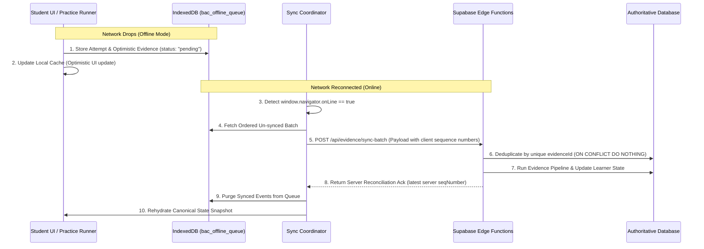

# BAC MASTERY V2 — OFFLINE & SYNCHRONIZATION CONTRACT

**Document Version:** 2.0.0  
**Status:** ARCHITECTURE FROZEN  
**Authority:** Core Architecture Group  
**Workspace:** BAC BEM (Algerian BAC Learning Operating System)  
**Invariant:** Pure specification — zero code mutations.

---

## 1. Context & The Algerian Reality

Algerian high school students frequently study on mobile 3G/4G connections or shared Wi-Fi networks subject to sudden latency spikes, intermittent dropouts, and power disruptions.  
If a learning platform requires continuous real-time internet connectivity to record answers:
- Students lose their practice streak during network cuts.
- Progress in a 20-minute mission is wiped out upon page reload.
- Students become frustrated and abandon the software.

**The V2 Mandate:**  
> **BAC Mastery V2 is an offline-first resilient Learning OS.**  
> Students can practice, answer questions, and complete missions without an active connection.  
> However, **the offline cache must NEVER silently overwrite authoritative cloud learner state.**

---

## 2. Canonical Offline Capabilities Boundary

| Capability | Allowed Offline? | Action During Disconnection | Sync Policy on Reconnection |
| :--- | :--- | :--- | :--- |
| **Complete Active Mission** | **YES** | Questions cached; attempts stored in IndexedDB queue. | Replay queued events in chronological order. |
| **Error Lab Practice** | **YES** | Locally cached mistakes used for repair steps. | Retest & repair events synchronized. |
| **Spaced Review Sessions** | **YES** | SM-2 retrieval items answered offline. | Retrieval evidence logged; interval updated. |
| **Generate NEW Missions** | **LIMITED** | Client uses local fallback roadmap queue (up to 3 queued). | Server validates and reconciles priority queue. |
| **Account / Billing Changes** | **NO** | Blocked; displays "Connection Required" banner. | Immediate network verification required. |
| **Diagnostic Cold-Start** | **NO** | Multi-stage adaptive branching requires initial online calibration. | Initial test requires connected session. |
| **Official Mock BAC Exam** | **LIMITED** | Timed paper can run offline; submission queued. | High-priority immediate flush on reconnect. |

---

## 3. The Offline Synchronization Protocol



---

## 4. Synchronization Rules & Invariants

### 4.1. Unique Event IDs (Client-Generated UUIDs)
Every offline attempt and evidence event MUST generate a globally unique, cryptographically random ID before touching any storage:
```typescript
const attemptId = `att_${studentId}_${questionId}_${Date.now()}_${crypto.randomUUID().slice(0, 8)}`;
const evidenceId = `ev_${attemptId}`;
```
*Rationale:* Prevents duplicate ID collisions across multiple client devices.

---

### 4.2. Absolute Idempotency
The server ingestion endpoint MUST be strictly idempotent:
```sql
-- Supabase Ingestion Guarantee
INSERT INTO evidence_events (
  evidence_id, attempt_id, student_id, skill_id, raw_score, independence_score, created_at
) VALUES (...)
ON CONFLICT (evidence_id) DO NOTHING;
```
*Rule:* If the same batch is transmitted three times due to network timeouts, it is processed exactly once.

---

### 4.3. Strict Chronological Ordering
- All offline events are queued with a monotonic client timestamp (`clientTimestamp`) and a local incrementing counter (`localEventIndex`).
- The server processes queued events strictly in order of creation, ensuring that prerequisite completions and error logs occur in the authentic sequence the student experienced.

---

### 4.4. Conflict Handling & Resolution Matrix

| Conflict Scenario | Resolution Strategy | Technical Mechanism |
| :--- | :--- | :--- |
| **Duplicate Attempt Submission** | Deduplication | Server drops duplicate `evidenceId` without error. |
| **Offline attempt on skill already updated on server** | Monotonic Recalculation | Server ingests event, appends to evidence stream, and re-evaluates EMA mastery from the event timestamp. |
| **Clock Drift on Student Phone** | Server Timestamp Verification | Client timestamp accepted for interval calculation, but bounded by server ingestion time ((pm 24) hours max drift). |
| **Local Cache Corrupted / Wiped** | Automatic Rehydration | Client detects empty cache; queries `GET /api/learner-state` to re-download authoritative snapshot. |

---

### 4.5. Exponential Backoff & Retry Behavior
If the synchronization API call fails due to weak 3G signals or server 503 errors:
1. **First Retry:** After 2 seconds.
2. **Second Retry:** After 5 seconds.
3. **Third Retry:** After 15 seconds.
4. **Subsequent Retries:** Exponential backoff with jitter up to a maximum of 5 minutes.
5. **Persistent Failure:** Events remain safely stored in IndexedDB. A discreet non-blocking status indicator displays: *"3 تمارين محفوظة أوفلاين، سيتم المزامنة عند عودة الاتصال"*.

---

### 4.6. App Restart Recovery
If the user closes the browser tab, restarts their phone, or runs out of battery while offline:
- The queue in **IndexedDB** survives across browser restarts.
- Upon app launch, the `SyncCoordinator` immediately checks the offline queue and flushes pending events as soon as network connectivity is confirmed.
