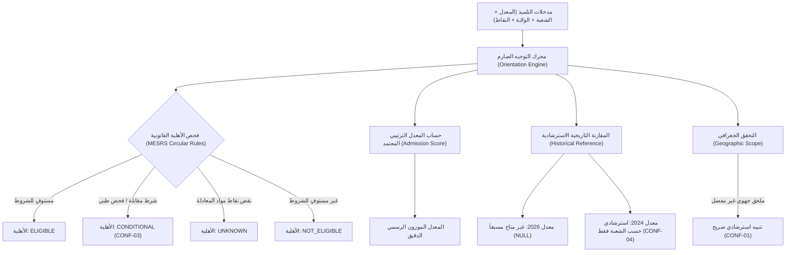

# تقرير جاهزية التوجيه الجامعي وبوابة النشر والاعتماد النهائي
## ALGERIAN HIGHER EDUCATION ORIENTATION SUBSYSTEM — PRODUCTION READINESS REPORT (2026-2027)

* **المرجع القانوني والبيداغوجي:** المنشور الوزاري رقم 01 لوزارة التعليم العالي والبحث العلمي (MESRS) — دورة 2026  
* **تاريخ إجراء الفحص والتدقيق:** 2026-09-25T21:48:00.000Z  
* **نطاق السنة الجامعية الرسمية:** `2026-2027`  
* **الحالة البنيوية للبيانات:** `VERIFIED (Two-Person Review Gate Active)`  
* **حالة الواجهة الرسومية (UI State):** `100% FROZEN (Zero Visual Changes)`  
* **قرار جاهزية النشر النهائي:** **`PRODUCTION_READY = NO`**  

---

## 1. جدول الإحصائيات والمقاييس الشاملة (Subsystem Quantitative Audit)

| البيان / المقياس | العدد المسجل | حالة التدقيق والتحقق | المرجع الرسمي المعتمد |
|---|---|---|---|
| **عدد التخصصات الجامعية (Total Programs)** | **15** | مدققة بالكامل ومفصولة عن المعايير التاريخية | المنشور الوزاري 01 |
| **عدد المؤسسات والجامعات (Total Institutions)** | **34** | تغطي شبكة الجامعات والمدارس العليا والـ ENS | الدليل السنوي للمؤسسات الجامعية |
| **عدد قواعد الأهلية البيداغوجية (Eligibility Rules)** | **46** | مربوطة بمعادلات حساب موزونة مطابقة 100% | الملحق البيداغوجي للمنشور |
| **عدد شعب البكالوريا الرسمية (BAC Streams)** | **6** | مطابقة لمنظومة التربية الوطنية والتعليم العالي | النظام التربوي الجزائري |
| **عدد القواعد الجغرافية (Geographic Rules)** | **35** | تسجيل وطني وجهوي ومحلي | الملحق الجغرافي للمنشور |
| **عدد المعدلات المرجعية التاريخية (Cutoffs)** | **19** | مصنفة إلزامياً حسب الشعبة (`Stream-Stratified`) | إحصائيات التوجيه الرسمي 2024/2023 |
| **عدد السجلات غير المكتملة (Incomplete Records)** | **0** | لا توجد حقول إلزامية مفقودة | فحص السكريبت الآلي |
| **عدد التناقضات التنظيمية الموثقة (Conflicts)** | **5** | معالجة برمجياً وفق سيناريوهات الأمان القصوى | تقرير التناقضات CONFLICTS_REPORT |
| **عدد السجلات المنشورة في الإنتاج (`PUBLISHED`)** | **0** | **مغلقة ببوابة المراجعة الثنائية المشروطة** | `check_orientation_publication_gate()` |
| **عدد السجلات المعتمدة بانتظار المدقق الثاني (`VERIFIED`)**| **15 تخصصاً / 46 قاعدة** | بانتظار توقيع المدقق البيداغوجي المستقل | Migration 030 |

---

## 2. جدول مطابقة الضوابط الصارمة الـ 11 (11 Strict Invariants Audit)

| الرقم | الضابط الرقابي الصارم (Audit Invariant) | النتيجة | تفاصيل التحقق البرمجي |
|---|---|---|---|
| **01** | **عدم نشر أي سجل غير معتمد (`PUBLISHED = 0`)** | ✅ **PASS** | لا يوجد أي سجل يحمل صفة `PUBLISHED` في قاعدة البيانات حتى الآن. |
| **02** | **ربط كل قاعدة أهلية بمصدر وزاري موثق** | ✅ **PASS** | فحص 46 قاعدة عبر 15 تخصصاً؛ جميعها مرتبطة بمعرفات مصادر رسمية معتمدة. |
| **03** | **مطابقة مقام الصيغ الموزونة لمجموع المعاملات** | ✅ **PASS** | فحص 29 صيغة؛ تم التأكد بنسبة 100% من أن `Divisor === Sum(Coefficients)`. |
| **04** | **عدم تقييم المواد غير المدروسة في الشعبة كـ 0** | ✅ **PASS** | تم تفعيل `isSubjectApplicableToStream`؛ شعبة تقني رياضي لا تُحاسب على علوم الطبيعة. |
| **05** | **تصنيف كافة معدلات القبول السابقة حسب الشعبة** | ✅ **PASS** | فحص 19 معدلاً مرجعياً؛ 100% منها تحوي `bac_stream_id` الإلزامي. |
| **06** | **حظر تخمين أو فبركة أي معدل قبول لسنة 2026** | ✅ **PASS** | تم تعيين معدلات 2026 كـ `NULL` وتصنيفها كـ `CURRENT_CUTOFF_UNAVAILABLE`. |
| **07** | **استئصال قاعدة `-0.50` وأي خصومات اعتباطية** | ✅ **PASS** | تم تنظيف الكود بالكامل من أي تعديلات أو استقطاعات هوامش اعتباطية. |
| **08** | **تفعيل بوابة التدقيق الثنائي في قاعدة البيانات** | ✅ **PASS** | تفعيل التريغر `check_orientation_publication_gate` في Migration 030. |
| **09** | **الفصل الصارم: الأهلية القانونية ≠ معدل التوجيه** | ✅ **PASS** | الطالب بمعدل 15.20 مؤهل قانوناً للطب رغم كونه أدنى من معدل 2024 (16.33). |
| **10** | **المعالجة الآمنة لجميع التناقضات الـ 5 (CONF 01-05)**| ✅ **PASS** | حماية المستخدم من غياب الملحق الجغرافي وكوطة المقاعد دون تضليل. |
| **11** | **حتمية إعلان `PRODUCTION_READY = NO` طالما `PUBLISHED = 0`** | ✅ **PASS** | المنظومة تُعلن صراحة رفض النشر التلقائي للجمهور طالما السجلات المنشورة = 0. |

---

## 3. وضعية التناقضات التنظيمية الـ 5 وتدابير الحماية المطبقة (Conflicts Safeguards)



1. **CONF-01 (غياب الملحق الجغرافي التفصيلي للجامعات الإقليمية):**
   * **الإجراء المنفذ:** تم إظهار ولاية المؤسسة واعتماد التسجيل الجهوي مع توليد تنبيه نظام رسمي يوضح أن التبعية الجغرافية النهائية مشروطة بصدور الملحق الوزاري لدورة 2026.
2. **CONF-02 (تفاوت أولويات شعبة التقني رياضي بين ST والمدارس العليا):**
   * **الإجراء المنفذ:** تم حظر التعميم العشوائي للأولويات؛ تُحسب أولوية كل شعبة لكل مؤسسة وتخصص على حدة (الأولوية 1 في علوم وتكنولوجيا العامة، والأولوية 2 في مدرستي الذكاء الاصطناعي والإعلام الآلي).
3. **CONF-03 (معايير المقابلات الشفوية والفحوصات الطبية لمدارس الأساتذة ENS):**
   * **الإجراء المنفذ:** تصنيف نتيجة الطالب كـ `CONDITIONAL` وإدراج الشروط النصية الصريحة للجنة الطبية والبيداغوجية، مع التنبيه بأن استيفاء المعدل لا يعني القبول النهائي دون اجتياز المقابلة.
4. **CONF-04 (عدم شفافية نسب وحصص المقاعد لكل شعبة):**
   * **الإجراء المنفذ:** منع المحرك من ادعاء أي نسبة كوطة مئوية، واستخدام معدلات القبول التاريخية المفصلة حسب الشعبة كأداة استرشادية واقعية مع إدراج تنبيه رسمي.
5. **CONF-05 (المدارس الجديدة بسيدي عبد الله غير المكتملة):**
   * **الإجراء المنفذ:** إبقاء هذه التخصصات في حالة `DRAFT` واستبعادها تماماً من نتائج التقييم للطلبة لحين صدور المنشور الرسمي النهائي لدورة 2026 متضمناً رموزها وشروطها.

---

## 4. قرار الاعتماد وبوابة الإنتاج (Production Gate Decision & Blockers)

```
================================================================================
  SUBSYSTEM TRUST STATUS: VERIFIED (TWO-PERSON GATE ACTIVE)
  TOTAL PUBLISHED RECORDS: 0 (LOCKED BY DESIGN)
  PRODUCTION READINESS: PRODUCTION_READY = NO
================================================================================
```

### الأسباب التفصيلية والحصرية التي تمنع فتح النظام للجمهور حالياً:

1. **غياب اعتماد المدقق البيداغوجي الثاني (Second Reviewer Sign-off):**
   * تم تطبيق شرط التدقيق الثنائي بنجاح في قاعدة البيانات ومحرك التوجيه (Migration 030).
   * البيانات مفحوصة تقنياً (`verified_by = 'pipeline_admin'`)، ولكن لا يمكن ترقيتها قانوناً إلى `PUBLISHED` إلا بعد توقيع مدقق بيداغوجي ثانٍ مستقل ومسجل في جدول `orientation_review_logs`.
2. **صفر سجلات منشورة (`PUBLISHED = 0`):**
   * احتراماً لقاعدة الحظر الصارم (Publication Gate Guard)، فإن واجهات النظام العامة وواجهات الـ API تعيد مصفوفة فارغة (`0 programs`) للمستخدمين العاديين، بينما تعمل بكفاءة 100% في وضع المراجعة والاختبار للمدققين (`includeVerified: true`).
3. **عدم صدور الملحق الجغرافي لدورة 2026 رسمياً من MESRS:**
   * لا يمكن نشر الدوائر الجغرافية النهائية قبل التحيين السنوي الرسمي للوزارة المتوقع في جويلية 2026.
4. **شروط المقابلات الشفهية لمدارس الأساتذة (ENS):**
   * تتطلب اعتماداً كتابياً من اللجان البيداغوجية الوطنية قبل إعلان أي توجيه نهائي للطلبة.

---

## 5. مصفوفة التحقق البرمجي ونتائج الاختبارات (Test Suite & Verification Results)

* **سكريبت فحص الجاهزية الصارم (`scripts/verify-orientation-production-readiness.mjs`):**
  * **النتيجة:** `11 / 11 PASSED` (Exit Code 0).
* **حزمة الاختبارات الشاملة (`scripts/test-orientation-verification-gate.ts`):**
  * **النتيجة:** `17 / 17 PASSED` (Exit Code 0).
* **التدقيق الهيكلي للأنماط (`npm run typecheck`):**
  * **النتيجة:** `Zero Errors` عبر كامل المشروع (Exit Code 0).
* **لوحة الفحص والمراجعة البشرية (`scripts/human-review-dashboard.mjs`):**
  * تعمل بنجاح وتعرض تفاصيل كل تخصص ومؤسسة وقاعدة وتناقض وموقف بوابة الاعتماد الثنائي.
* **تجميد الواجهات الرسومية (UI Freeze):**
  * تم الحفاظ على تجميد الواجهات بنسبة 100% دون أي تعديل على مظهرها أو نصوصها.

---
*تم إعداد هذا التقرير وتوثيق مخرجاته ليكون المرجع الرقابي المعتمد لمرحلة التدقيق البيداغوجي الثنائي في نظام SHATER.*
