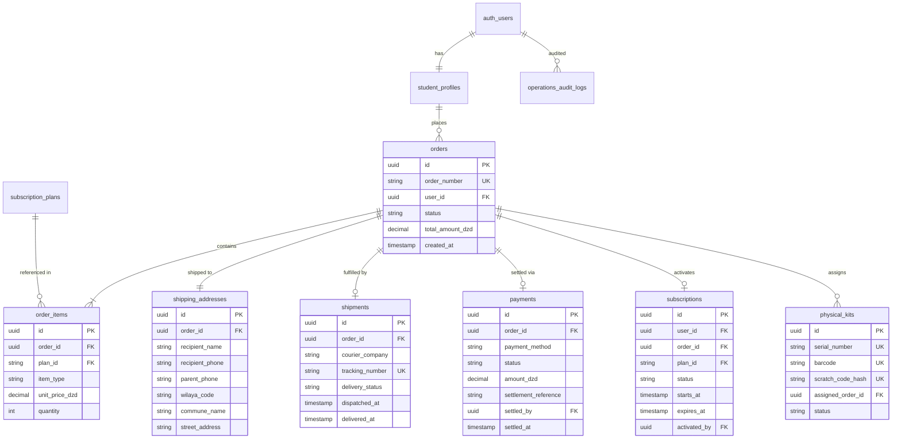

# 🏗️ SHATER Physical Kit + COD Subscription System Architecture

> **الوثيقة:** التصميم المعماري المرجعي (System Architecture Specification)  
> **الإصدار:** 1.0.0 (Production-Grade Draft)  
> **المبدأ الأساسي الحاكم:** **`DELIVERED ≠ PAID`** (فصل دورة حياة الشحنة الفيزيائية عن دورة التحصيل المالي ودورة تفعيل الاشتراك الرقمي).

---

## 1. Executive Summary & Core Architectural Principle (المبدأ الجوهري)

في بيئة التجارة الإلكترونية والدفع عند الاستلام (Cash on Delivery - COD) في الجزائر:
- **التوصيل والتسليم (Delivery):** تقوم به شركة توصيل خارجية (مثل Yalidine، ZR Express، إلخ). عندما يستلم التلميذ الطرد ويسلم المبلغ للموزع، تصبح حالة الشحنة `DELIVERED`.
- **التحصيل المالي والتسوية (Payment Settlement):** الأموال تبقى لدى شركة التوصيل لعدة أيام حتى يتم إرسال كشف التسوية المالية (Bordereau de versement / Virement) إلى الحساب البنكي أو البريدي لشركة SHATER.
- **التفعيل الرقمي (Digital Subscription Activation):** لا يجوز للنظام تفعيل الاشتراك كـ `ACTIVE` تلقائياً لمجرد إشعار التسليم السطحي، بل يجب أن تمر العملية بمرحلة تدقيق مالي، أو تفعيل يدوي من الإدارة (Admin Authorization Gate) بعد التحقق من مطابقة المبالغ المحصلة.

```mermaid
stateDiagram-v2
    direction LR
    [*] --> OrderCreated: 1. الطالب يطلب الباقة المادية
    OrderCreated --> KitPrepared: 2. SHATER يجهز الـ Physical Box
    KitPrepared --> InTransit: 3. الشحن مع شركة التوصيل
    InTransit --> Delivered_CashCollected: 4. التسليم وقبض الكاش (DELIVERED)
    Delivered_CashCollected --> FinancialSettlement: 5. تحويل الأموال لحساب SHATER
    FinancialSettlement --> Payment_PAID: 6. الإدارة تؤكد استلام المبلغ (PAID)
    Payment_PAID --> Subscription_ACTIVE: 7. تفعيل الاشتراك الرقمي للطالب
    Subscription_ACTIVE --> [*]
```



لذلك، يجب فصل دورة حياة الطلب إلى **أربع آلات حالات مستقلة ومنضبطة (4 Decoupled State Machines)**:
1. **Order Status:** دورة حياة الطلب التجاري.
2. **Delivery Status:** دورة حياة الشحنة المادية مع شركة التوصيل.
3. **Payment Status:** دورة حياة السيولة المالية وتسوية الكاش.
4. **Subscription Status:** دورة حياة الوصول الرقمي للطالب إلى المنصة.

---

## 2. Decoupled State Machines (آلات الحالات الأربع)

### 2.1. Order Status (حالة الطلب العام)
يمثل التزام الطالب التجاري مع المنصة:
- `PENDING`: تم إنشاء الطلب من طرف التلميذ وفي انتظار التأكيد الهاتفي.
- `CONFIRMED`: تم الاتصال بالطالب/الولي وتأكيد الرغبة والعنوان.
- `PROCESSING`: العلبة المادية (Physical Kit) قيد التجهيز والتغليف وإلصاق الباركود.
- `SHIPPED`: تم تسليم الطرد رسمياً لشركة الشحن مع رقم التتبع.
- `COMPLETED`: اكتملت العملية بالكامل (تم التوصيل + تحصيل المبلغ + تفعيل الحساب).
- `CANCELLED`: أُلغي الطلب (إما بطلب من التلميذ أو لتعذر التأكيد أو بسبب رجوع الطرد).

### 2.2. Delivery Status (حالة الشحن المادي)
يمثل حركة الطرد الفيزيائي على أرض الواقع:
- `PENDING`: بانتظار التسليم لشركة الشحن أو إنشاء بوليصة الشحن (Waybill / Bordereau).
- `SHIPPED`: الطرد بحوزة شركة الشحن (Hub / المركز الرئيسي).
- `OUT_FOR_DELIVERY`: الطرد خرج للتسليم النهائي مع الموزع الميداني (Livreur).
- `DELIVERED`: استلم الطالب العلبة المادية وسلّم الكاش للموزع.
- `FAILED`: تعذر التسليم في المحاولة الأولى (الهاتف مغلق / العنوان غير دقيق).
- `RETURNED`: رجع الطرد إلى مستودع SHATER (Échec de livraison / Retour).

### 2.3. Payment Status (حالة التحصيل المالي)
يمثل مسار السيولة المالية ومطابقتها:
- `PENDING`: لم يتم الدفع بعد (في انتظار إرسال الشحنة).
- `COD`: الدفع عند الاستلام معتمد (الطالب سيدفع كاش عند الباب).
- `DELIVERED_PENDING_SETTLEMENT`: **حالة محورية!** الطالب سلّم الكاش للموزع، لكن الأموال ما زالت في خزينة شركة التوصيل ولم تدخل حساب SHATER البنكي بعد.
- `PAID`: تم استلام الأموال رسمياً في الحساب المالي للمنصة وتأكيد التسوية بواسطة Admin/Finance.
- `FAILED`: فشل التحصيل (رفض الطالب الاستلام أو هرب الموزع أو فقد الطرد).
- `REFUNDED`: تم إرجاع المبلغ للطالب (في حالات استثنائية).

### 2.4. Subscription Status (حالة الاشتراك الرقمي)
يمثل صلاحية وصول الطالب إلى المواد والامتحانات في المنصة:
- `PENDING`: الاشتراك مسجل ومربوط بطلب COD لكنه مقفل (لا يمكن فتح الدروس المقفلة).
- `ACTIVE`: الاشتراك مفعل بالكامل (Access Status = PAID) وصلاحيته سارية حتى يوم البكالوريا.
- `EXPIRED`: انتهت مدة الاشتراك القانونية.
- `CANCELLED`: أُلغي الاشتراك قبل تفعيله.
- `REVOKED`: تم سحب وإلغاء الاشتراك المفعل لأسباب انضباطية أو بسبب نزاع مالي (Fraud / Chargeback).

---

## 3. Entity-Relationship Model (العلاقات والكيانات)



---

## 4. Complete Database Schema (مخطط قاعدة البيانات DDL)

المخطط مصمم ليتوافق بنسبة 100% مع معايير **Supabase PostgreSQL 15+**، مع فرض قيود السلامة المرجعية (Foreign Keys & Constraints) والفهارس الذكية (Indexes).

### 4.1. الكيانات الأساسية

#### 1. إضافة المعرّف الطلابي الرسمي (`SHATER ID`) إلى `student_profiles`
```sql
-- إضافة Matricule فريد وقصير للطالب
ALTER TABLE public.student_profiles
  ADD COLUMN IF NOT EXISTS shater_id TEXT UNIQUE;

CREATE SEQUENCE IF NOT EXISTS public.shater_id_seq START 10001;

CREATE OR REPLACE FUNCTION public.generate_shater_id()
RETURNS TRIGGER AS $$
BEGIN
  IF NEW.shater_id IS NULL THEN
    NEW.shater_id := 'SHTR-27-' || lpad(nextval('public.shater_id_seq')::text, 5, '0');
  END IF;
  RETURN NEW;
END;
$$ LANGUAGE plpgsql;

DROP TRIGGER IF EXISTS trg_assign_shater_id ON public.student_profiles;
CREATE TRIGGER trg_assign_shater_id
  BEFORE INSERT ON public.student_profiles
  FOR EACH ROW
  EXECUTE FUNCTION public.generate_shater_id();
```

#### 2. جدول الطلبات (`public.orders`)
```sql
CREATE TABLE IF NOT EXISTS public.orders (
  id UUID PRIMARY KEY DEFAULT gen_random_uuid(),
  order_number TEXT NOT NULL UNIQUE, -- e.g. ORD-2027-00142
  user_id UUID NOT NULL REFERENCES auth.users(id) ON DELETE RESTRICT,
  order_type TEXT NOT NULL DEFAULT 'COD' CHECK (order_type IN ('COD', 'ONLINE', 'LIBRARY')),
  status TEXT NOT NULL DEFAULT 'PENDING' CHECK (
    status IN ('PENDING', 'CONFIRMED', 'PROCESSING', 'SHIPPED', 'COMPLETED', 'CANCELLED')
  ),
  subtotal_dzd NUMERIC(10, 2) NOT NULL CHECK (subtotal_dzd >= 0),
  shipping_fee_dzd NUMERIC(10, 2) NOT NULL DEFAULT 0.00 CHECK (shipping_fee_dzd >= 0),
  discount_dzd NUMERIC(10, 2) NOT NULL DEFAULT 0.00 CHECK (discount_dzd >= 0),
  total_amount_dzd NUMERIC(10, 2) NOT NULL CHECK (total_amount_dzd >= 0),
  currency TEXT NOT NULL DEFAULT 'DZD',
  customer_notes TEXT,
  internal_notes TEXT,
  confirmed_at TIMESTAMPTZ,
  confirmed_by UUID REFERENCES auth.users(id),
  created_at TIMESTAMPTZ NOT NULL DEFAULT now(),
  updated_at TIMESTAMPTZ NOT NULL DEFAULT now()
);

CREATE INDEX IF NOT EXISTS idx_orders_user_id ON public.orders(user_id);
CREATE INDEX IF NOT EXISTS idx_orders_status ON public.orders(status);
CREATE INDEX IF NOT EXISTS idx_orders_created_at ON public.orders(created_at DESC);
```

#### 3. جدول عناصر الطلب (`public.order_items`)
```sql
CREATE TABLE IF NOT EXISTS public.order_items (
  id UUID PRIMARY KEY DEFAULT gen_random_uuid(),
  order_id UUID NOT NULL REFERENCES public.orders(id) ON DELETE CASCADE,
  plan_id TEXT REFERENCES public.subscription_plans(id) ON DELETE RESTRICT,
  item_type TEXT NOT NULL DEFAULT 'PHYSICAL_KIT' CHECK (
    item_type IN ('PHYSICAL_KIT', 'DIGITAL_SUBSCRIPTION', 'STUDY_GUIDE', 'ACCESSORY')
  ),
  title TEXT NOT NULL,
  unit_price_dzd NUMERIC(10, 2) NOT NULL CHECK (unit_price_dzd >= 0),
  quantity INT NOT NULL DEFAULT 1 CHECK (quantity > 0),
  total_price_dzd NUMERIC(10, 2) NOT NULL CHECK (total_price_dzd >= 0),
  metadata JSONB NOT NULL DEFAULT '{}'::jsonb,
  created_at TIMESTAMPTZ NOT NULL DEFAULT now()
);

CREATE INDEX IF NOT EXISTS idx_order_items_order_id ON public.order_items(order_id);
```

#### 4. جدول عناوين الشحن والتسليم (`public.shipping_addresses`)
```sql
CREATE TABLE IF NOT EXISTS public.shipping_addresses (
  id UUID PRIMARY KEY DEFAULT gen_random_uuid(),
  order_id UUID NOT NULL UNIQUE REFERENCES public.orders(id) ON DELETE CASCADE,
  user_id UUID NOT NULL REFERENCES auth.users(id) ON DELETE RESTRICT,
  recipient_name TEXT NOT NULL,
  recipient_phone TEXT NOT NULL CHECK (recipient_phone ~ '^(05|06|07|02)[0-9]{8}$'),
  parent_phone TEXT CHECK (parent_phone IS NULL OR parent_phone ~ '^(05|06|07|02)[0-9]{8}$'),
  wilaya_code TEXT NOT NULL,
  wilaya_name TEXT NOT NULL,
  commune_code TEXT,
  commune_name TEXT NOT NULL,
  street_address TEXT NOT NULL,
  delivery_type TEXT NOT NULL DEFAULT 'HOME' CHECK (delivery_type IN ('HOME', 'STOP_DESK')),
  desk_name TEXT, -- اسم مكتب التوصيل إن كان Stop-Desk
  created_at TIMESTAMPTZ NOT NULL DEFAULT now(),
  updated_at TIMESTAMPTZ NOT NULL DEFAULT now()
);

CREATE INDEX IF NOT EXISTS idx_shipping_addresses_wilaya ON public.shipping_addresses(wilaya_code);
CREATE INDEX IF NOT EXISTS idx_shipping_addresses_phone ON public.shipping_addresses(recipient_phone);
```

#### 5. جدول الشحنات الميدانية (`public.shipments`)
```sql
CREATE TABLE IF NOT EXISTS public.shipments (
  id UUID PRIMARY KEY DEFAULT gen_random_uuid(),
  order_id UUID NOT NULL UNIQUE REFERENCES public.orders(id) ON DELETE RESTRICT,
  courier_company TEXT NOT NULL DEFAULT 'YALIDINE' CHECK (
    courier_company IN ('YALIDINE', 'ZR_EXPRESS', 'KAZITOUR', 'MAYSTRO', 'INTERNAL', 'OTHER')
  ),
  tracking_number TEXT UNIQUE,
  tracking_url TEXT,
  delivery_status TEXT NOT NULL DEFAULT 'PENDING' CHECK (
    delivery_status IN ('PENDING', 'SHIPPED', 'OUT_FOR_DELIVERY', 'DELIVERED', 'FAILED', 'RETURNED')
  ),
  shipping_fee_dzd NUMERIC(10, 2) NOT NULL DEFAULT 0.00,
  dispatched_at TIMESTAMPTZ,
  out_for_delivery_at TIMESTAMPTZ,
  delivered_at TIMESTAMPTZ,
  returned_at TIMESTAMPTZ,
  failure_reason TEXT,
  courier_payload JSONB DEFAULT '{}'::jsonb, -- استجابة الـ API لشركة التوصيل
  created_at TIMESTAMPTZ NOT NULL DEFAULT now(),
  updated_at TIMESTAMPTZ NOT NULL DEFAULT now()
);

CREATE INDEX IF NOT EXISTS idx_shipments_tracking ON public.shipments(tracking_number);
CREATE INDEX IF NOT EXISTS idx_shipments_delivery_status ON public.shipments(delivery_status);
```

#### 6. جدول المدفوعات والتسويات المالية (`public.payments`)
```sql
CREATE TABLE IF NOT EXISTS public.payments (
  id UUID PRIMARY KEY DEFAULT gen_random_uuid(),
  order_id UUID NOT NULL UNIQUE REFERENCES public.orders(id) ON DELETE RESTRICT,
  payment_method TEXT NOT NULL DEFAULT 'COD' CHECK (
    payment_method IN ('COD', 'BARIDIMOB', 'CCP', 'CASH_OFFICE')
  ),
  status TEXT NOT NULL DEFAULT 'COD' CHECK (
    status IN ('PENDING', 'COD', 'DELIVERED_PENDING_SETTLEMENT', 'PAID', 'FAILED', 'REFUNDED')
  ),
  amount_dzd NUMERIC(10, 2) NOT NULL CHECK (amount_dzd >= 0),
  currency TEXT NOT NULL DEFAULT 'DZD',
  courier_collected_at TIMESTAMPTZ, -- متى استلم موزع الشركة الكاش من التلميذ
  settlement_reference TEXT, -- رقم تحويل شركة الشحن لحساب شاطر
  settled_at TIMESTAMPTZ, -- متى استلمت شاطر الأموال
  settled_by UUID REFERENCES auth.users(id), -- المشرف المالي الذي تحقق من الحساب
  receipt_url TEXT,
  notes TEXT,
  created_at TIMESTAMPTZ NOT NULL DEFAULT now(),
  updated_at TIMESTAMPTZ NOT NULL DEFAULT now()
);

CREATE INDEX IF NOT EXISTS idx_payments_status ON public.payments(status);
```

#### 7. جدول الاشتراكات الرقمية (`public.subscriptions`)
```sql
CREATE TABLE IF NOT EXISTS public.subscriptions (
  id UUID PRIMARY KEY DEFAULT gen_random_uuid(),
  user_id UUID NOT NULL REFERENCES auth.users(id) ON DELETE RESTRICT,
  order_id UUID REFERENCES public.orders(id) ON DELETE SET NULL,
  payment_id UUID REFERENCES public.payments(id) ON DELETE RESTRICT,
  plan_id TEXT NOT NULL REFERENCES public.subscription_plans(id) ON DELETE RESTRICT,
  status TEXT NOT NULL DEFAULT 'PENDING' CHECK (
    status IN ('PENDING', 'ACTIVE', 'EXPIRED', 'CANCELLED', 'REVOKED')
  ),
  starts_at TIMESTAMPTZ,
  expires_at TIMESTAMPTZ,
  activated_at TIMESTAMPTZ,
  activated_by UUID REFERENCES auth.users(id), -- من فعّل الاشتراك
  activation_type TEXT NOT NULL DEFAULT 'ADMIN_MANUAL' CHECK (
    activation_type IN ('ADMIN_MANUAL', 'VOUCHER_SCRATCH', 'AUTO_ONLINE_VERIFIED')
  ),
  revoked_at TIMESTAMPTZ,
  revocation_reason TEXT,
  created_at TIMESTAMPTZ NOT NULL DEFAULT now(),
  updated_at TIMESTAMPTZ NOT NULL DEFAULT now(),
  CONSTRAINT uq_active_user_subscription UNIQUE (user_id, plan_id, status) 
    DEFERRABLE INITIALLY DEFERRED
);

CREATE INDEX IF NOT EXISTS idx_subscriptions_user_status ON public.subscriptions(user_id, status);
CREATE INDEX IF NOT EXISTS idx_subscriptions_expires_at ON public.subscriptions(expires_at);
```

#### 8. جدول العلب المادية والمخزون (`public.physical_kits`)
```sql
CREATE TABLE IF NOT EXISTS public.physical_kits (
  id UUID PRIMARY KEY DEFAULT gen_random_uuid(),
  serial_number TEXT NOT NULL UNIQUE, -- e.g. KIT-2027-08491
  barcode TEXT NOT NULL UNIQUE,       -- e.g. 6130002708491
  scratch_code_hash TEXT NOT NULL UNIQUE, -- SHA256 of the 8-char scratch activation code
  scratch_code_prefix TEXT NOT NULL,  -- e.g. SHTR-8491-**** (للمعاينة الإدارية)
  plan_id TEXT NOT NULL DEFAULT 'season' REFERENCES public.subscription_plans(id),
  batch_number TEXT NOT NULL DEFAULT 'BATCH-2026-A',
  status TEXT NOT NULL DEFAULT 'IN_STOCK' CHECK (
    status IN ('IN_STOCK', 'ASSIGNED_TO_ORDER', 'IN_TRANSIT', 'DELIVERED', 'ACTIVATED', 'DAMAGED', 'RETURNED')
  ),
  assigned_order_id UUID REFERENCES public.orders(id) ON DELETE SET NULL,
  assigned_at TIMESTAMPTZ,
  created_at TIMESTAMPTZ NOT NULL DEFAULT now(),
  updated_at TIMESTAMPTZ NOT NULL DEFAULT now()
);

CREATE INDEX IF NOT EXISTS idx_physical_kits_status ON public.physical_kits(status);
CREATE INDEX IF NOT EXISTS idx_physical_kits_order ON public.physical_kits(assigned_order_id);
```

---

## 5. Detailed State Transitions & Business Logic (مصفوفة التحولات والشروط)

### 5.1. جدول تحولات حالة الطلب (Order Transitions)

| من حالة (From) | إلى حالة (To) | المحفز والحدث (Trigger & Actor) | الشروط المسبقة الحاكمة (Preconditions) |
| :--- | :--- | :--- | :--- |
| `PENDING` | `CONFIRMED` | المشرف يؤكد الطلب عبر الهاتف | التحقق من رقم الهاتف الجزائري ومطابقة الولاية والعنوان. |
| `CONFIRMED` | `PROCESSING` | مسؤول المستودع يبدأ تجهيز العلبة | إسناد علبة مادية فريدة (`physical_kits.assigned_order_id`). |
| `PROCESSING` | `SHIPPED` | تسليم الطرد لشركة الشحن | إدخال رقم التتبع الرسمي (`tracking_number`) وطباعة البوليصة. |
| `SHIPPED` | `COMPLETED` | تأكيد وصول الأموال وتفعيل الاشتراك | `Delivery = DELIVERED` و `Payment = PAID` و `Subscription = ACTIVE`. |
| `*` (أي حالة) | `CANCELLED` | إلغاء يدوي أو رجوع نهائي للطرد | `Delivery = RETURNED` أو طلب الإلغاء قبل الشحن. |

---

### 5.2. جدول تحولات حالة الشحن (Delivery Transitions)

| من حالة (From) | إلى حالة (To) | المحفز والحدث (Trigger) | التأثير على باقي الآلات (System Cascades) |
| :--- | :--- | :--- | :--- |
| `PENDING` | `SHIPPED` | مسح باركود الشحنة عند خروجها | `Order.status -> SHIPPED`، `PhysicalKit.status -> IN_TRANSIT`. |
| `SHIPPED` | `OUT_FOR_DELIVERY` | إشعار شركة التوصيل (Livreur en tournée) | إرسال تنبيه SMS/WhatsApp للطالب: "طردك يصل اليوم!". |
| `OUT_FOR_DELIVERY` | `DELIVERED` | الموزع يسلم الطرد ويستلم الكاش | **`Payment.status -> DELIVERED_PENDING_SETTLEMENT`** (الكاش مع الموزع). **الاشتراك لا يُفعّل بعد!** |
| `OUT_FOR_DELIVERY` | `FAILED` | الزبون لم يرد / تأجيل الموعد | بقاء الطلب قيد المحاولة (Tentative 2). |
| `FAILED` | `RETURNED` | فشل التسليم النهائي وإرجاع الطرد | `Order.status -> CANCELLED`، `Payment.status -> FAILED`، إعادة العلبة للمخزون كـ `RETURNED`. |

---

### 5.3. جدول تحولات حالة الدفع (Payment Transitions)

| من حالة (From) | إلى حالة (To) | المحفز والحدث (Trigger & Actor) | الأثر المالي والتقني |
| :--- | :--- | :--- | :--- |
| `PENDING` | `COD` | اختيار الدفع عند الاستلام | تسجيل الالتزام المالي بقيمة الفاتورة (مثلاً 4,900 دج). |
| `COD` | `DELIVERED_PENDING_SETTLEMENT` | استلام الموزع للكاش (`DELIVERED`) | الطالب استلم، الكاش في يد شركة التوصيل، بانتظار التحويل الأسبوعي. |
| `DELIVERED_PENDING_SETTLEMENT` | `PAID` | **المشرف المالي يؤكد مطابقة التسوية البنكية** | **الآن فقط: النظام يتيح تفعيل الاشتراك الرقمي.** |
| `PAID` | `REFUNDED` | المشرف ينفذ عملية استرجاع مالي | إلغاء الاشتراك الرقمي المرتبط فوراً (`Subscription -> REVOKED`). |

---

### 5.4. جدول تحولات حالة الاشتراك (Subscription Transitions)

| من حالة (From) | إلى حالة (To) | المحفز والحدث (Trigger & Actor) | قواعد الصلاحية والوصول للمنصة |
| :--- | :--- | :--- | :--- |
| `PENDING` | `ACTIVE` | **طريقة أ:** المشرف يضغط "تفعيل الاشتراك" بعد التأكد من `PAID`.<br>**طريقة ب:** الطالب يكشط كود البطاقة ويدخله في الموقع. | ترقية بروفايل الطالب فوراً إلى `access_status = 'PAID'`، تمديد الصلاحية لـ 10 أشهر، وتفعيل مكافأة الإحالة (700 دج). |
| `ACTIVE` | `EXPIRED` | انتهاء تاريخ صلاحية البكالوريا | إقفال المواد تلقائياً عبر `getStudentAccess()`. |
| `ACTIVE` | `REVOKED` | المشرف يسحب الاشتراك | إرجاع بروفايل الطالب إلى `EXPIRED` أو `TRIAL` وتسجيل السبب في سجل التدقيق. |

---

## 6. Row Level Security & Access Control (نموذج الأمان وصلاحيات الوصول)

### 6.1. مصفوفة الصلاحيات (RBAC Matrix)

| الدور (Role) | قراءة الطلبات (Orders) | تعديل العناوين والشحن | تأكيد التسوية المالية (PAID) | تفعيل الاشتراك (Activate) | الاطلاع على PII التلميذ |
| :--- | :---: | :---: | :---: | :---: | :---: |
| **Student (المالك)** | طلباته الخاصة فقط | تعديل قبل الشحن فقط | ❌ ممنوع | عبر كود الكشط فقط | بياناته فقط |
| **Finance Operator** | جميع الطلبات | ✅ نعم | ✅ نعم (صلاحية كاملة) | ✅ نعم | ✅ نعم (لأغراض الشحن) |
| **Owner (المدير)** | جميع الطلبات | ✅ نعم | ✅ نعم | ✅ نعم | ✅ نعم |
| **Content Reviewer** | ❌ ممنوع تماماً | ❌ ممنوع | ❌ ممنوع | ❌ ممنوع | ❌ محجوب كلياً (Zero PII) |
| **Teacher Admin** | ❌ ممنوع تماماً | ❌ ممنوع | ❌ ممنوع | ❌ ممنوع | ❌ محجوب كلياً |

### 6.2. سياسات RLS الأساسية (Supabase SQL)

```sql
-- 1. Orders Table RLS
ALTER TABLE public.orders ENABLE ROW LEVEL SECURITY;

CREATE POLICY "orders_student_select" ON public.orders
  FOR SELECT USING (auth.uid() = user_id OR public.has_finance_access(auth.uid()));

CREATE POLICY "orders_student_insert" ON public.orders
  FOR INSERT WITH CHECK (auth.uid() = user_id AND status = 'PENDING');

CREATE POLICY "orders_operator_update" ON public.orders
  FOR UPDATE USING (public.has_finance_access(auth.uid()));

-- 2. Shipping Addresses Table RLS (حماية خصوصية القُصّر)
ALTER TABLE public.shipping_addresses ENABLE ROW LEVEL SECURITY;

CREATE POLICY "shipping_addresses_student_select" ON public.shipping_addresses
  FOR SELECT USING (auth.uid() = user_id OR public.has_finance_access(auth.uid()));

CREATE POLICY "shipping_addresses_student_insert" ON public.shipping_addresses
  FOR INSERT WITH CHECK (auth.uid() = user_id);

CREATE POLICY "shipping_addresses_operator_all" ON public.shipping_addresses
  FOR ALL USING (public.has_finance_access(auth.uid()));

-- 3. Payments Table RLS (محمي حصرياً للمشرفين الماليين)
ALTER TABLE public.payments ENABLE ROW LEVEL SECURITY;

CREATE POLICY "payments_student_view_status" ON public.payments
  FOR SELECT USING (
    EXISTS (SELECT 1 FROM public.orders o WHERE o.id = payments.order_id AND o.user_id = auth.uid())
    OR public.has_finance_access(auth.uid())
  );

CREATE POLICY "payments_operator_write" ON public.payments
  FOR ALL USING (public.has_finance_access(auth.uid()));

-- 4. Subscriptions Table RLS
ALTER TABLE public.subscriptions ENABLE ROW LEVEL SECURITY;

CREATE POLICY "subscriptions_student_select" ON public.subscriptions
  FOR SELECT USING (auth.uid() = user_id OR public.is_operator(auth.uid()));

CREATE POLICY "subscriptions_operator_write" ON public.subscriptions
  FOR ALL USING (public.has_finance_access(auth.uid()));
```

---

## 7. Atomic Operator RPC Functions (الإجراءات الذرية المحمية)

لمنع حدوث أي حالة سباق (Race Condition) أو خطأ بشري أثناء إدارة الـ COD، تنفذ التغييرات الحساسة عبر دوال PostgreSQL ذرية محمية (`SECURITY DEFINER`):

### 7.1. دالة تأكيد وصول أموال الـ COD (`admin_settle_cod_payment`)
```sql
CREATE OR REPLACE FUNCTION public.admin_settle_cod_payment(
  p_order_id UUID,
  p_settlement_reference TEXT,
  p_notes TEXT DEFAULT 'COD settlement confirmed by Finance Admin'
)
RETURNS JSONB AS $$
DECLARE
  v_admin_id UUID := auth.uid();
  v_payment RECORD;
  v_shipment RECORD;
BEGIN
  -- 1. التحقق من رتبة المنفذ (OWNER أو OPERATOR فقط)
  IF NOT public.has_finance_access(v_admin_id) THEN
    RAISE EXCEPTION 'Access denied: requires finance privileges.';
  END IF;

  -- 2. التحقق من حالة الشحنة (يجب أن تكون DELIVERED)
  SELECT * INTO v_shipment FROM public.shipments WHERE order_id = p_order_id;
  IF NOT FOUND OR v_shipment.delivery_status <> 'DELIVERED' THEN
    RAISE EXCEPTION 'Cannot settle payment: shipment is not marked as DELIVERED.';
  END IF;

  -- 3. تحديث جدول الدفع إلى PAID
  UPDATE public.payments
  SET status = 'PAID',
      settlement_reference = p_settlement_reference,
      settled_at = now(),
      settled_by = v_admin_id,
      notes = coalesce(p_notes, notes),
      updated_at = now()
  WHERE order_id = p_order_id
  RETURNING * INTO v_payment;

  -- 4. تحديث حالة الطلب العام إلى COMPLETED
  UPDATE public.orders
  SET status = 'COMPLETED',
      updated_at = now()
  WHERE id = p_order_id;

  -- 5. تسجيل الحدث في سجل الرقابة التراكمي
  INSERT INTO public.operations_audit_logs (
    actor_user_id, actor_role, action, target_type, target_id, reason, after_state
  ) VALUES (
    v_admin_id, 'OPERATOR', 'COD_PAYMENT_SETTLED', 'payment', v_payment.id::text,
    p_notes, jsonb_build_object('order_id', p_order_id, 'reference', p_settlement_reference)
  );

  RETURN jsonb_build_object(
    'success', true,
    'order_id', p_order_id,
    'payment_id', v_payment.id,
    'status', 'PAID',
    'ready_for_subscription_activation', true
  );
END;
$$ LANGUAGE plpgsql SECURITY DEFINER SET search_path = public;
```

### 7.2. دالة تفعيل الاشتراك الرقمي بواسطة المشرف (`admin_activate_student_subscription`)
```sql
CREATE OR REPLACE FUNCTION public.admin_activate_student_subscription(
  p_order_id UUID,
  p_reason TEXT DEFAULT 'Subscription activated after COD payment settlement'
)
RETURNS JSONB AS $$
DECLARE
  v_admin_id UUID := auth.uid();
  v_order RECORD;
  v_payment RECORD;
  v_plan RECORD;
  v_duration INT := 10;
  v_expires_at TIMESTAMPTZ;
  v_sub_id UUID;
BEGIN
  IF NOT public.has_finance_access(v_admin_id) THEN
    RAISE EXCEPTION 'Access denied: requires finance privileges.';
  END IF;

  -- فحص الطلب
  SELECT * INTO v_order FROM public.orders WHERE id = p_order_id;
  IF NOT FOUND THEN RAISE EXCEPTION 'Order not found.'; END IF;

  -- فحص الدفع: لا يجوز التفعيل إلا إذا كان الدفع PAID حصراً!
  SELECT * INTO v_payment FROM public.payments WHERE order_id = p_order_id;
  IF NOT FOUND OR v_payment.status <> 'PAID' THEN
    RAISE EXCEPTION 'Cannot activate subscription: Payment is not verified as PAID.';
  END IF;

  -- تحديد مدة الباقة
  SELECT * INTO v_plan FROM public.subscription_plans WHERE id = 'season';
  IF FOUND AND v_plan.duration_months IS NOT NULL THEN
    v_duration := v_plan.duration_months;
  END IF;
  v_expires_at := now() + (v_duration || ' months')::interval;

  -- إنشاء أو تحديث سجل الاشتراك
  INSERT INTO public.subscriptions (
    user_id, order_id, payment_id, plan_id, status, starts_at, expires_at, activated_at, activated_by
  ) VALUES (
    v_order.user_id, p_order_id, v_payment.id, 'season', 'ACTIVE', now(), v_expires_at, now(), v_admin_id
  ) RETURNING id INTO v_sub_id;

  -- ترقية بروفايل التلميذ رسمياً إلى PAID
  UPDATE public.student_profiles
  SET access_status = 'PAID',
      plan = 'season',
      subscription_started_at = now(),
      subscription_expires_at = v_expires_at,
      updated_at = now()
  WHERE id = v_order.user_id;

  -- صرف مكافأة الإحالة إن وجدت
  PERFORM public.process_qualifying_referral(v_order.user_id, p_order_id);

  -- تسجيل في سجل التدقيق
  INSERT INTO public.operations_audit_logs (
    actor_user_id, actor_role, action, target_type, target_id, reason, after_state
  ) VALUES (
    v_admin_id, 'OPERATOR', 'SUBSCRIPTION_ACTIVATED_BY_ADMIN', 'subscription', v_sub_id::text,
    p_reason, jsonb_build_object('order_id', p_order_id, 'expires_at', v_expires_at)
  );

  RETURN jsonb_build_object(
    'success', true,
    'subscription_id', v_sub_id,
    'user_id', v_order.user_id,
    'expires_at', v_expires_at
  );
END;
$$ LANGUAGE plpgsql SECURITY DEFINER SET search_path = public;
```

---

## 8. Physical Kit Structure & Identity (مكونات العلبة المادية)

العلبة المادية (SHATER Physical Box) ليست مجرد وصل، بل تجربة متكاملة للتلميذ تعزز الانتماء وتسهل التفعيل:

```
┌────────────────────────────────────────────────────────┐
│               SHATER VIP PHYSICAL KIT                  │
│                                                        │
│  1. 💳 بطاقة شاطر باص (SHATER VIP Student Card):       │
│     - الوجه الأمامي: اسم الطالب، الشعبة، الـ SHATER ID. │
│     - رمز QR ذكي يوجه لملف الطالب عند مسحه بالكاميرا.   │
│     - الوجه الخلفي: شريط كشط أمان (Scratch-off) يخفي   │
│       رمز التفعيل الذاتي (SHATER-XXXX-XXXX).           │
│                                                        │
│  2. 🗺️ خارطة طريق البكالوريا (BAC 2027 Roadmap):       │
│     - مطوية منهجية مقسمة لـ 3 فصول دراسية ومحطات الحفظ. │
│                                                        │
│  3. 🎨 باقة ملصقات شاطر (Sticker Pack):                │
│     - ملصقات تحفيزية عالية الجودة للحاسوب والمكتب.      │
│                                                        │
│  4. 📜 رسالة ترحيب وتوجيه من فريق شاطر.                │
└────────────────────────────────────────────────────────┘
```

---

## 9. Security & Anti-Fraud Model (نموذج الحماية ومكافحة الاحتيال)

1. **الوقاية من هجمات الطلبات الوهمية (Anti-Spam & Fake Order Mitigation):**
   - **تقييد وتأخير التجهيز:** أي طلب جديد يبقى بحالة `PENDING` ولا ينتقل لمرحلة `PROCESSING` إلا بعد إرسال رسالة تأكيد عبر WhatsApp Bot أو اتصال هاتفي مباشر للتحقق من الجدية.
   - **التحقق من الهاتف الجزائري:** تطبيق Regex صارم وحظر الأرقام المشبوهة أو التي سجلت رفض استلام سابقاً (Blacklist).
   - **Rate Limiting:** حد أقصى لطلب واحد لكل رقم هاتف/IP كل 48 ساعة.
2. **عزل وتشفير كود الكشط (Scratch Code Protection):**
   - كود الكشط لا يُخزن كنص مكشوف أبداً في قاعدة البيانات، بل يُخزن كـ `SHA-256 Hash` في `physical_kits.scratch_code_hash`.
   - المشرفون يستطيعون فقط رؤية البادئة (مثل `SHTR-8491-****`) للتعرف على البطاقة دون التمكن من تفعيلها أو سرقتها.
   - نافذة إدخال الكود في الموقع تقفل تلقائياً لمدة 15 دقيقة بعد 5 محاولات إدخال خاطئة.
3. **حماية خصوصية التلميذ والولي (Minors Privacy & PII):**
   - إخفاء تام لعنوان الإقامة ورقم الهاتف عن طاقم الأساتذة ومراجعي المحتوى عبر سياسات RLS وقصر الوصول على طاقم الشحن والمالية المصرح لهم بـ `public.has_finance_access()`.

---

## 10. Audit Trails & Governance (حوكمة وسجل العمليات)

يتم تسجيل الحركات في جدول `public.operations_audit_logs` بشكل إلزامي لكل خطوة حساسة:
- `ORDER_CREATED`: عند إنشاء الطلب من الطالب.
- `ORDER_CONFIRMED`: عند الاتصال بالطالب وتأكيد الطلب.
- `KIT_ASSIGNED`: عند ربط علبة مادية محددة برقم باركود بالطلب.
- `SHIPMENT_DISPATCHED`: عند تسليم الطرد لشركة الشحن وإدخال رقم التتبع.
- `COD_DELIVERED`: عند تسجيل الموزع لعملية التسليم.
- `COD_PAYMENT_SETTLED`: عند مطابقة أموال التسوية البنكية وتحويل الدفع لـ `PAID`.
- `SUBSCRIPTION_ACTIVATED`: عند فتح حساب الطالب رقمياً.

---

## 11. Implementation Readiness Checklist (قائمة الجاهزية للتنفيذ)

- [x] الفصل التام بين الحالات الأربع (`Order`, `Delivery`, `Payment`, `Subscription`).
- [x] إثبات قاعدة `DELIVERED ≠ PAID` برمجياً وإجرائياً.
- [x] تخطيط الجداول الجديدة (`orders`, `order_items`, `shipping_addresses`, `shipments`, `payments`, `subscriptions`, `physical_kits`).
- [x] ابتكار نظام `SHATER ID` كمعرّف دراسي رسمي قصير مطبوع على البطاقة.
- [x] حماية خصوصية بيانات التلاميذ القُصّر وعزلها عبر RLS.
- [x] إعداد دوال العمليات الذرية لتأكيد التسوية وتفعيل الاشتراك.

> 📝 **جاهز للمرحلة القادمة:** هذا التصميم المعماري متكامل، متوافق مع بنية Next.js و Supabase الحالية، وجاهز للانتقال لمرحلة كتابة الـ Migrations والـ Backend فور صدور التوجيه.
