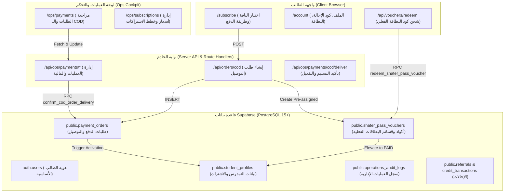

# 📦 SHATER Physical Subscription Kit + COD Orders — Deep Architectural Audit

> **تاريخ التقرير:** 30 سبتمبر 2026  
> **حالة التدقيق:** تدقيق استكشفي شامل (Read-Only Architectural Audit)  
> **الهدف:** فحص جاهزية البنية التحتية لإطلاق باقة الاشتراك المادي (SHATER Physical Box / Kit) مع الدفع عند الاستلام (Cash on Delivery - COD) وتفعيل الحسابات الرقمية.

---

## 1. Current Architecture (الهيكلية الحالية للنظام)

يعتمد مشروع **SHATER BAC** على معمارية حديثة مبنية على **Next.js 14/15 App Router** مع واجهة أمامية متقدمة (Tailwind CSS, Lucide Icons, Framer Motion)، وربط هجين ثنائي الطبقات مع قاعدة البيانات:



### طبقات المنظومة الأساسية:
1. **الطبقة الرسمية والموثوقة (Authoritative Layer):**
   - منصة Supabase مع PostgreSQL 15+، مفعلة بـ Row Level Security (RLS) ومحمية بـ Database Triggers و Security Definer RPCs لمنع أي تلاعب في أسعار الخطط أو فترات التجربة أو حالة الحساب (`access_status`).
2. **الطبقة الاحتياطية المستدامة (Durable Runtime Store):**
   - في حال غياب الاتصال بـ Supabase (في بيئات التطوير المحلية أو الفحوصات)، يعتمد النظام على تخزين JSON محمي في `.runtime/*.json` و `/tmp/` كـ Fallback متين معزول.
3. **الفصل الإداري (RBAC):**
   - جدول `public.user_roles` يقسم الصلاحيات إلى 4 رتب:
     - `OWNER`: تحكم كامل بالمالية، الاشتراكات، وإسناد الأدوار.
     - `OPERATOR`: إدارة طلبات الدفع، التوصيل، وتأكيد الاستلام دون صلاحية تغيير رتب المستخدمين.
     - `CONTENT_REVIEWER`: مراجعة المحتوى البيداغوجي فقط، وممنوع نهائياً من الاطلاع على المالية وعناوين التوصيل.
     - `TEACHER_ADMIN`: إدارة البنوك والتمارين.

---

## 2. Existing Tables (الجداول الحالية ذات الصلة)

تم فحص جميع ملفات الهجرة في `supabase/migrations/` (من `001` إلى `038`). الجداول ذات العلاقة المباشرة بـ COD، الاشتراكات، والطلاب هي:

### 1. `public.student_profiles`
- **المعرف الأساسي:** `id UUID REFERENCES auth.users(id) ON DELETE CASCADE`
- **الحقول المفحوصة:**
  - `user_id UUID UNIQUE`: متطابق حتماً مع `id`.
  - `first_name TEXT`, `last_name TEXT`, `student_phone TEXT`, `parent_phone TEXT`.
  - `wilaya_code TEXT`, `wilaya_name TEXT`, `commune_code TEXT`, `commune_name TEXT`, `school_name TEXT`.
  - `stream_id TEXT` (الشعبة الدراسية), `target_score NUMERIC(4,2)`.
  - `access_status TEXT`: القيم المسموحة (`TRIAL`, `PAID`, `EXPIRED`, `REJECTED`).
  - `plan TEXT`: القيم المسموحة (`season`, `monthly`, `bac_season_pass_pilot`, `PAID`).
  - `trial_started_at TIMESTAMPTZ`, `trial_expires_at TIMESTAMPTZ` (الافتراضي 7 أيام = 168 ساعة عبر Migration 020).
  - `subscription_started_at TIMESTAMPTZ`, `subscription_expires_at TIMESTAMPTZ`.
  - `referral_code TEXT UNIQUE`, `referred_by_code TEXT`, `credit_balance_dzd NUMERIC(10,2)`.
- **المحفز الأمني (Trigger):** `trg_protect_student_trial` يستدعي `protect_student_trial_fields()` لمنع أي مستخدم authenticated عادي من تعديل تواريخ الاشتراك أو الترقية لـ `PAID`.

### 2. `public.payment_orders`
- **المعرف الأساسي:** `id UUID DEFAULT gen_random_uuid()`
- **الحقول المفحوصة:**
  - `user_id UUID REFERENCES auth.users(id)` (يقبل `NULL` للطلبات الخارجية غير المسجلة بعد في بعض الحالات).
  - `plan TEXT NOT NULL DEFAULT 'season'` (`season`, `monthly`, `bac_season_pass_pilot`, `PAID`).
  - `amount NUMERIC(10,2) NOT NULL DEFAULT 0.00`, `currency TEXT NOT NULL DEFAULT 'DZD'`.
  - `payment_method TEXT`: (`baridimob`, `ccp`, `manual_transfer`, `cash`, `cod`, `shater_pass_cod`, `other`).
  - `status TEXT NOT NULL DEFAULT 'PENDING'`: (`DRAFT`, `PENDING`, `APPROVED`, `REJECTED`, `CANCELLED`).
  - `order_type TEXT NOT NULL DEFAULT 'ONLINE'`: (`ONLINE`, `COD`) — مضاف في Migration 020.
  - `shipping_name TEXT`, `shipping_phone TEXT`, `shipping_wilaya TEXT`, `shipping_commune TEXT`, `shipping_address TEXT`.
  - `delivery_status TEXT NOT NULL DEFAULT 'PENDING'`: (`PENDING`, `CONFIRMED`, `SHIPPING`, `DELIVERED`, `CANCELLED`, `RETURNED`).
  - `tracking_number TEXT`: رقم التتبع الخاص بشركة التوصيل.
  - `receipt_path TEXT`: مسار وصل التحويل (خاص بالتحويلات الرقمية فقط).
  - `notes TEXT`, `submitted_at TIMESTAMPTZ`, `reviewed_at TIMESTAMPTZ`, `reviewed_by UUID`.
  - `rejection_reason TEXT`.

### 3. `public.shater_pass_vouchers` (موجود فعلياً في Migration 020)
- **المعرف الأساسي:** `id UUID DEFAULT gen_random_uuid()`
- **الحقول المفحوصة:**
  - `code_hash TEXT NOT NULL UNIQUE`: الـ Hash التشفيري لكود البطاقة (Scratch Card).
  - `code_prefix TEXT NOT NULL`: بادئة مرئية للإدارة فقط (مثل `SHTR-9421-****`).
  - `plan_id TEXT NOT NULL DEFAULT 'season' REFERENCES subscription_plans(id)`.
  - `value_dzd NUMERIC(10,2) NOT NULL DEFAULT 4900.00`.
  - `status TEXT`: (`UNASSIGNED`, `ASSIGNED`, `SOLD`, `DELIVERED`, `ACTIVATED`, `EXPIRED`, `CANCELLED`).
  - `sales_channel TEXT`: (`COD`, `ONLINE`, `LIBRARY`, `RESELLER`).
  - `order_id UUID REFERENCES payment_orders(id) ON DELETE SET NULL`.
  - `assigned_user_id UUID REFERENCES auth.users(id)`.
  - `activated_by_user_id UUID REFERENCES auth.users(id)`.
  - `activated_at TIMESTAMPTZ`, `expires_at TIMESTAMPTZ`, `batch_id TEXT`.

### 4. `public.subscription_plans`
- **المعرف الأساسي:** `id TEXT` (`season`, `monthly`)
- **الحقول:** `name TEXT`, `price_dzd NUMERIC(10,2)`, `duration_months INT`, `active BOOLEAN`.

### 5. `public.operations_audit_logs`
- جدول تدقيق إداري تراكمي (Append-Only) لا يقبل الـ UPDATE أو الـ DELETE، يسجل كل عمليات إنشاء طلبات التوصيل، تأكيد التسليم، تفعيل البطاقات، وتعديل الاشتراكات.

---

## 3. Existing Subscriptions (نظام الاشتراكات والخطط الحالية)

1. **الخطط المعتمدة:**
   - `season` (**اشتراك الموسم الدراسي الكامل BAC 2027**):
     - السعر: 4,900 دج.
     - المدة: 10 أشهر (تغطي الموسم حتى يوم الامتحان الرسمي للبكالوريا).
     - الوصول: شامل لجميع المواد، الدروس، بنك التمارين، وتحديات الديوان.
   - `monthly` (**الاشتراك الشهري**):
     - السعر: 900 دج.
     - المدة: 30 يوماً متجددة.
2. **منطق تقييم حالة الوصول (`src/lib/access.ts`):**
   - الدالة المركزية `getStudentAccess(profile)` تفحص:
     - `PAID_ACTIVE`: إذا كان `access_status === 'PAID'` وتاريخ `subscription_expires_at` لم ينتهِ بعد.
     - `TRIAL_ACTIVE`: إذا كان الطالب في فترة التجربة المجانية (7 أيام من تاريخ التسجيل).
     - `TRIAL_EXPIRED`: إذا انتهت فترة التجربة ولم يُفعّل اشتراكه.
3. **آلية التفعيل (Activation Mechanics):**
   - يتم التفعيل إما:
     - **عبر المشرف:** استدعاء RPC `approve_payment_order()` أو `confirm_cod_order_delivery()`.
     - **أو ذاتياً بواسطة الطالب:** عبر إدخال كود بطاقة شاطر باص في RPC `redeem_shater_pass_voucher(p_code_hash)`.

---

## 4. Existing Order Logic (منطق الطلبات الحالي)

1. **إنشاء طلب COD من الواجهة (`src/app/subscribe/page.tsx`):**
   - يحتوي نموذج الدفع عند الاستلام على حقول:
     - اسم المستلم (`shippingName`).
     - هاتف المستلم (`shippingPhone`) مع تحقق من الصيغة الجزائرية (`/^(05|06|07|02)\d{8}$/`).
     - هاتف الولي (`shippingParentPhone`) كحقل اختياري للتأكيد.
     - الولاية والبلدية والعنوان (`shippingWilaya`, `shippingCommune`, `shippingAddress`).
   - يُرسل الطلب بـ `POST /api/orders/cod`.
2. **معالجة الطلب في السيرفر (`src/app/api/orders/cod/route.ts` & `src/lib/operations/payments.ts`):**
   - التحقق من الصلاحيات والمطابقة.
   - توليد قسيمة شاطر باص أولية `createVoucher()` مرتبطة بالطلب.
   - إدراج سجل في `payment_orders` بحالة `status = 'PENDING'` و `delivery_status = 'PENDING'`.
   - تسجيل حدث التدقيق `COD_ORDER_CREATED`.
3. **إنهاء وتأكيد التوصيل (`/api/ops/payments/cod/deliver`):**
   - يستدعي الدالة الإجرائية `confirmCodDelivery()` في `src/lib/operations/payments.ts` التي تستدعي بدروها الـ Database RPC: `public.confirm_cod_order_delivery()`.
   - يقوم الإجراء بتحويل الطلب إلى `DELIVERED` و `APPROVED`، ثم تحديث بروفايل الطالب فورياً إلى `PAID`، وتمديد الصلاحية 10 أشهر، وصرف مكافأة الإحالة (700 دج) إذا كان مسجلاً بكود صديق.

---

## 5. Existing Admin Logic (منطق لوحة العمليات والإدارة)

1. **الصفحة الرئيسية للمدفوعات والطلبات (`src/app/ops/payments/page.tsx`):**
   - تعرض مؤشرات KPI: عدد الطلبات، الطلبات المعلقة، الإيرادات، وعدد طلبات التوصيل (COD).
   - توفر فلترة خاصة بطلبات التوصيل عبر زر `statusFilter === "COD"`.
   - تحتوي على إمكانية معاينة بيانات الطالب ورقم هاتفه مع زر مباشر للاتصال عبر WhatsApp (`https://wa.me/213...`).
   - تحتوي على زري "موافقة وتفعيل" و "رفض مع تحديد السبب".
2. **الناقص في لوحة العمليات الحالية:**
   - زر "تأكيد التسليم والدفع" (`/api/ops/payments/cod/deliver`) غير معروض كـ Action منفصل داخل جدول `OpsPaymentsPage`؛ الزر المعروض حالياً هو زر الموافقة العامة فقط (`handleApprove`).
   - لا توجد واجهة لـ:
     - إسناد كود الشحنة (Tracking Number).
     - تغيير حالة الشحن إلى "قيد التجهيز" (Preparing) أو "خرج مع شركة التوصيل" (Shipping).
     - طباعة بوليصة التوصيل (Shipping Slip / Bordereau).

---

## 6. Existing Storage (المساحات التخزينية المتاحة)

1. **مساحة التخزين الحالية:**
   - الحاوية (Bucket): `payment_receipts` (خاصة، غير عامة `public = false`).
   - أقصى حجم للملف: 5 ميغابايت (`5242880 bytes`).
   - الامتدادات المقبولة: `image/jpeg`, `image/png`, `application/pdf`.
   - سياسات RLS: رفع الطالب مقتصر على مجلده فقط (`auth.uid()`)، والمشرف له صلاحية قراءة الكل.
2. **ما يتعلق بالباقة المادية (Physical Kit):**
   - لا يوجد حالياً Bucket مخصص لحفظ صور الشحنات أو صور الباركود المطبوعة.
   - يتم تخزين كود القسيمة كنص مشفر أو مهشش داخل جدول `shater_pass_vouchers`.

---

## 7. Existing RLS (سياسات الأمان على مستوى الصفوف)

| الجدول | سياسة SELECT | سياسة INSERT | سياسة UPDATE | سياسة DELETE |
| :--- | :--- | :--- | :--- | :--- |
| `student_profiles` | الطالب يقرأ ملفه فقط + المشرف | مع التسجيل الأولي | الطالب يحدث الحقول العامة (محمي بـ Trigger) | ممنوع (إلا بـ Cascade) |
| `payment_orders` | الطالب يقرأ طلباته + المشرف | الطالب ينشئ بحالة `PENDING` فقط | المشرف فقط (`is_operator`) | ممنوع |
| `shater_pass_vouchers` | المشرف المالي فقط | المشرف المالي فقط | المشرف المالي أو عبر RPC التفعيل | ممنوع |
| `referrals` | صاحب الإحالة + المشرف | عبر دالة السيرفر | المشرف المالي فقط | ممنوع |
| `credit_transactions` | صاحب الرصيد + المشرف | عبر دالة السيرفر | المشرف المالي فقط | ممنوع |
| `operations_audit_logs` | المشرفون فقط | المستخدم أو المشرف | **ممنوع نهائياً (Append-Only)** | **ممنوع نهائياً** |

---

## 8. Reusable Components & Modules (المكونات الجاهزة لإعادة الاستخدام)

1. **السجل الإداري الجزائري المكتمل (`src/domain/administrative/algeria-administrative.ts`):**
   - يحتوي على كافة الولايات الـ 69 والبلديات الـ 1,541 الرسمية باللغتين العربية والفرنسية وأكوادها.
2. **محدد الثانويات والولايات المنسدل (`src/components/schools/HighSchoolSelector.tsx`):**
   - كود جاهز ومجرب للقوائم المنسدلة التفاعلية مع البحث اللحظي حسب الولاية والبلدية.
3. **نموذج طلب التوصيل الميداني (`src/app/subscribe/page.tsx`):**
   - واجهة مستخدم مبنية بالكامل مع التحقق من الهواتف الجزائرية وتعبئة بيانات العنوان تلقائياً من البروفايل.
4. **توليد أكواد القسائم الآمنة (`generateVoucherCode()` في `src/lib/operations/vouchers.ts`):**
   - كود مجرب يولد بطاقات بتنسيق `SHATER-XXXX-XXXX` مع استبعاد الأحرف المتشابهة بصرياً (مثل `0`, `O`, `1`, `I`).
5. **مكونات بطاقة الطالب وتوليد QR Code (`QRCode` في `src/app/account/page.tsx`):**
   - مكتبة `qrcode` مدمجة فعلياً ومستخدمة لإنشاء رموز تفاعلية قابلة للمسح بالهاتف.
6. **مكونات التصميم والمظهر الفاخر:**
   - بطاقات وأزرار وشارات النظام الموحد (`Card`, `Badge`, `Button`, `AppShell`).

---

## 9. Conflicts & Discrepancies (التناقضات والفجوات المكتشفة في الكود)

خلال الفحص الدقيق، تم اكتشاف 6 تناقضات برمجية دقيقة يجب الانتباه لها قبل البدء في التنفيذ:

1. **تناقض قيم حالة التوصيل (`delivery_status`):**
   - في قاعدة البيانات (`020_shater_trial_cod_and_referral_v1.sql` سطر 89):
     ```sql
     CHECK (delivery_status IN ('PENDING', 'CONFIRMED', 'SHIPPING', 'DELIVERED', 'CANCELLED', 'RETURNED'))
     ```
   - في ملف الأنواع TypeScript (`src/lib/operations/types.ts` سطر 21):
     ```typescript
     export type DeliveryStatus = "NOT_APPLICABLE" | "PENDING" | "DISPATCHED" | "DELIVERED" | "FAILED" | "CANCELLED";
     ```
     *(إذا أرسل الكود قيمة `DISPATCHED` سيرفضها محرك PostgreSQL فوراً لعدم تطابق الـ CHECK constraint).*
2. **محاولة إدراج حقل `voucher_code` غير الموجود في `payment_orders`:**
   - في `src/lib/operations/payments.ts` (سطر 733)، يقوم الكود بـ:
     ```typescript
     voucher_code: voucher.voucherCode,
     ```
   - بينما جدول `payment_orders` في Migration 020 يربط القسيمة بالطلب عبر جدول `shater_pass_vouchers.order_id`، ولم يتم إنشاء عمود باسم `voucher_code` في `payment_orders`!
3. **الطلبات لغير المسجلين (Guest COD Orders) مقابل قيود الـ NOT NULL:**
   - في جدول `payment_orders` الأصلي (Migration 006 سطر 168):
     ```sql
     user_id UUID NOT NULL REFERENCES auth.users(id) ON DELETE CASCADE
     ```
   - بينما في `src/app/api/orders/cod/route.ts`، إذا كان الطالب غير مسجل دخول يرسل `userId = null`، مما سيؤدي لفشل الاستعلام في قاعدة البيانات إن لم يكن الطالب مسجلاً حساباً حقيقياً في `auth.users`.
4. **تناقض أسماء أعمدة كود القسيمة في `shater_pass_vouchers`:**
   - جدول Migration 020 يحتوي على الأعمدة: `code_hash` و `code_prefix`.
   - دالة `createVoucher()` في `src/lib/operations/vouchers.ts` سطر 136 تحاول الإدراج في عمود باسم `voucher_code` غير الموجود في تعريف الجدول في SQL!
5. **غياب معرّف الطالب الموحد (SHATER ID / Matricule):**
   - حالياً الطالب يملك فقط معرّف تقني طويل `UUID` (`e.g. 550e8400-e29b-41d4-a716-446655440000`).
   - لا يوجد حقل لمعرّف مقروء بشرياً (مثل `SHTR-26-84920`) يمكن طباعته على البطاقة الفيزيائية أو البحث به عند شركة التوصيل.
6. **غياب دورة شحن كاملة في لوحة الإدارة (`OpsPaymentsPage`):**
   - الجدول الحالي لا يوفر حقلاً لإدخال رقم تتبع الشحنة (`tracking_number`) ولا أزراراً لتحويل الحالة من "قيد التجهيز" إلى "تم الشحن".

---

## 10. Security & Operational Risks (المخاطر الأمنية والتشغيلية)

1. **هجمات الطلبات الوهمية والتلاعب بالتوصيل (COD Denial of Service & Fake Orders):**
   - في نظام الدفع عند الاستلام في الجزائر، تترتب تكاليف حقيقية على المنصة عند إرسال طرد يرفض المستلم استلامه (Return Fees / Frais de retour).
   - إذا بقي الـ Endpoint مفتوحاً بدون تأكيد رقم الهاتف (SMS OTP أو WhatsApp Confirmation) أو Rate Limiting صارم، يمكن لروبوتات إنشاء مئات الطلبات الوهمية لإلحاق خسائر شحن بالمنصة.
2. **خطر التفعيل المزدوج (Split-Brain / Double Activation Risk):**
   - يحصل الطالب في الـ Kit على بطاقة برمز كشط (Scratch Code) مسجل في النظام.
   - إذا قام الطالب بتفعيل الكود ذاتياً عبر الموقع، وفي نفس اليوم قام عامل التوصيل بتأكيد التسليم واستلام المبلغ في لوحة العمليات، قد يحاول النظام تفعيل الاشتراك مرتين أو احتساب مكافأة الإحالة (700 دج) مرتين إذا لم تكن العمليتان Idempotent بنسبة 100%.
3. **حماية خصوصية بيانات القُصّر (Minors PII Protection):**
   - طلبات التوصيل تجمع بيانات شخصية حساسة: الاسم الكامل، رقم هاتف التلميذ، رقم هاتف الولي، والولاية والبلدية والعنوان الدقيق.
   - يجب عزل هذه البيانات عبر RLS وصلاحيات صارمة بحيث لا يمكن لأي أستاذ أو مراجع محتوى (`CONTENT_REVIEWER`) الاطلاع على عناوين وأرقام الطلاب.
4. **تخمين أكواد بطاقات شاطر باص (Brute-Force Voucher Attacks):**
   - الـ Endpoint `/api/vouchers/redeem` يجب أن يتضمن حماية Flood Protection بحيث يقفل بعد 5 محاولات إدخال خاطئة للكود لمنع الروبوتات من تخمين أكواد البطاقات.

---

## 11. Recommended Implementation Plan (خطة التنفيذ المقترحة لاحقاً)

عند الانتقال لمرحلة البرمجة بعد موافقة الإدارة، نوصي باتباع الخطوات المعيارية التالية:

### المرحلة 1: مواءمة قاعدة البيانات والأنواع (Schema Harmonization)
1. إنشاء Migration تصحيحي:
   - مواءمة قيود `delivery_status` لتكون: `('PENDING', 'CONFIRMED', 'SHIPPING', 'DELIVERED', 'CANCELLED', 'RETURNED')`.
   - إضافة عمود `shater_id` (رقم تسجيل الطالب / Matricule) فريد وقصير في `student_profiles` (مثل: `SHTR-2027-XXXXX`) مع Sequence أو Trigger لتوليده تلقائياً عند التسجيل.
   - التأكد من أعمدة `voucher_code` و `tracking_number` في الجداول ذات الصلة.
   - السماح لطلبات الـ COD بربط الحساب تلقائياً عبر رقم الهاتف حتى لو تم الطلب قبل تسجيل الدخول.

### المرحلة 2: محتويات الـ SHATER Physical Subscription Kit
تصميم مكونات العلبة المادية الموجهة لطلاب البكالوريا:
1. **بطاقة شاطر باص الذكية (SHATER VIP Card):**
   - الوجه الأمامي: اسم الطالب، الشعبة، الـ SHATER ID (Matricule)، ورمز QR يوجه لملف الطالب.
   - الوجه الخلفي: شريط كشط أمان (Scratch-off) يخفي كود التفعيل الرقمي المكون من 8 أحرف.
2. **كتيب المنهجية وخارطة الطريق (BAC 2027 Roadmap):**
   - ملخص أسبوعي، أهم المحطات، وأسرار التفوق.
3. **ملصقات تحفيزية (SHATER Stickers Pack):**
   - ستيكرات كلاسيكية عالية الجودة للمكتب والحاسوب.
4. **رسالة ترحيبية وتوجيهية لطريقة الاستخدام.**

### المرحلة 3: دورة حياة الطلب المنضبطة (State Machine)

```
[1. تقديم الطلب على الموقع]
           ↓
[2. التحقق من الهاتف وتأكيد الطلب (Call/WhatsApp Confirm)]
           ↓
[3. تجهيز الـ Kit وطباعة البوليصة (Kit Prepared)]
           ↓
[4. التسليم لشركة الشحن (In Transit / Shipping)]
           ↓
[5. التوصيل والدفع عند الاستلام (COD Collected)]
           ↓
[6. تأكيد التسليم في لوحة التحكم وتفعيل الاشتراك الرقمي تلقائياً]
```

### المرحلة 4: تطوير لوحة الشحن واللوجستيك (Fulfillment & Logistics Desk)
- إضافة تبويب أو قسم مستقل في `/ops/payments` تحت اسم **"إدارة شحنات البطاقات (COD Logistics)"**:
  - عرض قائمة الطلبات الجاهزة للشحن.
  - إمكانية فرز الطلبات حسب الولاية والبلدية لسهولة التنسيق مع شركات التوصيل (مثل Yalidine أو ZR Express أو غيرها).
  - إدخال رقم بوليصة الشحن بنقرة واحدة.
  - زر **"تأكيد تحصيل المبلغ والتفعيل"** الذي يستدعي بأمان RPC `confirm_cod_order_delivery`.

---
> ⚠️ **ملاحظة تأكيدية:** لم يتم تعديل أي ملف في المشروع، ولم يتم تشغيل أي migrations أو تعديل أي جداول في قاعدة البيانات، وفقاً للشروط الصارمة لطلب التدقيق.
