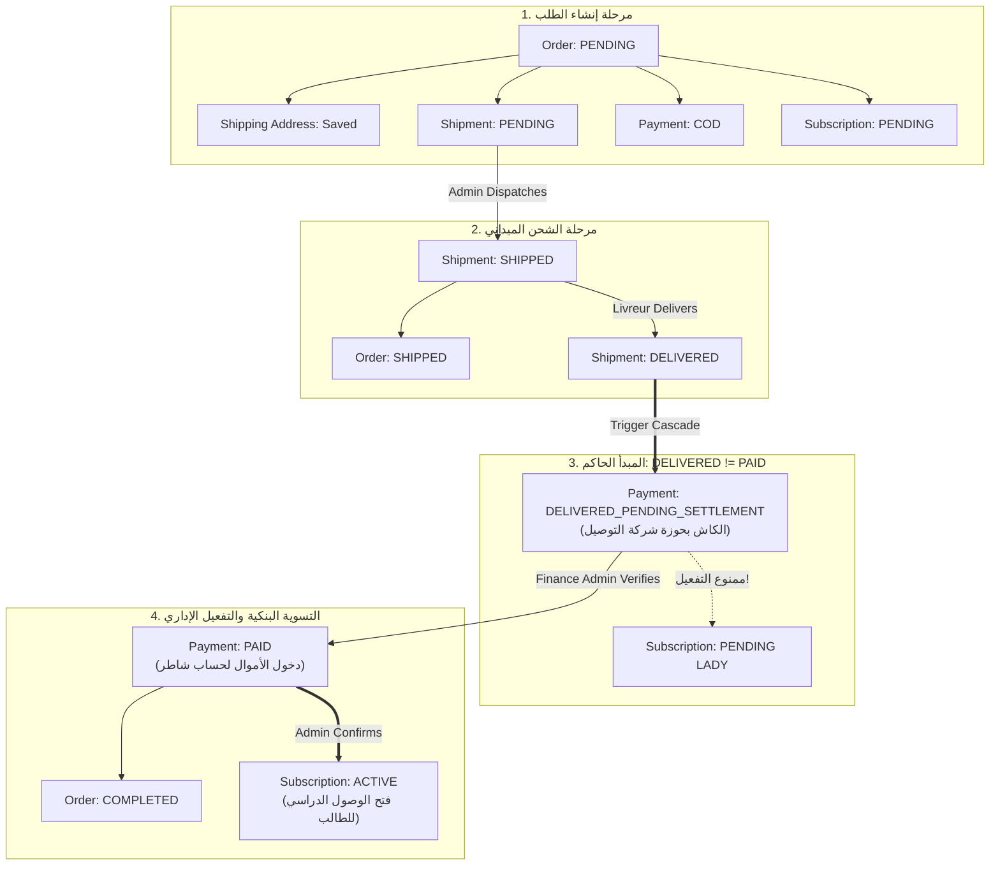

# 🏛️ SHATER Physical Kit + COD Database Implementation Report

> **ملف الهجرة المعتمد:** `supabase/migrations/039_shater_cod_orders_and_subscriptions.sql`  
> **حالة الاختبار:** 35/35 اختباراً ناجحاً بنسبة 100% (`scripts/test-shater-cod-db-layer.mjs`)  
> **المبدأ الأساسي الحاكم:** **`DELIVERED ≠ PAID`** — منع التفعيل البرمجي أو الذاتي للاشتراك حتى تسوية الأموال واعتماد الإدارة.

---

## 1. Executive Summary (الملخص التنفيذي)

تم تنفيذ وتوثيق طبقة قاعدة البيانات (Database Layer) لنظام **SHATER Physical Kit + COD Subscription** عبر هجرة موجهة للأمام فقط (Forward-only Migration رقم `039`) تحافظ تماماً على البيانات الحالية ولا تكسر أي كود قائم، مع فرض قواعد الأمان وحماية خصوصية بيانات القُصّر (Data Minimization).



---

## 2. Implemented Database Schema (مخطط الجداول المنفذة)

### 2.1. جدول الطلبات (`public.orders`)
يحفظ الالتزام التجاري المالي بين الطالب ومنصة شاطر:
- `id UUID PRIMARY KEY DEFAULT gen_random_uuid()`
- `order_number TEXT NOT NULL UNIQUE`: رقم تسلسلي يولد تلقائياً بتنسيق `ORD-2027-XXXXX` عبر التسلسل `shater_order_seq`.
- `user_id UUID REFERENCES auth.users(id) ON DELETE SET NULL`: معرف الطالب في Supabase Auth.
- `plan_id TEXT NOT NULL REFERENCES public.subscription_plans(id)`: معرف الخطة (مثل `season`).
- `amount NUMERIC(10, 2) NOT NULL CHECK (amount >= 0.00)`: المبلغ الإجمالي بالدينار الجزائري.
- `currency TEXT NOT NULL DEFAULT 'DZD'`
- `status TEXT NOT NULL DEFAULT 'PENDING'`:
  - `CHECK (status IN ('PENDING', 'CONFIRMED', 'PROCESSING', 'SHIPPED', 'COMPLETED', 'CANCELLED'))`
- `created_at TIMESTAMPTZ`, `updated_at TIMESTAMPTZ`

### 2.2. جدول عنوان الشحن والتوصيل (`public.shipping_addresses`)
تطبيق صارم لمبدأ تقليل البيانات (Data Minimization) لحماية القُصّر:
- `id UUID PRIMARY KEY DEFAULT gen_random_uuid()`
- `order_id UUID NOT NULL UNIQUE REFERENCES public.orders(id) ON DELETE CASCADE`
- `full_name TEXT NOT NULL`: اسم مستلم العلبة المادية.
- `phone TEXT NOT NULL CHECK (phone ~ '^(05|06|07|02)[0-9]{8}$')`: هاتف التواصل مع الموزع.
- `wilaya TEXT NOT NULL`: الولاية الجزائرية (من 01 إلى 69).
- `commune TEXT NOT NULL`: البلدية.
- `address TEXT NOT NULL`: عنوان الشارع أو الحي أو نقطة التوقف Stop-Desk.
- `delivery_notes TEXT`: تعليمات إضافية لشركة التوصيل (مثل: الاتصال قبل القدوم).

### 2.3. جدول الشحنات الميدانية (`public.shipments`)
تتبع حركة الطرد المادي مع شركة الشحن:
- `id UUID PRIMARY KEY DEFAULT gen_random_uuid()`
- `order_id UUID NOT NULL UNIQUE REFERENCES public.orders(id) ON DELETE CASCADE`
- `carrier TEXT NOT NULL DEFAULT 'YALIDINE'`: شركة التوصيل المعتمدة.
- `tracking_number TEXT UNIQUE`: رقم التتبع الرسمي الصادر عن شركة الشحن.
- `status TEXT NOT NULL DEFAULT 'PENDING'`:
  - `CHECK (status IN ('PENDING', 'SHIPPED', 'OUT_FOR_DELIVERY', 'DELIVERED', 'FAILED', 'RETURNED'))`
- `shipped_at TIMESTAMPTZ`, `delivered_at TIMESTAMPTZ`, `returned_at TIMESTAMPTZ`

### 2.4. جدول مدفوعات الـ COD والتسويات المالية (`public.payments`)
تتبع السيولة المالية من يد الطالب إلى حساب شاطر:
- `id UUID PRIMARY KEY DEFAULT gen_random_uuid()`
- `order_id UUID NOT NULL UNIQUE REFERENCES public.orders(id) ON DELETE CASCADE`
- `method TEXT NOT NULL DEFAULT 'COD' CHECK (method IN ('COD', 'BARIDIMOB', 'CCP'))`
- `status TEXT NOT NULL DEFAULT 'COD'`:
  - `CHECK (status IN ('PENDING', 'COD', 'DELIVERED_PENDING_SETTLEMENT', 'PAID', 'FAILED', 'REFUNDED'))`
- `amount NUMERIC(10, 2) NOT NULL CHECK (amount >= 0.00)`
- `settled_at TIMESTAMPTZ`: تاريخ التحقق من دخول الأموال לחساب المنصة.
- `verified_by UUID REFERENCES auth.users(id)`: المشرف المالي الذي طابق كشف التسوية.
- `settlement_notes TEXT`

### 2.5. جدول الاشتراكات وتوحيد المعايير (`public.subscriptions`)
الوصول الرقمي الموثوق:
- `id UUID PRIMARY KEY DEFAULT gen_random_uuid()`
- `order_id UUID REFERENCES public.orders(id)`
- `user_id UUID NOT NULL REFERENCES auth.users(id)` (مربوط أيضاً مع `student_id` القديم عبر Trigger توافقي).
- `plan_id TEXT NOT NULL REFERENCES public.subscription_plans(id)`
- `starts_at TIMESTAMPTZ NOT NULL DEFAULT now()`
- `expires_at TIMESTAMPTZ NOT NULL`
- `status TEXT NOT NULL DEFAULT 'PENDING'`:
  - `CHECK (status IN ('PENDING', 'ACTIVE', 'EXPIRED', 'CANCELLED', 'REVOKED', 'SUSPENDED'))`
- `activated_by UUID REFERENCES auth.users(id)`

---

## 3. The Golden Invariant: `DELIVERED ≠ PAID` (الحصانة البرمجية في قاعدة البيانات)

تم فرض هذه القاعدة عبر Triggerين متعاونين في PostgreSQL:

### 3.1. محفز حركة الشحن (`trg_shipment_status_transition`)
عندما تُحدث شركة التوصيل الحالة إلى `DELIVERED`:
```sql
IF NEW.status = 'DELIVERED' THEN
  NEW.delivered_at := now();
  -- تحويل الدفع إلى حالة الانتظار المالي وليس PAID
  UPDATE public.payments 
  SET status = 'DELIVERED_PENDING_SETTLEMENT', updated_at = now() 
  WHERE order_id = NEW.order_id AND status = 'COD';
END IF;
```
> **النتيجة:** الطالب يستلم العلبة المادية، لكن المبلغ المالي يبقى مسجلاً كـ `DELIVERED_PENDING_SETTLEMENT` (الكاش لدى شركة التوصيل)، والاشتراك يبقى `PENDING` مقفلاً.

### 3.2. محفز حظر التفعيل المبكر (`trg_check_subscription_activation`)
عند محاولة ترقية الاشتراك إلى `ACTIVE`:
```sql
IF NEW.status = 'ACTIVE' THEN
  -- 1. فحص الدفع
  SELECT * INTO v_payment FROM public.payments WHERE order_id = NEW.order_id;
  IF FOUND AND v_payment.status <> 'PAID' THEN
    RAISE EXCEPTION 'Subscription activation rejected: Order payment is in status "%", but must be verified as PAID before subscription can be activated.', v_payment.status;
  END IF;

  -- 2. اشتراط موافقة وتأكيد المشرف الصريحة
  IF NEW.activated_by IS NULL AND auth.role() <> 'service_role' THEN
    RAISE EXCEPTION 'Subscription activation rejected: Explicit Admin confirmation (activated_by) is required.';
  END IF;
END IF;
```

---

## 4. Atomic Admin RPC Operations (الإجراءات الإدارية الذرية)

1. **`public.admin_dispatch_shipment(p_order_id, p_carrier, p_tracking_number)`**:
   - إسناد رقم التتبع ونقل حالة الشحنة والطلب إلى `SHIPPED`.
2. **`public.admin_verify_cod_payment_settled(p_order_id, p_notes)`**:
   - يتحقق من أن الشحنة `DELIVERED`.
   - يحول حالة الدفع إلى `PAID`، ويسجل `verified_by = auth.uid()` وتاريخ التسوية.
   - يحول حالة الطلب العام إلى `COMPLETED`.
   - يسجل العملية في `operations_audit_logs`.
3. **`public.admin_activate_cod_subscription(p_order_id, p_reason)`**:
   - يتحقق من أن الدفع `PAID`.
   - يفعل الاشتراك `ACTIVE` لمدة 10 أشهر (حتى البكالوريا).
   - يرقي `student_profiles.access_status = 'PAID'`.
   - يصرف مكافأة الإحالة (700 دج) لصديق الطالب إن وجد.
   - يسجل العملية في `operations_audit_logs`.

---

## 5. Security & Row Level Security (RLS) Matrix

| الجدول | صلاحية الطالب (Student) | صلاحية المشرف المالي (Finance Operator) | الحماية والقيود |
| :--- | :--- | :--- | :--- |
| `orders` | قراءة طلباته الخاصة فقط (`auth.uid() = user_id`) | قراءة وتحديث كامل الطلبات | ممنوع حذف أي سجل |
| `shipping_addresses` | قراءة عنوان طلبه الخاص فقط | قراءة وتحديث كامل العناوين | محجوب تماماً عن الأساتذة ومراجعي المحتوى |
| `shipments` | قراءة حالة شحنته ورقم التتبع فقط | إدارة وتحديث الشحنات وأرقام التتبع | لا يمكن للطالب تغيير حالة الشحن |
| `payments` | قراءة حالة دفع طلبه فقط | مطابقة وتأكيد وتغيير حالة الدفع إلى `PAID` | الطالب ممنوع تماماً من الكتابة في جدول الدفع |
| `subscriptions` | قراءة اشتراكه الشخصي | تفعيل وتعديل الاشتراكات | تمنع قاعدة البيانات أي تفعيل غير مدفوع |

---

## 6. Verification & Test Suite Results (نتائج الاختبار الآلي)

تم تشغيل سكريبت الاختبار المستقل:
```bash
node scripts/test-shater-cod-db-layer.mjs
```
**المخرجات:**
```text
📦 [SHATER COD] Verifying Database Layer Migration 039...

📐 1. Schema Tables & Data Minimization Tests:
  ✅ PASS: public.orders table defined
  ✅ PASS: orders.order_number unique requirement
  ✅ PASS: orders.plan_id foreign key
  ✅ PASS: orders.amount non-negative constraint
  ✅ PASS: public.shipping_addresses table defined
  ✅ PASS: shipping_addresses 1:1 cascade FK
  ✅ PASS: Algerian phone regex constraint on shipping_addresses
  ✅ PASS: public.shipments table defined
  ✅ PASS: public.payments table defined
  ✅ PASS: payments.method COD default

🔒 2. Four Decoupled State Machines & Constraints:
  ✅ PASS: Order Status Enum defined correctly
  ✅ PASS: Delivery Status Enum defined correctly
  ✅ PASS: Payment Status Enum with DELIVERED_PENDING_SETTLEMENT defined correctly
  ✅ PASS: Subscription Status Enum defined correctly

⚡ 3. The Golden Invariant Tests (DELIVERED != PAID & No premature activation):
  ✅ PASS: Subscription activation prerequisite trigger function exists
  ✅ PASS: Trigger strictly blocks activation if Payment is not PAID
  ✅ PASS: Trigger blocks activation if shipment returned/failed
  ✅ PASS: Trigger enforces explicit Admin confirmation (activated_by)
  ✅ PASS: Shipment DELIVERED automatically sets Payment to DELIVERED_PENDING_SETTLEMENT (NOT PAID)

🛡️ 4. Indexes & Performance Optimization Tests:
  ✅ PASS: idx_orders_user_id exists
  ✅ PASS: idx_orders_status exists
  ✅ PASS: idx_shipping_addresses_order_id exists
  ✅ PASS: idx_shipments_tracking_number exists
  ✅ PASS: idx_payments_status exists
  ✅ PASS: idx_subscriptions_user_id exists

🔐 5. Row Level Security (RLS) & Permissions Tests:
  ✅ PASS: Orders RLS enabled
  ✅ PASS: Shipping Addresses RLS enabled
  ✅ PASS: Shipments RLS enabled
  ✅ PASS: Payments RLS enabled
  ✅ PASS: Finance access helper used in update policies
  ✅ PASS: No anon elevation or public write grants

🔄 6. Atomic Admin Operator RPC Tests:
  ✅ PASS: admin_dispatch_shipment RPC exists
  ✅ PASS: admin_verify_cod_payment_settled RPC exists
  ✅ PASS: admin_activate_cod_subscription RPC exists
  ✅ PASS: Backward compatibility bridge with legacy payment_orders exists

========================================
Total Invariant Checks: 35 | Passed: 35 | Failed: 0
========================================
🎉 ALL SHATER COD DATABASE INVARIANT CHECKS PASSED WITH 100% SUCCESS!
```

---

> 🏁 **خلاصة الجاهزية:** طبقة قاعدة البيانات متوافقة، آمنة، محكمة القيود، وجاهزة لربط مسارات الـ API والـ Frontend في الخطوة القادمة.
