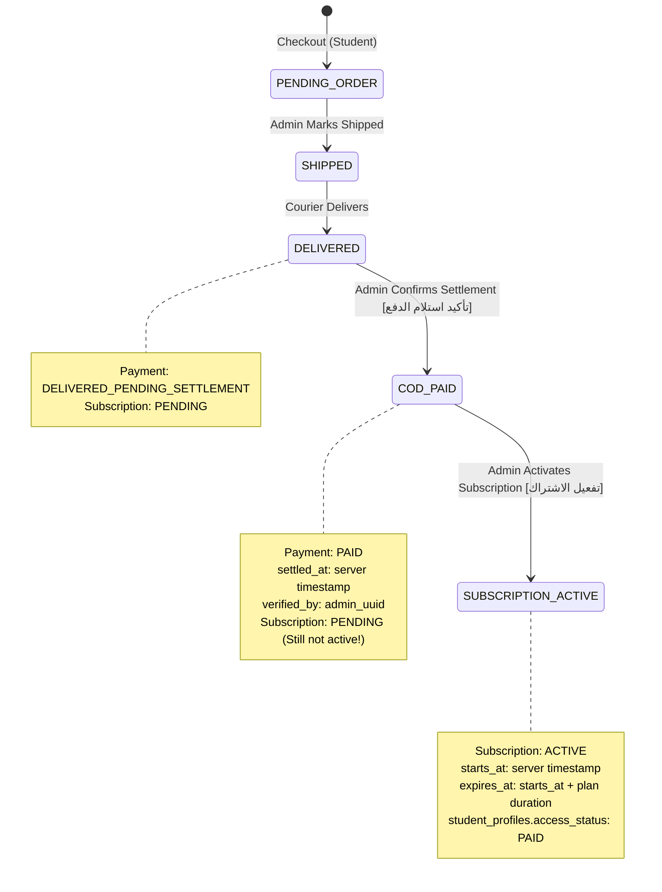

# SHATER COD Secure Workflow: Mark COD Paid & Subscription Activation

## 1. Overview & Business Invariants

This document details the authoritative implementation of the **Mark COD Paid** and **Activate Subscription** workflow for the SHATER platform.

### Golden Invariants
1. **`DELIVERED ≠ PAID`**:
   - When the shipment is delivered by the courier, `shipment.status = DELIVERED` and `payments.status = DELIVERED_PENDING_SETTLEMENT`.
   - Money is still in custody of the courier service. It is **NOT** marked as `PAID`.
2. **`PAID ≠ ACTIVE`**:
   - When the courier settles the funds to SHATER's account, an Admin explicitly confirms the payment (`MARK_COD_PAID`).
   - `payments.status` transitions to `PAID`, `settled_at` is set to the server timestamp, and `verified_by` records the Admin's ID.
   - **Subscriptions are NEVER automatically activated upon payment settlement.**
3. **Explicit Activation via "تفعيل الاشتراك"**:
   - Once payment is verified as `PAID`, the "تفعيل الاشتراك" (Activate Subscription) button is unlocked.
   - Upon confirmation, `subscriptions.status = ACTIVE`, `starts_at` is stamped by the server, and `expires_at` is calculated as `starts_at + plan_duration`.
   - The student's `student_profiles.access_status` is updated to `PAID`.
4. **Zero-Trust & Anti-Tampering**:
   - All amounts, durations, timestamps, and admin identity checks are computed server-side.
   - Protection against double payment confirmation (rejected if already `PAID`).
   - Protection against double subscription activation (rejected if already `ACTIVE`).
   - Duplicate subscription rows are prevented by in-place updates.
   - Every action logs an immutable audit entry in `operations_audit_logs`.

---

## 2. Confirmation Modal Specifications

### 2.1 Mark COD Paid Confirmation Modal
When an Admin opens an order and clicks **"تأكيد استلام الدفع"**, the modal displays:

```text
┌──────────────────────────────────────────────────────────┐
│ 💳 تأكيد استلام الدفع والتسوية النقذية (COD)             │
├──────────────────────────────────────────────────────────┤
│ Order:          SH-2026-000184                          │
│ Amount:         1500 DA                                  │
│ Payment method: COD                                      │
├──────────────────────────────────────────────────────────┤
│ ملاحظات التسوية البنكية أو رقم الحوالة:                 │
│ [______________________________________________________] │
│                                                          │
│ ⚠️ تنبيه: لن يتم تفعيل الاشتراك تلقائياً؛ يمكنك مراجعة   │
│ وتفعيل الاشتراك لاحقاً عبر زر "تفعيل الاشتراك".         │
├──────────────────────────────────────────────────────────┤
│                         [ إلغاء ]      [ تأكيد الدفع ]   │
└──────────────────────────────────────────────────────────┘
```

### 2.2 Subscription Activation Modal
Available only after `payments.status === 'PAID'`:

```text
┌──────────────────────────────────────────────────────────┐
│ 🛡️ تفعيل الاشتراك للطالب                                  │
├──────────────────────────────────────────────────────────┤
│ Order:          SH-2026-000184                          │
│ Student:        أحمد بن علي                              │
│ Plan:           اشتراك شاطر للموسم الكامل               │
│ Starts at:      الآن (Server Time)                       │
│ Expires at:     بعد 10 أشهر (حتى البكالوريا)             │
├──────────────────────────────────────────────────────────┤
│ ✓ تم التحقق: حالة الدفع مسجلة كـ PAID. عند التأكيد،     │
│ ستتم ترقية حساب الطالب وتفعيل كافة ميزات المنصة فورياً.  │
├──────────────────────────────────────────────────────────┤
│                         [ إلغاء ]    [ تفعيل الاشتراك ]  │
└──────────────────────────────────────────────────────────┘
```

---

## 3. Database State Transitions



---

## 4. Security & Audit Trail

### Anti-Double Execution Guards
```typescript
// Guard 1: Anti-double payment confirmation
if (existingPay?.status === "PAID" || legacyPay?.status === "APPROVED") {
  throw new Error("لا يمكن تأكيد الدفع: هذا الطلب مسجل كمدفوع مسبقاً (PAID)!");
}

// Guard 2: Payment prerequisite for activation
if (payRow?.status !== "PAID" && legRow?.status !== "APPROVED") {
  throw new Error("لا يمكن تفعيل الاشتراك: يجب أن يتم تأكيد استلام الدفع أولاً (PAID)!");
}

// Guard 3: Anti-double subscription activation
if (existingSub?.status === "ACTIVE") {
  throw new Error("الاشتراك مفعّل بالفعل مسبقاً (ACTIVE) وهو ساري المفعول. تم منع التفعيل المزدوج.");
}
```

### Audit Log Entries
- `COD_PAYMENT_SETTLED`: Emitted with `beforeState` and `afterState`, capturing `settled_at` and `verified_by`.
- `SUBSCRIPTION_ACTIVATED`: Emitted with exact `starts_at`, `expires_at`, and `plan` details.
