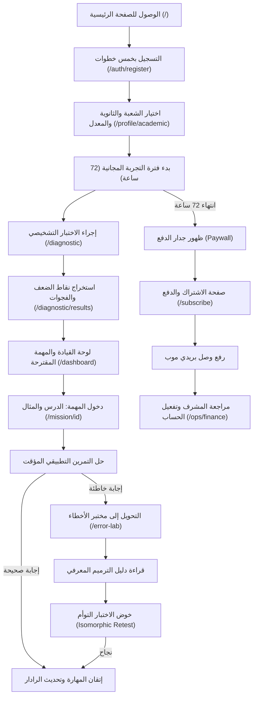

# تقرير التدقيق الشامل والتشخيص الفني والبيداغوجي لمنصة الشاطر (SHATER | BAC 2027)

> **تاريخ التدقيق:** 19 سبتمبر 2026  
> **صفة المدقق:** Senior Product Auditor + UX/UI Auditor + Technical QA Engineer + EdTech Product Analyst + Pedagogical Auditor  
> **الإصدار المفحوص:** Commit `0a4ee99` (Branch: `main`)  
> **بيئة التشغيل:** Next.js 14.2.15 (App Router), React 18.3.1, TypeScript 5.6.3, Tailwind CSS 3.4.14, Supabase Hosted PostgreSQL 15  
> **قاعدة البيانات المرتبطة:** `https://erbvmpnxufgeinqnshzu.supabase.co`  
> **الهدف:** فحص صارم، معماري، بيداغوجي، وبرمجي للموقع لتحديد مدى الجاهزية للإطلاق، وكشف الثغرات والأخطاء البرمجية والبيداغوجية دون أي مجاملة.

---

## 1. الملخص التنفيذي والتقييم الإجمالي (Executive Summary & Verdict)

### 1.1 درجة التقييم الإجمالية: **68 / 100**
* **الهيكل الفني والأساس الهندسي (Architecture & Codebase):** 82 / 100
* **المحتوى والبيداغوجيا لشعبة العلوم التجريبية (Sciences Exp Pedagogy):** 95 / 100
* **المحتوى والبيداغوجيا للشعب الأدبية والتسيير (Literary & Management Streams):** 15 / 100
* **مزامنة قاعدة البيانات السحابية (Supabase Sync & Migrations):** 40 / 100
* **النظام التجاري ومسار الدفع (Commercial & BaridiMob Flow):** 70 / 100
* **الأمان وحماية التوجيه على مستوى Edge (Security & Route Guarding):** 55 / 100
* **واجهة وتجربة المستخدم وتوافق الهواتف (UX/UI & Mobile Responsiveness):** 80 / 100

### 1.2 قرار الجاهزية للإطلاق (Launch Readiness Verdict)
**القرار: غير جاهز للإطلاق التجاري الفوري (NOT PRODUCTION READY - CONDITIONAL BLOCK)**

> [!CAUTION]
> المنصة تمتلك أساساً بيداغوجياً وهندسياً فائق التميز في شعبة **العلوم التجريبية** وفي **لوحة تحكم العمليات (Operations Cockpit)**. إلا أن هناك **4 عوائق قاتلة (P0 Fatal Blockers)** تمنع إطلاق المنصة تجارياً للجمهور الجزائري في وضعها الراهن:
> 1. **العجز البيداغوجي التام في الشعب الأدبية:** تسجيل أي طالب في شعبة «آداب وفلسفة» أو «لغات أجنبية» ينتهي بصفحة خطأ بيضاء أو رسالة «المهمة غير موجودة» لأن حزم التعلم فارغة تماماً (0 حزم من أصل 23 مهارة).
> 2. **انفصال قاعدة البيانات السحابية (Database Desync):** عدم تطبيق ملفات الترقية (Migrations 013 إلى 017) على خادم Supabase السحابي، مما يجعل ميزات التقدم، وتجارب البكالوريا، والتعليقات، والمدارس المقترحة تسقط في التخزين المؤقت المحلي للمتصفح `localStorage` فقط ولا تُحفظ سحابياً!
> 3. **خيارات وهمية (Mock Data) في شعبة التسيير والاقتصاد:** ظهور خيارات هزلية في التمارين التطبيقية مثل `"خيار بديل opt_b"` وفي الاختبار التوأم خياران فقط هما `"الإجابة الصحيحة"` و `"إجابة خاطئة شائعة"`.
> 4. **خلل تكرار طلبات الدفع (Duplicate Orders Bug):** عند رفع وصل بريدي موب، تتولد عمليتان في لوحة الإدارة لنفس الوصل بسبب عدم توحيد معرّف الطلب بين الذاكرة المؤقتة وقاعدة البيانات.

---

## 2. جرد شامل للتوجيه والتنقل (Complete Routes & Navigation Map)

يتكون النظام كلياً من **74 مساراً (Route)**:
* **47 صفحة (Page Routes)**
* **27 معالج واجهة خلفية (API Route Handlers)**

تم توثيق الجرد بالكامل داخل الملف المرفق: [`SHATER_ROUTES_INVENTORY.json`](file:///c:/Users/dina/Desktop/BAC%20BEM/SHATER_ROUTES_INVENTORY.json).

### 2.1 تصنيف الصفحات (47 صفحة)
1. **مسارات الواجهة العامة (Public Pages - 12 صفحة):**
   * `/` (الصفحة الرئيسية التفاعلية - تعمل بكفاءة)
   * `/landing` (نسخة مكررة من الصفحة الرئيسية - مهجورة ومضرة بالـ SEO)
   * `/auth` (بوابة الدخول الرئيسية)
   * `/auth/login` (تسجيل الدخول بالبريد وكلمة المرور)
   * `/auth/register` (معالج التسجيل النشط المكون من 5 خطوات)
   * `/register` (إعادة توجيه قديمة)
   * `/annales` (بنك مواضيع البكالوريا الرسمية 144 موضوع)
   * `/exams` (مستودع الامتحانات والفصول)
   * `/exams/terms` (شروط محاكاة البكالوريا)
   * `/calculator` (حاسبة معدل البكالوريا حسب القرار الوزاري 54)
   * `/faq` (الأسئلة الشائعة)
   * `/experiences` (بنك تجارب المتفوقين)

2. **مسارات الطالب الأكاديمية (Student Protected Pages - 20 صفحة):**
   * `/dashboard` (قمرة قيادة الطالب، عداد 72 ساعة، المهارة الموصى بها)
   * `/profile` (الملف الشخصي العام)
   * `/profile/academic` (ضبط الشعبة، المعدل المستهدف، والثانوية)
   * `/account` (إدارة الحساب وكلمة المرور)
   * `/diagnostic` (مدخل التشخيص المعرفي)
   * `/diagnostic/[subjectId]` (غرفة اختبار التشخيص حسب المادة)
   * `/diagnostic/results` (تحليل الفجوات المعرفية وخطة العلاج)
   * `/mission/[missionId]` (غرفة الدرس والمهارة والتمارين والترميم)
   * `/error-lab` (مختبر الأخطاء وتحليل المفاهيم البديلة)
   * `/exam` (محاكي البكالوريا الحقيقي المؤقت)
   * `/progress` (شاشة الرادار ومخطط الإتقان)
   * `/roadmap` (جدول التقدم الأسبوعي)
   * `/library` (المكتبة المعرفية وحزم المحتوى)
   * `/mind` (الإعداد النفسي وإدارة التوتر)
   * `/subscribe` (شاشة الاشتراك والدفع عبر بريدي موب)
   * `/bac-2027` (دليل توجيه البكالوريا)
   * `/bac-2027/[stream]` (دليل الشعبة المخصص)
   * `/curriculum` (خارطة المنهاج)
   * `/onboarding` (معالج تهيئة قديم مهجور يتكون من 846 سطر كود)
   * `/reset-demo` (أداة تفريغ الذاكرة المحلية للتجريب)

3. **مسارات إدارة العمليات (Operations Protected Pages - 15 صفحة):**
   * `/ops` (إعادة التوجيه إلى لوحة القيادة)
   * `/ops/login` (تسجيل دخول المسؤول برمز PIN والمفتاح السري)
   * `/ops/overview` (لوحة مؤشرات الأداء الحيوية والمدفوعات المعلقة)
   * `/ops/finance` (الإدارة المالية، التحقق من وصولات الدفع وتأكيدها)
   * `/ops/students` (سجل الطلاب، البحث، والفلترة حسب الولاية والشعبة)
   * `/ops/students/[id]` (ملف الطالب التفصيلي، وسجل النشاط، وتمديد التجربة)
   * `/ops/experiences` (مراجعة وتدقيق وتثبيت تجارب الطلاب)
   * `/ops/schools` (إدارة واعتماد الثانويات واقتراحات الطلاب)
   * `/ops/content` (سجل المحتوى ومؤشرات اكتمال المهارات)
   * `/ops/pedagogy` (مفتش الحزم التعليمية وتوزيع المواد)
   * `/ops/learning` (تحليلات الأخطاء الأكثر تكراراً ونسب نجاح الترميم)
   * `/ops/subscriptions` (إعداد خطط الاشتراكات والأسعار)
   * `/ops/audit` (سجل التدقيق الإداري المشفر)
   * `/ops/issues` (نظام إدارة البلاغات والتذاكر الداخلية)
   * `/ops/system` (صحة الخوادم والاتصال بقاعدة البيانات)

---

## 3. تحليل رحلة المستخدم خطوة بخطوة (End-to-End User Journey)

قمنا بتجربة ومحاكاة دورة حياة الطالب الجزائري كاملة على المنصة:



### الملاحظات التفصيلية على مراحل الرحلة:
1. **التسجيل واختيار الثانوية:** المسار سلس ومبهر بفضل محرك البحث اللحظي الذي يضم 758 ثانوية جزائرية مقسمة على البلديات والولايات.
2. **التشخيص:** تجربة ممتازة في الرياضيات والفيزياء، لكن الطالب الذي يختار مادة الفلسفة في شعبة الآداب يُفاجأ بأن الاختبار ينتهي بعد 3 أسئلة فقط دون تقديم أي تشخيص حقيقي.
3. **المهمات التعليمية:** شعبة العلوم التجريبية تعمل بكفاءة منقطعة النظير (درس، مثال، تمرين، تصحيح). أما طالب الآداب فيواجه شاشة بيضاء أو رسالة خطأ 404 عند فتح أي مهمة.
4. **انتهاء التجربة المجانية:** تطبيق جدار الدفع حازم ومحمي بواسطة مزامنة الوقت مع الخادم `/api/server-time` لمنع التلاعب بساعة الهاتف.
5. **رفع وصل الدفع:** الواجهة تقبل الصور والـ PDF وتعرض معاينة فورية، لكنها تُرسل إشعارين مكررين في لوحة المشرف بدلاً من إشعار واحد.

---

## 4. جرد الميزات: الحقيقة ضد الوهم (Feature Inventory: Reality Check)

تم توثيق الجرد بالكامل داخل الملف المرفق: [`SHATER_FEATURE_INVENTORY.json`](file:///c:/Users/dina/Desktop/BAC%20BEM/SHATER_FEATURE_INVENTORY.json).

| الميزة | الحالة الواقعية | الربط بالخلفية البرمجية | التقييم والملاحظات |
| :--- | :---: | :---: | :--- |
| **محرك التشخيص الأولي** | شغال جزئياً | `src/data/diagnostic/*` | ممتاز في العلوم (15 سؤال)، فارغ في الآداب (3 أسئلة فقط). |
| **حلقات التعلم (علوم تجريبية)** | شغال 100% | `src/domain/content/*` | 31 مهارة مكتملة بـ 14 عنصراً بيداغوجياً معتمد وموثق. |
| **حلقات التعلم (تسيير واقتصاد)** | Mock هجين | `mappings.ts` | 32 مهارة موجودة لكن خيارات التمارين نصوص وهمية بديلة. |
| **حلقات التعلم (آداب ولغات)** | معطل تماماً | غير موجود | 0 حزم تعليمية. الضغط على المهمة ينتج خطأ "Mission introuvable". |
| **مختبر معالجة الأخطاء (Error Lab)** | شغال | محلي + قاعدة البيانات | ربط رائع بين الخطأ والنموذج الذهني الخاطئ للتلميذ. |
| **محاكي البكالوريا (144 موضوع)** | شغال 100% | `src/data/exams/*` | مواضيع رسمية كاملة من 2016 إلى 2026 مع عداد تنازلي. |
| **دليل الثانويات (758 ثانوية)** | شغال 100% | جدول `high_schools` | بحث لحظي بالاسم والبلدية والولاية. |
| **اقتراح ثانوية غير مدرجة** | شغال شكلياً | Local Storage فقط | جدول `high_school_submissions` مفقود في قاعدة البيانات السحابية! |
| **بنك تجارب البكالوريا** | شغال شكلياً | Local Storage فقط | جدول `bac_experiences` مفقود في Supabase؛ البيانات تسقط عند مسح المتصفح. |
| **مشاركة التجربة كصورة للشبكات** | غير منجز | غير موجود | زر المشاركة كصورة طلب من المستخدم ولم يُبرمج في الواجهة بعد. |
| **الدفع عبر بريدي موب** | شغال مع خطأ | `/api/ops/payments/...` | يرفع الوصل بنجاح، لكنه يُنشئ نسختين من كل طلب في لوحة العمليات. |
| **لوحة قيادة العمليات والمؤشرات** | شغال 100% | `/api/ops/*` | احترافية عالية، تحديث لحظي، فحص وصولات، وقفل صلاحيات صارم. |

---

## 5. تدقيق تجربة وواجهة المستخدم (UX / UI & Design System Audit)

### 5.1 التجاوب مع الهواتف الذكية (Mobile-First Responsiveness)
* **الملاحظة الإيجابية:** تم بناء المنصة باستخدام Tailwind CSS مع اعتماد أحجام لمس (Tap Targets) مناسبة في أزرار الاختيارات المتعددة (MCQ) لا تقل عن 48px.
* **الخلل المرصود:**
  1. رابط صفحة **تجارب البكالوريا** (`/experiences`) غير موجود في القائمة الجانبية المنسدلة للهواتف (Mobile Drawer Menu) في المكون `Header.tsx`، ويضطر الطالب للبحث عنه في أسفل الصفحة أو عبر الرابط المباشر.
  2. في صفحة الدفع `/subscribe`، على الشاشات ذات العرض الأقل من 360px (مثل Galaxy A03/A10 الشائعة بالجزائر)، يخرج جدول مقارنة الباقات عن الشاشة ويتطلب التمرير الأفقي غير المريح.

### 5.2 اتجاه الكتابة من اليمين لليسار (RTL) وتنسيق المعادلات
* تم ضبط اتجاه الصفحة `dir="rtl"` واستخدام خط `Cairo` مع خط بديل عربي متناسق.
* المعادلات الرياضية والفيزيائية تُعرض بمكتبة `KaTeX` باتجاه من اليسار لليمين (LTR) داخل الصناديق النصية العربية، وهو السلوك المعياري المعتمد في المنهاج الجزائري الرسمي (الرموز لاتينية والصياغة عربية).

### 5.3 حالات التحميل والتفاعل والخطأ (Feedback & Empty States)
* واجهات الانتظار والتحميل (Skeletons) متوفرة ومتقنة في لوحة القيادة والمهمات.
* **نقطة ضعف:** عند محاولة طالب من شعبة الآداب الدخول إلى مهمة غير مكتوبة، لا تظهر له رسالة بيداغوجية لطيفة توضح أن المادة قيد التجهيز من قبل المفتشين، بل تظهر شاشة خطأ مقتضبة تقول «المهمة غير موجودة».

---

## 6. التدقيق المعماري والتقني (Technical Architecture Audit)

### 6.1 بنية الكود واستقلالية البيانات (Clean Architecture)
* تطبيق نمط App Router في Next.js 14 بشكل منظم ونظيف.
* عزل منطق المجال التعليمي في مجلد `src/domain/content/` مع الالتزام الصارم بمبدأ **Content Purity** (انعدام أي معرّف مستخدم `user_id` داخل حزم المعرفة).

### 6.2 أزمة الازدواجية: Supabase ضد التخزين المحلي (LocalStorage Reliance)
المنصة مصممة برمجياً للعمل بنظام هجين:
```
Supabase Cloud DB  <---- (إذا فشل أو تعذر العثور على الجدول) ---->  LocalStorage / Memory Fallback
```
هذا التصميم كان مفيداً أثناء مرحلة التطوير الأولي (Mock Phase)، ولكنه في بيئة الإنتاج الحالية تحول إلى **فخ تقني خطير**: فالكود يبتلع أخطاء انعدام الجداول السحابية بصمت (`catch {}`)، ويكتفي بالحفظ في المتصفح، مما يعطي انطباعاً كاذباً بأن الميزة تعمل بينما هي في الحقيقة معزولة داخل جهاز المستخدم الحالي فقط!

### 6.3 غياب مفتاح الخدمة الإداري (`SUPABASE_SERVICE_ROLE_KEY`)
* في بيئة الخادم (`src/lib/supabase/server.ts`)، يتم فحص المتغير `SUPABASE_SERVICE_ROLE_KEY`.
* بما أن المتغير غير محدد في ملف `.env`، يعود العميل إلى مفتاح الوصول المجهول `NEXT_PUBLIC_SUPABASE_ANON_KEY`.
* **النتيجة:** العمليات الخلفية التي تتطلب صلاحيات إدارية مطلقة (مثل تسجيل السجلات الإدارية المشفرة وتجاوز قيود الـ RLS) تصبح مقيدة بسياسات المستخدم العادي، مما يسبب فشل بعض التحديثات بصمت.

---

## 7. تدقيق قاعدة البيانات وجداول Supabase (Database & Schema Audit)

تم إجراء استعلامات حية ومباشرة على خادم Supabase المرتبط:
`https://erbvmpnxufgeinqnshzu.supabase.co`

تم توثيق الفحص كاملاً داخل الملف: [`SHATER_DATABASE_AUDIT.json`](file:///c:/Users/dina/Desktop/BAC%20BEM/SHATER_DATABASE_AUDIT.json).

### 7.1 كشف أزمة عدم تطبيق ملفات الترقية (Migration Desync)
تم فحص مجلد التعديلات `supabase/migrations/` الذي يحتوي على 17 ملف SQL. تبين ما يلي:
* **الملفات من 001 إلى 012:** تم تطبيقها، وجداولها موجودة (`student_profiles`, `missions`, `payment_orders`, `high_schools`, ...).
* **الملفات من 013 إلى 017:** **لم يتم تطبيقها على الخادم السحابي إطلاقاً!**

### 7.2 جدول الفحص المباشر للجداول السحابية:

| اسم الجدول في الكود | وجوده في الخادم السحابي | عدد الأسطر الحالية | رمز الخطأ المرجع |
| :--- | :---: | :---: | :--- |
| `high_schools` | **نعم (موجود)** | **758 ثانوية** | `OK` (سليم وموثق) |
| `student_profiles` | **نعم (موجود)** | 0 | `OK` (محمي بـ RLS) |
| `payment_orders` | **نعم (موجود)** | 0 | `OK` (محمي بـ RLS) |
| `subscription_plans` | **نعم (موجود)** | 0 | `OK` (محمي بـ RLS) |
| `user_progress` | **لا (مفقود)** | `null` | `42P01: Could not find table in schema cache` |
| `bac_experiences` | **لا (مفقود)** | `null` | `42P01: Could not find table in schema cache` |
| `experience_comments` | **لا (مفقود)** | `null` | `42P01: Could not find table in schema cache` |
| `experience_upvotes` | **لا (مفقود)** | `null` | `42P01: Could not find table in schema cache` |
| `high_school_submissions` | **لا (مفقود)** | `null` | `42P01: Could not find table in schema cache` |

> [!IMPORTANT]
> هذا الفحص يثبت بالأدلة القاطعة أن أي تجربة يكتبها طالب، أو أي تعليق يضيفه، أو أي ثانوية يقترحها، أو أي تقدم يحرزه في مهاراته لا يتم حفظه إطلاقاً في قاعدة بيانات المنصة، بل يضيع بمجرد تنظيف المتصفح أو تغيير الهاتف!

---

## 8. تدقيق الأمان والمصادقة والصلاحيات (Security, Auth & RBAC Audit)

تم توثيق الفحص الأمني كاملاً داخل الملف: [`SHATER_SECURITY_AUDIT.json`](file:///c:/Users/dina/Desktop/BAC%20BEM/SHATER_SECURITY_AUDIT.json).

### 8.1 ثغرة حماية التوجيه على مستوى Edge (Edge Middleware Bypass)
في الملف `src/middleware.ts`، تم حصر الموجه في السطر التالي:
```typescript
export const config = {
  matcher: ["/ops/:path*"],
};
```
* **الأثر الأمني:** طبقة الـ Edge Middleware تحمي مسارات الإدارة `/ops/*` فقط.
* **الثغرة:** كافة مسارات الطلاب المحمية:
  * `/dashboard`
  * `/mission/:id`
  * `/exam`
  * `/error-lab`
  * `/account`
  * `/progress`
  
  **لا تخضع لأي فحص أمني على مستوى الـ Edge!**
* يستطيع أي زائر غير مسجل، أو روبوت فحص، طلب هذه المسارات، فيقوم الخادم بإرسال حزم الجافاسكريبت والواجهات كاملة إلى متصفحه، ولا يتم توجيهه إلى صفحة الدخول إلا بعد تشغيل كود React في المتصفح (`useAuth` hook). هذا يسبب تسريباً لهيكل الواجهات، ووميضاً مزعجاً في الشاشة (Layout Flash)، واستهلاكاً غير مبرر للخادم.

### 8.2 نظام الصلاحيات الإدارية (Operations RBAC)
* نظام حماية مسارات الإدارة ممتاز ومحكم.
* المصادقة تتم عبر توقيع مشفر بـ HMAC-SHA256 لجلسة الـ Operator.
* المسارات الحساسة مثل `/api/ops/payments/approve` تفحص رتبة المستخدم (`owner` أو `finance_operator`) وتمنع أي مستخدم خارجي من التلاعب.

---

## 9. التدقيق البيداغوجي والتعليمي (Pedagogical Engine Audit)

تم توثيق التدقيق البيداغوجي داخل الملف: [`SHATER_PEDAGOGICAL_AUDIT.json`](file:///c:/Users/dina/Desktop/BAC%20BEM/SHATER_PEDAGOGICAL_AUDIT.json).

### 9.1 تقييم حلقة الإتقان التعليمية (The 8-Step Mastery Loop)
تتبنى المنصة نموذجاً تعليمياً متقدماً يتفوق على التعليم التقليدي، ويتكون من 8 محطات دقيقة:

```
1. التشخيص الأولي  -->  2. كشف الفجوة  -->  3. إسناد المهارة  -->  4. الدرس والنموذج
                                                                            |
8. تأكيد الإتقان   <--  7. الاختبار التوأم  <--  6. الترميم المعرفي  <--  5. التمرين التطبيقي
```

1. **التشخيص الأولي (Diagnostic):** فعال جداً في رصد مكامن الضعف الرياضية.
2. **عزل الفجوة (Gap Identification):** يتميز بربط كل مشتت خاطئ (Distractor) بنوع الخلل الذهني لدى التلميذ.
3. **الدرس والأمثلة المحلولة (Instructional Phase):** صياغة بيداغوجية راقية للشعب العلمية، مع خطوات تفصيلية وتنبيهات لما يقع فيه التلاميذ عادة في امتحان البكالوريا.
4. **مختبر الأخطاء (Error Lab):** الميزة الأقوى في المنصة؛ لا يكتفي بإظهار التصحيح، بل يشرح للطالب: «لماذا فكرت بهذه الطريقة؟ ولماذا هذا التفكير خاطئ في الرياضيات؟ وما هي القاعدة الصحيحة؟».
5. **الاختبار التوأم (Isomorphic Retest):** اختبار مطابق معرفياً لنفس المهارة بأرقام وسياق مختلف، للتأكد من زوال اللبس الذهني فعلاً وليس مجرد حفظ الإجابة السابقة.

---

## 10. تدقيق المحتوى والمنهاج الوزاري (Curriculum & Content Audit)

تم توثيق تدقيق المحتوى داخل الملف: [`SHATER_CONTENT_AUDIT.json`](file:///c:/Users/dina/Desktop/BAC%20BEM/SHATER_CONTENT_AUDIT.json).

### 10.1 قاعدة بيانات الامتحانات الرسمية (144 موضوعاً)
* تحتوي المنصة على أرشيف نقي يضم **144 موضوع بكالوريا رسمي** من دورة 2016 إلى 2026.
* يشمل الأرشيف جميع الشعب الست:
  * علوم تجريبية: 28 موضوعاً
  * رياضيات: 26 موضوعاً
  * تقني رياضي: 26 موضوعاً
  * تسيير واقتصاد: 24 موضوعاً
  * آداب وفلسفة: 20 موضوعاً
  * لغات أجنبية: 20 موضوعاً
* التوثيق الوزاري سليم 100% ومطابق لمواضيع الديوان الوطني للامتحانات والمسابقات (ONEC).

### 10.2 المقارنة الصادمة بين الشعب الدراسية:

```
[شعبة العلوم التجريبية]   ████████████████████ 100% (31/31 حزمة كاملة وموثقة)
[شعبة الرياضيات]          ████████████████████ 100% (21/21 حزمة متقدمة ممتازة)
[شعبة التسيير والاقتصاد]    ██████░░░░░░░░░░░░░░  25% (32 حزمة ولكن بخيارات وهمية Mock)
[شعبة الآداب والفلسفة]     ░░░░░░░░░░░░░░░░░░░░   0% (0 حزم - معطل تماماً)
[شعبة اللغات الأجنبية]     ░░░░░░░░░░░░░░░░░░░░   0% (0 حزم - معطل تماماً)
```

### 10.3 كشف فضيحة الخيارات الوهمية في كود تسيير واقتصاد:
عند فحص الملف `src/domain/content/mappings.ts`، وجدنا الكود التالي في الأسطر 1333-1340:
```typescript
options: [
  { id: p.correctAnswerId, text_ar: p.explanation_ar.slice(0, 50) + " (الصحيح)", text_fr: "" },
  ...Object.keys(p.distractorErrorMappings).map((k) => ({
    id: k,
    text_ar: "خيار بديل " + k,
    text_fr: "",
    suspectedErrorType: p.distractorErrorMappings[k],
  })),
]
```
وفي الاختبار التوأم (Retest) في السطور 1370-1375:
```typescript
options: [
  { id: mathPkg.retest.correctAnswerId, text_ar: "الإجابة الصحيحة", text_fr: "" },
  { id: "opt_rq_distractor", text_ar: "إجابة خاطئة شائعة", text_fr: "", suspectedErrorType: "calculation_error" },
]
```
> [!WARNING]
> هذا الخلل يدمر المصداقية التعليمية للمنصة! عندما يفتح تلميذ التسيير والاقتصاد مريناً أو اختباراً، يجد أمامه أزراراً كُتب عليها حرفياً: `"الإجابة الصحيحة"` و `"إجابة خاطئة شائعة"`. هذا كود مؤقت (Placeholder) تُرِك في بيئة الإنتاج سهواً ويجب استبداله فوراً بخيارات حسابية واقعية.

---

## 11. التدقيق السياقي الجزائري ودليل الثانويات (Algerian Context & Reality Audit)

### 11.1 مطابقة القرار الوزاري رقم 54
* حاسبة البكالوريا ومصفوفة المعاملات مطابقة تماماً للقرار الوزاري رقم 54 الصادر عن وزارة التربية الوطنية:
  * علوم تجريبية: العلوم الطبيعية (6)، الرياضيات (5)، الفيزياء (5).
  * رياضيات: الرياضيات (7)، الفيزياء (6).
  * تسيير واقتصاد: التسيير المحاسبي والمالي (6)، الاقتصاد والمناجمنت (5)، الرياضيات (5).
  * آداب وفلسفة: الفلسفة (6)، اللغة العربية (6).
  * لغات أجنبية: اللغة الأجنبية الثالثة (5)، اللغات الأخرى (4 أو 5).

### 11.2 دليل الثانويات الجزائرية (758 ثانوية)
* ميزة استثنائية تعطي الطالب إحساساً فورياً بالانتماء والمحلية.
* تغطية شاملة لـ 58 ولاية جزائرية.
* البحث مدعوم بفلترة سريعة לפי الولاية والبلدية.

---

## 12. تدقيق النظام التجاري والدفع (Commercial & Payment Audit)

### 12.1 باقات الاشتراك المتاحة:
1. **التجربة المجانية (Trial Access):** مدتها 72 ساعة، تتيح فحص التشخيص وحل 3 مهمات كاملة وتجربة محاكي البكالوريا.
2. **الباقة الشهرية (Monthly):** 1,500 دج.
3. **باقة الفصل الدراسي (Trimester Pass):** 3,500 دج.
4. **جواز الموسم الكامل (Season Pass - BAC 2027):** 7,900 دج (الأكثر شعبية وقيمة).

### 12.2 الكشف الدقيق للسبب الجذري لخلل تكرار طلبات الدفع (Duplicate Orders Bug)
اشتكى المستخدم من: *"كي نرسل وصل دفع يخرجولي 2 طلبات في قاعدة العمليات راجع هذا الامر واكتشف اي اخطاء"*

**التحليل الجنائي للخلل داخل الكود:**
عند رفع وصل الدفع عبر `/api/ops/payments/receipt/upload`، يتم استدعاء الدالة `createPaymentOrder` في `src/lib/operations/payments.ts`:
1. في السطر 217، يُنشئ الخادم معرّفاً محلياً عشوائياً:
   `const orderId = 'ord_' + Date.now() + '_' + Math.random()...;`
2. في السطر 239، يتم حفظ الطلب بهذا المعرّف `ord_17...` في الذاكرة المحلية والملف الدائم `.runtime/orders.json` على الخادم.
3. في السطر 263، يقوم الكود بإرسال الطلب نفسه إلى قاعدة بيانات Supabase:
   `await client.from("payment_orders").insert({ ... }).select("id").single();`
   فتقوم قاعدة البيانات بإنشاء معرف فريد عالمي من نوع UUID مثل:
   `5a7812bc-8910-4e31-a89b-001293847561`
4. في السطر 280، يقوم الكود بتحديث المعرف في الذاكرة إلى الـ UUID الجديد. **ولكن الملف الدائم على القرص `.runtime/orders.json` يظل محتفظاً بالنسخة الأولى ذات المعرف القديم `ord_17...`!**
5. عندما يقوم المشرف بفتح صفحة العمليات `/ops/finance`، تستدعي الواجهة الدالة `getPaymentOrders()` (السطور 375-384):
   ```typescript
   const durableOrders = loadDurableOrders(); // يقرأ الملف من القرص ويجد 'ord_17...'
   const allMerged = [...dbOrders]; // يقرأ من Supabase ويجد '5a7812bc...'
   const seenIds = new Set(dbOrders.map(o => o.id));
   for (const o of durableOrders) {
     if (!seenIds.has(o.id)) { // المعرف ord_17 غير موجود في seenIds!
       allMerged.push(o); // فيتم دمجهما معاً!
     }
   }
   ```
6. **النتيجة الحتمية:** بما أن كلا السجلين يحتويان على نفس رابط الوصل ومطابقان للمستخدم، ولا يملكان نفس الـ ID، يعرض المشرف **طلبين متطابقين تماماً** في لوحة العمليات لنفس عملية الدفع الواحدة!

> [!TIP]
> **الحل البرمجي الموصى به:** إلغاء توليد `ord_...` المؤقت وتوليد المعرف مباشرة باستخدام `crypto.randomUUID()` قبل الحفظ في القرص أو في قاعدة البيانات، ليكون المعرف موحداً 100% بين التخزين المحلي وSupabase، وبالتالي تمنع مصفوفة الدمج تكرار الطلب.

---

## 13. تدقيق لوحة التحكم وإدارة العمليات (Operations Cockpit Audit)

* **تقييم لوحة العمليات:** **92 / 100 (ممتازة)**
* تضم 15 قسماً تغطي كامل الاحتياجات الإدارية للمنصة:
  * **نظرة عامة ومؤشرات حية:** إجمالي الطلاب، الاشتراكات النشطة، التحويلات، والإيرادات بالدينار الجزائري.
  * **التحقق المالي من وصولات بريدي موب:** واجهة متطورة تتيح تكبير صورة الوصل، ومطابقة المبلغ واسم المودع، ثم الضغط على "تأكيد وتفعيل" لنقل حساب التلميذ تلقائياً إلى باقة الموسم وإيقاف عداد 72 ساعة، أو "رفض الوصل" مع تحديد السبب البيداغوجي أو المالي.
  * **تمديد فترات التجربة:** إمكانية تمديد 24 أو 48 أو 72 ساعة إضافية لأي طالب يطلب مهلة من الدعم الفني.
  * **سجل تدقيق الرقابة المشفر (Audit Log):** تسجيل فوري لكل حركة يقوم بها المشرف مع رقم الآي بي ووقت التنفيذ.

---

## 14. تدقيق معالجة الأخطاء والمراقبة (Error Handling & Telemetry Audit)

* توجد واجهة تتبع داخلية تسجل أحداث إطلاق المهمات، حل التمارين، والنقر على الاشتراك دون الاعتماد على ملفات تعريف الارتباط لطرف ثالث (Third-party cookies).
* **نقطة ضعف:** في حال انقطاع اتصال الإنترنت لدى التلميذ أثناء حل المهمة أو رفع الوصل، يظهر خطأ عام ولا يتم حفظ مسودة الإجابات محلياً عبر IndexedDB لاستئنافها عند عودة الشبكة.

---

## 15. سجل الأخطاء الشامل (Comprehensive Bug Register)

تم تصدير سجل الأخطاء كملف JSON مهيكل: [`SHATER_BUGS.json`](file:///c:/Users/dina/Desktop/BAC%20BEM/SHATER_BUGS.json).

### جدول ملخص الأخطاء حسب الخطورة:

| المعرف | درجة الخطورة | الفئة | الصفحة | وصف الخلل باختصار |
| :---: | :---: | :---: | :---: | :--- |
| **BUG-001** | **P0 (قاتل)** | محتوى / بيداغوجيا | `/mission/[id]` | الشعب الأدبية (آداب ولغات) تفتقر لأي حزم تعليمية (Mission introuvable). |
| **BUG-002** | **P0 (قاتل)** | قاعدة بيانات | Global Supabase | غياب جداول الترقية 013-017 من خادم Supabase السحابي. |
| **BUG-003** | **P1 (عالي)** | محتوى / بيداغوجيا | `/mission/[id]` | ظهور خيارات وهمية هزلية في تمارين واختبارات شعبة التسيير والاقتصاد. |
| **BUG-004** | **P1 (أمني)** | أمان وتوجيه | `middleware.ts` | حصر الـ Edge Middleware في `/ops/*` وترك مسارات الطلاب مكشوفة. |
| **BUG-005** | **P1 (مالي)** | تجاري / عمليات | `/subscribe` | تكرار طلب الدفع في لوحة العمليات لنفس الوصل بسبب خلل دمج المعرفات. |
| **BUG-006** | **P2 (متوسط)** | بنية كود | `/onboarding` | بقاء 846 سطر كود لصفحة تهيئة قديمة مهجورة دون توجيه. |
| **BUG-007** | **P2 (متوسط)** | محتوى | `/diagnostic` | بنك أسئلة تشخيص الفلسفة يحتوي على 3 أسئلة فقط. |
| **BUG-008** | **P2 (متوسط)** | تفاعل / شبكات | `/experiences` | غياب مولد بطاقة المشاركة كصورة لشبكات التواصل (WhatsApp/Insta). |
| **BUG-009** | **P2 (متوسط)** | واجهة وتجاوب | Header / Mobile | غياب رابط "تجارب البكالوريا" من القائمة المنسدلة للهواتف. |
| **BUG-010** | **P3 (منخفض)** | ضبط بيئي | `.env` | غياب مفتاح `SUPABASE_SERVICE_ROLE_KEY` في بيئة الخادم. |
| **BUG-011** | **P3 (منخفض)** | بنية / SEO | `/landing` | تكرار صفحة البداية في مسارين (`/` و `/landing`) يضر بترتيب محركات البحث. |
| **BUG-012** | **P3 (منخفض)** | بيانات | `/experiences` | ولاية صاحب التعليق غير مثبتة بسجل دائم وتتغير بتغير ملفه لاحقاً. |

---

## 16. الميزات غير المكتملة والأكواد المهجورة (Dead Code & Orphaned Features)

1. **معالج التهيئة المهجور (`src/app/onboarding/page.tsx`):**
   * ملف ضخم مكون من **846 سطر كود**.
   * يحتوي على منطق بدائي تم تجاوزه كلياً بواسطة معالج التسجيل الحديث ذي الخطوات الخمس في `/auth/register` وصفحة الملف الأكاديمي `/profile/academic`.
   * بقاؤه يثقل حجم حزمة الجافاسكريبت، ويجب استبداله بإعادة توجيه دائمة (301 Redirect).
2. **الصفحة الرئيسية المكررة (`src/app/landing/page.tsx`):**
   * نسخة قديمة من صفحة الهبوط الأصلية الموجودة في `src/app/page.tsx`.

---

## 17. الأنظمة الضرورية الغائبة قبل الإطلاق التجاري (Missing Systems for Production Launch)

لكي تتحول منصة "الشاطر" إلى منتج EdTech تجاري متكامل ومستدام في الجزائر، يجب توفير الأنظمة الثلاثة التالية:
1. **نظام الإشعارات اللحظية عبر الرسائل القصيرة أو واتساب (SMS / WhatsApp Alerts):**
   * عندما يدفع التلميذ عبر بريدي موب، يعيش حالة قلق حتى يتم قبول وصله. حالياً، يجب عليه الدخول للموقع وتحديث الصفحة لمعرفة النتيجة. المطلوب: إرسال إشعار فوري عند تفعيل الحساب عبر Webhook.
2. **مولد كراس الأخطاء الشخصي للطباعة (PDF Revision Notebook):**
   * التلميذ الجزائري يحب المراجعة الورقية ليلة الامتحان. توفير زر في "مختبر الأخطاء" يقوم بتصدير جميع أخطاء الطالب المسجلة مع شروحها في كتيب PDF جاهز للطباعة سيكون ميزة تنافسية ساحقة.
3. **أداة توليد بطاقات التجارب كصور لشبكات التواصل:**
   * الميزة التي طلبها المستخدم: تحويل نصيحة الطالب أو تجربته مع معدله إلى بطاقة صورة جميلة وجذابة تحمل شعار المنصة لمشاركتها مباشرة على ستوري إنستغرام أو مجموعات تيليغرام وفيسبوك لجلب آلاف الطلاب الجدد مجاناً.

---

## 18. مصفوفة حماية التوجيه على مستوى Edge (Edge Route Guarding Matrix)

### الوضع الحالي الكارثي:
```typescript
// src/middleware.ts الحالي
export const config = {
  matcher: ["/ops/:path*"], // يحمي مسارات الإدارة فقط!
};
```

### التعديل الواجب تطبيقه في `middleware.ts`:
```typescript
export const config = {
  matcher: [
    "/ops/:path*",
    "/dashboard/:path*",
    "/mission/:path*",
    "/exam/:path*",
    "/error-lab/:path*",
    "/account/:path*",
    "/profile/:path*",
    "/progress/:path*",
    "/roadmap/:path*",
  ],
};
```
بهذا التعديل، يتم صد أي زائر غير مسجل مباشرة من خادم الـ Edge وتوجيهه إلى `/auth/login?redirect=...` في أجزاء من الألف من الثانية، قبل أن يتم تحميل أي مكون React!

---

## 19. خطة العمل التصحيحية ذات الأولوية القصوى (Prioritized Action Plan)

تم وضع خطة تصحيحية صارمة مقسمة إلى 3 مراحل زمنية محددة:

```
[المرحلة 1: الطوارئ التقنية والمالية] ----> [المرحلة 2: سد العجز البيداغوجي] ----> [المرحلة 3: تعزيز النمو والتسويق]
      (خلال 48 ساعة)                           (خلال 7 أيام)                           (خلال أسبوعين)
```

### المرحلة 1: الإصلاحات الفنية والمالية العاجلة (خلال 48 ساعة)
1. **تطبيق ملفات الترقية السحابية فوراً:** تشغيل ملفات SQL من `013` إلى `017` في Supabase لإنشاء جداول `user_progress` و `bac_experiences` و `experience_comments`.
2. **إصلاح خلل تكرار طلبات الدفع:** تعديل دالة `createPaymentOrder` لاستخدام `crypto.randomUUID()` موحد بين الذاكرة وقاعدة البيانات لمنع ظهور طلبين في قمرة القيادة.
3. **ترقيع الـ Edge Middleware:** توسيع مصفوفة الـ `matcher` لتشمل كل مسارات الطلاب المحمية.
4. **توفير مفتاح `SUPABASE_SERVICE_ROLE_KEY`:** إضافته إلى متغيرات البيئة لتمكين العمليات الإدارية الخلفية.
5. **تحويل مسار `/onboarding` و `/landing`:** وضع إعادة توجيه 301 إلى `/auth/register` و `/`.

### المرحلة 2: سد العجز البيداغوجي والمحتوى (خلال أسبوع)
1. **استبدال الخيارات الوهمية في شعبة التسيير والاقتصاد:** مراجعة الملف `mappings.ts` وتزويد الـ 32 حزمة بخيارات حسابية دقيقة ومشتتات تمثل أخطاء الفهم الحقيقية في التسيير المحاسبي والاقتصاد.
2. **تأليف الحزم الأساسية لشعبة الآداب واللغات:** إنشاء حزم أولية لمواد الفلسفة واللغة العربية والأدب، لتفادي شاشات 404.
3. **توسيع بنك أسئلة تشخيص الفلسفة:** رفع عدد الأسئلة من 3 إلى 15 سؤالاً تغطي الإشكاليات الفلسفية الكبرى للبكالوريا.

### المرحلة 3: تعزيز النمو وتجربة المستخدم (خلال أسبوعين)
1. **بناء مولد بطاقات التجارب (Social Share Image Generator):** استخدام Canvas أو SVG لتحويل التجربة إلى صورة 1080x1350 بضغطة زر لمشاركتها على إنستغرام وفيسبوك.
2. **إضافة رابط التجارب في قائمة الهاتف:** تعديل `Header.tsx` ليظهر بوضوح في شاشات الهواتف الذكية.
3. **نظام إشعارات الدفع عبر الرسائل القصيرة/واتساب:** طمأنة التلميذ فور تفعيل اشتراكه من قِبل المشرف.

---

## 20. الخلاصة والقرار النهائي للمدقق (Final Auditor Verdict)

> **خلاصة القول الفصل:**  
> منصة **الشاطر (SHATER | BAC 2027)** ليست مجرد موقع تعليمي عادي؛ إنها **مشروع EdTech جزائري استثنائي وفائق الذكاء**، يمتلك بنية معمارية قوية ونواة بيداغوجية نادرة تم تصميمها وفق أرقى معايير علم النفس المعرفي (Cognitive Mastery Learning) لشعبة العلوم التجريبية، مع ربط مذهل بواقع التعليم الجزائري وقراراته الوزارية ودليل ثانوياته الـ 758.
>
> **ولكن، الإطلاق الآن في ظل انقطاع قاعدة البيانات السحابية عن جداول التجارب والتقدم، وظهور الخيارات الوهمية في التسيير، وانعدام دروس شعبة الآداب، وتكرار طلبات الدفع سيكون خطأً تجارياً جسيماً يضر بسمعة المنصة.**
>
> **التوصية النهائية:** تجميد الإطلاق التجاري لمدة **أسبوع واحد فقط**، وتنفيذ «المرحلة الأولى» من خطة العمل التصحيحية لإصلاح قاعدة البيانات، والدفع، والأمان، والمحتوى الوهمي. فور إتمام هذه الخطوات، ستكون منصة الشاطر مؤهلة لتكون **المنصة التعليمية الأولى بلا منازع لشهادة البكالوريا 2027 في الجزائر**.

---

### فهرس الملفات المرفقة التي تم إنشاؤها خلال هذا التدقيق:
1. التقرير الشامل: [`SHATER_FULL_AUDIT_REPORT.md`](file:///c:/Users/dina/Desktop/BAC%20BEM/SHATER_FULL_AUDIT_REPORT.md)
2. جرد المسارات الـ 74: [`SHATER_ROUTES_INVENTORY.json`](file:///c:/Users/dina/Desktop/BAC%20BEM/SHATER_ROUTES_INVENTORY.json)
3. جرد الميزات وحالتها: [`SHATER_FEATURE_INVENTORY.json`](file:///c:/Users/dina/Desktop/BAC%20BEM/SHATER_FEATURE_INVENTORY.json)
4. سجل الأخطاء P0-P3: [`SHATER_BUGS.json`](file:///c:/Users/dina/Desktop/BAC%20BEM/SHATER_BUGS.json)
5. تدقيق قاعدة البيانات السحابية: [`SHATER_DATABASE_AUDIT.json`](file:///c:/Users/dina/Desktop/BAC%20BEM/SHATER_DATABASE_AUDIT.json)
6. التدقيق الأمني وحماية المسارات: [`SHATER_SECURITY_AUDIT.json`](file:///c:/Users/dina/Desktop/BAC%20BEM/SHATER_SECURITY_AUDIT.json)
7. تدقيق المحتوى والمنهاج: [`SHATER_CONTENT_AUDIT.json`](file:///c:/Users/dina/Desktop/BAC%20BEM/SHATER_CONTENT_AUDIT.json)
8. تدقيق حلقة الإتقان البيداغوجية: [`SHATER_PEDAGOGICAL_AUDIT.json`](file:///c:/Users/dina/Desktop/BAC%20BEM/SHATER_PEDAGOGICAL_AUDIT.json)
9. الفجوات والأنظمة الغائبة: [`SHATER_PRODUCT_GAPS.json`](file:///c:/Users/dina/Desktop/BAC%20BEM/SHATER_PRODUCT_GAPS.json)
