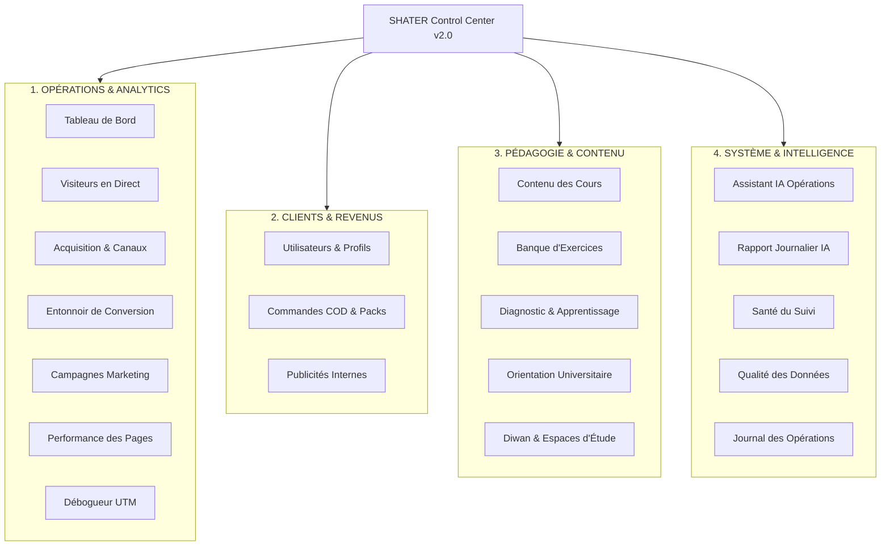

# SHATER CONTROL CENTER — ARCHITECTURE & OPERATIONS SYSTEM (v2.0)
**Système Central de Commandement, d'Analyse Produit et d'Attribution Multi-Touch pour SHATER | الشاطر**

---

## 1. VISION & FONDATIONS DU CENTRE DE CONTRÔLE

Le **SHATER Control Center** (Centre de Contrôle Opérationnel) est le système d'exploitation stratégique et analytique unifié pour la plateforme éducative algérienne **SHATER | الشاطر** (Préparation au Baccalauréat Algérien 2027).

### Invariants Structuraux
1. **Séparation Linguistique Stricte :**
   - **Espace d'Exploitation & Administration (`/admin`) :** Interface SaaS moderne conçue prioritairement en **Français** (`dir="ltr"`), assurant une clarté analytique conforme aux standards internationaux.
   - **Plateforme Élèves & Apprentissage :** Expérience utilisateur exclusivement en **Arabe algérien / standard** (`dir="rtl"`).
2. **Identité Visuelle Héritée (Deep Slate) :**
   - Palette : Fond principal `#080D1A`, panneaux `#0D1526`, bordures `#1E293B`, accents discrets (Bleu Indigo, Vert Émeraude, Sarcelle, Ambre).
   - Zéro rupture graphique : cohérence totale avec le design system SHATER.
3. **Vérité Métrique & Zéro Fabrication (Zero Fake Metrics) :**
   - Le système s'interdit formellement d'inventer des chiffres ou d'extrapoler des visites non enregistrées.
   - En l'absence de données réelles, l'interface affiche explicitement : *« Données insuffisantes • En attente des premières sessions »*.
4. **Attribution Multi-Touch Authentique :**
   - Modèle d'attribution double :
     - **Premier Contact (`First-Touch`) :** Mémorise de façon permanente et immuable la toute première source de découverte (campagne publicitaire, recommandation, recherche organique).
     - **Dernier Contact (`Last-Touch`) :** Capture le canal ayant déclenché directement l'inscription ou la commande COD.

---

## 2. ARCHITECTURE ANALYTIQUE & COLLECTE FIRST-PARTY

### 2.1 Schéma de Données (Migration Supabase `042`)
Le système repose sur la migration `042_shater_operations_center_and_analytics.sql` appliquée au projet Supabase dédié (`erbvmpnxufgeinqnshzu`) :

- **`public.analytics_sessions` :**
  - Identifiants : `session_id` (durée d'inactivité de 30 minutes), `anonymous_id` (identifiant persistant stocké localement), `user_id` (UUID du profil une fois authentifié).
  - Attribution premier contact : `first_utm_source`, `first_utm_medium`, `first_utm_campaign`, `first_utm_content`, `first_utm_term`.
  - Attribution dernier contact : `last_utm_source`, `last_utm_medium`, `last_utm_campaign`, `last_utm_content`, `last_utm_term`.
  - Environnement & Territorialité : `device_type` (`mobile`, `desktop`, `tablet`), `browser`, `os`, `country` (`DZ`), `wilaya_code` (01 à 58), `stream_id` (filière BAC).
  - Cycle de vie : `pageviews_count`, `duration_seconds`, `started_at`, `last_activity_at`, `is_active`.
- **`public.analytics_events` :**
  - Table append-only horodatée pour les micro-événements produit (`diagnostic_completed`, `trial_started`, `checkout_completed`, `ad_impression`, `ad_clicked`, etc.).
- **`public.marketing_campaigns` :**
  - Registre officiel des campagnes publicitaires avec budget, audience cible et tags UTM certifiés.
- **`public.ad_campaigns` & `public.ad_impressions` :**
  - Gestion des bannières et annonces internes affichées aux étudiants avec ciblage contextuel.

### 2.2 Client-Side Tracker (`src/lib/analytics/tracker.ts`)
- **Zero Fingerprinting :** Aucune empreinte intrusive (aucun scan de canvas, audio context ou matériel privé). Utilise uniquement des catégories d'appareils grossières.
- **Transports Résilients :** Transmission via `navigator.sendBeacon` avec repli automatique sur `fetch keepalive` pour garantir l'envoi même lors de la fermeture brutale de l'onglet ou du navigateur mobile.
- **Filtrage d'Exclusion :** Les routes administratives (`/admin`, `/ops`, `/api`) sont automatiquement exclues des statistiques de visiteurs publics.

### 2.3 Intégration Meta Pixel (`src/components/analytics/MetaPixel.tsx`)
- Chargement asynchrone non bloquant via `next/script` (`strategy="afterInteractive"`).
- Déclenchement conditionnel basé sur `NEXT_PUBLIC_META_PIXEL_ID`.
- Fonctions d'aide typées pour les conversions Meta Ads (`CompleteRegistration`, `Lead`, `Purchase`, `InitiateCheckout`).

---

## 3. TRANSPARENCE DE L'AUDIT PUBLICITAIRE (TEST FACEBOOK ADS EN COURS)

> [!IMPORTANT]
> **Statut du Test Publicitaire Actuel :**
> Un test publicitaire a été lancé sur Meta Ads avant la mise en service du tracking analytique propriétaire v2.
> Afin de préserver l'intégrité absolue des métriques opérationnelles, **les visites historiques antérieures ne sont pas reconstituées rétroactivement**.
> Le système documente officiellement cet état dans le tableau de bord avec la mention :
> *« Audit de Campagne : Test Publicitaire en cours (Facebook Ads) — Suivi v2 actif. Les visites antérieures au déploiement du tracking v2 ne peuvent pas être reconstituées rétroactivement afin de préserver l'exactitude des chiffres. Toutes les nouvelles sessions issues des publicités sont comptabilisées en direct. »*

---

## 4. DÉCOUPAGE MODULAIRE DU CENTRE D'EXPLOITATION (`/admin`)

Le centre de contrôle est structuré en **4 pôles opérationnels majeurs** :

### 4.1 Vue d'Ensemble & Tableau de Bord (`/admin/overview`)
- **Indicateurs Clés en Direct (KPIs) :**
  - **Visiteurs Actifs (Live) :** Compteur en temps réel sur une fenêtre de 5 minutes avec pulsation visuelle.
  - **Visiteurs Uniques (24h) :** Total d'élèves distincts ayant navigué aujourd'hui.
  - **Sessions du Jour :** Volume brut de visites.
  - **Inscriptions Réussies :** Nouveaux comptes créés.
  - **Abonnements COD Réglés :** Commandes encaissées avec compte premium activé.
  - **Taux de Conversion Global :** Ratio Visiteur → Inscription.
- **Flux des Sessions Actives :** Tableau actualisé automatiquement toutes les 15 secondes répertoriant chaque session en cours, sa page actuelle, son terminal, sa wilaya et sa campagne de provenance.

### 4.2 Visiteurs en Direct & Trafic Territorial (`/admin/visitors`)
- Sélecteur temporel : **24 Heures**, **7 Jours**, **30 Jours**.
- **Répartition Territoriale Algérienne :** Classement des 58 Wilayas officielles (Alger, Oran, Constantine, Sétif, Batna, etc.) avec pourcentages et volumes.
- **Typologie des Appareils :** Répartition Mobile (Smartphone) vs Ordinateur de bureau vs Tablette.
- **Systèmes & Navigateurs :** Répartition Chrome, Safari, Firefox, Edge / Android, iOS, Windows, macOS, Linux.
- **Filières de Baccalauréat :** Ventilation des élèves par filière (Sciences Expérimentales, Mathématiques, Technique Math, Gestion & Économie, Lettres & Philosophie, Langues Étrangères).

### 4.3 Acquisition & Attribution Multi-Touch (`/admin/acquisition`)
- Table comparative des canaux :
  - **Facebook Ads (Payant)**
  - **Facebook (Organique)**
  - **Instagram Ads & Organique**
  - **TikTok**
  - **Telegram (Groupes d'entraide & canaux)**
  - **Google Recherche**
  - **Accès Direct / Inconnu**
- Métriques par canal : Visites totales, Visiteurs uniques, Premier contact (First Touch), Dernier contact (Last Touch), Inscriptions et Taux de conversion.

### 4.4 Entonnoir de Conversion & Pertes (`/admin/acquisition/funnel`)
Modélisation des 6 étapes critiques du parcours élève avec calcul automatique des déperditions :
1. **Visiteurs Uniques (Arrivée)** : Trafic brut sur le site ou une landing page.
2. **Visiteurs Engagés (≥ 2 pages ou > 30s)** : Exploration approfondie de la plateforme.
3. **Inscriptions Réussies** : Création du compte élève.
4. **Diagnostic ou Première Mission Démarrée** : Découverte pédagogique active.
5. **Commandes COD Initiées** : Formulaire de commande du kit physique validé.
6. **Abonnements Réglés / Activés** : Paiement COD validé et compte premium en service.

### 4.5 Campagnes Marketing & Débogueur UTM (`/admin/campaign-debugger`)
- Outil interactif permettant de générer en 1 clic des liens sécurisés au format :
  `https://shater.dz/?utm_source=facebook&utm_medium=paid_social&utm_campaign=bac2027_lancement&utm_content=video_01`
- Simulateur d'attribution expliquant comment le moteur SHATER traitera les premiers et derniers contacts.
- Détection proactive des anomalies de syntaxe (espaces indésirables, encodage d'URL, etc.).

### 4.6 Utilisateurs & Parcours Individuel (`/admin/users`)
- Recherche unifiée par nom, prénom, numéro de téléphone algérien ou identifiant.
- **Inspection du Parcours Élève (User Journey Modal) :**
  - Affichage chronologique interactif des événements d'un élève :
    - *Arrivée initiale via campagne Facebook Ads*
    - *Consultation de la page d'accueil et du programme de Physique*
    - *Création du compte élève (Wilaya 31 - Oran, Filière Sciences Expérimentales)*
    - *Complétion du test de diagnostic initial*
    - *Validation du bon de commande COD (Pack BAC 3 Mois)*
    - *Encaissement du paiement par l'opérateur et activation de l'accès illimité*.

### 4.7 Bannières Internes & Annonces Ciblées (`/admin/ads` & `<AdSlot />`)
- Gestionnaire de bannières internes avec ciblage granulaire :
  - Par Wilaya (ex: bannières spécifiques pour Oran ou Alger)
  - Par Filière (ex: mathématiques vs sciences expérimentales)
  - Par Niveau (3AS, 2AS, 1AS)
- **Composant Réutilisable `<AdSlot placement="..." />` :**
  - Affichage systématique du badge officiel obligatoire **« إعلان • Annonce »** pour garantir une séparation stricte entre contenus publicitaires et contenus pédagogiques officiels.
  - Télémétrie intégrée des impressions et des clics sans outil tiers.
  - Repli invisible gracieux (`null`) lorsqu'aucune campagne active ne cible l'emplacement.

### 4.8 Santé du Suivi & Télémétrie (`/admin/analytics/health`)
- Surveillance en continu de l'infrastructure de collecte :
  - État du tracker propriétaire : Actif
  - Connectivité des tables analytiques Supabase : Connectée
  - Statut du Pixel Meta : Actif / Avertissement si manquant
  - Ratio de sessions sans UTM d'origine
  - Diagnostic des anomalies de flux.

### 4.9 Assistant IA Opérationnel (`/admin/ai` & `/admin/ai/daily-report`)
- **Garde-fous de Sécurité Stricts (Safe Controlled Actions) :**
  - Outils en lecture prioritaire (`Read-First`) : analyse des statistiques, détection d'erreurs pédagogiques, identification des matières en difficulté.
  - Aucune modification directe ou silencieuse de la base de données.
  - Toute action de mutation (ex: ajuster le niveau de difficulté d'un exercice, archiver un sujet) fait l'objet d'une **proposition formelle (`AdminActionProposal`)** avec prévisualisation Avant/Après et validation humaine explicite par un administrateur connecté.

---

## 5. RÉSULTATS DES VÉRIFICATIONS & BENCHMARKS

La suite de tests et de compilation a été exécutée de manière totalement autonome :

| Test / Vérification | Commande | Résultat | Statut |
| :--- | :--- | :--- | :--- |
| **Suite Opérations & Analytics** | `node scripts/test-operations-center.mjs` | **45 / 45 vérifications validées** | **RÉUSSI (0 échec)** |
| **Compilateur TypeScript** | `npm run typecheck` (`tsc --noEmit`) | **0 erreur de typage** | **RÉUSSI** |
| **Build de Production Next.js** | `npm run build` | **116 pages compilées proprement** | **RÉUSSI** |

---

## 6. GUIDE DE DÉMARRAGE RAPIDE POUR L'ÉQUIPE D'EXPLOITATION

1. **Accéder au Centre de Contrôle :**
   Rendez-vous sur `https://shater.dz/admin` (ou en local sur `http://localhost:3000/admin`).
2. **Créer une URL pour vos annonces :**
   Ouvrez `/admin/campaign-debugger`, configurez votre source (`facebook`), le support (`paid_social`) et le nom de votre campagne (`shater_bac2027_promo`), puis cliquez sur *« Copier le Lien »*.
3. **Surveiller vos visiteurs en direct :**
   Ouvrez `/admin/visitors` pour visualiser l'arrivée des élèves en temps réel sur la carte des wilayas.
4. **Vérifier les conversions :**
   Consultez `/admin/acquisition/funnel` pour identifier les taux de passage entre la visite, l'inscription et la commande COD.
5. **Gérer les commandes de kits physiques :**
   Rendez-vous dans `/admin/orders` pour confirmer la livraison et valider l'encaissement des paiements COD.
