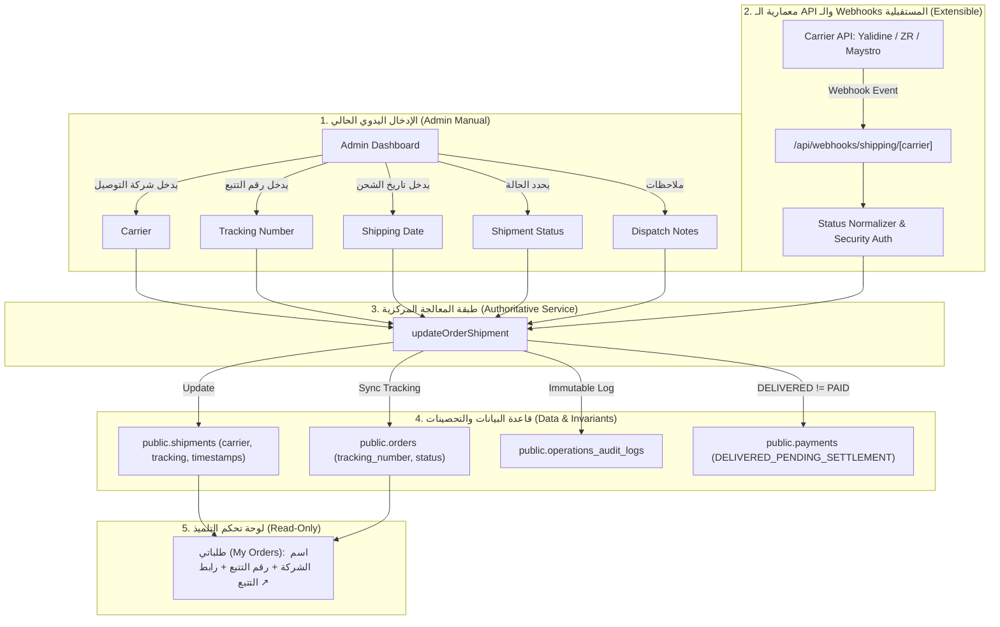

# 🚚 SHATER Shipping Management & Carrier Architecture

> **Migration:** `supabase/migrations/040_shater_shipping_management_and_tracking.sql`  
> **Test Suite:** `scripts/test-shipping-management.mjs` (100% Passed)  
> **Key Principle:** **`DELIVERED ≠ PAID`** + Extensible Carrier Webhooks Architecture

---

## 1. Overview & Architecture

نظام إدارة الشحن والتوصيل (Shipping Management) لمنصة شاطر يتيح للإدارة التحكم الكامل واليدوي في شحن الطرود المادية (Physical Kits)، مع إمكانية ربط الـ APIs والـ Webhooks الخاصة بشركات التوصيل مستقبلاً دون الحاجة لأي تغيير في المعمارية.

---

## 2. الحالات الست المعتمدة للشحن (The 6 Canonical Statuses)

| الحالة البرمجية | التسمية العربية | الوصف | السلوك المالي المرتبط |
| :--- | :--- | :--- | :--- |
| **`PENDING`** | في انتظار الشحن | تم إنشاء الطلب والعلبة قيد التحضير في مخزن شاطر. | الدفع `COD` (في انتظار الاستلام). |
| **`SHIPPED`** | تم الشحن | تم تسليم العلبة المادية لشركة التوصيل وسُجل تاريخ الشحن `shipped_at`. | الدفع `COD` (مع شركة الشحن). |
| **`OUT_FOR_DELIVERY`** | في الطريق للتسليم | الطرد حالياً بحوزة الموزع الميداني (Livreur) في طريقه لعنوان الطالب. | الدفع `COD` (جاهز للتحصيل نقداً). |
| **`DELIVERED`** | تم التوصيل | استلم الطالب العلبة المادية وسدد المبلغ نقداً للموزع. | **`DELIVERED_PENDING_SETTLEMENT`** (الأموال بحوزة شركة الشحن - ليس PAID). |
| **`FAILED`** | تعذر أو فشل التسليم | تعذر الوصول للطالب (هاتف مغلق، خطأ بالعنوان، تأجيل الاستلام). | الدفع `COD` (محاولة لاحقة). |
| **`RETURNED`** | طرد مرتجع (Retour) | تم إرجاع الطرد لمقر شاطر بعد استنفاد محاولات التسليم. | تحويل حالة الطلب إلى `CANCELLED` والدفع إلى `FAILED`. |

> [!CAUTION]
> **قاعدة ذهبية ثابتة:** تحول الشحنة إلى `DELIVERED` لا يعني أبداً أن الدفع أصبح `PAID`، ولا يتم تفعيل الاشتراك نهائياً إلا بعد تسوية الأموال نقداً في حساب شاطر وتأكيد المشرف المالي.

---

## 3. حقول الإدخال الإدارية (Admin Inputs)

في لوحة المشرف (`src/app/admin/orders/page.tsx`)، عند فتح تفاصيل أي طلب:

1. **شركة التوصيل (Carrier):**
   - خيارات سريعة مدمجة:
     - **ياليدين إكسبريس (Yalidine Express)**
     - **زد آر إكسبريس (ZR Express)**
     - **مايسترو دليفري (Maystro Delivery)**
     - **كازيتور إكسبريس (Kazitour)**
     - **برو كوليس (Procolis)**
     - **شمال وجنوب إكسبريس (Nord et Sud)**
     - **شركة توصيل أخرى (Manual)**: يتيح كتابة أي شركة توصيل محلية أو اسم موزع خاص.
2. **رقم التتبع (Tracking Number):**
   - حقل إدخال بنص مونوسبيس (Monospace).
   - زر نسخ رقم التتبع بنقرة واحدة.
   - إذا كانت الشركة تدعم التتبع الإلكتروني (مثل Yalidine أو ZR)، يظهر زر مباشر: **`[ تتبع بموقع شركة الشحن ↗ ]`**.
3. **تاريخ الشحن (Shipping Date):**
   - حقل اختيار تاريخ (`<input type="date">`) يحدد تاريخ خروج الشحنة ويسجل في `shipped_at`.
4. **حالة الشحنة (Status):**
   - قائمة منسدلة بالحالات الست (`PENDING`, `SHIPPED`, `OUT_FOR_DELIVERY`, `DELIVERED`, `FAILED`, `RETURNED`).
5. **ملاحظات الشحن والتوصيل (Status Notes):**
   - حقل للملاحظات الميدانية (مثل: "الزبون طلب التسليم بعد العصر" أو سبب التعذر).
6. **زر الحفظ:**
   - **`[ حفظ وتحديث بيانات الشحن والتتبع ]`** ينفذ الإجراء من جانب الخادم ويحدث `orders.tracking_number` و `shipments` ويسجل العملية في سجل التدقيق.

---

## 4. معمارية الـ Webhooks المستقبلية (Future-Proof Architecture)

إذا تم توفير API أو Webhook من شركة التوصيل مستقبلاً، فإن النظام مهيأ بالكامل:

* **Endpoint:** `POST /api/webhooks/shipping/[carrier]`
  * أمثلة:
    * `/api/webhooks/shipping/yalidine`
    * `/api/webhooks/shipping/zr-express`
    * `/api/webhooks/shipping/generic`
* **Workflow:**
  1. استقبال الحمولة `JSON` من الـ Webhook.
  2. التحقق من التوقيع السري `SHIPPING_WEBHOOK_SECRET` (إن وجد).
  3. استخراج `tracking_number` وتطبيعه.
  4. تطبيع حالة شركة التوصيل (مثلاً: `livré` أو `en transit` أو `echec`) إلى الحالات الست المعتمدة في شاطر عبر `normalizeShipmentStatus()`.
  5. البحث عن الطلب برقم التتبع وتحديث الشحنة مركزياً عبر `updateOrderShipment()`.
  6. تطبيق قواعد الأمان الصارمة (`DELIVERED != PAID`).

---

## 5. واجهة التلميذ (Student Dashboard)

في صفحة **طلباتي (My Orders)**:
* يُعرض اسم شركة التوصيل.
* يُعرض تاريخ الشحن.
* يُعرض رقم التتبع (Tracking Number) مع إمكانية نسخه.
* رابط مباشر لتتبع الطرد عبر موقع شركة التوصيل إن توفر.
* شارة ملونة توضح بدقة مرحلة التوصيل (في انتظار الشحن / تم الشحن / في الطريق للتسليم / تم التوصيل / تعذر التسليم / مرتجع).
* **حماية كاملة:** لا يملك الطالب أي صلاحية لتعديل بيانات الشحن أو الأسعار.
