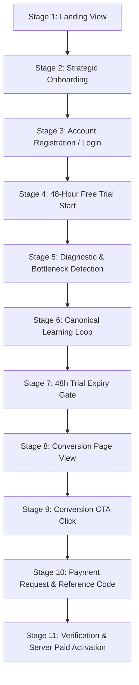

# BAC Mastery — Commercial Pilot Funnel Architecture
**Version**: 1.0.0-pilot-commercial  
**Target Milestone**: Prompt 19 Commercial Hardening  
**Target Stream**: Sciences Expérimentales (BAC 2026)  
**Commercial Hypothesis**: 48-Hour Free Trial $\to$ 3,900 DZD Season Pass (`ManualPilotPaymentProvider`)

---

## 1. The 11-Stage Commercial Pilot Funnel

The BAC Mastery commercial funnel models the student journey from first landing visit to full paid season pass activation. Every step is anchored to real student actions, zero artificial friction, and server-authoritative state transitions.



---

## 2. Detailed Stage Breakdown & Metrics

| Stage # | Stage Name | Trigger / User Action | Primary Telemetry Event | Success Criteria | Drop-off Risk & Mitigation |
| :--- | :--- | :--- | :--- | :--- | :--- |
| **Stage 1** | **Landing Page** | Enters website root `/` | `landing_view` | Reads value prop; clicks dynamic CTA | *Dispersion / Skepticism* $\to$ Clear method focus, no fake stats. |
| **Stage 2** | **Strategic Onboarding** | Completes stream, target, time, energy | `onboarding_started`, `onboarding_completed` | Clean profile constructed | *Fatigue* $\to$ Step-by-step 4-question wizard, instant response. |
| **Stage 3** | **Registration / Auth** | Signs up or signs in via `/auth` | `registration_completed`, `login_completed` | Valid JWT session in Supabase Auth | *Auth friction* $\to$ Email/password without email confirmation block. |
| **Stage 4** | **48h Free Trial** | Account linked with server timestamp | `trial_started` | `canUseProduct = true`, 48h countdown | *Ambiguity* $\to$ Prominent countdown in account, no card required. |
| **Stage 5** | **Diagnostic Evaluation** | Completes 6-item diagnostic | `diagnostic_started`, `diagnostic_completed` | Observed score & bottleneck skill detected | *Anxiety* $\to$ Low-stakes framing, pedagogical focus on learning. |
| **Stage 6** | **Canonical Learning Loop** | Mission $\to$ Error $\to$ Repair $\to$ Retest | `mission_started`, `practice_completed`, `mastery_demonstrated` | At least 1 mastery demonstrated | *Frustration on errors* $\to$ Immediate root-cause diagnosis in Error Lab. |
| **Stage 7** | **Trial Expiry Gate** | 48 hours elapse from trial start | `trial_expired` | `canUseProduct = false`, gate triggered | *Hostility* $\to$ Clear message: "48h ended, all data preserved". |
| **Stage 8** | **Conversion Page** | Visits `/subscribe` | `conversion_viewed` | Real student metrics & 5 core answers shown | *Lack of clarity* $\to$ Transparent pricing (3,900 DZD), no hidden fees. |
| **Stage 9** | **Conversion CTA** | Clicks primary CTA on `/subscribe` | `conversion_cta_clicked` | Opens honest pilot activation modal | *Unclear terms* $\to$ Explicit explanation of manual pilot process. |
| **Stage 10** | **Payment Request** | Submits checkout in modal | `payment_started` | `PILOT-BAC-XXXX` reference code issued | *Payment method confusion* $\to$ BaridiMob/CCP guidance provided. |
| **Stage 11** | **Payment Verification** | Sends receipt $\to$ Admin confirms | `payment_pending_verification`, `payment_confirmed` | Server elevates profile to `PAID_ACTIVE` | *Delay in activation* $\to$ Direct WhatsApp/Email channel for supervisor. |

---

## 3. Drop-Off Prevention & Ethical Safeguards

1. **Zero Dark Patterns**:
   - No fake countdown timers ("Offer expires in 03:22").
   - No artificial scarcity badges ("Only 2 spots left!").
   - No fake strike-through discounts ("Was 25,000 DZD, now 3,900 DZD").
2. **Data Preservation Guarantee**:
   - When 48h expires, student progress (target score, diagnostic results, completed missions, error records, masteries) remains 100% saved in Supabase and LocalStorage.
3. **Transparent Support Path**:
   - Real supervisor contact provided via environment variables (`NEXT_PUBLIC_SUPPORT_WHATSAPP` / `NEXT_PUBLIC_SUPPORT_EMAIL`).
   - If missing, displays `SUPPORT_CONTACT_REQUIRED` rather than inventing mock numbers.

---

## 4. Telemetry Schema & Event Definitions

All funnel events are strictly anonymized and emit the following minimal properties:

```typescript
export interface FunnelTelemetryPayload {
  userId?: string | null;
  sessionId?: string;
  planId?: string;
  streamId?: string;
  skillId?: string;
  referenceId?: string; // payment reference only, no card data
  timestamp: string;
}
```

**Privacy Enforcement**: No passwords, plaintext answers, student names, phone numbers, or CCP account credentials are EVER passed to analytics buffers or network logs.
