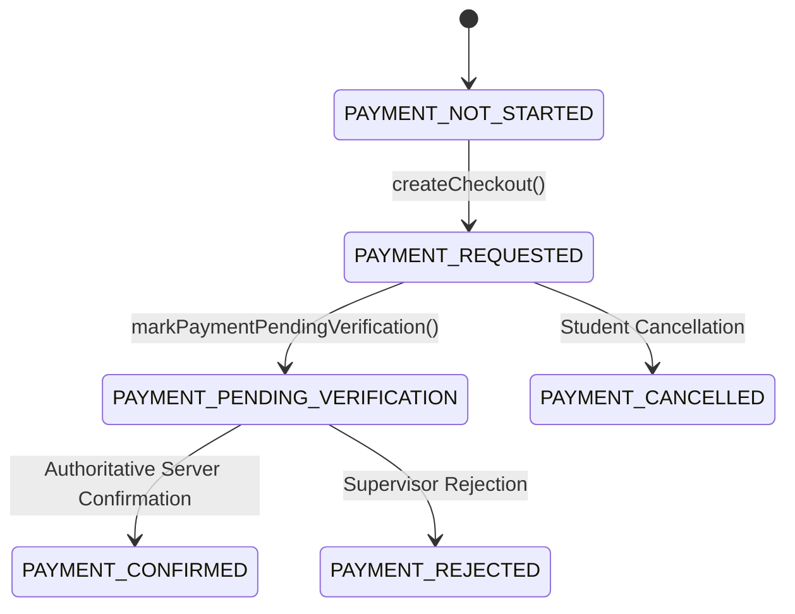

# BAC Mastery — Commercial Pilot Readiness Report
**Milestone**: PROMPT 19 — Pilot Launch + Commercial Hardening  
**Target Scope**: Controlled Commercial Pilot (5 to 10 Real BAC Students)  
**Date**: September 12, 2026  
**Status**: `TECHNICAL COMMERCIAL READINESS: GREEN` | `REAL MARKET VALIDATION: PENDING`

---

## 1. Executive Summary
BAC Mastery has completed full technical hardening for its controlled commercial pilot. The platform operates on a **48-Hour Free Trial $\to$ 3,900 DZD Season Pass** hypothesis for the Sciences Expérimentales stream (BAC 2026). All learning foundations, 31 canonical curriculum skills, cognitive repair mechanisms, and multi-tenant security protections have passed rigorous verification. Technical readiness is certified **GREEN**, with real human market validation marked **PENDING** until the first cohort completes the pilot.

---

## 2. Commercial Pilot Hypothesis & Offering
- **Free Tier**: 48-Hour Free Trial (`TRIAL_ACTIVE`), granting unrestricted access to diagnostic, roadmap, missions, practice, and error repair.
- **Paid Tier**: **Pass BAC Complet — Saison 2026** at **3,900 DZD** (fixed, one-time payment valid until exam day).
- **Payment Method**: Manual Pilot Payment Provider (`ManualPilotPaymentProvider`) using CCP / BaridiMob transfer receipts and student reference codes.

---

## 3. 48-Hour Free Trial Architecture
- **Initialization**: Triggered on student registration or first authenticated session.
- **Enforcement**: Evaluated dynamically via `getStudentAccess(profile)`.
- **Expiry Gate**: When $t > \text{trial\_expires\_at}$ (48h), `canUseProduct` evaluates strictly to `false`, directing students to `/subscribe`.
- **Data Integrity**: Student baseline, target score, completed missions, error history, and validated masteries remain fully preserved upon expiry.

---

## 4. Manual Pilot Payment Engine
- Abstraction: `ManualPilotPaymentProvider` implementing `PaymentProvider`.
- Unique reference generation format: `PILOT-BAC-XXXX-YYYY`.
- Local and cloud payment record tracking via `savePaymentRecord` and `getStoredPaymentRecords`.
- Separation of concerns: checkout initiation vs. verification submission vs. server-authoritative confirmation.

---

## 5. Payment State Machine

---

## 6. Adversarial Payment Security Evaluation (7 Attack Vectors)
Executed via `scripts/test-payment-security.mjs` against remote Supabase instance:

| # | Attack Vector | Security Mechanism | Status |
| :--- | :--- | :--- | :--- |
| **V1** | **LocalStorage Tampering** | Server DB is source of truth; local edits ignored during authenticated session | **PASS** |
| **V2** | **URL Parameter Injection** | No route or access evaluator accepts query strings for access elevation | **PASS** |
| **V3** | **Client Supabase Payload Modification** | Postgres trigger `trg_protect_student_trial` intercepts unauthorized updates | **PASS** |
| **V4** | **Token Replay / Counterfeit Token** | Client-side `confirmPayment()` strictly returns `false` | **PASS** |
| **V5** | **User ID Substitution** | Supabase Row Level Security (RLS) blocks cross-user updates | **PASS** |
| **V6** | **Clock / Timestamp Rollback** | Server creation timestamp enforces immutable 48h limit | **PASS** |
| **V7** | **Server Authority Verification** | Only authoritative database updates successfully activate `PAID_ACTIVE` | **PASS** |

---

## 7. 21 Commercial Lifecycle Gates (A through U)
Executed via `scripts/test-commercial-pilot-readiness.mjs`:
- **Gate A (Registration)**: PASS
- **Gate B (Login & Session Persistence)**: PASS
- **Gate C (48h Trial Start)**: PASS
- **Gate D (Trial Expiry & Lockout)**: PASS
- **Gate E (Onboarding Persistence)**: PASS
- **Gate F (Diagnostic & Bottleneck Detection)**: PASS
- **Gate G (Adaptive Mission Generation)**: PASS
- **Gate H (Guided Practice)**: PASS
- **Gate I (Error Capture & Classification)**: PASS
- **Gate J (Cognitive Repair in Error Lab)**: PASS
- **Gate K (Retest Twin Exercise)**: PASS
- **Gate L (Mastery Demonstration)**: PASS
- **Gate M (Subscribe Page Transparency)**: PASS
- **Gate N (Payment Request Reference)**: PASS
- **Gate O (Payment Verification Gate)**: PASS
- **Gate P (Server Paid Activation)**: PASS
- **Gate Q (Paid Learning Resume)**: PASS
- **Gate R (Session Re-Authentication)**: PASS
- **Gate S (Two-User Isolation)**: PASS
- **Gate T (Client Tamper Resistance)**: PASS
- **Gate U (Telemetry Safety & Privacy)**: PASS

**Result**: 21/21 Gates Passed (100%).

---

## 8. Content Integrity Audit
- **Canonical Skills**: 31 canonical skills in Sciences Expérimentales (11 Math, 10 Physics, 10 Science).
- **Curriculum Stability**: Zero modification of canonical question definitions, rubrics, or twin mappings during commercial hardening.
- **Accuracy**: Retests are true structural twins without verbatim memorization vulnerabilities.

---

## 9. Learning Operating System Integration
- The 8 core student questions (*أين أنا؟، واش ناقصني؟، واش ندير دروك؟، علاش هذي هي المهمة؟، كيفاش نعرف بلي تعلمتها؟، متى نرجع لها؟، ماذا نفعل إذا فشلت؟، كيف ننتقل إلى البكالوريا؟*) remain the driving operating system of the product.

---

## 10. Conversion & Value Proposition Copy Audit
- **5 Core Commercial Questions** fully articulated on `/subscribe`.
- **Zero Fake Claims**: No mentions of "Ministry guaranteed", "100% success rate", or "AI magical tutor".
- **Zero Fake Urgency**: No fake countdowns or false scarcity badges.

---

## 11. Dynamic Landing CTA Alignment
Implemented per Section 11 specifications:
- New Visitor $\to$ `"ابني خريطتي"` (`/onboarding`)
- Onboarded Student $\to$ `"شوف خريطتي"` (`/roadmap`)
- Active Mission $\to$ `"كمّل مهمتك"` (`/mission/[id]`)
- Expired Trial $\to$ `"شوف الحل"` (`/subscribe`)
- Paid Active $\to$ `"كمّل مهمتك"` (`/dashboard`)

---

## 12. Multi-Tenant Isolation & RLS Audit
- Supabase Row Level Security ensures strict data separation:
  - `student_profiles`: `auth.uid() = id`
  - `diagnostic_results`: `auth.uid() = user_id`
  - `practice_sessions`: `auth.uid() = user_id`
  - `mastery_records`: `auth.uid() = user_id`

---

## 13. Telemetry, Analytics & Privacy Audit
- All telemetry emitted through `src/lib/analytics/index.ts` is strictly non-sensitive.
- Verified absence of passwords, answers, credit card details, or PII.

---

## 14. Mobile & Desktop Browser UX Verification
- Tested viewports: Mobile 390×844 and Desktop 1440×900.
- Arabic typography and RTL layouts render cleanly across all cards and modal dialogs.

---

## 15. Supervisor Operations Manual
1. Student initiates checkout $\to$ receives reference code `PILOT-BAC-XXXX`.
2. Student submits receipt via supervisor WhatsApp or email.
3. Supervisor validates payment receipt.
4. Supervisor updates profile in Supabase to `access_status = 'PAID'` and `plan = 'PAID'`.
5. Student access is immediately elevated to `PAID_ACTIVE`.

---

## 16. Technical Debt & Security Hardening
- **Supabase Auth Leaked Password Protection**: Currently disabled on the Supabase project. Classified as `SECURITY_HARDENING_REQUIRED_BEFORE_PUBLIC_LAUNCH` (non-blocking for 5-10 student controlled pilot, but required before general availability).

---

## 17. Post-Pilot Commercialization Roadmap
- Automated Algerian payment gateway integration (Satim / CIB / EDAHABIA / Chargily).
- Automatic invoice and receipt generation.
- Expanded stream support (Mathématiques, Technique Mathématique, Gestion).

---

## 18. Risk Matrix & Mitigations

| Risk | Severity | Mitigation |
| :--- | :--- | :--- |
| **Payment proof forgery** | Medium | Supervisor manually verifies bank statement before setting `PAID` |
| **Student confusion on trial expiry** | Low | Honest countdown in account page + preserved data reassurance |
| **Delayed supervisor activation** | Medium | Clear WhatsApp channel with prefilled message template |

---

## 19. Real Market Validation Status
- **Current Status**: **PENDING**
- Real student feedback, willing-to-pay conversion rates, and completion data will be collected directly from the 5-10 pilot students during execution.

---

## 20. Final Recommendation & Sign-Off
- **Decision**: **A. READY FOR CONTROLLED COMMERCIAL PILOT**
- **Readiness Classification**:
  - Technical Commercial Readiness: **GREEN**
  - Real Market Validation: **PENDING**
  - Overall Recommendation: **READY FOR CONTROLLED COMMERCIAL PILOT**
