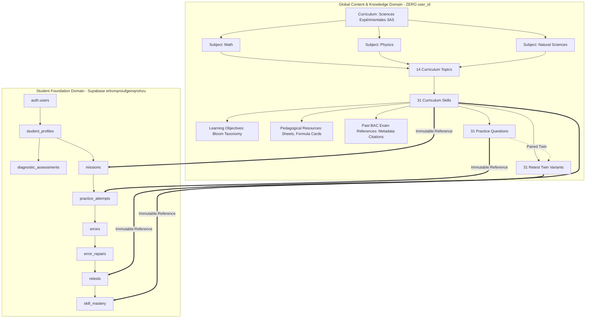

# BAC Mastery — Content & Knowledge Architecture
## Prompt 11: Trustworthy Internal Knowledge & Content Foundation

---

## 1. Architectural Mission & Core Principles

BAC Mastery is a precision digital learning system for Algerian high school students preparing for the National Baccalauréat examination.
Its pedagogical thesis:

> **"ماشي واش تقرا. كيفاش توصل."**
> Progression from baseline competence → structured roadmap → focused missions → error remediation → retest validation → proven mastery.

To support this mission with absolute educational authority, Prompt 11 establishes the **Content & Knowledge Architecture** — a clean, immutable, trustworthy internal knowledge model that serves as the single source of truth for all academic curriculum structures, questions, and pedagogical assets.

### 1.1 Fundamental Architectural Principles

1. **Content Purity & Zero Student Ownership (Invariant 1)**:
   - All content entities (`Curriculum`, `Subject`, `Topic`, `Skill`, `LearningObjective`, `Resource`, `PracticeQuestion`, `RetestQuestion`, `QuestionVariant`, `ContentSource`, `VerificationRecord`, `PastBacExamReference`) are **strictly global**.
   - Content entities contain **ZERO `user_id`**, `student_id`, or student runtime state.
   - Student performance, attempts, errors, and mastery exist **exclusively** in the 10 student foundation tables (`student_profiles`, `diagnostic_assessments`, `missions`, `practice_attempts`, `errors`, `error_repairs`, `retests`, `skill_mastery`, `daily_study_streaks`, `student_activity_events`).

2. **Provenance & Verification Rigor (Invariant 2)**:
   - Every official curriculum fact (e.g. subject coefficients, syllabus chapters) must have a documented official provenance.
   - Unverified facts or claims are explicitly tagged `verificationStatus = "unverified"`; **never silently assumed or invented**.
   - Zero prohibited claims: no "official predictions", no "guaranteed scores", no invented ministerial coefficients.

3. **Rights & Copyright Integrity (Invariant 3)**:
   - Strict separation between **Original BAC Mastery Content** (`sourceType = "original_bac_mastery"`, `rightsStatus = "original"`) and **Official Public Exam References** (`rightsStatus = "official_reference"`).
   - Past BAC exam problems are mapped via **metadata references, exercise numbers, targeted skills, and original guidance notes** — **never verbatim reproduction of protected exam sheets without authorization**.

4. **Unseen Retest Guarantee (Invariant 4)**:
   - Practice questions and Retest questions are paired twins testing the exact same academic skill and subject, but represent **strictly distinct problem instances** (`retestId !== practiceId`) with distinct prompts.
   - A student never encounters the identical question during retest remediation.

---

## 2. High-Level Architectural Topology

---

## 3. Structural Tiers & Relationships

The content model is organized into five distinct tiers:

### Tier 1: Curriculum & Subject Framework
- **`Curriculum`**: The macro academic framework representing an official secondary stream (e.g., *Sciences Expérimentales*, 3AS, Academic Year 2024-2025).
- **`Subject`**: Academic subjects (*Mathématiques*, *Physique-Chimie*, *Sciences de la Nature et de la Vie*) with authoritatively verified coefficient provenance referencing ministerial decrees (e.g. *Arrêté ministériel n° 54*).

### Tier 2: Syllabus Modules & Competences
- **`Topic`**: Major pedagogical chapters within each subject (14 topics in the Sciences Expérimentales pilot).
- **`Skill`**: High-value targeted competencies (31 skills in the pilot) structured as a cycle-free **Directed Acyclic Graph (DAG)** of prerequisites.
- **`LearningObjective`**: Atomic pedagogical criteria mapped to Bloom's Revised Taxonomy (*remember*, *understand*, *apply*, *analyze*, *evaluate*, *create*).

### Tier 3: Verified Pedagogical Resources
- **`Resource`**: Reference materials supporting mastery:
  - *Summary Sheets* (ملخصات شاملة للدروس)
  - *Methodology Guides* (أدلة منهجية لمعالجة التمارين)
  - *Formula Cards* (بطاقات القوانين والعلاقات الأساسية)
  - *Concept Maps* (خرائط ذهنية ومفاهيمية)

### Tier 4: Assessment & Remediation Engine
- **`PracticeQuestion`**: Primary diagnostic and practice items (31 items in pilot).
  - Multiple choice (3–4 options).
  - Single unambiguous correct answer.
  - Distractor options mapped to the **Error Lab Taxonomy** (`forgot_information`, `misunderstood_concept`, `methodology_error`, `calculation_error`, etc.).
  - Detailed bilingual explanations and repair hints.
- **`RetestQuestion`**: Paired twin variants (31 items in pilot).
  - Tests the exact same skill and difficulty level.
  - Distinct problem statement, numbers, and context.
  - Links directly to `retestForQuestionId`.

### Tier 5: External Citations & Provenance Audit
- **`PastBacExamReference`**: Metadata-only citations of official national BAC exams (Year, Session, Subject, Exercise Number, Sub-question, Guidance Notes).
- **`ContentSource`**: Immutable registry of ministerial decrees, official curriculum syllabi, national examination archives, and editorial authoring engines.
- **`VerificationRecord`**: Audit trail recording pedagogical verification, reviewer credentials, timestamp, and evidentiary documents.

---

## 4. Integration with Product Engines

The Content & Knowledge Architecture provides the read-only substrate for all four student engines:

| Student Engine | Content Interaction | Data Isolation Guarantee |
| :--- | :--- | :--- |
| **Diagnostic Engine** | Evaluates student baseline using `PracticeQuestion` samples mapped to cognitive dimensions. | Questions are read-only references; student answers and signals write only to `diagnostic_assessments`. |
| **Mission Engine** | Generates personalized tasks targeting unmastered `Skill` entities based on the prerequisite DAG. | Missions store `skill_id` and `practiceQuestionIds` as string foreign keys; content is immutable. |
| **Error Lab** | Analyzes incorrect choices using `QuestionOption.suspectedErrorType` to prescribe tailored repair strategies. | Errors record `suspected_error_type`; content repair guides remain global templates. |
| **Mastery Engine** | Transitions skills from `not_assessed` → `emerging` → `needs_work` → `demonstrated` upon passing `RetestQuestion`. | Student mastery state is stored strictly in `skill_mastery(user_id, skill_id)`. |

---

## 5. Scope & Controlled Execution Boundary

- **Pilot Scope**: Exclusively **Sciences Expérimentales (3AS)** covering 14 topics, 31 skills, and 62 practice + retest questions across Mathematics, Physics-Chemistry, and Natural Sciences.
- **Remote Database Gate**: **ZERO remote content tables created**. The Supabase database remains strictly at the 10 student foundation tables. Migration of content tables to Supabase will be planned under Prompt 12 following explicit review.
