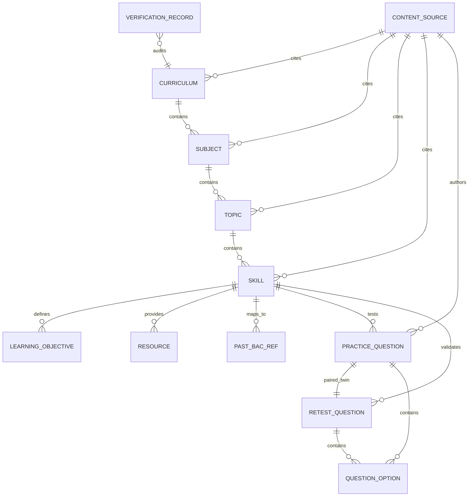

# BAC Mastery — Content Data Model Specification
## Prompt 11: Entity Definitions, Schemas, and Relationships

---

## 1. Architectural ERD (Entity Relationship Diagram)

---

## 2. Invariant: Absolute Content Purity

> [!IMPORTANT]
> **Strict Content Purity Constraint**:
> Every content entity in this specification is strictly **global and student-agnostic**.
> Content entities **MUST NOT** include `user_id`, `userId`, `student_id`, or student runtime states.
> All student activity, attempts, and mastery progressions belong exclusively to the 10 student foundation tables.

---

## 3. Entity Specifications

### 3.1 `Curriculum`
The root macro-academic structure representing a national curriculum stream.

| Field | Type | Required | Description |
| :--- | :--- | :---: | :--- |
| `id` | `string` | Yes | Unique identifier (e.g., `curr_bac_sciences_exp`) |
| `streamId` | `StreamId` | Yes | Secondary stream identifier (`sciences_exp`) |
| `educationLevel` | `EducationLevel` | Yes | Level (`secondary`) |
| `examType` | `ExamType` | Yes | Examination type (`BAC`) |
| `academicYear` | `string` | Yes | Academic year (e.g., `2024-2025`) |
| `title_ar` | `string` | Yes | Arabic title |
| `title_fr` | `string` | Yes | French title |
| `description_ar` | `string` | Yes | Pedagogical description in Arabic |
| `description_fr` | `string` | Yes | Pedagogical description in French |
| `subjectIds` | `SubjectId[]` | Yes | List of included subject IDs (`math`, `physics`, `natural_sciences`) |
| `sourceId` | `string` | Yes | Foreign key to `ContentSource` |
| `sourceType` | `ContentSourceType` | Yes | Source classification (`official_curriculum`) |
| `rightsStatus` | `ContentRightsStatus` | Yes | Legal rights classification (`official_reference`) |
| `verificationStatus` | `VerificationStatus` | Yes | Review status (`verified`) |
| `verifiedAt` | `string` | No | ISO timestamp of verification |
| `verifiedBy` | `string` | No | Auditor / Committee name |
| `version` | `number` | Yes | Monotonic version integer |
| `isActive` | `boolean` | Yes | Availability toggle |

---

### 3.2 `Subject`
Academic discipline within a curriculum with official ministerial coefficient tracking.

| Field | Type | Required | Description |
| :--- | :--- | :---: | :--- |
| `id` | `SubjectId` | Yes | Primary key (`math`, `physics`, `natural_sciences`) |
| `curriculumId` | `string` | Yes | Parent curriculum reference (`curr_bac_sciences_exp`) |
| `streamId` | `StreamId` | Yes | Stream code (`sciences_exp`) |
| `code` | `string` | Yes | Internal code (e.g. `MATH-3AS-SE`) |
| `title_ar` | `string` | Yes | Arabic name (الرياضيات) |
| `title_fr` | `string` | Yes | French name (Mathématiques) |
| `coefficientProvenance`| `CoefficientProvenance` | Yes | Sub-object defining value (7), status (`verified`), and document citation |
| `order` | `number` | Yes | Official sequence order (1, 2, 3) |
| `sourceId` | `string` | Yes | Reference to official ministerial decree |
| `sourceType` | `ContentSourceType` | Yes | Source category (`ministry`) |
| `rightsStatus` | `ContentRightsStatus` | Yes | Rights classification (`official_reference`) |
| `verificationStatus` | `VerificationStatus` | Yes | Review state (`verified`) |
| `isActive` | `boolean` | Yes | Active toggle |

---

### 3.3 `Topic`
Major pedagogical chapter or curriculum unit.

| Field | Type | Required | Description |
| :--- | :--- | :---: | :--- |
| `id` | `string` | Yes | Unique ID (e.g., `math_topic_functions`, `physics_topic_rc_rl`) |
| `subjectId` | `SubjectId` | Yes | Foreign key to `Subject` |
| `curriculumId` | `string` | Yes | Root curriculum ID |
| `streamId` | `StreamId` | Yes | Stream identifier |
| `title_ar` | `string` | Yes | Arabic chapter title |
| `title_fr` | `string` | Yes | French chapter title |
| `description_ar` | `string` | No | Scope in Arabic |
| `description_fr` | `string` | No | Scope in French |
| `order` | `number` | Yes | Official curricular sequence number |
| `academicYear` | `string` | Yes | e.g. `2024-2025` |
| `sourceId` | `string` | Yes | Foreign key to `ContentSource` |
| `sourceType` | `ContentSourceType` | Yes | Source classification |
| `rightsStatus` | `ContentRightsStatus` | Yes | Rights classification |
| `verificationStatus` | `VerificationStatus` | Yes | Review state |
| `isActive` | `boolean` | Yes | Active toggle |

---

### 3.4 `Skill`
High-value targeted learning competence.

| Field | Type | Required | Description |
| :--- | :--- | :---: | :--- |
| `id` | `string` | Yes | Semantic identifier (e.g., `math_derivatives_chain_rule`) |
| `topicId` | `string` | Yes | Parent topic reference |
| `subjectId` | `SubjectId` | Yes | Subject identifier |
| `streamId` | `StreamId` | Yes | Stream identifier |
| `title_ar` | `string` | Yes | Arabic competence title |
| `title_fr` | `string` | Yes | French competence title |
| `description_ar` | `string` | Yes | Detailed operational objective |
| `description_fr` | `string` | Yes | Detailed operational objective |
| `prerequisites` | `string[]` | Yes | Array of prerequisite `skill.id` (strictly DAG compliant) |
| `cognitiveDimensions` | `DiagnosticDimension[]` | Yes | Cognitive dimensions assessed (`knowledge`, `application`, etc.) |
| `difficulty` | `1 \| 2 \| 3` | Yes | Integer rating (1 = Foundational, 2 = Standard BAC, 3 = Advanced BAC) |
| `order` | `number` | Yes | Pedagogical sequence within topic |
| `learningObjectiveIds` | `string[]` | No | Associated `LearningObjective` IDs |
| `repairStrategy_ar` | `string` | Yes | High-level remediation strategy in Arabic |
| `repairStrategy_fr` | `string` | Yes | High-level remediation strategy in French |
| `repairSteps_ar` | `string[]` | Yes | Minimum 3 actionable step-by-step repair actions |
| `repairSteps_fr` | `string[]` | Yes | Minimum 3 actionable step-by-step repair actions |
| `academicYear` | `string` | Yes | e.g. `2024-2025` |
| `sourceId` | `string` | Yes | Content source citation |
| `sourceType` | `ContentSourceType` | Yes | `official_curriculum` |
| `rightsStatus` | `ContentRightsStatus` | Yes | `official_reference` |
| `verificationStatus` | `VerificationStatus` | Yes | Review status |
| `isActive` | `boolean` | Yes | Active toggle |

---

### 3.5 `LearningObjective`
Atomic pedagogical criteria mapped to Bloom's taxonomy.

| Field | Type | Required | Description |
| :--- | :--- | :---: | :--- |
| `id` | `string` | Yes | Unique ID (e.g. `lo_math_deriv_chain_01`) |
| `skillId` | `string` | Yes | Target skill reference |
| `code` | `string` | Yes | Pedagogical code (e.g. `LO-MATH-DERIV-01`) |
| `description_ar` | `string` | Yes | Arabic criterion statement |
| `description_fr` | `string` | Yes | French criterion statement |
| `bloomLevel` | `BloomTaxonomyLevel` | Yes | `remember`, `understand`, `apply`, `analyze`, `evaluate`, `create` |
| `order` | `number` | Yes | Sequence order |
| `sourceId` | `string` | Yes | Content source citation |
| `sourceType` | `ContentSourceType` | Yes | `official_curriculum` |
| `rightsStatus` | `ContentRightsStatus` | Yes | `official_reference` |
| `verificationStatus` | `VerificationStatus` | Yes | Review status |

---

### 3.6 `PracticeQuestion` & `RetestQuestion`
Assessment items with distractor error taxonomy and unseen twin guarantees.

| Field | Type | Required | Description |
| :--- | :--- | :---: | :--- |
| `id` | `string` | Yes | Unique identifier (e.g. `pq-math-chain-01`, `rq-math-chain-01`) |
| `educationLevel` | `"secondary"` | Yes | Fixed level |
| `examType` | `ExamType \| "bac"` | Yes | Examination type (`BAC`) |
| `streamId` | `StreamId` | Yes | Stream code |
| `subjectId` | `SubjectId` | Yes | Subject code |
| `skillId` | `string` | Yes | Target skill ID |
| `topicId` | `string` | No | Parent topic ID |
| `dimension` | `DiagnosticDimension` | Yes | Primary cognitive dimension evaluated |
| `difficulty` | `1 \| 2 \| 3` | Yes | Difficulty tier |
| `type` | `QuestionType` | Yes | Question format (`mcq`, `multiple_select`, etc.) |
| `prompt_ar` | `string` | Yes | Arabic problem statement |
| `prompt_fr` | `string` | Yes | French problem statement |
| `options` | `QuestionOption[]` | Yes | 3–4 options with `id`, `text_ar`, `text_fr`, and `suspectedErrorType` |
| `correctAnswerId` | `string` | Yes | ID of the unique correct option |
| `explanation_ar` | `string` | Yes | Complete mathematical/scientific solution in Arabic |
| `explanation_fr` | `string` | Yes | Complete mathematical/scientific solution in French |
| `repairHint_ar` | `string` | No | Concise pedagogical hint for remediation |
| `repairHint_fr` | `string` | No | Concise pedagogical hint for remediation |
| `expectedTimeSeconds` | `number` | Yes | Expected benchmark solving time in seconds (e.g. 120s) |
| `tags` | `string[]` | Yes | Searchable keywords and conceptual tags |
| `version` | `number` | Yes | Content iteration number |
| `isRetestVariant` | `boolean` | Yes | `false` for practice questions; `true` for retest questions |
| `retestForQuestionId` | `string` | Retest Only | Foreign key to parent practice question ID |
| `sourceId` | `string` | Yes | `src-bac-mastery-pedagogy` |
| `sourceType` | `ContentSourceType` | Yes | `original_bac_mastery` |
| `rightsStatus` | `ContentRightsStatus` | Yes | `original` |
| `verificationStatus` | `VerificationStatus` | Yes | `verified` |
| `academicYear` | `string` | Yes | e.g. `2024-2025` |

---

### 3.7 `Resource`
Pedagogical summary cards, formula sheets, and methodology guides.

| Field | Type | Required | Description |
| :--- | :--- | :---: | :--- |
| `id` | `string` | Yes | Unique ID (e.g. `res_math_derivatives_summary`) |
| `subjectId` | `SubjectId` | Yes | Subject identifier |
| `topicId` | `string` | No | Associated topic |
| `skillId` | `string` | No | Associated skill |
| `type` | `ResourceType` | Yes | `summary_sheet`, `methodology_guide`, `formula_card`, `concept_map` |
| `title_ar` | `string` | Yes | Arabic title |
| `title_fr` | `string` | Yes | French title |
| `summary_ar` | `string` | Yes | Short overview in Arabic |
| `summary_fr` | `string` | Yes | Short overview in French |
| `content_ar` | `string` | Yes | Full pedagogical body in Arabic |
| `content_fr` | `string` | Yes | Full pedagogical body in French |
| `sourceId` | `string` | Yes | Content authoring source |
| `sourceType` | `ContentSourceType` | Yes | Source category |
| `rightsStatus` | `ContentRightsStatus` | Yes | Rights category |
| `verificationStatus` | `VerificationStatus` | Yes | Review status |
| `academicYear` | `string` | Yes | e.g. `2024-2025` |
| `isActive` | `boolean` | Yes | Active toggle |

---

### 3.8 `PastBacExamReference`
Metadata citation linking curriculum skills to official national BAC exam problems.

| Field | Type | Required | Description |
| :--- | :--- | :---: | :--- |
| `id` | `string` | Yes | Citation ID (e.g. `bac_ref_2023_math_s1_ex2`) |
| `year` | `number` | Yes | Official exam year (e.g. `2023`) |
| `session` | `"principal" \| "catchup"` | Yes | Examination session |
| `streamId` | `StreamId` | Yes | Target stream |
| `subjectId` | `SubjectId` | Yes | Subject code |
| `topicId` | `string` | Yes | Covered chapter ID |
| `skillIds` | `string[]` | Yes | Evaluated skill IDs |
| `exerciseNumber` | `number` | Yes | Exercise position in exam sheet (e.g. 2) |
| `subQuestionRef` | `string` | No | Sub-question reference (e.g. "Partie B - Q2.a") |
| `title_ar` | `string` | Yes | Arabic citation title |
| `title_fr` | `string` | Yes | French citation title |
| `description_ar` | `string` | Yes | Summary of exercise problem in Arabic |
| `description_fr` | `string` | Yes | Summary of exercise problem in French |
| `sourceId` | `string` | Yes | `src-onec-past-exams-archive` |
| `sourceType` | `ContentSourceType` | Yes | `official_exam` |
| `officialExamSourceId`| `string` | Yes | Alias citation reference |
| `rightsStatus` | `"official_reference"` | Yes | Mandatory fair-use reference flag |
| `verificationStatus` | `VerificationStatus` | Yes | `verified` |
| `guidanceNotes_ar` | `string` | No | Pedagogical hints and trap avoidance in Arabic |
| `guidanceNotes_fr` | `string` | No | Pedagogical hints and trap avoidance in French |
