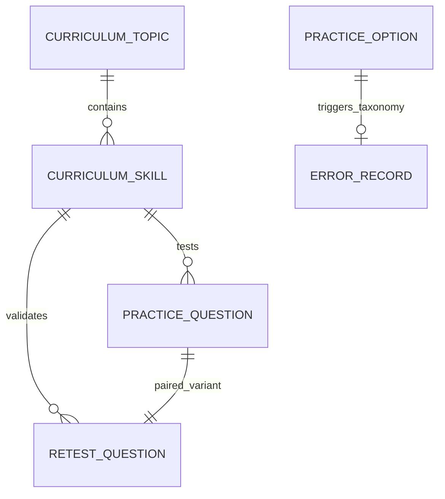
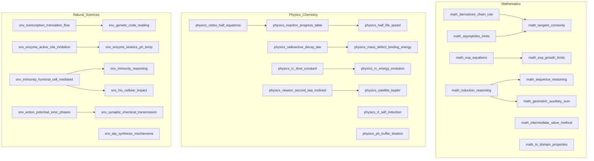

# BAC Mastery — Learning Content Model Specification
## Prompt 07: Expanded Curriculum Learning Map (Sciences Expérimentales 3AS)

---

## 1. Architectural Mission & Educational Scope

BAC Mastery is a digital learning system designed for Algerian high school students preparing for the Baccalauréat examination.
Its core mission:

> **"ماشي واش تقرا. كيفاش توصل."**
> From current level → target → roadmap → execution → mastery → exam readiness.

In Prompt 07, the product evolves from the initial 9-skill pilot into a structured, curriculum-aligned **Learning Map** for **BAC Sciences Expérimentales (3AS)**:
- **14 Curriculum Topics** across Mathematics (4), Physics-Chemistry (5), and Natural Sciences (5).
- **31 High-Value Targeted Skills** (~10–11 per core subject) with directional prerequisite graphs, difficulty ratings, and cognitive dimensions.
- **44 Original Practice & Unseen Retest Questions** (22 practice + 22 twin retest variants) mapped to the Error Lab taxonomy.
- **Authoritative Decision Authority**: The Adaptive Roadmap Engine (from Prompt 06) remains the sole, unmodified decision engine controlling progression.

---

## 2. Domain Data Architecture

### 2.1 Curriculum Topic (`CurriculumTopic`)
Represents an official pedagogical unit or chapter in the Algerian 3AS curriculum:
- `id`: Unique identifier (e.g., `math_topic_functions`, `physics_topic_nuclear`).
- `educationLevel`: Fixed to `"secondary"`.
- `examType`: Fixed to `"BAC"`.
- `streamId`: Fixed to `"sciences_exp"`.
- `subjectId`: Subject identifier (`"math" | "physics" | "natural_sciences"`).
- `title_ar` / `title_fr`: Bilingual chapter title.
- `description_ar` / `description_fr`: Pedagogical scope.
- `order`: Official curriculum sequence order.
- `isActive`: Boolean flag for availability.

### 2.2 Targeted Learning Skill (`CurriculumSkill`)
Represents an actionable, assessable student capability within a curriculum topic:
- `id`: Semantic identifier (e.g., `math_derivatives_chain_rule`, `physics_rc_time_constant`).
- `topicId`: Parent curriculum topic reference.
- `subjectId`: Core subject.
- `streamId`: `"sciences_exp"`.
- `title_ar` / `title_fr`: Bilingual skill title.
- `description_ar` / `description_fr`: Targeted operational objective.
- `prerequisites`: Directional list of prerequisite skill IDs (`string[]`).
- `cognitiveDimensions`: Core dimensions assessed (`knowledge`, `understanding`, `application`, `methodology`, `speed`, `confidence`).
- `difficulty`: Integer scale `1 | 2 | 3`.
- `order`: Topic-internal pedagogical ordering.
- `repairStrategy_ar` / `repairStrategy_fr`: Pedagogical explanation of the repair method.
- `repairSteps_ar` / `repairSteps_fr`: Step-by-step actionable remediation guide.

---

## 3. Curriculum Topics Catalog (14 Topics)

### 3.1 Mathematics (4 Topics)
1. `math_topic_functions`: دراسة الدوال العددية والاشتقاقية وتطبيقاتها (Functions & Derivatives)
2. `math_topic_exp_ln`: الدوال الأسية واللوغاريتمية النيبيرية (Exponential & Logarithmic Functions)
3. `math_topic_sequences`: المتتاليات العددية والبرهان بالتراجع (Numerical Sequences & Induction)
4. `math_topic_probability`: الاحتمالات والمتغيرات العشوائية (Probability & Random Variables)

### 3.2 Physics-Chemistry (5 Topics)
1. `physics_topic_kinetics`: المتابعة الزمنية لتحول كيميائي وسرعة التفاعل (Chemical Kinetics)
2. `physics_topic_nuclear`: التحولات النووية، النشاط الإشعاعي والانشطار (Nuclear Transformations)
3. `physics_topic_rc_rl`: الظواهر الكهربائية، ثنائي القطب RC و RL (RC & RL Electric Circuits)
4. `physics_topic_mechanics`: تطور جملة ميكانيكية، قوانين نيوتن وحركة الكواكب (Mechanics & Newton's Laws)
5. `physics_topic_acid_base`: مراقبة تطور جملة كيميائية، الأحماض والأسس (Acid-Base Equilibria)

### 3.3 Natural Sciences / SVT (5 Topics)
1. `snv_topic_protein_synthesis`: آليات تركيب البروتين: الاستنساخ والترجمة (Protein Synthesis)
2. `snv_topic_enzymes`: النشاط الإنزيمي وعلاقته بالبنية الفراغية (Enzyme Catalysis & Structure)
3. `snv_topic_immunity`: دور البروتينات في الدفاع عن الذات (Immunology & Defense)
4. `snv_topic_neuro`: دور البروتينات في الاتصال العصبي (Neurophysiology & Synaptic Transmission)
5. `snv_topic_cellular_energy`: التحولات الطاقوية: التركيب الضوئي والتنفس الخلوي (Cellular Energetics)

---

## 4. Skills Catalog & Directed Acyclic Graph (DAG)

The prerequisite graph is strictly structured as a **Directed Acyclic Graph (DAG)** with zero circular dependencies:

---

## 5. Question Bank Architecture (44 Questions)

Each of the newly supported skills is accompanied by two questions:
1. **Initial Practice Question (`pq-*`)**: Diagnostic-style practice item with 3–4 plausible distractors tied to specific learning traps.
2. **Paired Unseen Retest Variant (`rq-*`)**: Conceptually equivalent item verifying transfer without memorization:
   - `practiceId !== retestId`
   - Distinct prompts (e.g., different mathematical functions, chemical reaction substrates, electrical circuit parameters).
   - Same underlying competence and cognitive dimension.

### Distractor Error Taxonomy Mapping
All distractors link to the Error Lab taxonomy:
- `forgot_information`
- `misunderstood_concept`
- `methodology_error`
- `calculation_error`
- `misread_question`
- `rushed`
- `lack_of_practice`
- `time_management`
- `attention_error`
- `unknown`

---

## 6. Student Skill Evidence Lifecycle

Skills evolve through distinct evidence states based strictly on performance:

| State | Definition | Trigger |
|---|---|---|
| `not_assessed` | Mapped in curriculum, supported by engine, but not yet attempted | Initial default |
| `emerging` | Practice question answered correctly with positive confidence | Initial pass |
| `needs_work` | Retest failed twice; scheduled for spaced delay before re-entry | Retest failure |
| `demonstrated` | Error remediated and twin retest successfully passed | Retest pass |

---

## 7. Non-Overclaiming Commitments

1. **No Predictive Scoring**: Zero occurrences of `predictedBACScore`.
2. **No "Official Coefficient" Overclaiming**: Stream coefficients are framed as planning weights or curriculum priority signals.
3. **Transparent Evidence Scope**: Roadmap confidence remains explicitly labeled `"pilot"`.
4. **Honest Disclosure**: Unassessed subjects and unassessed skills are clearly presented as `not_assessed` rather than presumed weak or zero.
