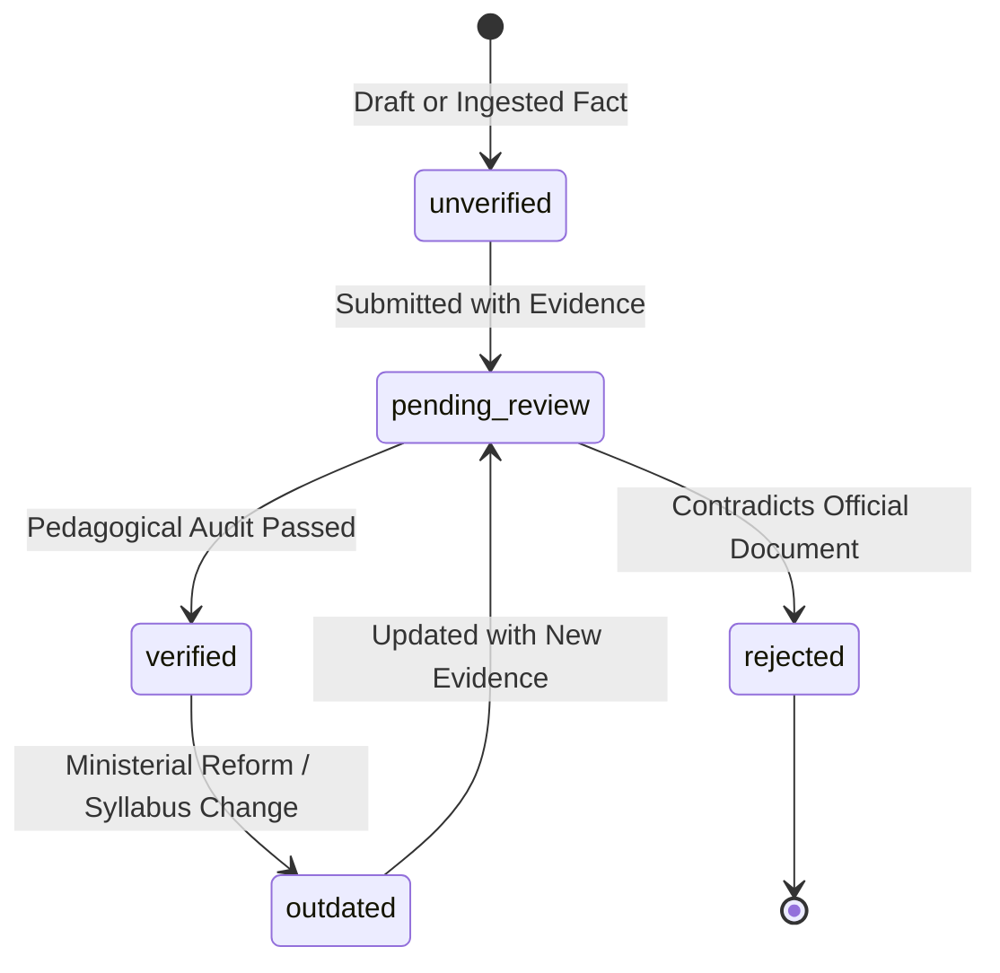

# BAC Mastery — Content Provenance & Verification Specification
## Prompt 11: Epistemological Integrity, Verification Lifecycle, and Fact Provenance

---

## 1. Principles of Educational Epistemology

In educational systems preparing students for high-stakes national examinations, **factual integrity is paramount**. Misrepresenting official examination rules, inventing subject coefficients, or presenting unofficial exercises as official exams undermines student trust and harms learning outcomes.

The BAC Mastery Content Provenance framework enforces three golden rules:
1. **Provenance for Every Fact**: Every curriculum fact, coefficient, and pedagogical unit must explicitly declare its authoritative source.
2. **Explicit Uncertainty**: Any fact that has not been confirmed against an official ministerial document is explicitly flagged as `unverified`. It is never assumed or fabricated.
3. **Audit Trail**: Every verification action is documented with an immutable `VerificationRecord` identifying the auditor, timestamp, and evidentiary decree.

---

## 2. Verification Status Taxonomy

Every content entity and curriculum fact in BAC Mastery exists in one of five lifecycle states:



### 2.1 State Definitions

| Status | Code | Operational Meaning | System Visibility |
| :--- | :--- | :--- | :--- |
| **Unverified** | `unverified` | Ingested fact, initial draft question, or provisional topic without direct ministerial document verification. | Internal only; blocked from claims of official curriculum status. |
| **Pending Review** | `pending_review` | Submitted to the Pedagogical Review Board with referenced source documentation. | Reviewer queue only. |
| **Verified** | `verified` | Rigorously cross-referenced against official decree, ministerial circular, or authenticated syllabus. | Production active; eligible for student-facing curricular display. |
| **Outdated** | `outdated` | Formerly verified, but superseded by an official ministerial reform or curriculum change. | Archived; flagged for curriculum refresh. |
| **Rejected** | `rejected` | Fails scientific or pedagogical review, contains factual error, or contradicts official BAC standards. | Suppressed permanently from runtime. |

---

## 3. Source Category Taxonomy

Sources are classified into strictly typed categories:

| Category | Type Key | Description & Evidentiary Standard |
| :--- | :--- | :--- |
| **Ministry** | `ministry` | Official decrees (*Arrêtés*), circulars (*Circulaires*), and executive orders published by the Ministry of National Education (MEN, Algeria). |
| **Official Curriculum** | `official_curriculum` | Official secondary syllabus publications (*Programmes et documents d'accompagnement 3AS*). |
| **Official Exam** | `official_exam` | Official examination archives published by the National Examinations Board (*Office National des Examens et Concours - ONEC*). |
| **Official Document** | `official_document` | Pedagogical progression circulars and annual inspection distribution tables. |
| **School Reference** | `school_reference` | Official national textbooks published by the *Centre National des Publications Scolaires (CNPS)*. |
| **Trusted Educational Source** | `trusted_educational_source` | Academic pedagogical bodies, verified university science faculties, or accredited subject associations. |
| **Original BAC Mastery** | `original_bac_mastery` | In-house authored diagnostic questions, unseen twin retests, distractor error taxonomy mappings, and step-by-step repair guides. |
| **Past BAC Exam Reference** | `past_bac_exam` | Metadata-only citation of an official BAC examination problem. |
| **Other** | `other` | Secondary validated sources with documented academic utility. |

---

## 4. Official Curriculum Facts & Coefficient Governance

### 4.1 Strict Coefficient Provenance
Subject coefficients in the Algerian Baccalauréat carry decisive weight in overall scoring. In BAC Mastery, subject coefficients are modeled via the `CoefficientProvenance` structure:

```typescript
export interface CoefficientProvenance {
  value: number;
  status: VerificationStatus;
  officialDocumentRef?: string;
  verifiedAt?: string;
  notes?: string;
}
```

#### Official Sciences Expérimentales (3AS) Coefficients
| Subject | Verified Coefficient | Official Document Reference | Audit State |
| :--- | :---: | :--- | :---: |
| **Mathématiques** | **7** | *Arrêté ministériel n° 54 du 28 juillet 2007 (Annexe Sciences Expérimentales)* | `verified` |
| **Physique-Chimie** | **6** | *Arrêté ministériel n° 54 du 28 juillet 2007 (Annexe Sciences Expérimentales)* | `verified` |
| **Sciences de la Nature et de la Vie** | **6** | *Arrêté ministériel n° 54 du 28 juillet 2007 (Annexe Sciences Expérimentales)* | `verified` |

### 4.2 Absolute Non-Overclaiming Policy
The codebase and content model are subject to automated verification preventing deceptive claims:
- **Prohibited**: Fabricating ministerial coefficients or pass mark thresholds.
- **Prohibited**: Claiming "predicted BAC scores" or "garantie de réussite".
- **Enforced**: `scripts/test-content-architecture.mjs` and `scripts/test-content-model.mjs` scan all content datasets to ensure zero prohibited overclaiming phrases exist.

---

## 5. Audit Trail & Verification Records

Whenever an entity transitions to `verified`, a formal `VerificationRecord` is generated:

```json
{
  "id": "ver-coef-math-sciences-exp",
  "entityType": "subject",
  "entityId": "math",
  "status": "verified",
  "verifiedBy": "Direction des Examens (Audit Interne)",
  "verifiedAt": "2024-09-01T10:00:00Z",
  "evidenceDocument": "Arrêté n° 54 / MEN / 2007",
  "notes": "Coefficient 7 authoritatively confirmed for Sciences Expérimentales."
}
```

This ensures full accountability and verifiable educational provenance across every level of the system.
