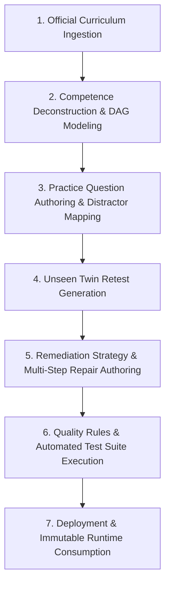

# BAC Mastery — Content Authoring & Verification Workflow
## Prompt 11: End-to-End Pedagogical Lifecycle and Quality Gates

---

## 1. Overview of the Content Lifecycle

Every learning unit, question, and remediation guide in BAC Mastery traverses a rigorous 7-stage quality lifecycle before reaching students:

---

## 2. The 7 Pedagogical Stages

### Stage 1: Official Curriculum Ingestion & Verification
- **Input**: Official ministerial syllabus documents (*Programmes officiels 3AS*) and coefficient decrees (*Arrêté n° 54*).
- **Process**:
  - Extract chapters, modules, and national exam weighting.
  - Verify official coefficients against ministerial publications.
  - Record evidentiary document reference and timestamp in `VerificationRecord`.
  - Tag entity with `sourceType = "official_curriculum"` and `verificationStatus = "verified"`.

### Stage 2: Competence Deconstruction & DAG Modeling
- **Input**: Curriculum chapter definitions.
- **Process**:
  - Deconstruct macro topics into targeted, assessable operational skills.
  - Formulate directional prerequisites ensuring a strict **Directed Acyclic Graph (DAG)**.
  - Map each skill to cognitive dimensions (`knowledge`, `understanding`, `application`, `methodology`, `speed`, `confidence`).
  - Assign difficulty rating: 1 (Foundational), 2 (BAC Standard), or 3 (Advanced BAC).

### Stage 3: Practice Question Authoring & Distractor Mapping
- **Input**: Skill definition and target learning objectives.
- **Process**:
  - Author a rich, authentic problem statement in both Arabic and French.
  - Formulate 3 to 4 distinct options with exactly **one mathematically/scientifically correct answer**.
  - **Error Lab Distractor Alignment**: Every incorrect option (distractor) must be intentionally engineered to diagnose a specific student misconception from the Error Lab taxonomy:
    - `forgot_information` (نسيان معلومة أو قانون)
    - `misunderstood_concept` (سوء فهم المفهوم العلمي)
    - `methodology_error` (خطأ منهجي في خطوات الحل)
    - `calculation_error` (خطأ حسابي أو إشارة)
    - `misread_question` (سوء قراءة معطيات السؤال)
  - Write comprehensive, step-by-step bilingual explanations.

### Stage 4: Unseen Twin Retest Generation
- **Input**: Approved practice question.
- **Objective**: Ensure authentic mastery validation without memorization bias.
- **Rules for Retests**:
  - Must evaluate the **exact same skill** (`retest.skillId === practice.skillId`).
  - Must evaluate the **exact same subject** (`retest.subjectId === practice.subjectId`).
  - Must share the **same difficulty level**.
  - **Strictly Distinct Problem**: Distinct numerical parameters, altered scenario/context, and distinct prompt formulation (`retest.id !== practice.id` and `prompt_ar.trim() !== parent.prompt_ar.trim()`).
  - Link directly to `retestForQuestionId`.

### Stage 5: Remediation Strategy & Multi-Step Repair Authoring
- **Input**: Skill entity and common error patterns.
- **Process**:
  - Formulate a clear, actionable pedagogical repair strategy (`repairStrategy_ar`, `repairStrategy_fr`).
  - Provide a minimum of 3 progressive, actionable remediation steps (`repairSteps_ar`, `repairSteps_fr`) walking the student through error recognition, formula adjustment, and verification.

### Stage 6: Quality Rules & Automated Test Suite Execution
- **Input**: Candidate content dataset.
- **Verification Gates**:
  - The dataset must execute against the 12 Content Quality Rules in `src/domain/content/validation.ts`.
  - The comprehensive test suite `scripts/test-content-architecture.mjs` must achieve **100% PASS** across all 16 suites (A through P).
  - TypeScript compilation (`node node_modules/typescript/bin/tsc --noEmit`) must exit with 0 errors.

### Stage 7: Deployment & Immutable Runtime Consumption
- **Execution**:
  - Content datasets are loaded into the domain memory layer (`src/domain/content/mappings.ts`).
  - Zero database writes occur on the content tables during this architecture-first phase.
  - Diagnostic, Mission, and Mastery engines query content via read-only helper functions (`getSkillById`, `getPracticeQuestionsForSkill`, `getRetestQuestionForSkill`).
