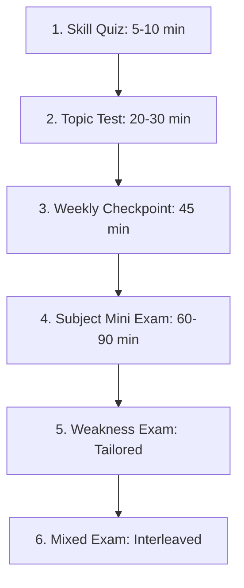

# BAC Mastery — Exam Strategy, Past BAC Mapping & Readiness Analytics
## The Strategic Guide to Algerian Baccalauréat Assessment

---

## 1. The Strategy: Deconstructing the BAC Exam

Many students approach the BAC examination as an unpredictable lottery. In reality, the Algerian Baccalauréat is an **exceptionally structured, pattern-based criterion assessment**:
- Mathematics exercises consistently evaluate standard sub-goals (limits/asymptotes → derivatives/sign → tangent/inflection → curve sketch → auxiliary sequence/integrals).
- Physics-Chemistry consistently evaluates physical modeling (identifying system & forces → Newton's 2nd law / differential equation → solution verification → graphical exploitation of $\tau$ or $t_{1/2}$).
- Natural Sciences consistently evaluates scientific reasoning (document analysis → comparison/deduction → structured synthesis).

The goal of BAC Mastery is **not to archive old PDF exams**, but to teach students:
1. **What BAC questions are actually testing**.
2. **How examiners allocate marks in the official marking guide (*Barème officiel*)**.
3. **How to manage the 3.5 to 4.5 hours of exam time with tactical discipline**.

---

## 2. Past BAC Exam Metadata Library

BAC Mastery maintains metadata-only index citations of official national BAC examinations, paired with original pedagogical guidance and twin training variants:

### Mathématiques (Sciences Expérimentales)
* **BAC Reference**: `bac_ref_2023_math_s1_ex2`
  * **Year / Session**: 2023 / Session Principale (Juin 2023)
  * **Subject / Stream**: Mathématiques / Sciences Expérimentales
  * **Exercise Position**: Exercice 2 (Étude de fonction exponentielle - 7 Points)
  * **Official Source**: Office National des Examens et Concours (ONEC)
  * **Targeted Skills**: `math_derivatives_chain_rule`, `math_asymptotes_limits`, `math_tangent_convexity`
  * **Difficulty**: 2 (Standard BAC)
  * **BAC Mastery Analytical Insight**:
    > "التمرين ركز على دالة مركبة من الشكل $f(x) = (ax+b)e^{-x} + c$. الفخ المنهجي الرئيسي الذي أوقع 60% من الممتحنين هو نسيان الإشارة السالبة لمشتقة الدالة الداخلية عند اشتقاق $e^{-x}$، مما أدى إلى جدول تغيرات خاطئ تماماً أفسد رسم المنحنى اللاحق."
  * **Guidance Strategy**:
    > "ضع إشارة المشتق الداخلي $-1$ بين قوسين في مسودة جانبية قبل كتابة سطر المشتقة على ورقة الإجابة."

* **BAC Reference**: `bac_ref_2022_math_s2_ex3`
  * **Year / Session**: 2022 / Session Principale (Sujet 2)
  * **Subject / Stream**: Mathématiques / Sciences Expérimentales
  * **Exercise Position**: Exercice 3 (Suites numériques et récurrence - 4.5 Points)
  * **Targeted Skills**: `math_induction_reasoning`, `math_sequence_reasoning`, `math_arithmetic_geometric_auxiliary`
  * **Difficulty**: 2 (Standard BAC)
  * **BAC Mastery Analytical Insight**:
    > "اختبر التمرين البرهان بالتراجع لحصر المتتالية $0 < u_n < 2$، ثم دراسة إشارة الفرق $u_{n+1} - u_n$. ركز التصحيح النموذجي على صياغة المراحل الثلاث للبرهان بالتراجع وتأطير الفرضية."

---

### Physique-Chimie (Sciences Expérimentales)
* **BAC Reference**: `bac_ref_2022_phys_s1_ex1`
  * **Year / Session**: 2022 / Session Principale (Sujet 1)
  * **Subject / Stream**: Physique-Chimie / Sciences Expérimentales
  * **Exercise Position**: Exercice 1 (Électricité : Dipôle RC - 6 Points)
  * **Targeted Skills**: `physics_rc_time_constant`, `physics_rc_differential_equation`
  * **Difficulty**: 2 (Standard BAC)
  * **BAC Mastery Analytical Insight**:
    > "المسألة تطلبت إثبات المعادلة التفاضلية بدلالة توتر المكثفة $u_C(t)$ ثم استغلال المنحنى البياني للمماس عند $t=0$ لإيجاد $\tau$. ضياع النقاط حدث في مرحلة استنتاج سعة المكثفة $C$ بسبب عدم تحويل المقاومة من الكيلو أوم إلى الأوم ($1 \text{ k}\Omega = 10^3\ \Omega$)."

* **BAC Reference**: `bac_ref_2023_phys_s2_ex2`
  * **Year / Session**: 2023 / Session Principale (Sujet 2)
  * **Subject / Stream**: Physique-Chimie / Sciences Expérimentales
  * **Exercise Position**: Exercice 2 (Nucléaire : Datation et Décroissance - 6 Points)
  * **Targeted Skills**: `physics_nuclear_decay_law`, `physics_mass_defect_binding_energy`
  * **Difficulty**: 2 (Standard BAC)
  * **BAC Mastery Analytical Insight**:
    > "تطبيق قانون التناقص الإشعاعي لحساب عمر عينة خشبية قديمة. الخطأ الشائع كان في تحويل زمن نصف العمر من السنوات إلى الثواني، أو الخلط بين النشاط الإشعاعي $A(t)$ وعدد الأنوية $N(t)$."

---

### Sciences de la Nature et de la Vie (Sciences Expérimentales)
* **BAC Reference**: `bac_ref_2023_snv_s1_ex2`
  * **Year / Session**: 2023 / Session Principale (Sujet 1)
  * **Subject / Stream**: Sciences de la Nature et de la Vie / Sciences Expérimentales
  * **Exercise Position**: Exercice 2 (Synthèse des protéines & Toxine alpha-amanitine - 7 Points)
  * **Targeted Skills**: `snv_protein_synthesis`, `snv_scientific_analysis_method`
  * **Difficulty**: 3 (BAC High-Yield Reasoning)
  * **BAC Mastery Analytical Insight**:
    > "التمرين من النمط الثاني (استدلال علمي). الخطأ القاتل الذي يقع فيه أغلب التلاميذ هو 'الوصف السطحي للوثيقة' بدلاً من 'التحليل مع إبراز الدلالة والخروج باستنتاج'. سلم التنقيط يمنح 0.25 على قراءة المعطيات و0.75 على الاستنتاج الذي يربط بين تثبيط ARN بوليميراز وتوقف اصطناع ARNm."

---

## 3. Mini Exam Hierarchy

BAC Mastery assesses student progression through 6 calibrated evaluation vehicles:



1. **Skill Quiz (اختبار المهارة المصغر)**: 3–5 questions directly testing a single skill immediately following lesson study.
2. **Topic Test (اختبار المحور)**: 8–12 questions covering an entire chapter (e.g. all 4 skills of *الدوال العددية*).
3. **Weekly Checkpoint (المحطة الأسبوعية)**: Interleaved diagnostic mixing core skills from across the current and previous weeks.
4. **Subject Mini Exam (الامتحان المصغر للمادة)**: Half-length BAC format (e.g. 1 major function study + 1 sequence exercise, 90 minutes).
5. **Weakness Exam (امتحان استهداف الثغرات)**: Dynamically generated exclusively from the student's logged unresolved errors in Error Lab.
6. **Mixed Exam (الامتحان التراكمي المدمج)**: Interleaving mastered, emerging, and borderline skills under timed pressure.

---

## 4. Multi-Dimensional Exam Analytics

BAC Mastery rejects single-number grading (e.g. *"13/20"*), which provides zero diagnostic utility. Every assessment delivers a **Multi-Dimensional Readiness Forensic Report**:

```
+-------------------------------------------------------------------------+
|                  BAC MASTERY READINESS FORENSIC REPORT                  |
+-------------------------------------------------------------------------+
| Overall Score: 14.5 / 20.0 (72.5%)                                      |
| Readiness Signal: ADVANCING (مستوى متقدم - ثغرات منهجية محددة)           |
+-------------------------------------------------------------------------+
| COGNITIVE DIMENSIONS BREAKDOWN:                                         |
|  * Knowledge (المعارف والقوانين)       : 92% [EXCELLENT]                 |
|  * Understanding (الفهم المفاهيمي)     : 85% [STRONG]                    |
|  * Application (التطبيق الحسابي)        : 74% [SATISFACTORY]              |
|  * Methodology (المنهجية وتبرير الخطوات) : 52% [NEEDS REPAIR - BOTTLENECK] |
|  * Speed & Time Management (السرعة)     : 68% [SLOWER THAN BENCHMARK]     |
|  * Confidence Calibration (معايرة الثقة) : 80% [ACCURATELY CALIBRATED]     |
+-------------------------------------------------------------------------+
| ERROR TAXONOMY PROFILE:                                                 |
|  * 2x Calculation Errors (خطأ حسابي في توحيد المقامات)                   |
|  * 2x Methodology Errors (عدم تبرير شرط الاستمرار في مبرهنة القيم)       |
|  * 1x Sign Error (نسيان الإشارة السالبة لمشتقة الأس)                     |
+-------------------------------------------------------------------------+
| TACTICAL TIME ANALYSIS:                                                 |
|  * Target Solving Time : 45 minutes                                     |
|  * Actual Solving Time : 54 minutes (+9m delay on derivatives step)     |
+-------------------------------------------------------------------------+
| PRESCRIPTIVE NEXT BEST ACTION (المهمة التصحيحية القادمة):               |
|  -> Mission: "إصلاح منهجية التبرير الصارم لمبرهنة القيم المتوسطة"        |
|  -> Repair Guide: 10-minute micro-drill on TVI justification steps      |
+-------------------------------------------------------------------------+
```
