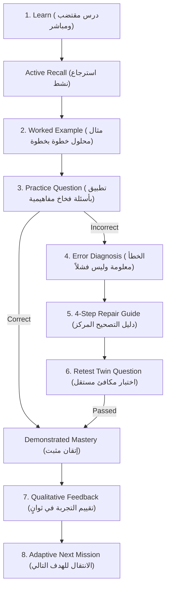

# BAC Mastery — Pilot 1.0 Execution & Validation Plan
**Target Audience**: 5–10 Real Algerian BAC 3AS Students (*Filière Sciences Expérimentales*)  
**Status**: PILOT READY / VERIFIED  
**Phase**: Prompt 17 Production & Student Experience Gate  
**Version**: 1.0.0  

---

## 1. Executive Summary & Pilot Philosophy

BAC Mastery is an adaptive, pedagogically grounded mastery engine specifically built for Algerian secondary school students preparing for the Baccalauréat examination.

### The Product Philosophy
> **"من مستواك الحالي إلى هدفك"**  
> *"De votre niveau actuel à votre objectif"*  
> **"ماشي واش تقرا. كيفاش توصل."**  
> *"Ce n'est pas seulement ce que vous apprenez, mais comment y parvenir avec certitude."*

The purpose of Pilot 1.0 is **not** to conduct a broad public launch, add speculative features, or expand across unverified streams.  
The sole mission is to place the verified, independently audited 31-skill *Sciences Expérimentales* curriculum into the hands of **5 to 10 real Algerian students** and ensure they achieve independent, closed-loop mastery without developer assistance, cognitive frustration, or technical friction.

---

## 2. Target Student Profile & Selection

| Dimension | Target Profile | Rationale |
| :--- | :--- | :--- |
| **Stream (الشعبة)** | Sciences Expérimentales (علوم تجريبية) | 31 canonical skills fully audited across Math, Physics, SNV with 100% pedagogical asset bundles. |
| **Target Score (معدل البكالوريا)** | 14.00/20 to 18.00/20 | Students striving for competitive higher education branches (Médecine, ENS, ESI, Pharmacie, Architecture). |
| **Academic Stance** | High intention, moderate or fragile execution | Students who report "نفهم في القسم بصح نحصل في التمارين" (understand theory but struggle on exam-level problems). |
| **Device Form Factor** | Smartphone (390×844 viewport, Chrome/Safari) | Mobile-first primary usage pattern among Algerian high schoolers. |
| **Connectivity** | 4G (Mobilis, Djezzy, Ooredoo) / Home ADSL | Must perform with zero degradation on slow or intermittent mobile networks. |

---

## 3. The 30-Second Student Onboarding Protocol

First impressions dictate adoption. A pilot student must reach their first concrete academic action within **30 seconds** of opening BAC Mastery.

```
Landing Page (/)
   │
   ▼ [Dynamic CTA: "ابني خريطتي"]
10-Step Visual Onboarding (/onboarding)
   │  ├ Stream: Sciences Expérimentales
   │  ├ Target: 16.00/20 (e.g., ENS / ESI / Médecine)
   │  └ Core obstacle: "نفهم الفكرة بصح نغلط في التطبيق"
   ▼
Dynamic Calibration Landing / Direct Entry
   │
   ▼ [Dynamic CTA: "شوف خريطتي" / "ابدأ التشخيص"]
Diagnostic Checkup (/diagnostic) (Optional 5 questions)
   │
   ▼
Dashboard "NOW" Action Hierarchy (/dashboard)
   │
   ▼ [Single Primary Focus: "مهمتك لليوم"]
First Mission (/mission/math_exponential_properties_equations)
```

---

## 4. Critical Language & Cultural Architecture

### Separation of Educational Content and UI Language
In accordance with official Algerian pedagogical standards:
1. **Scientific School Subjects (Math, Physics-Chemistry, Natural Sciences - SNV)**:
   - Always taught and explained in **Algerian Arabic** with authentic, respectful high-school terminology.
   - Container layout is strictly **Right-to-Left (`dir="rtl"`)**.
   - Mathematical expressions, formulas, and symbols are rendered in **Latin algebraic notation** ($x, e^x, \ln x, f'(x)$) with isolated directional contexts to prevent operator inversion.
2. **Language Subjects (Français, English, Espagnol)**:
   - Content language strictly matches the studied language (French in `fr`, English in `en`).
3. **UI Interface Chrome**:
   - Toggable between Arabic (`ar`) and French (`fr`).
   - Switching UI to French translates navigation bars, buttons, and headers, but **never corrupts or machine-translates the scientific Arabic lesson content**.

---

## 5. The 8-Step Closed-Loop Mission Architecture

Every mission guides the student through an evidence-based learning sequence:



### Pedagogical Safeguards
- **Active Recall (`DEF-002` Resolved)**: Students must formulate answers mentally before revealing solutions.
- **Independent Retest (`DEF-001` Resolved)**: Retests utilize structurally isomorphic twin equations (e.g., $2e^{2x} - 5e^x - 3 = 0$), guaranteeing that retest success reflects genuine conceptual mastery rather than rote memorization of the worked example.
- **Non-Punitive Feedback**: Errors trigger informative guidance: `"الخطأ معلومة وليس فشلاً"` (An error is diagnostic data, not a failure).

---

## 6. Lightweight Pilot Feedback Framework

To capture authentic student impressions without survey fatigue, BAC Mastery embeds a **low-friction feedback widget** directly into the post-mission summary:

### Sentiment Options (1-Tap)
- **سهلة** (*Facile / Intuitive*)
- **عادية** (*Normale / Conforme*)
- **صعبة** (*Difficile / Nécessite plus d'étapes*)
- **ما فهمتش واش ندير** (*Confuse / Friction d'utilisation*)

### Optional Qualitative Note
- `"واش اللي ما عجبكش؟ / ملاحظة سريعة لتحسين التجربة"`
- Submissions are stored locally in `localStorage.bac_mastery_pilot_feedback` and automatically linked to telemetry events.

---

## 7. Essential Analytics & Privacy Safeguards

Telemetry is engineered strictly for pilot understanding and optimization while maintaining complete student privacy:

### Monitored Signals
1. **Drop-off Points**: Where do students hesitate or exit?
2. **Time to First Mission**: How many minutes from landing to opening the first lesson?
3. **Repair Rate**: What percentage of students who err complete the 4-step repair and pass the retest?
4. **Day-2 Return**: Does the student return to resume their adaptive roadmap?

### Privacy Guarantees
- **Zero PII**: No national identification numbers, phone numbers, or private chat logs collected.
- **Automatic Token & Secret Scrubbing**: All JWTs, session tokens, and passwords are sanitized before persistence.
- **Offline & Guest Resilient**: Functions locally in guest mode via browser storage without mandatory account registration.

---

## 8. Pilot Success Metrics & Exit Gates

The pilot is judged successful when:

| Metric | Target | Verification Method |
| :--- | :--- | :--- |
| **First Action Latency** | < 45 seconds | Analytics timestamp delta (`landing_view` -> `onboarding_started`) |
| **Mission Completion Rate** | $\ge 80\%$ | Ratio of `mastery_demonstrated` to `first_mission_started` |
| **Retest Twin Independence** | 100% | Verified by adversarial suite (`test-content-independent-truth-audit.mjs`) |
| **Mobile Layout Integrity** | 0 overflows | Real Chrome CDP mobile audit (390×844) |
| **Console Runtime Health** | 0 uncaught errors | Chrome CDP error listener & production monitoring service |
| **Student Satisfaction** | $\ge 75\%$ positive/neutral | Feedback aggregate (`سهلة` + `عادية` $\ge 75\%$) |

---

*Authored by BAC Mastery Senior Product & Engineering Team — Prompt 17 Pilot Readiness Gate.*
