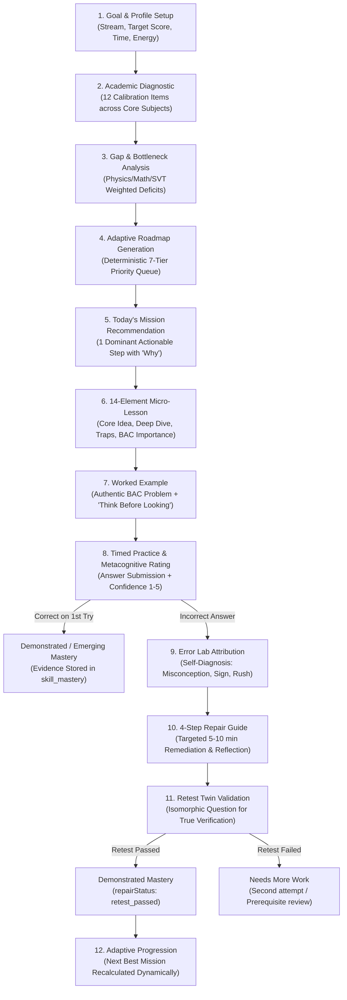

# BAC Mastery — Product Engine Specification
## From Verified Content Engine to Real Student Product Loop

**Version:** 1.0.0 (Production-Grade Pilot)  
**Curriculum Stream:** Sciences Expérimentales (3ème Année Secondaire — BAC Algérie)  
**Baseline Date:** September 2026  
**Status:** Implemented, Verified, Zero Regressions

---

## 1. Product Mission & Value Proposition

BAC Mastery is not a static video library, an unstructured PDF archive, or a gamified novelty with badges, XP, and fake levels.

Its foundational promise to the Algerian BAC student is:
> **"ماشي واش تقرا. كيفاش توصل."**  
> *"De votre niveau réel actuel jusqu'à la mention ciblée au Baccalauréat — sans dispersion, sans épuisement, avec une certitude mathématique et scientifique."*

The platform transforms 31 canonical, verified Sciences Expérimentales skills into a continuous, deterministic learning loop:
`Strategic Profile → Diagnostic Calibration → Adaptive Roadmap → Today's Mission → 14-Element Micro-Lesson → Worked Example ("Think Before Looking") → Active Practice → Error Lab Diagnosis → Targeted Repair Guide → Retest Twin → Demonstrated Mastery → Adaptive Next Mission`.

---

## 2. The Core 12-Step Student Lifecycle

---

## 3. Screen Specifications & Route Hierarchy

### 3.1 `/dashboard` — Authenticated Student Home
- **Context Header:** Displays student stream (*Sciences Expérimentales*), BAC Target Score (*e.g., 16.50/20*), weekly target (*5 demonstrated skills*), and daily energy status (*High ⚡ / Balanced 🌿 / Low 🌙*).
- **Today's Mission Card:** The dominant single action on the screen. Displays skill title (Arabic & French), subject badge, estimated completion time (15 min), and an authoritative rationale badge (*e.g., نقطة اختناق من التشخيص*).
- **"Why This Mission?" Callout:** One clear, evidence-based sentence explaining why this exact skill was scheduled right now based on student performance data.
- **Road Visualizer:** Displays student position across the 4 stages:
  1. *الأساس (Foundation)* — Diagnostic & Goal Calibration
  2. *التثبيت (Consolidation)* — Active practice and error remediation
  3. *التمكن (Mastery)* — Demonstrated skills threshold
  4. *جاهزية البكالوريا (BAC Exam-Ready)* — Full annales & timed simulation
- **Verified Progress Card:** Displays exact demonstrated skills count (out of 31), emerging skills, completed missions, and active repair backlog. **Zero vanity percentages or unearned claims.**
- **Error Lab Card:** Direct shortcut showing open repairs awaiting action.

### 3.2 `/mission/[missionId]` — The 8-Step Interactive Mission Execution
1. **Step 1: Micro-Lesson (`learn`):**
   - Target capability (*"بعد ما نكمل هذا الدرس، واش نقدر ندير وحدي؟"*).
   - Core concept in bold Algerian Arabic pedagogy.
   - Simplified deep-dive explanation.
   - Why this matters for the Algerian BAC exam.
   - Common student traps (*الأخطاء الشائعة والسبب والتصحيح*).
   - Active recall check with toggleable reveal (*اختبار التذكر السريع*).
2. **Step 2: Worked Example (`worked_example`):**
   - Authentic BAC problem formulation.
   - Interactive *"خمّم وحدك قبل ما تشوف الحل"* (Think before looking) toggle to prevent passive reading.
   - Step-by-step method with mathematical justifications.
   - Official BAC answer presentation and verification tip.
3. **Step 3: Practice (`practice`):**
   - Authentic practice question with 4 calibrated options.
   - Metacognitive confidence rating prompt (1 to 5) before submitting.
   - Live timer tracking cognitive latency.
4. **Step 4: Practice Feedback (`practice_feedback`):**
   - If correct: instant congratulation, full model explanation, and direct path to finalize mastery.
   - If incorrect: diagnostic insight explaining why the distractor was tempting and encouraging prompt to fix the root cause.
5. **Step 5: Error Lab Diagnosis (`error_diagnosis`):**
   - Student self-attribution among 6 cognitive categories:
     - *ما فهمتش الفكرة الأساسية أصلاً (Misunderstood concept)*
     - *نسيت القانون / الملاحظة الضرورية (Formula forgotten)*
     - *غلطت في الحساب أو الإشارة (Calculation/sign error)*
     - *ما قريتش المعطيات والشروط مليح (Misread question)*
     - *عرفت النتيجة بصح ما عرفتش طريقة البرهان والتحرير (Methodology/writing)*
     - *تسرعت في اختيار الإجابة بدون تدقيق (Rushed answer)*
6. **Step 6: Repair Guide (`repair`):**
   - Root-cause breakdown.
   - Precise diagnosis.
   - 4-step remediation protocol.
   - Micro-practice prompt with instant verification.
   - Personal takeaway note input field (*الملاحظة التي سأحفظها لعدم التكرار*).
7. **Step 7: Retest Twin (`retest`):**
   - Isomorphic twin question sharing the identical cognitive skill structure but different numerical values or context.
   - Confidence evaluation (1 to 5).
   - Evaluation: If passed, converts error to `retest_passed` and awards `demonstrated` mastery!
8. **Step 8: Summary & Demonstrated Evidence (`summary` — "وش ثبت اليوم؟"):**
   - Concrete audit record of the skill proven today.
   - Reference to official past BAC exam occurrences (year, session, exercise number).
   - Direct button to the Next Best Mission calculated adaptively.

### 3.3 `/roadmap` — Pure Adaptive Roadmap & Curriculum Matrix
- Renders the complete 31-skill curriculum across Mathematics (11), Physics (10), and Natural Sciences (10).
- Dynamically colors skills by evidence level: Unassessed (gray), Emerging (blue), Demonstrated (emerald), Needs Work / In Repair (amber).
- Displays the 7-tier priority queue explaining exactly which mission follows next.

### 3.4 `/progress` — Verified Academic Record
- Aggregates verified student learning evidence only:
  - Demonstrated skills count (out of 31).
  - Emerging skills count.
  - Repaired errors count.
  - Completed missions count.
  - Subject coverage bars for Math, Physics, and SVT.
- Lists all individually validated skills with their unique identifiers.

### 3.5 `/error-lab` (and `/errors`) — Error Lab & Remediation Queue
- Displays all recorded errors partitioned into:
  - *أخطاء قيد الإصلاح (Active Repairs)*
  - *جاهزة للاختبار التوأم (Retests Ready)*
  - *أخطاء متكررة (Recurring Errors)*
  - *أخطاء تم إصلاحها بنجاح (Remediated Errors)*
- Direct actions to resume repair or launch twin retests.

### 3.6 `/account` — Student Profile & Cloud Sync
- Displays student credentials and auth session status.
- Cloud synchronization trigger (`syncAllLocalStorageToCloud`) ensuring all local progress is saved to Supabase.
- Overview of academic goals, available study time, and energy preferences.
- Logout and session controls.

---

## 4. Architectural Rules & Invariants

1. **Deterministic Next Best Mission:**
   Priority 1: Active Error Repair / Retest (`continuation_repair` / `continuation_retest`).
   Priority 2: Recurring Error Cause (`recurring_error_cause`).
   Priority 3: Diagnostic Critical Bottleneck (`diagnostic_bottleneck`).
   Priority 4: Weakest Supported Subject / Dimension (`weakest_supported_dimension`).
   Priority 5: Emerging Skill Verification (`emerging_verification`).
   Priority 6: Next Sequential Subject Skill (`next_subject_skill`).
   Priority 7: Core Subject Balanced Rotation (`next_core_subject`).

2. **Content Purity:**
   No content domain entity or static asset ever contains a `user_id`, `student_id`, or runtime mutable state. Content is strictly read-only, versioned, and verified.

3. **Dual-Storage Resilience:**
   All student state functions seamlessly offline in `localStorage` when unauthenticated. When authenticated with Supabase, state is seamlessly synced to the 10 remote student foundation tables protected by strict Row Level Security (`auth.uid() = user_id`).
