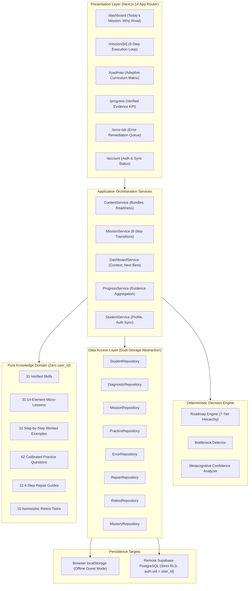

# BAC Mastery — Product Engine Architecture
## Technical & Pedagogical System Design (Prompt 14)

**Version:** 1.0.0  
**Baseline Date:** September 2026  
**Scope:** Sciences Expérimentales (Mathematics, Physics-Chemistry, Life & Natural Sciences)

---

## 1. System Architecture Overview

The BAC Mastery product architecture follows a clean, layered design that cleanly separates:
1. **Domain Content Engine:** 100% Pure, verified pedagogical knowledge model (Zero runtime mutations, zero `user_id`).
2. **Data Access & Repositories Layer:** Resilient dual-storage abstraction (`Supabase Cloud ↔ Browser LocalStorage`).
3. **Application Orchestration Services Layer:** Business logic, state transitions, mission coordination, and progress calculation.
4. **Presentation & Interaction Layer:** Next.js 14 App Router, Tailwind CSS, accessible dark-first UI components, bilingual RTL/LTR layout.

---

## 2. Layer Responsibilities & Contracts

### 2.1 Domain Content Engine (`src/domain/content/`)
- **Immutability & Purity:** Every curriculum topic, skill, lesson, worked example, practice question, repair guide, and retest variant is completely stateless. No `user_id` or runtime progress is ever written to this layer.
- **Learning Bundle Selector (`getSkillLearningBundle`):** Assembles all 14 pedagogical assets for any given skill ID in `O(1)` runtime.

### 2.2 Data Access Layer (`src/lib/repositories/`)
- **Table Alignment:** Exactly 10 student foundation tables on Supabase:
  1. `student_profiles`
  2. `diagnostic_sessions`
  3. `diagnostic_answers`
  4. `diagnostic_results`
  5. `missions`
  6. `practice_attempts`
  7. `errors`
  8. `error_repairs`
  9. `retests`
  10. `skill_mastery`
- **Graceful Fallback:** If unauthenticated or offline, all repository calls seamlessly read and write to standard `localStorage`. If authenticated, operations write to Supabase while updating local caches.

### 2.3 Application Services Layer (`src/lib/services/`)
- **`MissionService`:** Orchestrates the 8-step execution flow (`recordPracticeAttempt`, `recordError`, `startRepair`, `completeRepair`, `recordRetestOutcome`).
- **`DashboardService`:** Resolves student dashboard data, today's mission, natural-language evidence rationale, and road visualizer status.
- **`ProgressService`:** Computes verified demonstrated and emerging skills, active repair queues, and subject coverage without vanity metrics.
- **`StudentService`:** Manages student strategic profile, auth state changes, and non-destructive guest-to-authenticated session migration.

---

## 3. Decision Engine & Priority Hierarchy

The core algorithm determining "What should the student do next?" implements an authoritative 7-tier deterministic hierarchy:

| Priority | Reason Code | Logic |
|---|---|---|
| **Tier 1** | `continuation_repair` / `continuation_retest` | Unfinished learning loop! Active repair or twin retest must be completed before any new topic. |
| **Tier 2** | `recurring_error_cause` | Critical impediment! Same error repeated $\ge 2$ times across sessions. |
| **Tier 3** | `diagnostic_bottleneck` | Major cognitive gap identified during the 12-question initial diagnostic. |
| **Tier 4** | `weakest_supported_dimension` | Lowest-scoring cognitive dimension (e.g., Application vs Rigor). |
| **Tier 5** | `emerging_verification` | Skill attempted with 1 success requiring consolidation through retest or additional practice. |
| **Tier 6** | `next_subject_skill` | Next sequential skill in the curriculum syllabus according to prerequisite DAG. |
| **Tier 7** | `next_core_subject` | Balanced rotation across Mathematics, Physics, and Natural Sciences to prevent cognitive fatigue. |

---

## 4. Security & Isolation Architecture

1. **Authentication:** Supabase Auth (JWT bearer tokens).
2. **Row Level Security (RLS):** All 10 student foundation tables have active RLS enforcing `auth.uid() = user_id`.
3. **Data Protection:** Zero cross-tenant leakage. Anonymous users cannot select or insert student rows.
4. **No Third-Party AI APIs or Trackers:** Student cognitive responses, reflections, and error records are processed entirely deterministically on-device and within the secure Supabase perimeter.
