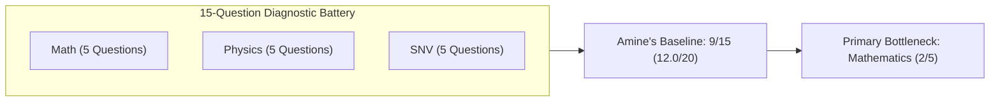

# BAC Mastery — Sciences Expérimentales Student Pilot Experience
## End-to-End Pedagogical Journey Simulation: Persona "Amine"

- **Stream**: Sciences Expérimentales (3AS)
- **Persona Name**: Amine K. (أمـيـن)
- **High School**: Lycée Colonel Lotfi, Oran
- **Target Goal**: 15.00 / 20 (Mention Bien / Très Bien)
- **Target University Stream**: Faculty of Medicine / National Polytechnic School (ENP)
- **Study Budget**: 14 hours / week
- **Pilot Date**: September 2026

---

## Phase 1: Landing, Onboarding & Goal Selection

Amine arrives at BAC Mastery. He selects **Sciences Expérimentales (علوم تجريبية)**.

1. **Target Score Selection**:
   - Amine inputs his target score: **15.00 / 20**.
   - The system displays the historical significance of 15.00 in Sciences Exp: access to prestigious national schools (Médecine, Pharmacie, Informatique ESI).
2. **Weekly Study Commitment**:
   - Amine selects **14 hours / week** (2 hours/day average).
3. **Initial Self-Assessment**:
   - Amine expresses high confidence in Natural Sciences (SNV) and Physics, but reports consistent anxiety regarding Mathematics function analysis and composite derivation.

---

## Phase 2: The 15-Question Multi-Subject Diagnostic

Amine begins the calibrated 15-question baseline assessment across the three core STEM subjects:



### Diagnostic Performance Breakdown:
- **Mathematics (Score: 2 / 5)**:
  - Question 1 (Composite Derivation): **INCORRECT**. Committed canonical misconception `CE_MATH_01` (omitted inner derivative $u'(x)$).
  - Question 2 (TVI & Uniqueness): **INCORRECT**. Omitted strict monotonicity requirement.
  - Question 3 (Asymptotes & Limits): **CORRECT**. Identified horizontal asymptote at $y = 2$.
  - Question 4 (Exponential Equations): **INCORRECT**. Algebraic factoring error on $(e^x - 1)(e^x + 3) = 0$.
  - Question 5 (Induction Reasoning): **CORRECT**. Successfully verified hereditary step.
- **Physical Sciences (Score: 3 / 5)**:
  - Correct on redox titration, RC time constant, and Newton's second law.
  - Missed half-life curve determination and nuclear binding energy conversion.
- **Natural Sciences (SNV) (Score: 4 / 5)**:
  - High proficiency in translation stages, amphoteric ionization, antibody structures, and synapse functioning.
  - Missed one detail in scientific document exploitation.

### Diagnostic Diagnostic Output:
- **Baseline Estimated BAC Score**: **12.00 / 20**
- **Score Gap to Target**: **+3.00 Points**
- **Identified Critical Bottleneck**: **Mathematics (Functions & Derivation)**

---

## Phase 3: Adaptive Roadmap Generation

The BAC Mastery Roadmap Engine ingests Amine's diagnostic profile and generates his personalized study queue:

1. **Priority 1**: `math_derivatives_chain_rule` (Mathematics — Coefficient 5)
2. **Priority 2**: `math_intermediate_value_method` (Mathematics — Coefficient 5)
3. **Priority 3**: `physics_reaction_rate_monitoring` (Physics — Coefficient 5)
4. **Priority 4**: `math_exponential_properties_equations` (Mathematics — Coefficient 5)
5. **Priority 5**: `snv_scientific_analysis_method` (SNV — Coefficient 6)

The engine recognizes that mastering composite derivation is a prerequisite for both Mathematics curve sketching and Physics RC circuit differential equations.

---

## Phase 4: Daily Mission Lifecycle — "Today's Mission"

Amine launches his first mission: **اشتقاق الدوال المركبة وقاعدة السلسلة (Composite Function Derivation & Chain Rule)**.

### Step 4.1: Micro-Lesson Review
Amine reads the concise, high-yield theory summary:
$$\left(v(u(x))\right)' = u'(x) \cdot v'(u(x))$$
Specifically for exponential functions:
$$\left(e^{u(x)}\right)' = u'(x) \cdot e^{u(x)}$$

### Step 4.2: Worked Example
Amine examines an authentic step-by-step worked example:
- Given: $f(x) = e^{3x^2 - 5x + 1}$
- Decomposition: Let $u(x) = 3x^2 - 5x + 1$, so $u'(x) = 6x - 5$.
- Result: $f'(x) = (6x - 5) e^{3x^2 - 5x + 1}$.

### Step 4.3: Practice Question & Canonical Error
Amine attempts Practice Question 1:
- **Prompt**: Calculate the derivative of $g(x) = e^{x^2 + 2x}$ on $\mathbb{R}$.
- **Amine's Answer**: $g'(x) = e^{x^2 + 2x}$.
- **Result**: **INCORRECT**.

---

## Phase 5: Error Lab & Pedagogical Repair

The system immediately intercepts the incorrect submission and opens the **Error Lab**:

1. **Misconception Diagnosis**:
   - *"You treated $e^{u(x)}$ as if it were simply $e^x$, forgetting to multiply by the derivative of the exponent $u'(x)$."*
2. **Cognitive Reframing**:
   - The system displays the rule: *"Every composite derivative requires the internal factor $u'(x)$. Without it, your slope at $x = 1$ would be evaluated as $e^3$ instead of $4e^3$, resulting in an incorrect tangent equation."*
3. **Interactive Repair Exercise**:
   - Amine completes the guided 3-step prompt:
     1. What is $u(x)$? $\rightarrow x^2 + 2x$
     2. What is $u'(x)$? $\rightarrow 2x + 2$
     3. What is the full derivative? $\rightarrow (2x + 2) e^{x^2 + 2x}$
   - Amine verifies the repair and unlocks the Retest Gate.

---

## Phase 6: Isomorphic Retest & Verified Mastery

The system presents the unassisted **Isomorphic Retest Question**:
- **Prompt**: Let $h(x) = 4 e^{5x^3 - 2x}$. Compute $h'(x)$ for all $x \in \mathbb{R}$.
- **Amine's Work**:
  - $u(x) = 5x^3 - 2x \implies u'(x) = 15x^2 - 2$
  - $h'(x) = 4 \cdot (15x^2 - 2) e^{5x^3 - 2x} = (60x^2 - 8) e^{5x^3 - 2x}$
- **Result**: **CORRECT! (First attempt on Retest)**
- **System Action**:
  - Skill status transitions from `IN_PROGRESS` $\rightarrow$ **`MASTERED`**.
  - **+50 XP** awarded.
  - **Mastery Badge Unlocked**: *Maître de la Dérivation Composée*.
  - Streak incremented to Day 1.

---

## Phase 7: Spaced Review & Wellbeing Adjustment

### Step 7.1: Automated Spaced Repetition Scheduling
The system automatically schedules `math_derivatives_chain_rule` for:
- Day 3 Micro-Review (Flash verification)
- Day 7 Weekly Mini-Exam Checkpoint

### Step 7.2: Wellbeing Check-in
At 21:30, Amine completes his session and checks the wellbeing prompt:
- Amine selects: **"Tired / مُتعب"** (after a long day of high school classes).
- **Wellbeing Engine Response**:
  - *"Great work today, Amine. You repaired a major mathematical misconception. Because you're tired, tomorrow's study load is adjusted from 3 missions to 1 high-yield mission. Rest tonight to consolidate memory traces."*
  - Streak is safeguarded.

---

## Phase 8: Authentic Exam Mode Simulation

On the weekend, Amine enters **Exam Mode**:
1. **Past BAC Citation Lookup**:
   - Amine views the historical link: his mastered skill appeared in **BAC 2021 Sciences Expérimentales (Sujet 1, Exercice 3)**.
2. **Timed Checkpoint**:
   - Amine takes the 20-minute Mini-Exam covering Functions & Differential Equations.
   - Amine solves the differential equation question with confidence, utilizing the composite derivative skills mastered earlier in the week.
3. **Readiness Score Update**:
   - Amine's BAC Readiness Index increases to **50%**.

---

## Phase 9: Zero-PII Student Intelligence Export

Amine wants external coaching feedback from an AI tutor. He clicks **"Export AI Intelligence Report"**:

1. **System Generation**:
   - The platform compiles a deterministic, privacy-safe Markdown report with no PII.
2. **Exported Payload Snippet**:
```markdown
### Student Diagnostic & Learning Trajectory
- Stream: Sciences Expérimentales (3AS)
- Target Goal: 15.00/20 | Current Estimated Baseline: 12.50/20
- Completed Missions: 1 | Mastered Skills: 1/31
- Repaired Misconception: CE_MATH_01 (Omission of inner derivative in exponential chain rule)
- Retest Performance: 100% first-pass accuracy
- Current Bottleneck: TVI Uniqueness Conditions (math_intermediate_value_method)
- Next Recommended Mission: TVI Monotonicity Proofs
```
3. **Amine copies the prompt into ChatGPT/Claude**:
   - Receives personalized study tips and encouragement completely grounded in Algerian BAC standards.

---

## Conclusion of Amine's Pilot Simulation

The end-to-end pilot confirms that BAC Mastery functions seamlessly as a unified, rigorous, and supportive learning partner for Algerian 3AS Sciences Expérimentales students.
