# SHATER BAC — Rapport d'Audit Technique Complet
## Infrastructure Analytique, Traçage Visiteurs, Télémétrie & Dashboard Opérations

> **Date de l'audit** : Octobre 2026  
> **Système analysé** : SHATER BAC Production (Plateforme EdTech Baccalauréat Algérie)  
> **Cadre** : Audit technique exhaustif sans régression, préservation des données de production et respect strict de l'intégrité pédagogique.

---

## 1. Résumé Exécutif & Diagnostic Global

L'analyse approfondie du code source révèle une infrastructure analytique hybride résultant de plusieurs vagues d'implémentation successives (Phase 2 Operations Foundation, Phase 3 Cockpit, Migration 021 Durable Visitor Hits, Migration 042 First-Party Analytics, et Migration 046 Hotfix).

### Points Forts Existants
1. **Respect de la vie privée dès la conception (Privacy-First)** : Absence délibérée de fingerprinting invasif (canvas/audio/hardware), aucune géolocalisation GPS intrusive (uniquement le code Wilaya algérien 01-58), et un filtrage systématique du PII (mots de passe, tokens, réponses scolaires) avant émission.
2. **Couche Marketing Unifiée (`src/lib/analytics/marketing.ts`)** : Façade centrale bien pensée qui synchronise Meta Pixel, GA4 et la télémétrie First-Party avec un identifiant d'événement partagé (`eventId`).
3. **Double Attribution Prévue** : L'architecture stocke à la fois le premier contact (`firstTouch` immuable) et le dernier contact (`lastTouch`) dans le stockage client et la base de données.
4. **Intégration Meta Conversions API (CAPI)** : Présence d'un service serveur (`src/lib/analytics/meta-server.ts`) avec hachage SHA-256 normalisé selon les spécifications Meta.

### Faiblesses Critiques & Risques Majeurs Identifiés
1. **Double Traçage Actif en Parallèle (Duplication systématique)** : `src/app/layout.tsx` monte simultanément `<VisitorTracker />` ET `<FirstPartyTracker />`. Chaque vue de page génère deux requêtes POST concurrentes à `/api/telemetry/visitor` avec deux identifiants de session différents (`deviceId` persistant vs `ses_...` glissant), faussant immédiatement les métriques de trafic.
2. **Écrasement Destructif de l'Attribution lors de la Navigation** : Alors que `FirstPartyTracker` conserve les UTM en `localStorage`, `VisitorTracker` ne lit que `window.location.search`. Dès qu'un visiteur clique sur un lien interne (sans UTM dans l'URL), `VisitorTracker` envoie un hit avec des UTM nuls qui, lors de l'upsert Supabase dans `analytics_sessions`, écrase le `first_utm_source` initial par `NULL`.
3. **Failles de Sécurité RLS Sévères (Migration 046)** : Pour débloquer l'affichage du dashboard opérationnel, la migration 046 a ouvert les politiques `SELECT` en `USING (true)` pour `anon` et `authenticated` sur `visitor_hits`, `analytics_sessions`, et surtout `orders`, `shipping_addresses` et `payments`. N'importe quelle entité anonyme munie de la clé publique Supabase anon peut extraire l'intégralité des commandes, noms, adresses et numéros de téléphone des élèves.
4. **Fragmentation du Stockage (Fichier local `.runtime`, Mémoire globale Node, Supabase)** : Les métriques de `/ops` s'appuient en priorité sur un fichier JSON local (`.runtime/visitor_logs.json`) et des variables globales en mémoire (`__BAC_GLOBAL_ANALYTICS_STORE__`). Dans un environnement serverless ou conteneurisé multi-instances, ces données sont désynchronisées et perdues à chaque redémarrage.
5. **Erreurs de Schéma SQL dans le Service Opérations (`operations-service.ts`)** : Plusieurs requêtes interrogent la table inexistante `profiles` au lieu de `student_profiles`, ou recherchent la colonne inexistante `orders.payment_status` au lieu de `payments.status`, provoquant des erreurs SQL silencieuses qui ramènent artificiellement des compteurs du funnel à zéro.
6. **Désynchronisation de l'EventID Meta CAPI / Pixel** : Lors du checkout, le serveur génère un `eventId = orderNumber` (ex: `SH-2026-001001`), tandis que le client génère `purch_SH-2026-001001`. Les deux chaînes ne correspondant pas exactement, Meta ne peut pas dédupliquer et comptabilise chaque achat deux fois dans le gestionnaire de publicités.

---

## 2. Réponses Détaillées aux 30 Questions Techniques

### 1. Comment les visiteurs sont actuellement identifiés ?
Deux mécanismes coexistent en concurrence :
* **Dans `VisitorTracker.tsx`** : Fonction `getOrCreateVisitorDeviceId()`. Utilise la clé `localStorage` `"shater_visitor_device_id"`. Format : `dev_${Date.now()}_${Math.random().toString(36).substring(2, 9)}`.
* **Dans `tracker.ts` (`FirstPartyTracker.tsx`)** : Fonction `getOrCreateAnonymousId()`. Utilise la clé `localStorage` `"shater_anonymous_id"`. Format : `anon_${Date.now()}_${rand}`.
* **Côté API (`/api/telemetry/visitor`)** : Si aucun `anonymousId` n'est transmis (cas de `VisitorTracker`), le serveur génère un fallback `anon_${sessionId}`.

### 2. Comment les sessions sont actuellement identifiées ?
Deux implémentations divergentes s'exécutent en même temps :
* **Dans `VisitorTracker.tsx`** : Calcule un identifiant dans `sessionStorage` (`bac_visitor_session_id`), mais à la ligne 102, lors de l'appel réseau, il transmet `sessionId: deviceId` ! Par conséquent, la session de `VisitorTracker` ne meurt jamais et assimile l'appareil à une session perpétuelle.
* **Dans `tracker.ts` (`FirstPartyTracker.tsx`)** : Implémente une session standard avec expiration après 30 minutes d'inactivité. Clés : `sessionStorage.getItem("shater_session_id")` et `sessionStorage.getItem("shater_session_last_active")`. Si le delta dépasse 30 minutes, un nouveau `ses_${now}_${rand}` est généré.
* **Conséquence** : Chaque visiteur émet simultanément des requêtes sous deux `sessionId` différents.

### 3. Les visiteurs anonymes peuvent-ils être suivis en toute sécurité ?
Oui d'un point de vue de la confidentialité du client (aucun fingerprinting invasif, pas de lecture de canvas, respect des catégories grossières d'appareils et de wilayas). Cependant, **non d'un point de vue intégrité et sécurité infrastructure** : la table `analytics_sessions` permet une mise à jour universelle (`FOR UPDATE TO anon, authenticated USING (true)`), permettant à un visiteur malveillant d'écraser n'importe quelle session d'un tiers. De plus, l'adresse IP brute est stockée directement dans le champ `ip_hash` sans hachage préalable.

### 4. Le même visiteur peut-il accidentellement créer plusieurs identités ?
Oui, dans plusieurs scénarios fréquents :
1. **Double tracker** : La même personne possède simultanément une identité `dev_...` et une identité `anon_...`.
2. **In-App Browsers (Facebook / Instagram / TikTok)** : Si un lycéen clique sur une pub Instagram, la session s'ouvre dans le Webview d'Instagram (avec son propre `localStorage`). S'il ouvre ensuite le site dans Chrome ou Safari, un nouveau `shater_anonymous_id` est créé.
3. **Navigation Privée / Nettoyage du cache** : Réinitialise l'identifiant anonyme.
4. **Changement d'onglet après fermeture** : Puisque le timestamp de dernière activité de `tracker.ts` est stocké dans `sessionStorage` (qui est propre à un onglet), l'ouverture d'un nouvel onglet après fermeture crée une nouvelle session immédiatement, même avant 30 minutes.

### 5. Un visiteur peut-il être ultérieurement rattaché à un élève inscrit ?
* **Dans le schéma de base de données** : Oui, les tables `analytics_sessions`, `analytics_events` et `visitor_hits` possèdent un champ `user_id UUID REFERENCES auth.users(id)`.
* **Dans le code d'authentification actuel** : **Non rétroactivement**. Lorsqu'un utilisateur anonyme s'inscrit, aucune routine SQL n'exécute de réconciliation (`UPDATE analytics_sessions SET user_id = $1 WHERE anonymous_id = $2`). Seules les sessions et événements créés *après* l'authentification reçoivent le `user_id`. L'historique antérieur reste orphelin (`user_id IS NULL`).

### 6. Que se passe-t-il exactement quand un visiteur anonyme s'inscrit ?
1. L'élève crée son compte sur `/auth` via `signUp(email, password)`.
2. Supabase Auth génère son UUID dans `auth.users`.
3. `/auth/page.tsx` déclenche `purgeUserAndLegacyStorage(newUser.id)` qui supprime les brouillons de formulaires obsolètes (mais préserve `shater_anonymous_id` et `shater_first_touch_utm`).
4. L'événement marketing `trackTrialStart` est émis vers Meta (`StartTrial`), GA4 (`trial_started`) et la télémétrie First-Party (`trial_started`).
5. Redirection vers `/auth/register`. Le client envoie désormais son nouveau `userId` dans les hits télémétriques.
6. À la soumission du profil complet, `StudentService.saveRegistration` écrit dans `student_profiles`. **Aucune donnée UTM ni `anonymous_id` n'est enregistrée dans `student_profiles`**.
7. L'événement `trackCompleteRegistration` est émis (`CompleteRegistration` Meta, `sign_up` GA4, `registration_completed` télémétrie).

### 7. Quelles données sont réellement persistées dans Supabase ?
* **`visitor_hits`** : Chaque hit de page individuel et chaque heartbeat (sessionId, userId, path, referrer, utm_*, ref_code, device_type, browser, os, ip_hash, created_at).
* **`analytics_sessions`** : Enregistrements agrégés par session (session_id, anonymous_id, user_id, landing_page, referrer, first_utm_*, last_utm_*, device_type, pageviews_count, duration_seconds, started_at, last_activity_at).
* **`analytics_events`** : Événements métier granulaires (event_id, session_id, anonymous_id, user_id, event_name, route, properties, occurred_at).
* **`telemetry_events`** : Table miroir de télémétrie applicative issue de la Phase 2 (identique en substance à `analytics_events` avec colonnes spécialisées stream, subject, skill_id, mission_id).
* **`marketing_campaigns`** : Registre des campagnes déclarées manuellement.
* **`orders`, `shipping_addresses`, `payments`, `subscriptions`** : Données transactionnelles et logistiques.

### 8. Quelles données existent uniquement dans le navigateur ?
* **`shater_first_touch_utm`** (dans `localStorage`) : Objet JSON complet contenant la source, le medium, la campagne, le contenu, le mot-clé, le referrer et l'URL d'atterrissage initiale.
* **`shater_last_touch_utm`** (dans `localStorage`) : Dernier jeu UTM rencontré.
* **`shater_marketing_consent`** (dans `localStorage`) : Choix de consentement éventuel.
* **`shater_session_last_active`** (dans `sessionStorage`) : Horodatage précis en millisecondes pour le calcul du timeout de 30 min.
* **Brouillons d'onboarding et d'inscription** : Stocks temporaires non finalisés.

### 9. Quelles métriques affichées dans `/ops` sont réelles ?
Dans le Cockpit Opérations (`src/components/ops/OperationsCockpitDashboard.tsx`) alimenté par `/api/ops/dashboard` :
* **Nombre total d'élèves (`totalStudents`)** : Réel, compte exact des lignes dans `student_profiles`.
* **Élèves payants (`paidStudents`)** : Réel, calculé à partir des lignes actives dans `subscriptions` et `student_profiles.access_status`.
* **Commandes en attente (`pendingOrdersCount`)** : Réel, compte des commandes `PENDING`.
* **Alertes de commandes en souffrance (`stalePendingAlerts`)** : Réel, calculé sur les commandes soumises depuis plus de 12 heures.
* **Alertes d'expiration d'abonnements (`expiringSoonAlerts`)** : Réel, basé sur `subscriptions.expires_at` entre 3 et 7 jours futurs.
* **Distribution des filières et des wilayas** : Réel, extrait des colonnes `stream_id` et `wilaya_name` de `student_profiles`.

### 10. Quelles métriques sont calculées ?
* **Revenu du jour / du mois / total** : Somme arithmétique de la colonne `amount` des commandes approuvées (`APPROVED`).
* **Taux d'élèves payants (`paidRatio`)** : Ratio `(paidStudents / totalStudents) * 100`.
* **Durée de session moyenne** : Somme des `duration_seconds` divisée par le nombre de sessions.
* **Taux d'abandon et de conversion par étape du funnel** : Ratios calculés entre les étapes séquentielles.

### 11. Quelles métriques sont actuellement indisponibles ?
* **Revenu par campagne publicitaire (ROAS réel)** : Indisponible dans la base car la table `orders` ne dispose d'aucune colonne `utm_source` ou `utm_campaign`.
* **Attribution multi-touch des commandes payées** : Indisponible sous forme de requête structurée (les UTM sont stockés sous forme de texte brut informel dans `payment_orders.notes`).
* **LTV (Lifetime Value) et Churn réel** : Indisponibles car aucun suivi de renouvellement n'est modélisé.
* **Compteurs de conversion dans `operations-service.ts`** : Les requêtes sur `profiles` et `orders.payment_status` échouent en erreur SQL, rendant les taux correspondants `not_available`.

### 12. Quelles métriques sont potentiellement trompeuses ?
* **Heures d'étude estimées aujourd'hui (`estimatedStudyHoursToday`)** : **Formule synthétique inventée** dans `src/lib/operations/dashboard.ts` (lignes 252-255) :
  $$\frac{\text{utilisateurs actifs} \times 20 + \text{leçons vues} \times 12 + \text{exercices} \times 5}{60}$$
  Cette métrique n'est pas du temps réel passé par les élèves.
* **Multiplicateur COD en dur dans le client** : Dans `OperationsCockpitDashboard.tsx` (lignes 116, 121), le code multiplie les commandes par `4900` en dur (`summary.paid * 4900`), ignorant les prix réels ou les abonnements mensuels à 1500 DA.
* **`todayVisitors` dans `analytics-store.ts`** : La fonction utilise `Math.max(todayUniqueVisitorsSet.size, allSessions.length)`. Si le serveur tourne depuis 3 jours, `allSessions.length` inclut les sessions des jours précédents, gonflant artificiellement les visiteurs du jour.
* **Visiteurs en direct (`liveCount`)** : Dupliqué car deux trackers envoient deux heartbeats distincts toutes les 45 et 90 secondes.

### 13. Les pages vues sont-elles dupliquées ?
**OUI, à 100%**.
1. `src/app/layout.tsx` monte à la fois `<VisitorTracker />` (ligne 126) et `<FirstPartyTracker />` (ligne 127).
2. À chaque chargement ou changement de route, `VisitorTracker` émet un `fetch("/api/telemetry/visitor")`, tandis que `FirstPartyTracker` émet un `sendVisitorHit()` vers `/api/telemetry/visitor`.
3. Côté serveur, `/api/telemetry/visitor/route.ts` appelle à la fois `visitors.recordVisitorHit` et `analytics-store.recordAnalyticsHit`.
4. Chaque navigation d'un utilisateur réel produit systématiquement deux hits dans `visitor_hits` et deux entrées dans les sessions.

### 14. Les rafraîchissements (F5) créent-ils des sessions dupliquées ?
* **Non pour l'ID de session** : Dans un même onglet, `sessionStorage` conserve le même `shater_session_id` pour `FirstPartyTracker`, et `localStorage` conserve le `deviceId` pour `VisitorTracker`.
* **Oui pour les compteurs** : Le rafraîchissement incrémente `pageviews_count` et insère une nouvelle ligne dans `visitor_hits`, ce qui est le comportement standard d'une nouvelle vue de page.

### 15. L'ouverture de plusieurs onglets crée-t-elle des sessions incorrectes ?
**OUI**.
* Puisque `tracker.ts` utilise `sessionStorage` pour stocker `shater_session_id`, ouvrir un second onglet (ex: clic droit "Ouvrir dans un nouvel onglet") attribue au second onglet un **nouvel identifiant de session distinct**, alors qu'il s'agit du même utilisateur physique naviguant en parallèle.
* Pendant ce temps, `VisitorTracker` transmet dans les deux onglets le même `deviceId`. Le serveur reçoit donc pour le même onglet des requêtes désynchronisées.

### 16. Les paramètres UTM sont-ils capturés ?
* **Oui par `tracker.ts`** : Lit `utm_source`, `utm_medium`, `utm_campaign`, `utm_content`, `utm_term`, ainsi que les alias de raccourci (`source`, `campaign`, `camp`, `medium`).
* **Incomplètement par `VisitorTracker.tsx`** : Ne capture que `utm_source`, `utm_campaign` et `utm_medium`. Ignore `utm_content` et `utm_term`.

### 17. Les informations de référent (Referrer) sont-elles capturées ?
Oui. `document.referrer` est lu côté client et `req.headers.get("referer")` est vérifié côté serveur. `visitors.ts` extrait et catégorise le domaine (Facebook, Instagram, WhatsApp, Telegram, TikTok, Google, YouTube, LinkedIn).

### 18. L'attribution de campagne survit-elle à la navigation interne ?
* **Dans le navigateur (`tracker.ts`)** : Oui, car `tracker.ts` persiste `shater_first_touch_utm` et `shater_last_touch_utm` dans `localStorage`. Même lorsque l'URL interne ne contient plus d'UTM, `sendVisitorHit` continue de transmettre les UTM sauvegardés.
* **Dans la base de données Supabase** : **NON, elle est écrasée à cause du conflit avec `VisitorTracker`** ! Lorsque l'utilisateur navigue vers une page interne, `VisitorTracker` (qui ne lit que l'URL courante) envoie `utmSource: undefined`. Dans `visitors.ts` (lignes 277-286), l'upsert Supabase sur `analytics_sessions` reçoit `first_utm_source: null`, ce qui écrase la valeur enregistrée au premier contact !

### 19. L'attribution survit-elle à l'inscription ?
* **Partiellement dans `analytics_sessions`** : La session courante reçoit le `user_id`.
* **Non dans le profil élève** : La table `student_profiles` ne possède aucune colonne d'attribution (`utm_source`, `utm_campaign`, `first_touch`). Si une requête recherche l'origine d'un élève via son profil, l'information est introuvable sans jointure complexe et fragile sur `analytics_sessions`.

### 20. L'attribution survit-elle à la connexion (Login) ?
Non. Si un élève se connecte depuis un nouvel appareil ou un navigateur nettoyé sans paramètre UTM d'entrée, sa session sera étiquetée en accès Direct / Organique, sans lien avec la campagne d'acquisition initiale ayant conduit à la création de son compte.

### 21. L'attribution survit-elle à la souscription / commande ?
* **Dans `/api/orders/checkout` (Formulaire COD du kit)** : Partiellement. Le client transmet `attribution: getStoredAttribution()`. Mais le serveur concatène ces données sous forme de texte brut dans le champ `payment_orders.notes` (ex: `[COD-KIT] ... | UTM: facebook/bac2025`). La table principale `orders` ne contient aucun champ UTM.
* **Dans `/api/orders/cod`** : **Totalement perdue**. La route ne transmet ni n'enregistre aucune donnée d'attribution.

### 22. Les événements Meta Pixel correspondent-ils aux événements First-Party ?
* **Au niveau sémantique** : Oui, `marketing.ts` coordonne les deux canaux avec cohérence (`ViewContent`, `CompleteRegistration`, `StartTrial`, `InitiateCheckout`, `Purchase`, `Lead`).
* **Au niveau de la déduplication CAPI (Grave anomalie)** : **NON**.
  - Client (`checkout/page.tsx` + `marketing.ts`) : émet `Purchase` vers Meta Pixel avec `eventID = purch_${orderNumber}` (ex: `purch_SH-2026-001001`).
  - Serveur (`checkout/route.ts` ligne 340) : émet `Purchase` vers Meta CAPI avec `eventId = orderNumber` (ex: `SH-2026-001001`).
  - **Résultat** : La non-concordance des chaînes empêche la déduplication chez Meta, provoquant un double comptage systématique des conversions d'achat dans Meta Ads Manager.

### 23. GA4 existe-t-il et comment est-il implémenté ?
Oui :
- Composant racine `<GoogleAnalytics />` dans `src/app/layout.tsx` conditionné par la variable `NEXT_PUBLIC_GA_MEASUREMENT_ID`.
- Stratégie Next.js `Script afterInteractive` avec initialisation de `gtag.js`.
- Écoute des transitions d'App Router via `GoogleAnalyticsNavigationTracker` pour émettre `pageview` sans doublon de strict mode.
- Exclusion explicite des routes `/ops`, `/admin`, `/api`.
- Fonctions d'envoi dans `src/lib/analytics/gtag.ts` avec assainissement systématique interdisant l'envoi de PII ou de données pédagogiques.

### 24. Y a-t-il des problèmes de sécurité et de confidentialité ?
**OUI, majeurs** :
1. **Fuite massive de PII via RLS** : La migration 046 a activé `USING (true)` en SELECT public sur `orders`, `shipping_addresses`, `payments`, `visitor_hits` et `analytics_sessions`. Tout utilisateur anonyme peut extraire les noms, numéros de téléphone et adresses de livraison des élèves via l'API Supabase cliente.
2. **Écriture sans contrôle de session** : La politique `analytics_sessions_update_all` autorise `FOR UPDATE TO anon, authenticated USING (true)`. N'importe qui peut altérer ou effacer les données de session de n'importe quel visiteur.
3. **Stockage d'adresses IP non hachées** : La colonne `ip_hash` de `visitor_hits` et `analytics_sessions` stocke l'adresse IP en clair (`entry.ip`), en violation de la politique de confidentialité affichée.

### 25. Les politiques RLS protègent-elles les données analytiques ?
**NON**. En l'état actuel de la base de données (après la migration 046), les tables analytiques et opérationnelles n'ont aucune protection en lecture et sont accessibles publiquement via la clé anonyme Supabase.

### 26. Les clients peuvent-ils usurper `user_id` ou `visitor_id` ?
* **Dans `/api/telemetry/visitor`** : **OUI**. La route accepte directement `userId`, `sessionId` et `anonymousId` fournis dans le corps JSON sans vérifier de jeton JWT d'authentification. Un attaquant peut assigner arbitrairement des sessions à l'UUID d'un autre élève.
* **Dans `/api/telemetry/events`** : **OUI en l'absence de jeton**. Ligne 206 de `telemetry.ts` :
  `userId: serverDerivedUserId || (typeof item.userId === "string" ? item.userId : null)`.
  Si aucune entête `Authorization: Bearer` n'est transmise, le serveur fait aveuglément confiance au `userId` transmis dans le payload.

### 27. Le client peut-il soumettre des événements arbitraires ?
* **Dans `/api/telemetry/events`** : Les noms d'événements sont validés contre une liste blanche (`ALLOWED_TELEMETRY_EVENTS`). Cependant, cette liste autorise des événements hautement critiques (`payment_approved`, `payment_confirmed`, `purchase_completed`, `subscription_started`). Un client non authentifié peut soumettre ces événements directement.
* **Dans `/api/telemetry/visitor`** : Aucun contrôle sur les paramètres d'URL ou métadonnées transmises.

### 28. Les horodatages peuvent-ils être manipulés ?
**OUI**. Dans `src/lib/operations/telemetry.ts` (ligne 208) :
`occurredAt: typeof item.occurredAt === "string" ? item.occurredAt : ...`
Le serveur accepte l'horodatage client sans vérifier sa cohérence par rapport à l'horloge du serveur, permettant d'injecter des événements antidatés ou situés dans le futur.

### 29. Les robots / crawlers peuvent-ils polluer les métriques ?
**OUI**.
- Aucun filtrage par User-Agent (ex: Googlebot, Bingbot, Yandex, curl, python-requests, bytespider) dans les routes `/api/telemetry/*`.
- Aucun contrôle de `navigator.webdriver` ou d'exécution headless côté client.
- Tout scraper parcourant le site génère des hits réels dans la base de données et gonfle les compteurs du dashboard.

### 30. Les endpoints analytiques peuvent-ils être abusés (DDoS / Flood) ?
**OUI**.
- Aucune limitation de débit (Rate Limiting) n'est configurée sur `/api/telemetry/visitor` ni sur `/api/telemetry/events`.
- Un script automatisé peut saturer la base de données Supabase, remplir le fichier local `.runtime/visitor_logs.json` et déborder la mémoire du serveur Node.js.

---

## 3. Inventaire Technique Existant

### 3.1. Fichiers & Composants

| Fichier | Emplacement | Rôle Principal | Statut / Problème |
|---|---|---|---|
| `layout.tsx` | `src/app/` | Point d'entrée de l'application | Monte à tort `<VisitorTracker />` ET `<FirstPartyTracker />` simultanément |
| `VisitorTracker.tsx` | `src/components/analytics/` | Traçage legacy des visiteurs | Transmet `deviceId` comme `sessionId` ; écrase les UTM par NULL |
| `FirstPartyTracker.tsx` | `src/components/analytics/` | Traçage First-Party moderne | Conforme aux invariants, sessions 30 min, attribution dual-touch |
| `GoogleAnalytics.tsx` | `src/components/analytics/` | Intégration GA4 | Conforme, sécurisé, zéro PII |
| `MetaPixel.tsx` | `src/components/analytics/` | Intégration Meta Pixel | Conforme, gère les transitions App Router |
| `tracker.ts` | `src/lib/analytics/` | Cœur du client First-Party | Robuste, capture UTM, sendBeacon |
| `marketing.ts` | `src/lib/analytics/` | Façade unifiée des conversions | Centralise Meta, GA4 et Télémétrie |
| `meta-server.ts` | `src/lib/analytics/` | Meta Conversions API (CAPI) | Conforme, mais `eventId` désynchronisé avec le client |
| `gtag.ts` | `src/lib/analytics/` | Utilitaires Google Analytics | Conforme avec assainissement PII |
| `useLandingUtm.ts` | `src/lib/hooks/` | Capture et propagation des UTM | Utilisé sur les Landing Pages |
| `visitors.ts` | `src/lib/operations/` | Service persistance visiteurs | Écrit dans `.runtime/visitor_logs.json` et Supabase |
| `analytics-store.ts` | `src/lib/operations/` | Moteur mémoire temps réel | Stocke en `globalThis` ; non résilient en serverless |
| `telemetry.ts` | `src/lib/operations/` | Ingestion des événements serveur | Liste blanche, déduplication, double écriture SQL |
| `dashboard.ts` | `src/lib/operations/` | Calcul des KPIs du cockpit `/ops` | Contient des métriques synthétiques (heures d'étude estimées) |
| `operations-service.ts` | `src/lib/admin/` | Service du centre de contrôle `/admin` | Requêtes SQL cassées sur tables/colonnes inexistantes |
| `OperationsCockpitDashboard.tsx` | `src/components/ops/` | UI du tableau de bord `/ops` | Multiplicateurs en dur (4900 DA), calculs côté client |

### 3.2. Tables Supabase Existantes

| Table | Migration | Rôle | Vulnérabilité / Remarque |
|---|---|---|---|
| `visitor_hits` | 021, 046 | Enregistrement de chaque hit de navigation | RLS ouverte en SELECT à `anon` (046) ; IP en clair dans `ip_hash` |
| `analytics_sessions` | 042, 046 | Agrégat des sessions de visite | RLS ouverte en SELECT et UPDATE à `anon` (046) |
| `analytics_events` | 042 | Événements applicatifs et marketing | Ingestion publique ouverte, lecture opérateur |
| `telemetry_events` | 006 | Télémétrie pédagogique Phase 2 | RLS bloque les insertions sans auth quand `user_id` est fourni |
| `marketing_campaigns` | 042 | Registre des campagnes marketing | Protégée pour les opérateurs |
| `ad_campaigns` / `impressions` / `clicks` | 042 | Système d'annonces Shater Ads | Conforme |
| `orders` | 039, 046 | Commandes physiques & abonnements | RLS ouverte en SELECT à `anon` (046) ; aucun champ UTM |
| `payment_orders` | 006, 046 | Commandes legacy de paiement | Stocke les UTM dans `notes` en texte brut |
| `student_profiles` | 001, 004, 039 | Profil officiel de l'élève inscrit | Aucun champ d'attribution ni lien `anonymous_id` |

### 3.3. APIs Analytiques & Télémétriques

| Endpoint | Méthode | Consommateur | Rôle | Problèmes Identifiés |
|---|---|---|---|---|
| `/api/telemetry/visitor` | POST | Trackers client | Ingestion des hits et heartbeats | Aucune authentification, double appel, pas de rate limiting |
| `/api/telemetry/events` | POST | `marketing.ts`, `tracker.ts` | Ingestion d'événements | Fait confiance au `userId` client sans token, pas de rate limiting |
| `/api/ops/dashboard` | GET | `/ops` | Données agrégées cockpit | KPIs synthétiques, mélange DB et mémoire |
| `/api/ops/analytics/visitors` | GET | `/ops/visitors` | Logs détaillés visiteurs | Fusionne DB, fichier `.runtime` et mémoire avec `Math.max` |
| `/api/ops/analytics/traffic` | GET | `/ops/analytics` | Trafic 24h & export CSV | Dépend du fichier local `.runtime` |
| `/api/admin/operations/*` | GET | `/admin/*` | Vues analytiques détaillées | Requêtes SQL cassées (`profiles`, `payment_status`) |
| `/api/orders/checkout` | POST | `/checkout` | Création commande & CAPI | Désynchronisation de l'eventID Meta CAPI / Pixel |

---

## 4. Flux de Données Actuel (Architecture As-Is)

```mermaid
flowchart TD
    subgraph Client["Navigateur de l'Élève / Visiteur"]
        Page["Chargement Page / Changement Route"]
        VT["VisitorTracker.tsx"]
        FPT["FirstPartyTracker.tsx"]
        MP["MetaPixel.tsx"]
        GA["GoogleAnalytics.tsx"]
        Mkt["marketing.ts (Actions conversion)"]
        LS["localStorage (shater_anonymous_id, first_touch_utm)"]
        SS["sessionStorage (shater_session_id)"]
    end

    subgraph Edge["Middleware & Edge Next.js"]
        MW["src/middleware.ts"]
    end

    subgraph APIs["Next.js Route Handlers (Serveur)"]
        APIVisitor["/api/telemetry/visitor"]
        APIEvents["/api/telemetry/events"]
        APICheckout["/api/orders/checkout"]
        APIDash["/api/ops/dashboard"]
    end

    subgraph Ephemeral["Stockage Éphémère Serveur (Problématique)"]
        MemLogs["Array en mémoire (visitors.ts)"]
        DiskLogs[".runtime/visitor_logs.json"]
        MemStore["globalThis.__BAC_GLOBAL_ANALYTICS_STORE__"]
    end

    subgraph ThirdParty["Services Tiers"]
        MetaGraph["Meta Graph API (CAPI)"]
        MetaBrowser["Meta Pixel (Browser)"]
        GABrowser["Google Analytics (Browser)"]
    end

    subgraph Database["Supabase PostgreSQL (erbvmpnxufgeinqnshzu)"]
        TblHits["public.visitor_hits"]
        TblSess["public.analytics_sessions"]
        TblEvents["public.analytics_events"]
        TblTelem["public.telemetry_events"]
        TblOrders["public.orders"]
        TblPayOrders["public.payment_orders"]
        TblProfiles["public.student_profiles"]
    end

    Page --> VT
    Page --> FPT
    Page --> MP
    Page --> GA

    VT -- "1. POST (sessionId = deviceId, pas d'UTM stocké)" --> APIVisitor
    FPT -- "2. POST / Beacon (sessionId = ses_*, UTM localStorage)" --> APIVisitor
    Mkt -- "3. Événement conversion" --> APIEvents
    Mkt --> MP
    Mkt --> GA
    MP --> MetaBrowser
    GA --> GABrowser

    APIVisitor --> MemLogs
    MemLogs --> DiskLogs
    APIVisitor --> MemStore
    APIVisitor -- "Double insertion / Upsert conflictuel" --> TblHits
    APIVisitor -- "Écrase first_utm_source par NULL" --> TblSess

    APIEvents --> TblEvents
    APIEvents --> TblTelem

    APICheckout --> TblOrders
    APICheckout --> TblPayOrders
    APICheckout -- "CAPI (eventId non préfixé)" --> MetaGraph

    APIDash --> TblOrders
    APIDash --> TblProfiles
    APIDash --> TblTelem
    APIDash --> MemStore
```

---

## 5. Matrice des Problèmes & Risques de Sécurité

### Criticité Haute (Urgence P0)
1. **Fuite de données privées (RGPD / Données Mineurs Algérie)** :
   * *Cause* : Migration 046 `CREATE POLICY "orders_select_all_resilient" ON public.orders FOR SELECT TO anon, authenticated USING (true);` et politiques similaires sur `shipping_addresses` et `payments`.
   * *Impact* : Toute personne inspectant la console réseau ou interrogeant l'URL Supabase avec la clé anonyme peut lister l'ensemble des adresses, téléphones et commandes des familles algériennes.
2. **Double comptage publicitaire Meta (Perte de budget Ads)** :
   * *Cause* : Désaccord entre `eventId = orderNumber` (CAPI serveur) et `eventId = purch_${orderNumber}` (Pixel client).
   * *Impact* : Meta Ads Manager optimise les campagnes sur des données faussées par un facteur 2.
3. **Écrasement destructif des attributions marketing** :
   * *Cause* : `VisitorTracker` soumet `first_utm_source: null` sur toutes les pages internes, écrasant l'attribution originelle du visiteur dans `analytics_sessions`.

### Criticité Moyenne (Priorité P1)
1. **Duplication des pages vues et sessions** :
   * *Cause* : Coexistence de `<VisitorTracker />` et `<FirstPartyTracker />` dans `RootLayout`.
   * *Impact* : Nombre de visiteurs et de sessions artificiellement multiplié par 2.
2. **Défaillance des requêtes SQL du tableau de bord `/admin`** :
   * *Cause* : Recherche de tables (`profiles`) et colonnes (`payment_status`) inexistantes dans `operations-service.ts`.
   * *Impact* : Funnel de conversion et statistiques de vente affichant 0 ou des erreurs dans le panneau d'administration.
3. **Absence d'authentification et de rate limiting sur les APIs de télémétrie** :
   * *Cause* : `/api/telemetry/visitor` accepte n'importe quelle charge utile de n'importe qui sans limitation de fréquence ni validation de signature.

### Criticité Faible / Technique (Priorité P2)
1. **Multiplicateurs financiers codés en dur dans le frontend** : Présence de `4900` au lieu de la somme réelle des commandes.
2. **Métriques synthétiques présentées comme réelles** : Estimation des heures d'étude via une pondération arbitraire.
3. **Adresses IP en clair dans une colonne nommée `ip_hash`** : Risque de non-conformité de confidentialité.

---

## 6. Architecture Cible Recommandée

### 6.1. Principes Directeurs
1. **Un Seul Tracker Client Authoritative** : Retirer complètement `VisitorTracker.tsx` de `layout.tsx` et consolider toute la logique dans `FirstPartyTracker.tsx` basé sur `tracker.ts`.
2. **Source Unique de Vérité dans Supabase** : Éliminer la dépendance aux fichiers locaux éphémères (`.runtime/visitor_logs.json`) et aux maps globales en mémoire pour les rapports historiques. PostgreSQL Supabase doit être la source exclusive.
3. **Verrouillage Strict RLS** : Supprimer immédiatement les politiques `USING (true)` accordées à `anon` sur les tables transactionnelles (`orders`, `shipping_addresses`, `payments`) et analytiques (`analytics_sessions`). Rétablir l'accès en lecture strictement conditionné à `is_operator(auth.uid())` ou `service_role`.
4. **Réconciliation Visiteur -> Étudiant (Identity Stitching)** : Lors de l'inscription sur `/auth`, exécuter une fonction sécurisée (RPC Postgres ou Route Handler serveur) qui associe l'historique de la session anonyme (`anonymous_id`) au nouvel `user_id`.
5. **Attribution Déterministe dans les Commandes** : Ajouter les colonnes `utm_source`, `utm_medium`, `utm_campaign`, `utm_content`, `utm_term` directement dans la table `public.orders`.
6. **Harmonisation CAPI / Pixel Dédupliquée** : Standardiser le format exact de l'événement d'achat sur `purch_${orderNumber}` à la fois côté client et côté serveur CAPI.
7. **Rate Limiting & Détection des Bots** : Mettre en place un filtre de robots (User-Agent) et un rate-limiter par IP sur les endpoints `/api/telemetry/*`.

---

## 7. Plan de Migration & Recommandations de Code

### Étape 1 : Sécurisation Immédiate de la Base de Données (Priorité P0)
* Créer une migration Supabase corrective `047_harden_analytics_and_orders_rls.sql` :
  - Révoquer les politiques `anon` permissives sur `orders`, `shipping_addresses`, `payments`, `visitor_hits`, `analytics_sessions`.
  - Restreindre la lecture aux opérateurs vérifiés (`public.is_operator(auth.uid())`) et au `service_role`.
  - Autoriser l'insertion anonyme uniquement sur les tables de collecte télémétrique (`visitor_hits`, `analytics_events`), et interdire l'update anonyme sur `analytics_sessions`.

### Étape 2 : Unification du Traçage Client (Priorité P0)
* Dans `src/app/layout.tsx` :
  - Supprimer l'import et l'instanciation de `<VisitorTracker />`.
  - Conserver uniquement `<FirstPartyTracker />`, `<GoogleAnalytics />` et `<MetaPixel />`.
* Archiver sans supprimer `VisitorTracker.tsx` pour préserver l'historique du repo.

### Étape 3 : Correction de l'Attribution et Déduplication Meta CAPI (Priorité P0)
* Dans `src/app/api/orders/checkout/route.ts` :
  - Aligner l'eventId CAPI : `eventId: purch_${orderNumber}`.
  - Sauvegarder les UTM directement dans la table `orders`.

### Étape 4 : Réparation des Requêtes SQL du Dashboard (Priorité P1)
* Dans `src/lib/admin/operations-service.ts` :
  - Remplacer `from("profiles")` par `from("student_profiles")`.
  - Corriger la requête de paiement en joignant `payments` au lieu de filtrer sur une colonne fictive `orders.payment_status`.

---

## 8. Classification des Fichiers

### Fichiers qui DOIVENT être modifiés lors de l'implémentation
1. `src/app/layout.tsx` (Suppression de `<VisitorTracker />`)
2. `src/app/api/orders/checkout/route.ts` (Correction `eventId` CAPI et persistance structurée UTM)
3. `src/lib/admin/operations-service.ts` (Correction des noms de tables et colonnes SQL)
4. `src/lib/operations/visitors.ts` (Suppression de l'écrasement de `first_utm_source` par null, hachage SHA-256 de l'IP)
5. `src/app/api/telemetry/visitor/route.ts` (Sécurisation, filtrage des bots et validation des payloads)
6. `src/app/api/telemetry/events/route.ts` (Validation stricte de l'autorisation sur les événements critiques)
7. `supabase/migrations/` (Nouvelle migration 047 de verrouillage RLS)

### Fichiers qui NE DOIVENT PAS être modifiés
1. `src/components/analytics/GoogleAnalytics.tsx` (Implémentation GA4 propre et conforme)
2. `src/lib/analytics/gtag.ts` (Utilitaires GA4 propres avec assainissement PII)
3. `src/components/analytics/MetaPixel.tsx` (Composant Meta Pixel conforme)
4. `src/lib/analytics/meta.ts` (Module de dispatch Pixel robuste)
5. `src/lib/analytics/tracker.ts` (Logique de session et d'attribution client saine)
6. `src/lib/analytics/marketing.ts` (Façade centrale de tracking très bien structurée)
7. `src/lib/onboarding/*` (Toutes les règles métier d'onboarding scolaire existantes)
8. `src/lib/practice/*`, `src/lib/services/*` (Moteur pédagogique de BAC Mastery)
9. Données de seed et migrations historiques (Préservation stricte 001 à 046)

---

## 9. Conclusion de l'Audit

Le système dispose d'une base architecturale solide (`FirstPartyTracker`, `marketing.ts`, `meta-server.ts`) capable de supporter l'ensemble des besoins de SHATER BAC sans nécessiter la création d'un système tiers ni la refonte de l'interface utilisateur. 

La consolidation de cette infrastructure consiste principalement à :
1. Éliminer les doublons concurrents hérités (`VisitorTracker`),
2. Verrouiller les failles RLS critiques exposant les données personnelles des élèves,
3. Corriger les erreurs de colonnes SQL dans les services de reporting,
4. Aligner la déduplication Meta CAPI pour maximiser l'efficacité des campagnes d'acquisition.

## 9. IMPLEMENTATION RECORD: FIRST-PARTY IDENTITY LAYER (Completed)

Following the audit, the foundational first-party identity layer was fully implemented with the following key components:

### 9.1 Database & Schema Changes (`047_first_party_identity_layer.sql`)
- Created `analytics_visitors` table to serve as the source of truth for anonymous identities.
- Added `visitor_id` to the `analytics_sessions` table.
- Added a `link_visitor_to_user(visitor_id, user_id)` RPC function that securely associates anonymous history with authenticated profiles.
- **SECURITY**: Fixed the catastrophic migration 046 vulnerability. Dropped the `USING (true)` policies for `orders`, `shipping_addresses`, `payments`, `analytics_sessions`, and `visitor_hits` and properly scoped them using `is_operator(auth.uid()) OR auth.role() = 'service_role'`.

### 9.2 Client-Side Tracker Upgrades (`tracker.ts`)
- Swapped `Math.random()` for cryptographically strong `crypto.randomUUID()` to generate collision-resistant `visitor_id`, `session_id`, and `event_id`.
- Enriched analytics payload to explicitly forward `visitorId` mapped to `anonymousId`.
- **Double Tracking Resolved**: Removed the duplicate `<VisitorTracker />` mount in `src/app/layout.tsx`. The site now cleanly relies solely on `<FirstPartyTracker />`.

### 9.3 Ingestion API Hardening (`route.ts`)
- **Server-Derived Auth**: The endpoints now use `extractAuthenticatedUserId(req)` to derive the authenticated user directly from the JWT. Client-submitted `userId` payloads are ignored.
- **Bot Filtering**: The `visitor/route.ts` API intercepts basic bot traffic using User-Agent pattern matching.
- **Single Write Path**: Removed the duplicate memory upsert logic into `analytics_sessions`.
- **Visitor Upserts**: API automatically upserts new visitors into `analytics_visitors`.
- **Commercial Security**: High-stakes financial events (`payment_approved`, `purchase_completed`, `subscription_started`, etc.) were stripped from the client allowlist in `telemetry.ts`. They can now only be generated server-side.

### 9.4 Identity Stitching Utility (`identity.ts`)
- Created a server-only utility (`src/lib/analytics/identity.ts`) containing `linkVisitorToUser`.
- Operates using the `getAdminClient()` (Service Role) to bypass RLS.
- Invokes the `link_visitor_to_user` Postgres RPC to atomically update all past sessions and events when an anonymous visitor registers or logs in.

## 10. IMPLEMENTATION RECORD: FIRST-PARTY ATTRIBUTION LAYER (Completed)

Following the identity layer, a robust attribution layer was built to capture and preserve acquisition sources safely.

### 10.1 Channel Classification Engine (`attribution.ts`)
- Implemented a server-side `classifyChannel(source, medium, referrer)` utility.
- Recognizes `direct`, `organic_search`, `social`, `paid_social`, `paid_search`, `referral`, and `telegram`.
- Automatically strips out internal referrers (`shater.dz`, `localhost`) to prevent users browsing the site from destroying their acquisition attribution.

### 10.2 Database Schema Extensibility (`048_first_party_attribution.sql`)
- Added `first_channel` and `last_channel` columns to both `analytics_visitors` and `analytics_sessions`.
- Added `last_referrer` and `last_landing_page` to `analytics_visitors`.

### 10.3 Immutable First-Touch RPCs
- **Security & Consistency**: Replaced standard Supabase `upsert()` calls with secure Postgres RPC functions (`record_visitor_identity` and `record_session_identity`).
- **First-Touch Preservation**: The RPCs guarantee that once a visitor or session is created, their `first_utm_*` and `first_channel` fields can **never** be overwritten by subsequent requests.
- **Last-Touch Logic**: The RPCs only update `last_utm_*` and `last_channel` if the incoming request is classified as an external acquisition source (i.e., not `direct`). This ensures the last meaningful marketing touchpoint is retained until conversion.

### 10.4 Client Tracker Updates
- Upgraded `captureAttribution()` in `tracker.ts` to recognize external referrers without UTM parameters as valid touchpoints. Previously, organic search traffic without UTMs would not be tracked as a new acquisition source.
- Minimized reliance on client-side localStorage state, shifting the source of truth to the server-side RPC immutability logic.

## 11. IMPLEMENTATION RECORD: CONTROLLED PRODUCT & MONETIZATION EVENT TRACKING LAYER (Completed)

Following the identity and attribution layers, a production-grade controlled event tracking system was designed and deployed across all genuine student journeys.

### 11.1 Controlled Event Taxonomy (`src/lib/analytics/taxonomy.ts`)
Strictly avoided blind tracking and noise by locking telemetry to a verified domain whitelist (`SHATER_CONTROLLED_EVENTS`):
- **ACQUISITION**: `page_view`, `session_start`
- **REGISTRATION**: `signup_started`, `signup_completed`, `login`, `logout`
- **PRODUCT**: `diwan_opened`, `diwan_table_created`, `diwan_table_joined`, `planner_opened`, `exam_opened`, `exam_started`, `exam_completed`, `summary_opened`, `subject_opened`, `calculator_used`, `orientation_opened`
- **MONETIZATION**: `trial_started`, `checkout_started`, `subscription_created`, `payment_submitted`, `payment_confirmed`, `subscription_expired`
- **ENGAGEMENT**: `session_activity`

### 11.2 Privacy, Bounds & PII Scrubbing
- **Payload Bounds**: Implemented `sanitizeEventMetadata` enforcing maximum 20 keys, 500 characters per value, and a 4KB total size cap per event.
- **PII Scrubbing**: Built-in blocklist stripping `password`, `token`, `secret`, `authorization`, `credit_card`, `cookie`, `phone`, `email`, `address`, and `student_phone`.
- **Crypto Identifiers**: All events receive a cryptographically random UUID (`evt_...`).

### 11.3 Database Migration 049 (`049_event_tracking_layer.sql`)
- Added `visitor_id TEXT` and `page_path TEXT` to `public.analytics_events` with B-Tree indexes for fast query aggregation.
- Updated `public.link_visitor_to_user(visitor_id, user_id)` RPC to retroactively stitch anonymous pre-auth events to the student's authenticated `user_id`.

### 11.4 Ingestion Security, Deduplication & Authoritative Boundaries
- **Route Hardening (`/api/telemetry/events`)**: 
  - Rate limiting (max 120 events/min per IP/Visitor, HTTP 429).
  - Body size capping (max 64KB, HTTP 413).
  - Server-side JWT user extraction (`extractAuthenticatedUserId`). Public clients can never declare or spoof `user_id`.
- **Deduplication Engine**:
  - In-memory 10,000-entry LRU cache for `event_id`.
  - 5-minute sliding window deduplication for critical conversions (`signup_completed`, `trial_started`, `payment_submitted`) to prevent multi-click inflation.
- **Authoritative Business Events (`recordAuthoritativeBusinessEvent`)**:
  - Public browser clients are strictly forbidden from emitting `payment_confirmed` or `subscription_created`.
  - Financial state is solely emitted by trusted server endpoints:
    - `subscription_created`: Triggered in `/api/orders/checkout` upon authoritative DB insertion.
    - `payment_confirmed`: Triggered in `src/lib/operations/payments.ts` (`approvePaymentOrder`) following atomic PostgreSQL approval.
    - `subscription_expired`: Triggered in `/api/student/sync` when a paid student's validity window elapses.

### 11.5 Complete UI Feature Instrumentation
Every event corresponds to a real, tested feature:
- `page_view` & `session_activity`: `src/components/analytics/FirstPartyTracker.tsx` (with 45s activity heartbeat).
- `session_start`: `src/lib/analytics/tracker.ts` (`sendVisitorHit`).
- `signup_started`: `src/app/auth/register/page.tsx` (mount).
- `signup_completed`: `src/lib/auth/context.tsx` (`signUp`), `src/app/auth/register/page.tsx`, and `src/lib/analytics/marketing.ts`.
- `login` & `logout`: `src/lib/auth/context.tsx` (`signIn`, `signOut`).
- `diwan_opened`, `diwan_table_created`, `diwan_table_joined`: `src/app/diwan/page.tsx`.
- `planner_opened`: `src/app/planner/page.tsx`.
- `exam_opened`: `src/app/exam/page.tsx`.
- `exam_started` & `exam_completed`: `src/components/exam/DDaySimulator.tsx`.
- `summary_opened` & `subject_opened`: `src/app/curriculum/page.tsx`.
- `calculator_used`: `src/components/calculator/BacAverageCalculator.tsx`.
- `orientation_opened`: `src/app/orientation/page.tsx`.
- `trial_started`: `src/app/auth/page.tsx`, `src/lib/auth/context.tsx`, `src/app/auth/register/page.tsx`, and `src/lib/analytics/marketing.ts`.
- `checkout_started` & `payment_submitted`: `src/app/checkout/page.tsx`.

