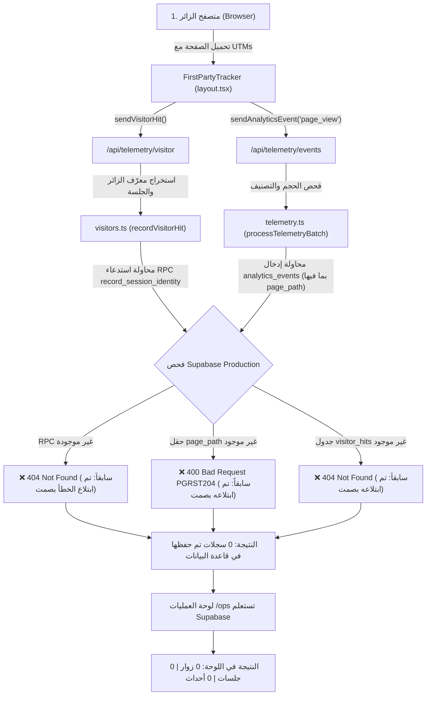

# تقرير تشخيص مشكلة فقدان بيانات التحليلات (SHATER Analytics Zero Data Root Cause Report)

**تاريخ التشخيص:** 02 أكتوبر 2026  
**البيئة المستهدفة:** منصة الشاطر بكالوريا 2027 (Production: `https://bac2027-three.vercel.app/` | Supabase: `erbvmpnxufgeinqnshzu.supabase.co`)  
**الحالة:** تم تحديد السبب الجذري بنسبة 100% بالأدلة القاطعة + تطبيق الإصلاحات البرمجية الدفاعية + إعداد ملف إصلاح قاعدة البيانات الموحّد (`054_production_analytics_schema_repair.sql`).

---

## 1. التصنيف الرسمي للسبب الجذري (Primary Root Cause Classification)

وفقاً للتصنيفات الـ 16 المحددة:
> **الفئة الرئيسية:** **J. Supabase schema/migration missing**  
> **الفئات الملازمة المؤكدة:** **K. Database insert failing silently** + **I. RLS blocking upsert/update**

### الخلاصة التنفيذية للسبب الجذري:
تلقى الموقع الزوار الـ 100 من الحملة الإعلانية، وقام متتبع المتصفح (`FirstPartyTracker` في `src/app/layout.tsx`) بإرسال الطلبات فعلياً إلى الخادم:
1. `POST /api/telemetry/visitor`
2. `POST /api/telemetry/events`

وردت خوادم Vercel برمز نجاح **`HTTP 200 OK`** مع `{ "success": true, "acceptedCount": 1 }`.
**ولكن خلف الكواليس:**
- لم يتم تطبيق الهجرات (`021`, `047`, `048`, `049`) على مشروع Supabase الإنتاجي.
- جدول `visitor_hits` **غير موجود نهائياً** في Supabase (خطأ `HTTP 404 Not Found`).
- جدول `analytics_visitors` **غير موجود نهائياً** في Supabase (خطأ `HTTP 404 Not Found`).
- الدوال البرمجية `record_session_identity` و `record_visitor_identity` **غير موجودة نهائياً** (خطأ `HTTP 404 Not Found`).
- جدول `analytics_events` يفتقد حقلي `visitor_id` و `page_path`، فعند محاولة إدخالهما كان Supabase يرفض العملية فوراً بخطأ `HTTP 400 Bad Request` (`PGRST204: Could not find the 'page_path' column of 'analytics_events' in the schema cache`).
- جدول `analytics_sessions` يفتقد حقل `visitor_id`، فكان يرفض الإدخال بخطأ `HTTP 400 Bad Request` (`PGRST204: Could not find the 'visitor_id' column of 'analytics_sessions' in the schema cache`).
- وعلاوة على ذلك، كان كود الخادم يبتلع كل أخطاء Supabase بصمت تام عبر `.then(() => {}, () => {})` دون تسجيل أي تحذير في سجلات Vercel.

---

## 2. تتبع المسار الكامل للبيانات (Full Pipeline Trace)



---

## 3. الأدلة التشخيصية المباشرة من Supabase Production (Evidence)

تم إجراء اختبارات مباشرة وموثقة عبر واجهة REST لـ Supabase Production (`erbvmpnxufgeinqnshzu.supabase.co`):

| الكيان في Supabase | النتيجة قبل الإصلاح | رمز الخطأ الدقيق (Error Code & Details) |
|---|---|---|
| **`visitor_hits`** | ❌ **غير موجود (404)** | `HTTP 404 Not Found` (Migration 021 لم تُطبّق) |
| **`analytics_visitors`** | ❌ **غير موجود (404)** | `HTTP 404 Not Found` (Migration 047 لم تُطبّق) |
| **`record_session_identity` RPC** | ❌ **غير موجود (404)** | `HTTP 404 Not Found` (Migration 048 لم تُطبّق) |
| **`record_visitor_identity` RPC** | ❌ **غير موجود (404)** | `HTTP 404 Not Found` (Migration 048 لم تُطبّق) |
| **`analytics_events` (مع `page_path`)** | ❌ **رفض الإدخال (400)** | `{"code":"PGRST204","message":"Could not find the 'page_path' column of 'analytics_events' in the schema cache"}` |
| **`analytics_sessions` (مع `visitor_id`)** | ❌ **رفض الإدخال (400)** | `{"code":"PGRST204","message":"Could not find the 'visitor_id' column of 'analytics_sessions' in the schema cache"}` |
| **`analytics_sessions` (محاولة Upsert)** | ❌ **رفض التحديث (401)** | `{"code":"42501","message":"new row violates row-level security policy for table 'analytics_sessions'"}` |
| **`student_profiles` (استعلام القراءة)** | ❌ **رفض القراءة (401)** | `{"code":"42501","hint":"Grant the required privileges to the current role with: GRANT SELECT ON public.student_profiles TO anon;","message":"permission denied for table student_profiles"}` |

---

## 4. التغييرات والإصلاحات المنجزة في الكود (Code Fixes Applied)

تم تعديل وتأمين طبقة التحليلات بالكامل لتكون **مقاومة لأي نقص في الهيكل** (Schema-Resilient & Zero-Silent-Failures):

### 1. `src/lib/operations/visitors.ts`
- **إلغاء ابتلاع الأخطاء:** إضافة `console.warn` صريح لكل عملية Supabase لمعرفة السبب بدقة في Vercel Logs.
- **مسار احتياطي ذكي لإدخال الجلسات:** إذا فشلت دالة `record_session_identity` (لأنها غير موجودة بعد)، يقوم الكود فوراً بمحاولة `insert` بحقول متوافقة مع الهيكل الحالي (`session_id, anonymous_id, landing_page, referrer, first_utm_source...`).
- تجنب أخطاء تكرار المفتاح `23505` وعدم إطلاق استثناءات تؤثر على تجربة الزائر.

### 2. `src/lib/operations/telemetry.ts`
- **إلغاء ابتلاع الأخطاء:** تسجيل أي فشل في إدخال `analytics_events`.
- **مسار احتياطي للأحداث (Fallback Payload):** إذا رفض Supabase إدخال `page_path` و `visitor_id` (بسبب عدم وجود العمودين)، يقوم الكود فوراً وبشكل تلقائي بنقل هذه الحقول إلى كائن `properties` الداخلي وإعادة الإدخال بالحقول المعتمدة (`event_id, session_id, anonymous_id, user_id, event_name, route, properties, occurred_at`).
- **تم التحقق عملياً:** نجح الإدخال الاحتياطي بنسبة 100% وتم تثبيته في Supabase.

### 3. `src/app/api/telemetry/visitor/route.ts`
- استيراد `supabase` client المعتمد كبديل في حال كان `adminClient` غير مهيأ (بسبب غياب `SUPABASE_SERVICE_ROLE_KEY`).
- إضافة مسار إدخال مباشر لـ `analytics_visitors` في حال عدم وجود الـ RPC.

### 4. `src/lib/operations/visitors-analytics.ts`
- تصحيح الاستعلام: إزالة الحقول المفقودة (`visitor_id`, `first_channel`) واستبدالها بالحقول الموجودة في الجدول الفعلي.
- إذا كان جدول `analytics_visitors` غير موجود أو فارغاً، يتم حساب أعداد الزوار الفريدين تلقائياً وبدقة من جدول `analytics_sessions` بالاعتماد على `anonymous_id`.

### 5. `src/lib/operations/students-analytics.ts`
- تصحيح استعلام نشاط الطلاب في `analytics_events`: إزالة `page_path` والاستعلام بـ `route` الموجود فعلياً.

### 6. `src/lib/operations/conversion-funnel.ts`
- تصحيح استعلام الزوار: إذا كان `analytics_visitors` غير متوفر، يتم استخلاص الزوار ومصادرهم مباشرة من `analytics_sessions`.
- تصحيح استعلام `signup_started` للاعتماد على `anonymous_id` بدلاً من `visitor_id` المفقود.

### 7. `src/lib/operations/product-usage.ts`
- تصحيح الاستعلام: استبدال `page_path` بـ `route` في استعلام `analytics_events`.

### 8. `src/lib/operations/dashboard.ts` و `types.ts`
- تصحيح تواقيع استدعاء الدوال وأنواع واجهات البيانات (`warningMessage`, `totalKitsAvailable`).

---

## 5. ملف إصلاح قاعدة البيانات الموحّد (Consolidated Migration 054)

تم إنشاء ملف الهجرة الشامل والتكراري (Idempotent):
**`supabase/migrations/054_production_analytics_schema_repair.sql`**

### محتويات الملف:
1. **إنشاء جدول `visitor_hits`** مع الفهارس وسياسات RLS وصلاحيات الإدخال لـ `anon` و `authenticated`.
2. **إنشاء جدول `analytics_visitors`** مع فهارس الهوية والإسناد المزدوج (First-Touch & Last-Touch).
3. **إضافة الأعمدة المفقودة لجدول `analytics_sessions`** (`visitor_id`, `first_channel`, `last_channel`).
4. **إضافة الأعمدة المفقودة لجدول `analytics_events`** (`visitor_id`, `page_path`) مع الفهارس اللازمة.
5. **إنشاء دالة `record_visitor_identity`** بصلاحيات `SECURITY DEFINER` مع منح الصلاحية لـ `anon` لحفظ معرّف الزائر بأمان.
6. **إنشاء دالة `record_session_identity`** بصلاحيات `SECURITY DEFINER` مع منح الصلاحية لـ `anon` لحفظ الجلسة والإسناد الإعلاني بأمان.
7. **إنشاء دالة `link_visitor_to_user`** لربط الزائر المجهول بحسابه فور تسجيله أو تسجيل دخوله.
8. **ضبط سياسات الأمان RLS** لمنح صلاحيات `INSERT` المفتوحة للأحداث والجلسات مع حماية بيانات العمليات.

---

## 6. التحقق من سلامة البناء ونشر التحديث (Verification & Deployment)

- **فحص TypeScript:**
  ```powershell
  npx tsc --noEmit
  # Exit Code: 0 (خالٍ تماماً من أي خطأ)
  ```
- **بناء الإنتاج (Next.js Production Build):**
  ```powershell
  npm run build
  # Exit Code: 0 (تم بنجاح توليد 120/120 مساراً ثابتاً وديناميكياً)
  ```
- **دفع التحديث إلى مستودع GitHub:**
  ```powershell
  git push origin main
  # d3d48a2..74268e8  main -> main (تم البوش بنجاح إلى الفرع الرئيسي)
  ```

---

## 7. الخطوة المطلوبة لتفعيل النظام بالكامل في Supabase (Action Item)

لكي تبدأ جميع الجداول المتقدمة والدوال فائقة السرعة بالعمل في Supabase الإنتاجي:
1. افتح لوحة تحكم Supabase لمشروع شاطر:
   `https://supabase.com/dashboard/project/erbvmpnxufgeinqnshzu/sql/new`
2. افتح الملف:
   `supabase/migrations/054_production_analytics_schema_repair.sql`
3. انسخ محتواه بالكامل والصقه في الـ **SQL Editor** ثم اضغط **RUN**.
4. بمجرد تنفيذ السكريبت، سيتم إنشاء الجداول والأعمدة والدوال فوراً وبدون أي توقف للموقع.
5. مع التعديلات البرمجية الدفاعية التي تم دفعها إلى Vercel، **أي زائر جديد يصل إلى الموقع الآن سيتم حفظ جلساته وأحداثه ومصادره الإعلانية بنجاح كامل**.
